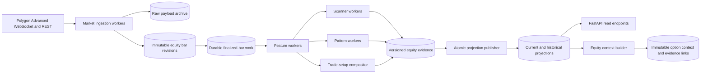

# Equity Market Ingestion and Analysis Materialization Design

> Historical implementation record: numbered migration references below describe the path to the
> current architecture. The only executable fresh-install schema is
> `backend/migrations/000_canonical_schema.sql`.

Status: historical implementation record; canonical baseline complete

Implementation status as of 2026-08-30:

- Migrations 017 and 018 create the reviewed 16-table physical model and preserve
  separate live-observed and historical-reconstructed bar identities.
- `backend/equity/` implements Polygon reference/float, statement/ratio, native bar,
  evidence, context, outcome, qualification, repository, and orchestration contracts.
- `run_equity_materialization.py` supports migration, status, reference, fundamentals,
  native 15m/30m bars, analysis, outcomes, qualification, and bounded replay.
- `run_equity_worker.py` provides a separately supervised XNYS-aware 15m/30m worker;
  Docker Compose exposes it only under the explicit `equity` profile. A session-scoped
  PostgreSQL advisory lock prevents two worker processes from owning publication.
- Materialized read APIs expose current facts, company/fundamental history, contexts,
  outcomes, qualifications, and health. Ticker Detail displays the registered company
  name from this path.
- Option normalization can consume point-in-time dividend evidence and option strategy
  context can consume one resolved equity context when
  `OPTION_EQUITY_CONTEXT_ENABLED=true`. Linked contexts fail closed on unavailable or
  conflicting qualified direction.
- The applied local cohort contains 386 company/security references. AAPL live/replay
  30-minute ingestion and materialization have been smoke tested. The configured
  account returned HTTP 403 for Financials, so statement storage remains empty until
  Stocks Advanced or Financials entitlement is enabled.
- The idempotent legacy bridge imported 39,805 existing scanner occurrences into the
  common evidence ledger; those rows remain explicitly `LEGACY_PROVENANCE`,
  `SOURCE_BAR_ID_UNAVAILABLE`, and research-only.
- Existing scanner/Pattern Watch/trade-setup APIs remain the default fallback. Full
  universe interval backfill, projection parity, portal cutover, Advanced WebSocket
  live-session soak, projection parity, portal cutover, and production qualification
  remain incomplete. The Advanced stream accumulator, persistence worker, and bounded
  native reconciliation operation are implemented but not enabled by default.

As of: 2026-08-30

Related documents:

- [Signal Research and Validation](SIGNAL_RESEARCH.md)
- [Scanner Event Evaluation](SCANNER_EVENT_EVALUATION.md)
- [Model Registry](MODEL_REGISTRY.md)
- [Option Pipeline Current State](OPTION_PIPELINE_CURRENT_STATE.md)
- [Option Chain Scanner Design](OPTION_CHAIN_SCANNER_DESIGN.md)

## 1. Decision to Review

Move equity market ingestion, feature calculation, scanner evaluation, Pattern Watch,
trade-setup synthesis, and result publication into durable backend workers. FastAPI
becomes a read API over published PostgreSQL projections. The option pipeline consumes
the same point-in-time equity evidence through a typed `EquityContextSnapshot` rather
than recalculating equity indicators or reading portal response payloads.

Thirty-minute bars become a first-class intraday setup and direction-change interval.
Fifteen-minute bars remain a trigger and pattern-confirmation interval; they do not run
the complete directional scanner catalog by default.

This refactor improves portal latency and creates one causal, replayable evidence graph
for equity research, option contract selection, historical evaluation, and production
recommendations.

## 2. Current State and Gaps

The current scheduler persists daily, hourly, and five-minute OHLCV at different
cadences. It persists daily cross-sectional signals, daily discovery states, and
scanner events for `1d`, `1h`, and `1wk`. Most portal analysis still runs inside API
requests:

- Pattern Watch calculates formations and price channels on demand.
- Single- and multi-interval trade setup calculate indicators, scanners, structures,
  entries, stops, targets, and confluence on demand.
- Gap, FVG, moving-average, momentum, bearish-bounce, Fibonacci, and streak endpoints
  calculate results on demand.
- Fifteen- and thirty-minute frames are currently assembled from five-minute rows at
  query time.
- `selected_tickers` has mutable market-cap, sector, SIC, float, valuation, and yield
  placeholders, but no company-name column. Polygon discovery currently fetches only
  market cap, SIC description, and exchange from Ticker Overview and overwrites the
  current metadata row; there is no filing or restatement history.

The current persistence also has causal limitations:

- A provisional daily bar overwrites the same natural key later used by the final bar.
- Equity bars do not record provider market time, first-observed time, revisions,
  finality, ingestion run, or payload identity consistently.
- Pattern Watch and trade setup do not have durable model versions or policy hashes.
- A portal cache timestamp is not a market-data watermark.
- Empty results cannot always distinguish no match, insufficient history, incomplete
  coverage, and computation failure.
- The option context independently calculates coarse daily/hourly EMA state and cannot
  identify the equity scanner, pattern, or setup evidence it consumed.

The existing option context does bound legacy daily/hourly bar timestamps by option
`market_time`; it does not read bars dated after that watermark. Its unresolved causal
gap is that those legacy rows lack observation time, finality, revision identity, and
source-bar provenance. No design section below should be read as already implemented.

## 3. Research and Production Boundary

Persistence does not promote a scanner.

The current scanner registry reports no `ROBUST_PASS` or `VALIDATED` composite setup.
Existing composite events remain research evidence with `MONITOR_ONLY`, `UNRANKED`, or
other explicit qualification state. `xsmom-1.0` is the current production
cross-sectional model, but its slow 21-session horizon makes it candidate/regime
context rather than an intraday timing signal.

The target system supports two consumers:

1. Research runs may consume all causally valid evidence and retain its qualification
   state for evaluation.
2. Production option direction may consume only evidence whose exact scanner version,
   interval, direction, and horizon have been explicitly promoted. Unvalidated
   evidence can still supply descriptive location, pattern, and risk context, but it
   cannot add confidence or authorize a directional structure.

Activity detectors never infer trade direction merely because they are persisted.

## 4. Target Architecture



The scheduler owns calendars and job creation, not market analysis. Workers claim
durable jobs with leases. A slow scanner cannot block ingestion or other intervals.

### 4.1 Continuous processing is not continuous persistence

Advanced market events may arrive many times per second. They update in-memory stream
state, rolling bars, and hard invalidation checks, but they do not create one database
run, feature snapshot, scanner row, or setup row per event or per second.

Persist according to the narrowest durable business event:

| Artifact | Durable granularity |
|---|---|
| Raw trades/quotes | Buffered compressed stream segments in object/archive storage; PostgreSQL stores manifests and gaps, not one control-plane run per tick. |
| Stream connection | One session/connection record plus bounded segment checkpoints and reconnect/gap events. |
| Market bars | One final bar revision per ticker and interval, plus later corrections. |
| Analysis run | One universe-wide interval watermark and model bundle, not one run per ticker or second. |
| Member coverage | Compact completion/no-match/insufficient/failure coverage per run; detailed rows only when required for audit or failure diagnosis. |
| Feature state | One mutable current projection per ticker/interval plus immutable snapshots only when referenced by evidence, option context, or research outcomes. |
| Scanner event | One immutable occurrence when a detector matches or changes state; no row for every non-match evaluation. |
| Pattern | One observation on lifecycle/readiness/geometry change, not every refresh. |
| Trade setup | One snapshot when its evidence hash, direction, levels, or validity changes; optional periodic checkpoint. |
| Outcome | One row when a registered subject/horizon matures or becomes unavailable. |
| Qualification | One prospective revision when a reviewed evaluation is published. |
| Option context/validity | One context per option matrix/decision; persist recommendation state transitions and hard invalidations, not every quote recheck. |

For approximately 400 underlyers, a full regular session contains at most about
156,000 one-minute symbol bars, not 400 database runs every minute. Thirty-minute
analysis creates 13 universe-wide watermarks per full session, with members processed
in bounded batches. Five- and fifteen-minute analysis should use a narrowed candidate
or watchlist universe when the calculation does not require all symbols.

## 5. Interval Contract

| Interval | Primary role | Default calculations | Publication trigger |
|---|---|---|---|
| `1m` | Canonical Advanced event-time input | No full scanner catalog | Final minute event |
| `5m` | Entry timing and rapid trigger | Trigger features and selected day-trade detectors | Final five-minute window |
| `15m` | Pattern and setup confirmation | Pattern Watch, channels, trigger indicators | Final fifteen-minute window |
| `30m` | Intraday setup and direction change | Reviewed 30m scanner catalog, patterns, features, setup | Final thirty-minute window |
| `1h` | Intraday trend confirmation | Current composite catalog, features, setup | Final session-anchored hour |
| `1d` | Regime, structure, and swing context | Cross-sectional, discovery, composite scanners, setup | Validated final session close |
| `1wk` | Slow structure | Reviewed weekly scanners and patterns | Last exchange session of week |
| `1mo` | Long-term context | Features and setup only | Last exchange session of month |

Each calculation registers supported intervals. The scheduler does not blindly run
every scanner at every interval.

### 5.1 Thirty-minute source decision

Polygon's REST aggregate endpoint already constructs full 30-minute bars from base
minute aggregates and omits partial aggregate bars by default. Direct Polygon 30-minute
bars are therefore valid first-class provider observations; local aggregation does not
make a final 30-minute decision available before the window closes.

Use a hybrid contract:

- Historical and Developer/bootstrap ingestion stores Polygon-native 30-minute REST
  bars as the authoritative source.
- Advanced production constructs a session-anchored 30-minute bar from the real-time
  one-minute stream for immediate close-boundary processing.
- A native Polygon 30-minute REST result is fetched as reconciliation. Equal payloads
  confirm the stream bar; a corrected payload creates an immutable revision and a
  reconciliation event.
- A live decision records whether it used `NATIVE_REST` or
  `DERIVED_REALTIME_STREAM`. A later correction never rewrites original decision
  evidence.

The production system must not require exactly 30 one-minute or six five-minute rows.
Polygon omits intervals with no qualifying trades. Completeness is based on provider
window finality, event watermark, session bounds, and gap policy, not a fabricated
zero-volume bar.

### 5.2 Fifteen-minute source decision

Fifteen-minute data follows the same native/stream reconciliation contract but has a
narrower analytical role. It is retained because Pattern Watch classifies `15m` as a
trigger tier and trade setup uses it for confirmation. The complete directional
scanner catalog does not run at `15m` unless a versioned research proposal adds a
specific detector.

### 5.3 Session boundaries

All intervals use the XNYS calendar, including holidays and early closes. Intraday
decision bars are regular-session bars unless a separately named extended-hours model
requests a different session contract. Every bar stores start and end instants; a bar
cannot be final or actionable before its end.

## 6. Market Data Model

Replace the behavioral dependency on the three legacy price tables with one normalized
bar contract. Legacy tables remain dual-written during migration and are retired only
after parity and rollback gates pass.

### 6.0 Point-in-time universe

Add `equity_universe_runs` and `equity_universe_members` before historical replay.
Each run records source, selection policy, market effective time, first-observed time,
configuration hash, and completeness. Members have effective-from/to timestamps and
preserve delisted or later-removed tickers.

Cross-sectional ranks, breadth, discovery states, coverage denominators, and scanner
replay must use the universe observable at that decision time. Using today's active
`selected_tickers` list for historical sessions would introduce survivorship and
selection bias.

### 6.1 `equity_ingestion_runs`

One provider request or stream reconciliation cohort:

- Provider and provider mode.
- Requested interval and time range.
- Universe version and expected ticker count.
- Started, observed, and completed timestamps.
- Complete, degraded, failed, and missing-ticker counts.
- Raw payload manifest and failure details.
- Status: `RUNNING`, `COMPLETE`, `DEGRADED`, or `FAILED`.

For REST, one run represents a bounded request/batch. For Advanced WebSocket data, one
run represents a connection/session or bounded archive segment, not one event or
second. Segment manifests can checkpoint counts, watermarks, checksums, and gaps while
raw high-frequency payloads remain in compressed archive objects.

### 6.2 `equity_bar_revisions`

One immutable provider or derived observation:

- Stable bar identity, ticker, interval, session date, start, and end.
- OHLCV, VWAP, transaction count, adjusted flag, and provider.
- Source type: `NATIVE_REST`, `REALTIME_STREAM`, or `DERIVED`.
- Finality and reconciliation state.
- First-observed, last-observed, and revised-observed timestamps.
- Raw payload hash and source raw-file identity.
- Source bar IDs for a derived interval.
- Ingestion-run identity.

Store vendor-native unadjusted values as the canonical price fact. Persist split,
dividend, symbol-change, and other adjustment facts separately with effective and
observed timestamps. A feature policy may request an adjusted view using only actions
known and effective by its decision watermark. Fetching an adjusted historical series
today must not silently rewrite an earlier decision's levels or evidence.

Keep availability concepts separate:

- `bar_start` and `bar_end`: market interval.
- `provider_published_at`: provider event time when supplied.
- `system_observed_at`: when the live system first possessed the payload.
- `replay_available_at`: a policy-derived timestamp for historical source data.
- `availability_mode`: `LIVE_OBSERVED` or `HISTORICAL_RECONSTRUCTED`.

A historical download performed today must not use today's retrieval timestamp as the
simulated availability of every historical bar. Replay availability is derived from
bar end, source semantics, corrections, and the production latency policy, and remains
explicitly distinguishable from a timestamp observed live.

The same payload observed twice updates only last-observed metadata. A changed payload
creates a new revision. Point-in-time reads choose the latest revision observable by
the requested decision watermark.

### 6.3 Current bar projection

A view selects the latest final, reconciled revision by ticker, interval, and bar
start. The projection is a convenience; analysis evidence always retains exact bar
revision IDs.

### 6.4 Company identity and fundamentals

Company identity and filing fundamentals have slower cadence and different correction
semantics from universe membership and market bars. Do not store them only as mutable
columns on `selected_tickers`, and do not couple a company-name or shares revision to a
universe membership lifecycle.

Polygon/Massive supplies:

- Ticker Overview on all Stocks plans: registered company/security name, CIK,
  composite/share-class FIGI, exchange, SIC, description, listing/delisting dates,
  employee count, share-class and weighted shares outstanding, market cap, branding,
  and contact/reference fields.
- Stocks Advanced or Financials expansion: quarterly, annual, and TTM income,
  balance-sheet, and cash-flow statements, with records documented back to 2009.
- Stocks Advanced or Financials expansion: daily current TTM ratios including market
  cap, enterprise value, EV/sales, EV/EBITDA, valuation, profitability, leverage,
  liquidity, dividend yield, and free cash flow. The ratios endpoint has no historical
  query contract and therefore is not sufficient for historical replay.
- Float on all Stocks plans: latest effective-dated free float and float percentage,
  with no historical endpoint contract.

#### `equity_security_reference_revisions`

One low-rate immutable revision represents a security and its issuer identity as
observed from the reference source:

- Stable internal security ID, ticker/root/suffix, asset type, active/list/delist state,
  currency, primary exchange, and round lot.
- Registered name, CIK, composite FIGI, share-class FIGI, SIC code/description, derived
  sector/industry, description, homepage, and optional branding/contact fields.
- Share-class shares, weighted shares, free float, float percentage, and employee
  count, with each field's effective/source date where available.
- Provider, source request date, effective date, observed time, payload hash, and
  superseded revision.

CIK groups multiple share classes under an issuer when available; FIGI identifies the
security/share class. Ticker alone is not treated as permanent identity. Universe
members reference the applicable security revision rather than copying all metadata.

Ticker Overview's historical `date` parameter may expose filing-derived information
using the filing's period-of-report date even when the filing was submitted later.
Therefore a historical overview response is useful reference evidence but is not by
itself proof that a filing-derived value was publicly available on that date.

#### `equity_fundamental_reports`

One immutable report revision merges source statement records for an issuer, period,
timeframe, filing/revision, and source payload identity. Store frequently queried facts
as typed nullable columns and retain complete versioned source payloads for less common
facts:

- Identity/provenance: security/issuer key, CIK, accession number when resolved, form,
  period end, fiscal year/quarter, timeframe, filing date, availability time, observed
  time, source, payload hashes, and restatement/supersession links.
- Income: revenue, gross profit, operating income, EBITDA, pretax income, interest,
  taxes, net income, EPS, basic/diluted weighted shares, R&D, SG&A, and depreciation/
  amortization.
- Balance sheet: cash, short-term investments, current assets/liabilities, total assets,
  current and long-term debt, total liabilities, and equity.
- Cash flow: operating cash flow, capital expenditures, free cash flow, dividends,
  financing/investing cash flow, share issuance, and repurchases where supplied.

Do not label operating income as EBIT silently. Preserve provider `operating_income`
and `ebitda`; a derived EBIT value must carry a formula/version such as pretax income
plus net interest expense, because definitions and sign conventions vary. Financial
institutions and other sectors may have non-comparable EBITDA/EV metrics and must retain
null/not-applicable quality reasons.

Availability is based on when information became public, not `period_end`. The SEC
filing index supplies filing date, accession number, issuer, and form. When only a date
is available and no accepted timestamp is known, intraday replay uses the conservative
next regular-session-open availability policy. Later comparative restatements append a
new report revision and never rewrite the version visible to an earlier decision.

#### Derived fundamental evidence

At the daily analysis watermark, derive a `FUNDAMENTAL_SNAPSHOT` in `equity_evidence`
only when research, portal, universe selection, or option context needs it. It references
the exact security revision, fundamental reports, and price-bar revision used.

Useful typed derived fields include:

- Market cap and market-cap group.
- Enterprise value and net debt.
- Point-in-time shares, float turnover, and dollar-volume-to-market-cap.
- Revenue, EBITDA, operating-income, EPS, and free-cash-flow growth/margins.
- P/E, P/S, P/B, P/FCF, EV/sales, and EV/EBITDA where meaningful.
- ROA, ROE, current/quick ratios, debt/equity, dividend yield, and FCF yield.
- Days since filing, data age, source coverage, and restatement quality.

Historical ratios are derived from point-in-time reports, point-in-time share/debt/cash
facts, and the historical price bar. Current provider ratios may populate current portal
views and serve as reconciliation, but cannot be backfilled as if they were historically
available.

Fundamentals are slow regime, eligibility, capacity, and stratification evidence. They
do not become intraday trigger votes. Particularly useful future research includes
float-adjusted turnover/squeeze risk, market-cap/liquidity cohorts, earnings quality,
leverage and balance-sheet risk, profitability/FCF quality, dividend-sensitive option
pricing, and outcome stratification by fundamental regime.

#### Initial fundamental-use policy

Fundamentals may improve initial scanner and option quality in these bounded roles:

| Input | Initial use | Prohibited interpretation |
|---|---|---|
| Market cap, price, and average dollar volume | Universe eligibility, liquidity cohort, scanner threshold normalization, and capacity limits. | Not a bullish/bearish vote. |
| Shares outstanding and free float | Float turnover, unusual participation, squeeze/crowding research, and size-aware notional limits. | Not proof of short squeeze direction or institutional activity. |
| Dividend amount/yield and ex-dividend date | Option valuation input, covered-call/cash-secured-put context, and early-assignment risk. | Not a standalone income recommendation. |
| Net debt, debt/equity, current/quick ratios | Balance-sheet and event-risk flags for short-premium strategies. | Not an automatic rejection across sectors. |
| Revenue, operating income, EBITDA, EPS, and FCF growth/margins | Slow quality/regime cohorts and outcome stratification; optional reviewed eligibility gates. | Not an intraday trigger or uncalibrated confidence point. |
| Filing age, restatement, and missing coverage | Data-quality and stale-context gates. | Missing data is not zero and is not neutral evidence. |

Initial scanner integrations are versioned research policies:

- Volume and breakout detectors may compare ordinary volume with float-adjusted
  turnover when point-in-time float is available.
- Cross-sectional and discovery research may stratify by market-cap, profitability,
  leverage, and FCF cohorts, but production weights change only after independent
  walk-forward qualification.
- Pattern and trade-setup outputs may carry fundamental risk/context tags without
  changing geometric direction or trigger time.

Initial option integrations are similarly bounded:

- Local option valuation consumes point-in-time dividend yield or an explicit fallback.
- Income Wheel may use dividend/ex-dividend, leverage/liquidity, and profitability/FCF
  quality as versioned eligibility/risk context.
- Gamma and flow research may use free-float turnover and market-cap/liquidity cohorts
  as normalization or stratification, never as aggressor direction.
- Spread/range research may use event, leverage, and liquidity risk tags; structure
  direction still comes from qualified equity evidence and option-market conditions.

Every consuming policy declares maximum age and missingness behavior per field. A
fundamental value must cite its security revision, report revision, effective/public
availability time, derived-snapshot version, and source price where applicable. No
consumer substitutes a current value into historical replay. Fundamental filters or
normalizers must demonstrate incremental out-of-sample value before they can raise a
qualification state or numerical option confidence.

## 7. Analysis Data Model

### 7.1 `equity_analysis_runs`

One deterministic cohort for an interval and market watermark:

- Business key derived from interval, market time, universe hash, feature version,
  scanner-policy hash, and pattern/setup versions.
- Market time, observed time, status, and publication time.
- Expected, complete, no-match, insufficient-data, and failed member counts.
- Input and output fingerprints.
- `ORIGINAL`, `REPLAY`, or `SHADOW` run purpose.

Rerunning an identical cohort is idempotent. Running changed code requires a changed
version or policy hash and creates a side-by-side cohort.

There is one run per interval watermark and model bundle for the applicable universe.
For example, the 30-minute lane creates 13 runs on a normal full session, not one run
per symbol and not 1,800 per-second runs.

### 7.2 `equity_analysis_members`

One row per run and ticker records `COMPLETE`, `NO_MATCH`, `INSUFFICIENT_DATA`, or
`FAILED`, source coverage, latest source bar ID, evidence count, and failure reason.
This prevents absence of a result from being interpreted as no signal.

This is a logical coverage contract, not necessarily a permanent row for every
successful ticker at every short interval. An implementation may store a compact
completed/no-match set on the run plus detailed member rows for insufficient and failed
symbols. It must still prove that an absent signal means evaluated-no-match rather than
not evaluated. Full member rows remain appropriate for replay, degraded runs, and
intervals where per-ticker audit value justifies retention.

### 7.3 `equity_feature_snapshots`

A typed snapshot stores reusable inputs once per ticker, interval, and run:

- Close, returns, ATR, realized volatility, and same-clock volume baseline.
- EMA/SMA values and stack state.
- RSI, stochastic, MACD, ADX, and directional movement.
- VWAP basis and distance.
- Swing and level references.
- Bar count, coverage, stale/missing flags, and exact source bar IDs.
- Feature model version and payload hash.

Important fields are typed columns. Experimental diagnostics may use versioned JSON,
but the table is not a persisted copy of a portal DTO.

Do not retain a full immutable feature vector for every ticker at every short-interval
watermark indefinitely. Maintain a current projection for portal reads. Persist an
immutable feature snapshot when it is referenced by a scanner occurrence, pattern
transition, changed/actionable setup, option context, or registered outcome subject.
Bars plus model versions remain the rebuild source for evaluated no-match cohorts.

Feature roles are typed and cannot be collapsed into equal votes:

- Regime and candidate: xsmom, discovery, sector, and broad-market state.
- Structure and direction: EMA/SMA/swing state and qualified scanner output.
- Location: gaps, FVGs, VWAP, moving averages, pivots, and range boundaries.
- Trigger: candle, breakout, stochastic, and short-interval transition.
- Participation: same-clock volume/range evidence.
- Risk: ATR, invalidation, stop, and target references.

EMA trend, scanner direction, and pattern bias remain separate fields. Agreement does
not increase confidence unless a combined policy has independently qualified.

### 7.4 Scanner events and occurrences

Evolve the existing append-only scanner tables instead of creating a competing event
system. Add analysis-run, feature-snapshot, market-time, observed-time, and source-bar
references. Preserve scanner name/version, occurrence identity, direction, entry,
stop, target, risk, and metadata.

Add a qualification registry keyed by:

```text
scanner + version + interval + direction + horizon + evaluation version
```

It stores `ROBUST_PASS`, `MONITOR_ONLY`, or `UNRANKED`, effective dates, sample size,
independent periods, net alpha, uncertainty, and report identity. Option production
queries this registry rather than relying on a scanner name alone.

### 7.5 Pattern instances and observations

Pattern Watch needs lifecycle persistence, not unrelated response snapshots:

- Stable pattern instance identity from ticker, interval, type, and structural anchors.
- Observation identity, analysis run, feature snapshot, and source bars.
- Exact final `completed_through_bar_id` used for geometry and readiness.
- Bias, geometry grade, readiness, boundaries, touches, fit error, invalidation,
  start/end anchors, and algorithm version.
- Lifecycle: `FORMING`, `CONFIRMED`, `INVALIDATED`, or `EXPIRED`.

Price channels use the same observation model under a separate source name and version.

The current detector deliberately drops the newest input row because request-time
frames may contain a forming bar. The worker refactor must replace that implicit rule
with an explicit `completed_through`/`as_of_bar_id` contract. A worker receiving only
final bars must evaluate the latest final bar rather than unconditionally discarding
it. Parity tests must cover both request-time legacy frames and finalized worker frames.
Readiness transitions use only bars fully closed by observation time. A later
confirmation cannot retroactively change an earlier observation. One forming-pattern
outcome subject is anchored at the first predeclared readiness transition, such as
`AT_EDGE`, rather than every subsequent refresh.

Unchanged pattern observations update only the current projection/last-seen watermark;
they do not append another historical observation.

### 7.6 Trade-setup snapshots

Trade setup becomes a backend composition over persisted features, scanner events,
patterns, channels, and levels:

- Ticker, primary interval, confirmation intervals, and decision watermark.
- Direction state and explicit conflict state.
- Entries, stops, targets, invalidation levels, and risk units.
- EMA alignment, momentum state, volatility, and confluence zones.
- Exact upstream evidence IDs.
- Setup policy version/hash and quality reasons.

The setup compositor does not rerun underlying scanners.

An unchanged setup updates only current freshness metadata. Append a durable setup
snapshot when direction, evidence identity, entry/stop/target, conflict, validity, or
policy changes. Periodic checkpoints are optional operational evidence and are not
independent research subjects.

Neutral structures also require a separate typed range forecast, not merely a generic
trade-setup label. The forecast records horizon, lower/upper boundaries, expected-move
method, invalidation boundary, model/policy version, evidence IDs, and qualification
state. It exposes no probability until that exact forecast version is calibrated.

### 7.7 Outcome and qualification materialization

The existing scanner outcome engine is the starting point. It already evaluates the
first bar strictly after signal time, stores gross and net signed returns, broad-market
and sector alpha, MAE/MFE, risk multiples, and stop/target first-hit state, and labels
an inseparable stop-plus-target crossing within one OHLC bar as `SAME_BAR`.

Generalize that behavior without forcing every research artifact into one definition
of a win.

#### `equity_outcome_policies`

Every evaluated hypothesis has a reviewed, immutable policy keyed by evidence type,
source name/version, interval, direction contract, and evaluation version. It records:

- Eligibility transition, such as scanner match, first pattern `AT_EDGE`, pattern
  confirmation, or actionable trade setup.
- Entry model, order type, maximum entry wait, and no-fill behavior.
- Holding horizons, session-close handling, overnight permission, and expiration.
- Stop, target, trailing, and same-bar ambiguity rules.
- Cost/slippage model and benchmark/sector benchmark policy.
- Success definition and minimum data-quality requirements.
- Independent-period spacing and multiple-testing family identity.

Changing any assumption creates a new policy version. It never edits old outcomes.

Same-bar ambiguity policy is explicit: `CONSERVATIVE_STOP_FIRST` is the initial
primary qualification policy, while `TARGET_FIRST_SENSITIVITY` and
`EXCLUDE_AMBIGUOUS_SENSITIVITY` may be reported as separate cohorts. Excluding
ambiguous paths cannot improve the primary qualification sample by silently dropping
difficult outcomes.

#### `equity_research_outcomes`

One immutable row per evidence subject, outcome policy, and horizon stores:

- Subject evidence ID and type, ticker, direction, interval, and source version.
- Signal/observation time and first actionable entry time.
- Entry status: `ENTERED`, `NOT_TRIGGERED`, `NO_LIQUID_BAR`, `STALE`, or
  `UNAVAILABLE`.
- Entry/exit price, gross return, signed return, estimated costs, and net return.
- Broad-market and sector return, alpha, and net alpha.
- MAE/MFE in percent and risk units.
- Stop/target hit flags, first-hit state, exit reason, and path-ambiguity state.
- Exact entry, path, exit, and benchmark bar revision IDs.
- Confirmation bar revision ID when applicable, plus confirmation-bar end and entry
  time so `confirmation_bar_end < entry_time` is auditable.
- Outcome, cost, benchmark-assignment, and ambiguity-policy versions.
- Computed category: `WIN`, `LOSS`, `AMBIGUOUS_SAME_BAR`, `NOT_ENTERED`, or
  `UNAVAILABLE`.
- Staleness result and reason codes under the outcome policy.
- Outcome availability time, evaluation version, and quality reasons.

These are simulated research outcomes, not realized account profit or loss. Dollar P&L
is reported only when a separate versioned sizing policy supplies capital and quantity;
normalized net return, alpha, and R-multiple remain the primary comparison measures.
Unavailable and unentered subjects remain in coverage denominators rather than being
dropped.

The outcome subject is an immutable scanner occurrence, pattern state transition,
trade-setup snapshot, or registered forecast observation, not a mutable lifecycle row.
For scanner recurrence this means `scanner_event_occurrences.occurrence_id`, not only
`scanner_events.event_id`. Repeated detection of the same unchanged pattern does not
create another subject; a predeclared readiness/lifecycle transition can.

The target outcome uniqueness key is occurrence/observation/setup identity plus
outcome-policy identity and horizon. Legacy `(event_id, horizon)` outcomes remain
readable during migration but do not define the new sample cardinality.

Corrections create a new outcome revision or supersession link. The target pipeline
does not delete an already published outcome and silently recompute it from later bar
revisions. Reports can select the original-observed or latest-corrected outcome cohort
explicitly.

#### Evidence-specific outcome contracts

| Evidence | Primary outcome contract |
|---|---|
| Directional scanner event | Enter at the next eligible bar open; measure signed net return, benchmark/sector alpha, MAE/MFE, and stop/target sequencing. |
| Forming directional pattern | Evaluate geometry separately from trade return. Anchor one subject at the first predeclared readiness transition; do not count every repeated observation. |
| Confirmed directional pattern | Enter only after confirmation according to its policy; confirmation-bar prices cannot be reused as fills. |
| Neutral pattern | Measure boundary resolution, false-break rate, time to resolution, and invalidation. Do not invent an ex-ante direction. |
| Trade setup | Simulate its explicit entry condition after observation. `NOT_TRIGGERED` is not a loss; entered setups use stored stop, target, invalidation, and risk. |
| Range forecast | Measure containment, boundary breach, realized range, and later option-structure outcomes under a separate combined policy. |
| Raw indicator | No automatic outcome. Evaluate only a registered directional or conditioning hypothesis with a declared transform, threshold, direction, and horizon. |

Initial intraday research horizons are policy values, not hard-coded global constants.
For 30-minute direction research, begin with `+30m`, `+60m`, `+120m`, regular close,
and next open. For 15-minute trigger research, begin with `+15m`, `+30m`, `+60m`,
and regular close. Outcomes that would cross the session boundary are unavailable
unless the policy explicitly permits overnight holding.

#### Qualification and calibration

Persist a qualification revision keyed by the full hypothesis:

```text
evidence source/version + interval + direction + horizon + outcome policy
+ benchmark/cost model + evaluation version
```

Reuse the current methodology as the initial gate: portfolio aggregation by signal
time, horizon-spaced independent periods, minimum event and period counts, positive net
alpha, test statistic, early/late stability, and Benjamini-Hochberg FDR correction.
Exact thresholds stay in a versioned evaluation policy.

Only after a hypothesis qualifies may expanding or purged walk-forward calibration
publish a probability. Persist out-of-sample count, probability interval, Brier score,
Brier skill versus the unconditional base rate, expected calibration error, calibration
curve, expected net alpha, and uncertainty. Win rate alone never establishes
confidence because it ignores payoff magnitude, benchmark return, costs, overlap, and
multiple testing.

Outcome arrival never mutates a detector, weight, or live confidence automatically.
A new qualification/calibration revision becomes effective prospectively after review;
historical decisions retain the revision observable at their decision time.

The legacy daily recommendation win-rate priors, analog boosts, confidence bins, and
performance log remain diagnostic during migration. They do not qualify a scanner,
pattern, setup, or option strategy because they do not implement this complete
point-in-time subject, independent-period, cost, benchmark, and FDR contract.

### 7.8 Current projections

Atomic projection tables or views expose only the latest published run:

- Current scanner results.
- Current Pattern Watch observations.
- Current ticker trade setup.
- Current multi-interval equity context.

A run publishes only after coverage checks. The portal never sees a mixed half-old,
half-new universe.

Current projections are bounded UPSERT state or views, not append-only history. Their
size is proportional to active ticker/interval/source keys rather than process uptime.

### 7.9 Logical contracts versus physical tables

Sections 6 and 7 define ownership, identity, causality, and retention boundaries. They
do not require one new physical table for every bullet or one row for every worker
evaluation. Implementation should reuse the existing scanner event, occurrence, and
outcome tables where their identities remain valid.

The minimum durable physical boundaries should remain separate because they have
different write rates and retention rules:

1. Low-rate control plane: point-in-time universe, ingestion segment manifests, and
  interval analysis runs/coverage.
2. Partitioned market facts: immutable final bar revisions and corrections.
3. Sparse decision evidence: existing scanner occurrences plus pattern transitions and
  changed/actionable setup snapshots.
4. Research loop: outcome policies, matured outcomes, and qualification/calibration
  revisions.
5. Option lineage: a join from immutable option context to exact equity evidence.
6. Bounded read models: current projections implemented as views, materialized views,
  or UPSERT tables according to measured query latency.

Do not combine market bars, evidence, outcomes, and current projections into one JSON
table. Their immutable/mutable semantics, indexes, retention, and audit requirements
are materially different. Conversely, do not create separate physical tables for each
indicator or scanner; use versioned typed evidence families and the existing scanner
registry.

### 7.10 Evaluated schema shapes

Three physical designs were considered:

| Shape | Strength | Failure mode | Decision |
|---|---|---|---|
| One giant scanner/context table | One simple lookup | Duplicates features, mixes mutable current state with immutable history, obscures no-match coverage and corrections, and cannot represent pattern/setup lifecycles cleanly. | Reject |
| Separate table per scanner/artifact | Strong type isolation | Table and join explosion, expensive option/portal reads, and difficult evolution when scanners are added. | Reject |
| Hybrid evidence envelope plus context/projections | Preserves normalized market/run/outcome facts while keeping scanners extensible and reads fast. | Requires strict payload schemas and a context builder. | Recommend |

The recommendation honors the useful part of a final aggregation table without making
it the sole source of truth: options receive one resolved context row, while exact
scanner details remain in a common immutable evidence ledger.

### 7.11 Concrete target table inventory

The recommended target has 15 canonical durable equity tables plus one bounded serving
projection, for 16 physical tables in the default production deployment. If indexed
views meet the portal p95 target, `equity_current_projection` may remain a view and the
physical count is 15. This count excludes unrelated application/option tables,
compressed archive objects, and legacy tables retained temporarily during dual-write
migration.

| # | Target table | Purpose | Typical write cadence |
|---:|---|---|---|
| 1 | `equity_universe_runs` | Versioned point-in-time universe policy, completeness, effective time, and observation time. | Daily or universe-policy change. |
| 2 | `equity_universe_members` | Effective/observed membership, including delisted and later-removed symbols. | Membership lifecycle change. |
| 3 | `equity_ingestion_segments` | REST batch or WebSocket connection/segment manifest, checksums, watermarks, archive location, gaps, and status. | Bounded batch/stream segment, not event. |
| 4 | `equity_bar_revisions` | Unified immutable bars, source/finality, native-versus-derived reconciliation, availability, adjustments, and corrections. | Final bar or correction. |
| 5 | `equity_corporate_actions` | Point-in-time split, dividend, symbol-change, and adjustment facts. | Provider action/revision. |
| 6 | `equity_security_reference_revisions` | Company/security name, identifiers, listing/reference metadata, share counts, float, and immutable source revisions. | Weekly/on-change and new-universe members. |
| 7 | `equity_fundamental_reports` | Point-in-time filing-derived income, balance-sheet, and cash-flow report revisions with restatement lineage. | Daily incremental filing ingestion/backfill. |
| 8 | `equity_analysis_runs` | One interval-watermark/model-bundle cohort with purpose, coverage totals, fingerprints, and publication status. | Finalized interval boundary. |
| 9 | `equity_analysis_members` | Worker lease and detailed per-ticker complete/no-match/insufficient/failure audit where retained. | Applicable ticker/run; later compactable. |
| 10 | `equity_evidence` | Common immutable ledger for features, fundamentals snapshots, all scanner occurrences, xsmom/discovery, pattern/channel transitions, range forecasts, and trade setups. | Final snapshot, match, or meaningful state/evidence change. |
| 11 | `equity_context_snapshots` | Resolved typed multi-interval context for one ticker, horizon, market/observation watermark, and policy. This is the primary equity object used by option analysis. | Option matrix request or changed published context. |
| 12 | `equity_context_evidence` | Many-to-many lineage from a resolved context to the exact evidence rows it used. | With a context snapshot. |
| 13 | `equity_current_projection` | Bounded UPSERT serving state for current portal filters and latest ticker/interval/source views. | Atomic publication; rows replaced in place. |
| 14 | `equity_outcome_policies` | Versioned entry, horizon, cost, benchmark, ambiguity, missingness, and success definitions. | Reviewed policy release. |
| 15 | `equity_research_outcomes` | Immutable matured scanner/pattern/setup/range outcomes and correction revisions. | Subject/horizon maturity or unavailability. |
| 16 | `equity_qualification_revisions` | FDR-controlled qualification and walk-forward calibration effective prospectively. | Reviewed research publication. |

#### Common evidence ledger

`equity_evidence` contains all scanner and analysis details without creating one table
per scanner. Common typed columns include evidence ID/type/role, lifecycle key, ticker,
interval, direction, status, strength, market/observation/valid-until times, source and
model versions, analysis run, latest source bar revision, source-window fingerprint,
quality state, qualification eligibility, and payload schema/hash.

Type-specific details use validated, versioned JSONB payloads. Examples are
`FEATURE_SNAPSHOT`, `SCANNER_RESULT`, `REGIME_SIGNAL`, `PATTERN_OBSERVATION`,
`PRICE_CHANNEL`, `FUNDAMENTAL_SNAPSHOT`, `TRADE_SETUP`, and `RANGE_FORECAST`. Critical
query/filter fields stay typed; experimental scanner details do not require migrations.

The current `scanner_events`, `scanner_event_occurrences`, `cross_sectional_signals`,
and `market_discovery_states` tables dual-write to this ledger during migration. After
parity and replay validation, their target-state facts are represented by evidence
rows; legacy tables can be archived rather than maintained indefinitely.

#### Option-facing aggregation

`equity_context_snapshots` is the single final aggregation table that option analysis
references. It contains typed resolved fields for regime, EMA direction, qualified
direction, qualification ID, conflict, trigger, active pattern state, range forecast,
locations, risk levels, staleness, quality, and context policy, plus a compact versioned
summary payload.

It deliberately does not duplicate every source payload. `equity_context_evidence`
links one context to the exact `equity_evidence` rows, preserving explanation and
replay without making each context row wide and repetitive. The existing
`option_context_snapshots` table receives one `equity_context_snapshot_id` foreign key.
Option strategies normally perform one indexed context lookup; evidence is joined only
for explanation, audit, or research.

#### Portal reporting

The portal is not constrained to the option-facing aggregation:

- `equity_current_projection` serves fast current scanners, patterns, indicators,
  setups, company name, current fundamentals, and cross-interval filters.
- `equity_security_reference_revisions` supports company/security profile, identifier,
  listing, shares, float, and historical reference reporting.
- `equity_fundamental_reports` supports quarterly/annual/TTM statements, revisions,
  growth, profitability, leverage, and cash-flow drill-down.
- `equity_evidence` supports historical drill-down and scanner/pattern/setup lifecycle
  reporting, including derived point-in-time fundamental snapshots.
- `equity_research_outcomes` supports return, alpha, MAE/MFE, first-hit, and coverage
  reports.
- `equity_qualification_revisions` supports qualification, calibration, uncertainty,
  and effective-version history.
- `equity_context_snapshots` shows the exact resolved context used by options.

Scanner-, pattern-, setup-, context-, and outcome-specific SQL views may provide stable
API shapes. Views add reporting flexibility without adding append-only fact tables.

## 8. Worker and Publication Flow

1. Ingestion writes raw provider facts and immutable bar revisions.
2. Reconciliation seals or revises provider observations.
3. A final bar creates one durable analysis work item for its interval and watermark.
4. Feature workers process bounded ticker batches and persist member status.
5. Scanner and pattern workers consume feature/source-bar snapshots without provider
   calls.
6. Trade-setup workers compose already persisted evidence.
7. Outcome workers evaluate matured subjects under registered policies without
   blocking current evidence publication.
8. Qualification/calibration jobs consume immutable outcomes on a slower reviewed
   cadence and write prospective revisions.
9. The publisher checks coverage, failures, version consistency, and causal timestamps.
10. One transaction marks the run complete and advances current projections.
11. APIs and option context builders receive an invalidation notification or poll the
   published run identity.

Use PostgreSQL leases with `FOR UPDATE SKIP LOCKED`. Expired claims are retryable.
Ingestion and analysis use separate queues and worker pools.

Continuous quote/trade updates are coalesced in memory for ordinary recalculation.
Only finalized bars, durable gaps, hard validity transitions, evidence changes, and
periodic recovery checkpoints cross the database boundary.

Initial publication policy:

- `COMPLETE`: at least 95% expected ticker coverage and no contract-level invariant
  failures.
- `DEGRADED`: at least 90% coverage with explicit missing/failure details.
- `FAILED`: below 90%, mixed model versions, future-visible input, or invalid source
  provenance.

An option underlyer still requires its own complete member record even when the
universe run is published as degraded.

### 8.1 Retention and storage tiers

Retention is set after measured Advanced-load tests, but the initial policy shape is:

- Raw high-frequency events: compressed archive segments with PostgreSQL manifests;
  only a bounded hot window remains locally queryable.
- One-minute bars: time-partitioned hot storage for live indicators and incident
  replay, then compressed/cold archive or provider rehydration according to licensing.
- Final 5m/15m/30m/1h/1d bars used by decisions: retain through the research and audit
  horizon; archive partitions rather than orphaning evidence references.
- Analysis runs and coverage: keep detailed short-interval members for a bounded hot
  window, then retain compact run summaries and exceptions.
- Decision-linked features, scanner occurrences, pattern transitions, setup snapshots,
  outcomes, qualifications, and option links: long-lived research evidence.
- Current projections: one bounded row per current key, replaced atomically.

No retention job may delete a source revision still referenced by retained decision or
outcome evidence unless the reference is first moved to a durable archive manifest
that supports reconstruction.

## 9. Equity Context for Options

### 9.1 Current boundary

Today `StrategyContextSnapshot` contains only legacy daily/hourly closes and EMAs, an
EMA-derived `trend_state`, event-calendar states, source-bar string keys, and policy
identity. Five-minute columns exist in the migration target but the current builder
does not populate them. It has no 30-minute scanner, 15-minute pattern, feature
snapshot, setup, qualification, or immutable bar-revision link.

The strategy changes in section 10 therefore remain future shadow versions until the
materialization and qualification gates below are implemented.

### 9.2 Target repository

Add a provider-neutral `EquityContextRepository.get_as_of()` that takes:

```text
underlyer + option market time + option observed time + strategy horizon + policy hash
```

It returns an immutable `EquityContextSnapshot` containing:

- Slow regime: daily/weekly structure, market regime, sector context, and xsmom state.
- Direction: qualified 30-minute and one-hour structure evidence.
- Trigger: five- and fifteen-minute confirmation evidence.
- Pattern state: active formations, channels, and invalidation boundaries.
- Location/risk: gaps, FVGs, moving averages, VWAP, pivots, ATR, entries, stops, and
  targets.
- Conflict state across horizons.
- Qualification and quality status for every component.
- Exact feature, event, pattern, setup, bar, run, and model identities.
- Market, observed, and expiration timestamps.

The typed contract includes at least:

```text
context_id, underlyer, market_time, observed_time, strategy_horizon
status, reason_codes, universe_run_id, security_reference_revision_id
analysis_run_ids, fundamental_snapshot_id, fundamental_report_ids
regime_state, regime_evidence_ids
market_cap, shares_outstanding, free_float, dividend_yield
enterprise_value, ebitda, operating_income, free_cash_flow
ema_direction, qualified_direction, direction_qualification
direction_qualification_id, direction_source_event_id
direction_horizon, direction_valid_until
trigger_state, trigger_evidence_ids, trigger_valid_until
pattern_state, pattern_observation_ids
range_forecast_id, range_lower, range_upper, range_valid_until
location_evidence_ids, risk_evidence_ids
conflict_state, stale_components
feature_snapshot_ids, source_bar_revision_ids
context_policy_version, context_policy_sha256
```

`qualified_direction` is nullable and can be populated only from an exact
scanner/version/interval/direction/horizon qualification entry. `ema_direction` and
pattern bias never silently fill it. A non-null direction requires a matching
`direction_qualification_id` whose state is production-eligible under context policy.
A pattern may become a trigger input only through its own qualified pattern/combined
policy; it still does not become an implicit direction source.

Fundamental fields are nullable, age/availability qualified, and referenced through
their source revision IDs. They cannot establish intraday qualified direction. The
context policy declares which slow fields are required for valuation, eligibility, or
stratification and how stale/missing values are handled.

The repository applies both bounds:

```text
evidence.market_time <= option.market_time
evidence.observed_at <= option.observed_time
```

It never substitutes the newest portal projection for a historical or delayed option
decision.

Point-in-time revision selection chooses the latest revision whose availability is at
or before the option observation watermark. Later corrections remain persisted but do
not alter the original context.

Staleness is session- and interval-aware and versioned in context policy. Initial
candidate limits for research are 10 minutes for `5m`, 30 minutes for `15m`, 60 minutes
for `30m`, two hours for `1h`, and through the next completed session for `1d`.
These values require replay sensitivity analysis before production promotion.
`stale_components` records component name, configured maximum age, observed age, and
stale status. A stale required component cannot establish direction or trigger entry.

Direction resolution is precedence-based, not vote counting:

1. A qualified direction event may establish direction for its registered horizon.
2. A contrary qualified event of equal or higher precedence produces `CONFLICTED` and
  suppresses directional option structures.
3. EMA and pattern evidence annotate alignment or conflict but do not create qualified
  direction.
4. Missing or stale required evidence produces `UNAVAILABLE`, never `NEUTRAL`.

The option context persists a many-to-many evidence link. Replaying option strategy
version B can use the same immutable equity context or a separately versioned rebuilt
context without overwriting version A.

## 10. Option Strategy Use

All changes in this section require new option strategy versions and initially run as
`SHADOW` with null execution eligibility. The current six strategy implementations do
not enforce these equity mappings.

### 10.1 Income Wheel

- Require bullish, neutral, or explicitly permitted range context for a cash-secured
  put; bearish qualified context suppresses entry.
- Add reviewed Delta, downside distance, event blackout, IV regime, and return-on-risk
  rules.
- Use equity support/location evidence for strike comparison, not as an extra
  correlated confidence vote.

### 10.2 Zero-DTE Gamma

- Calls require qualified bullish direction; puts require qualified bearish direction.
- Require a reviewed 30-minute setup plus a five- or fifteen-minute trigger, underlying
  participation, remaining-time cutoff, and fresh option activity.
- Volume/OI and Gamma alone never establish direction.

### 10.3 Spread and Range

- Bullish context may compare put credit and call debit structures.
- Bearish context may compare call credit and put debit structures.
- Neutral/range context may compare iron condors and butterflies only when a persisted
  range forecast and invalidation boundary exist.
- OI walls remain option-market location evidence, not proof of support or dealer
  positioning.

The current engine constructs credit verticals, condors, and butterflies without
direction or range-forecast gating and does not yet construct the proposed debit
vertical comparisons. That behavior remains documented as the baseline; it is not
silently relabeled as the target policy.

### 10.4 Sweep-Like and Volume/OI

Keep both as activity evidence. They may confirm an independently established equity
direction after historical evaluation, but they do not become directional
recommendations and do not contribute an unvalidated confidence point.

Both current outputs are already research-only with null execution eligibility. The
target schema adds `confirming_primary_context_id` so a future study can measure
incremental confirmation value without turning either detector into a thesis.

### 10.5 Smile Distortion

Keep as relative-volatility research until a versioned multi-leg convergence thesis,
hedge, horizon, and outcome definition are implemented. Equity direction may classify
the regime but does not convert a residual into a trade by itself.

The current output is already research-only. Preserve an invariant test that Smile,
Sweep-Like, and Volume/OI cannot acquire execution eligibility or directional legs.

### 10.6 Confidence contract

An equity scanner's qualification or calibrated probability is not an option-trade
confidence score. Option recommendation confidence must be calibrated for the exact
combined policy:

```text
equity context version + option strategy version + contract selector version
+ entry/cost model + holding horizon + data-quality cohort
```

Evaluation compares at least option-only, equity-only, and combined selection cohorts.
The combined policy must demonstrate incremental out-of-sample value and calibration;
otherwise the UI displays evidence and qualification states without a numerical
confidence claim.

## 11. Open-Interest Dependency

The equity refactor does not solve historical option open interest. Keep this as a
separate prerequisite track:

1. Verify the Advanced entitlement and provider delivery mechanism for historical
   daily option OI.
2. Persist one dated, observed-at OI fact per contract and completed session.
3. Never reconstruct OI from trades.
4. Version OI-dependent option strategies separately from no-OI alternatives.
5. Disable exact replay of Gamma volume/OI, OI-wall, and Volume/OI strategies when
   causal OI is unavailable; do not silently use current OI.

Current Gamma and Volume/OI selection already require non-null snapshot OI. The missing
contract is not a null fallback; it is dated provenance proving that the OI value was
the completed prior-session value observable at the decision. Add `oi_session_date`,
`oi_source`, `oi_observed_at`, and `oi_fact_id` to normalized option evidence. OI wall
analytics retain their complete set of source OI fact IDs. Missing or non-causal OI
suppresses the affected exact strategy version with an explicit reason.

## 12. API Contract

Normal portal GET requests perform no provider fetches and no scanner calculations.
They read current or historical published projections with filters and stable
pagination.

Every response exposes:

- Analysis run ID and status.
- Market-data time, observed time, and published time.
- Model/scanner/pattern/setup versions.
- Coverage and staleness.
- Qualification state and research/production eligibility.

Current-projection list responses preserve `count` and `results` and also expose
`total`, `limit`, `offset`, and `has_more`. Ordering includes publication time, ticker,
interval, projection type, and source name so repeated page requests are deterministic
within a published cohort.

Separate bounded research endpoints expose outcome coverage, return/alpha
distributions, MAE/MFE, first-hit rates, independent-period counts, qualification
revisions, and calibration diagnostics. Current-result endpoints do not calculate
these statistics on demand or merge future outcomes into historical evidence.

`refresh=true` is removed from analytical GET semantics. An administrative refresh
endpoint enqueues work and returns a run ID; it does not execute analysis in the API
process.

Existing response DTOs may initially be assembled from the new projections to avoid a
simultaneous frontend rewrite.

## 13. Historical Rebuild

Historical rebuilding uses the same normalization, feature, scanner, pattern, setup,
and publication code as live processing.

Replay order:

1. Import raw/native historical bars with provider market timestamps.
2. Establish the point-in-time universe for each session.
3. Seal interval bars according to the exchange calendar.
4. Run features and detectors in market-time order.
5. Persist no-match, insufficient-data, and failure coverage.
6. Materialize outcomes with next-actionable-bar entry rules.
7. Run qualification and calibration reports.
8. Build option-facing equity contexts only after evidence publication.

Every replay has a research-run identity and writes side-by-side versions. It never
overwrites original live evidence.

Legacy scanner events without reliable observed-at or source-bar identity remain
labeled `LEGACY_PROVENANCE`. They may support diagnostics but cannot establish a fully
causal production option decision.

## 14. Migration Plan

### Phase 0: Freeze contracts

- Approve this design and interval roles.
- Register every feature, scanner, pattern, setup, and qualification version.
- Define the typed `EquityContextSnapshot` and option strategy requirements.
- Record performance and row-count baselines for existing endpoints.
- Define point-in-time universe and corporate-action adjustment contracts.
- Define live-observed versus historical-reconstructed availability semantics.
- Register outcome policies for each eligible evidence type, including entry, horizon,
  cost, benchmark, success, missingness, overlap, and ambiguity rules.
- Budget expected rows, bytes, WAL, partitions, and retention by artifact using an
  Advanced stream capture; do not extrapolate from per-second worker wake-ups.

### Phase 1: Immutable bars and dual write

- Add ingestion-run, raw-manifest, immutable bar-revision, and reconciliation schema.
- Add Polygon-native `30m` ingestion and `15m` supporting ingestion.
- Add Advanced one-minute stream normalization behind the same contract.
- Add security-reference revisions and populate registered name, CIK/FIGI, listing,
  exchange, SIC, shares, float, and descriptive metadata for current universe members.
- Continue exposing `selected_tickers` during migration through dual write or a
  compatibility view, including company name for portal display.
- Dual-write legacy price tables and compare OHLCV/session coverage.
- Implement buffered archive segments, stream checkpoints, partitions, and retention
  before enabling full-universe Advanced capture.
- Do not change portal APIs yet.

### Phase 2: Durable feature and scanner runs

- Add analysis runs, member coverage, work leases, feature snapshots, and
  qualification registry.
- Materialize `30m`, `1h`, and `1d` first.
- Add `5m`, `15m`, `1wk`, and `1mo` only for their registered calculations.
- Backfill outcomes and verify idempotent replay.
- Generalize scanner outcomes onto immutable occurrence IDs while retaining the legacy
  tables during parity validation.
- Persist qualification and calibration revisions rather than mutating event rows.
- Keep historical feature snapshots sparse and decision-linked; benchmark any proposal
  to retain every short-interval ticker vector before enabling it.
- Ingest SEC filing index and Advanced statement revisions incrementally, then derive
  daily point-in-time `FUNDAMENTAL_SNAPSHOT` evidence for registered research uses.
- Reconcile current provider ratios against locally derived values; never use the
  current-only ratios endpoint to fabricate historical observations.
- Keep 30-minute scanner output research-only until its exact
  scanner/version/direction/horizon combinations pass the existing qualification
  methodology.

### Phase 3: Pattern and setup materialization

- Extract Pattern Watch and price-channel computation from FastAPI.
- Persist pattern lifecycle observations.
- Extract trade setup into a pure compositor over persisted evidence.
- Materialize pattern geometry/resolution outcomes and directional confirmed-pattern
  outcomes as separate policies.
- Materialize trade-setup `ENTERED`, `NOT_TRIGGERED`, and unavailable outcomes with
  explicit stop/target path handling.
- Validate parity against current endpoint fixtures.

### Phase 4: Portal read cutover

- Add projection-backed APIs behind a feature flag.
- Run old and new responses side by side and compare normalized DTOs.
- Switch portal queries after latency, coverage, and staleness gates pass.
- Remove request-time calculations only after rollback observation.
- Add outcome, qualification, and calibration research views with coverage shown next
  to every reported rate.

### Phase 5: Option integration shadow

- Build and persist `EquityContextSnapshot` for each option matrix.
- Link exact evidence IDs to option decision evidence.
- Run revised option strategies as shadow versions with no execution eligibility.
- Measure incremental value versus option-only and equity-only baselines.
- Calibrate only the complete combined policy; do not copy equity confidence into an
  option recommendation.
- Persist outcomes for the exact equity-context plus option-contract selection, entry,
  cost, and holding policy so equity evidence's incremental option value can be tested.

### Phase 6: Historical rebuild and promotion

- Import the selected historical range.
- Replay equity and option contexts with walk-forward separation.
- Populate causal option outcomes.
- Promote only strategy/version/horizon combinations that pass reviewed gates.

### Phase 7: Legacy retirement

- Stop legacy dual writes after retention and rollback gates pass.
- Archive or migrate old scanner facts with provenance labels.
- Remove API calculation paths and obsolete cache invalidation.

## 15. Acceptance Gates

### Causality

- No feature, event, pattern, setup, or option context uses a bar ending after its
  market watermark or evidence observed after its observation watermark.
- Early closes and holidays use XNYS schedules.
- Corrections create revisions and do not mutate prior decision evidence.
- Historical replay uses point-in-time universe membership and adjustment facts.
- Historical retrieval time is never confused with simulated source availability.

### Determinism

- Identical input revisions plus identical model/policy hashes produce identical
  evidence identities and payload hashes.
- Retries create no duplicate facts or outcomes.
- Historical and live paths share the same calculation functions.
- Outcome revisions preserve original-observed results; corrections never silently
  replace a published research result.
- Run cardinality is determined by exchange-calendar interval watermarks and model
  versions, not scheduler loop frequency or number of market events.

### Coverage

- Runs distinguish no match, insufficient data, missing input, and failure.
- Projection publication is atomic and satisfies the configured universe threshold.
- Option processing fails closed for an incomplete target underlyer.
- Compact member coverage must prove evaluated no-match versus not evaluated without
  requiring an append-only successful-member row at every second.

### Research integrity

- Qualification is keyed by exact scanner/version/interval/direction/horizon.
- Unvalidated evidence cannot create production confidence or execution eligibility.
- Correlated indicators are grouped by role rather than counted as independent votes.
- Missing required direction is `UNAVAILABLE`, not neutral; equal-precedence qualified
  disagreement is `CONFLICTED` and suppresses directional structures.
- Combined option confidence is independently calibrated for the complete policy.
- Repeated observations of one unchanged pattern or setup do not inflate sample size.
- `NOT_TRIGGERED`, stale, and unavailable subjects remain visible in coverage and are
  not relabeled as wins or losses.
- Qualification may strengthen, weaken, or demote a hypothesis. No job automatically
  promotes a detector or changes live weights from newly matured outcomes.

### Outcome correctness

- Entries occur strictly after the evidence observation under the registered policy.
- Confirmation bars cannot also supply executable entry prices.
- Pattern readiness cites one final completed-through bar and later confirmations do
  not mutate earlier readiness observations.
- Same-bar stop/target ambiguity is explicit and evaluated under predeclared
  conservative/sensitivity policies; primary qualification is stop-first.
- Scanner recurrence uses occurrence identity; pattern sampling uses lifecycle
  transitions rather than every refresh observation.
- Outcome uniqueness is subject occurrence/observation/setup plus policy and horizon,
  never only a mutable scanner lifecycle ID.
- Directional, neutral-pattern, setup, range, and raw-indicator hypotheses use their
  own registered success definitions.
- Return, alpha, MAE/MFE, and R calculations cite exact source bar revisions and cost
  model versions.
- Portfolio-time aggregation and horizon spacing prevent correlated ticker events and
  overlapping outcomes from masquerading as independent samples.
- Qualification reports apply the declared multiple-testing family and out-of-sample
  calibration reports include Brier score and base-rate skill.

### Performance

- Portal analytical GET p95 is below 250 ms with no provider or calculation calls.
- Finalized 30-minute evidence publishes within 60 seconds in bootstrap mode and within
  5 seconds in accepted Advanced mode.
- Ingestion remains responsive when analysis queues are backlogged.
- No ordinary quote/trade update creates an analysis run, feature-history row, pattern
  observation, or setup snapshot unless a finality/state-change policy requires it.
- Advanced soak tests measure sustained archive throughput, PostgreSQL rows/WAL,
  partition growth, queue age, checkpoint recovery, and projection latency.
- Reference and filing jobs run outside latency-sensitive intraday workers and do not
  block bar finality or scanner publication.

### Option integration

- Every option candidate records the exact equity context and evidence IDs it used.
- Bullish/bearish contract selection has explicit, testable context rules.
- Activity-only option detectors cannot emit directional recommendation legs.
- Missing historical OI blocks OI-dependent exact replay with a reason code.
- Context tests cover stale 5m/15m/30m/1h evidence, equal-precedence directional
  conflict, later source revisions, and unavailable evidence.
- A non-null `qualified_direction` requires a production-eligible qualification ID,
  and stale required evidence cannot route a directional structure.
- Dividend-sensitive valuation cites an effective, observed fundamental/corporate-
  action fact or records an explicit fallback; current metadata is not silently used
  for historical option replay.
- Market cap, enterprise value, EBITDA/operating income, shares, and other slow
  fundamentals remain context/stratification evidence until an exact combined option
  policy demonstrates incremental out-of-sample value.
- Strategy tests prove bullish/bearish/range structure routing and preserve the
  research-only invariants of activity and Smile detectors.

## 16. Alternatives Rejected

### Calculate in FastAPI and cache

Rejected because results are not durable, APIs remain CPU-bound, cache timestamps are
not causal watermarks, and option research cannot reproduce the evidence.

### Persist current endpoint payloads unchanged

Rejected because UI DTOs mix calculations, display strings, and nested objects without
stable model or schema versions.

### Run every scanner every five minutes

Rejected because intervals have different roles, slow signals should not be sampled as
fast signals, and the workload would multiply correlated detections without adding
independent evidence.

### Treat positive return as confidence

Rejected because raw win rate ignores magnitude, benchmark drift, costs, overlap,
selection bias, and multiple testing. Outcomes strengthen a hypothesis only through a
versioned qualification and out-of-sample calibration policy; they can also demote it.

### Recalibrate automatically after every outcome

Rejected because it makes live behavior depend on an unstable, self-reinforcing
sample and makes historical decisions irreproducible. Outcome jobs write immutable
facts; reviewed qualification/calibration revisions become effective prospectively.

### Use only locally aggregated 30-minute bars

Rejected as the sole source because Polygon already supplies full native aggregates
and correctly handles available base bars. Local Advanced stream aggregation remains
valuable for immediate processing and is reconciled against native REST.

### Use only Polygon-native 30-minute REST in Advanced production

Rejected as the sole source because the real-time stream provides lower-latency event
watermarks and supports coherent derivation across intervals. Native REST remains the
authoritative reconciliation source.

## 17. Decisions Requiring Approval

| Decision | Recommended choice |
|---|---|
| Final production provider | Polygon Stocks Advanced plus Options Advanced |
| Canonical Advanced intraday input | One-minute aggregate stream |
| Thirty-minute policy | First-class setup/direction interval; local close-boundary result reconciled with native REST |
| Fifteen-minute policy | Persisted trigger/pattern evidence; no complete scanner catalog |
| Equity storage | Immutable unified bar revisions with legacy dual write during migration |
| Physical schema | Hybrid: 15 canonical durable tables plus one optional bounded current-projection table |
| Scanner persistence | All scanner/pattern/setup/regime/feature facts use one versioned `equity_evidence` ledger |
| Option equity lookup | One typed `equity_context_snapshots` row plus lineage through `equity_context_evidence` |
| Portal reporting | Current projection for fast reads; evidence/outcome/qualification views for flexible reporting |
| Company identity | Immutable security-reference revisions keyed by stable identifiers, not ticker alone |
| Filing fundamentals | Immutable report revisions using filing availability and restatement lineage |
| Derived fundamentals | Daily sparse `FUNDAMENTAL_SNAPSHOT` evidence with exact report/share/price sources |
| Provider ratios | Current display/reconciliation only; historical ratios are derived point-in-time |
| Historical universe | Effective and observed universe membership; never today's survivor list |
| Price adjustment | Canonical unadjusted facts plus point-in-time corporate-action views |
| Analysis publication | Durable workers and atomic PostgreSQL projections |
| Analysis run cadence | One universe run per finalized interval watermark/model bundle; never per second |
| High-frequency events | Buffered/compressed archive segments plus manifests; no control-plane row per tick |
| Feature history | Current projection for all; immutable history only when decision/outcome-linked by default |
| Pattern/setup history | Append on meaningful state/evidence changes, not every evaluation |
| Retention | Tiered hot/partitioned/cold policy; never orphan retained evidence |
| API responsibility | Read/query only; administrative refresh enqueues work |
| Option integration | Immutable `EquityContextSnapshot` plus exact evidence links |
| Unvalidated scanners | Research context only; no production confidence or direction gate |
| Confidence | Calibrate the complete equity-plus-option selection policy independently |
| Outcome subjects | Immutable scanner occurrences, pattern transitions, setup snapshots, and registered forecasts |
| Outcome meaning | Simulated normalized return/alpha/risk first; dollar P&L only with a versioned sizing policy |
| Pattern evaluation | Separate geometry resolution from directional trade outcomes |
| Confidence updates | Reviewed prospective qualification/calibration revisions; no automatic weight changes |
| Historical processing | Same code path, side-by-side run/version identities, no overwrite |
| Initial implementation order | Bars -> 30m/1h/1d features/scanners -> patterns/setups -> APIs -> option shadow |

Further production cutover should proceed only as the remaining decisions and the
option-strategy mapping in section 10 satisfy their acceptance gates.

## 18. Implemented Operations

Apply the additive schema and inspect all 16 physical tables:

```powershell
cd backend
.\.venv\Scripts\python.exe scripts\run_equity_materialization.py `
  --apply-migration --status
```

Refresh company/security identity, market cap, shares, and float for the active
universe:

```powershell
.\.venv\Scripts\python.exe scripts\run_equity_materialization.py `
  --reference --date 2026-08-28
```

Financial statement ingestion requires Stocks Advanced or Financials entitlement. A
missing entitlement returns `POLYGON_FINANCIALS_ENTITLEMENT_UNAVAILABLE` and does not
block bar or scanner processing:

```powershell
.\.venv\Scripts\python.exe scripts\run_equity_materialization.py `
  --fundamentals --tickers AAPL
```

Backfill native bars and materialize the latest sufficiently covered interval:

```powershell
.\.venv\Scripts\python.exe scripts\run_equity_materialization.py `
  --bars --analyze --interval 30m --from-date 2026-06-01 `
  --date 2026-08-28 --tickers AAPL --skip-fundamentals
```

Import existing scanner occurrences into the common ledger. The bridge is idempotent
and marks every imported row `LEGACY_PROVENANCE` and research-only:

```powershell
.\.venv\Scripts\python.exe scripts\run_equity_materialization.py `
  --import-legacy-scanners --limit 50000
```

Bounded historical replay requires bars ingested with `--replay`; replay runs never
advance current projections:

```powershell
.\.venv\Scripts\python.exe scripts\run_equity_materialization.py `
  --bars --analyze --replay --interval 30m `
  --from-date 2026-08-01 --date 2026-08-28 --max-runs 1000 `
  --tickers AAPL --skip-fundamentals
```

Evaluate matured directional outcomes and publish reviewed qualification revisions:

```powershell
.\.venv\Scripts\python.exe scripts\run_equity_materialization.py `
  --outcomes --interval 30m
.\.venv\Scripts\python.exe scripts\run_equity_materialization.py `
  --qualify --interval 30m --evaluation-version equity_qualification_v1
```

The separately supervised worker is available through the explicit Compose profile:

```powershell
docker compose --profile equity up -d equity-worker
```

Recover abandoned analysis runs and ingestion segments only while no worker owns the
leadership lock. All mutating materialization CLI operations, including bar backfills,
refuse to start when a worker is active:

```powershell
cd backend
.\.venv\Scripts\python.exe scripts\run_equity_materialization.py `
  --recover-stale-runs --stale-after-minutes 60
```

Native bar ingestion terminal-fails its segment when provider normalization or
persistence raises. Worker startup performs the same stale-work recovery after it has
acquired leadership.

Inspect interval coverage without acquiring worker leadership or changing data:

```powershell
cd backend
.\.venv\Scripts\python.exe scripts\run_equity_materialization.py `
  --coverage-report --interval 30m `
  --from-date 2026-06-01 --date 2026-08-28
```

Run one latest-watermark analysis with production-equivalent live inputs while
persisting research evidence and coverage but leaving current portal projections
unchanged:

```powershell
cd backend
.\.venv\Scripts\python.exe scripts\run_equity_materialization.py `
  --analyze --shadow --interval 15m --date 2026-08-28 `
  --skip-fundamentals
```

`AnalysisRunResult.evidence_count` reports evidence evaluated/referenced by the run;
`inserted_evidence_count` reports only newly inserted content-addressed facts. A
deterministic rerun may therefore evaluate evidence while inserting zero duplicate
rows.

Validate Advanced stream configuration and current security references without opening
a socket or writing an ingestion segment:

```powershell
cd backend
.\.venv\Scripts\python.exe scripts\run_equity_stream_worker.py `
  --validate-config --tickers AAPL,MSFT
```

The separately invoked Advanced worker subscribes to `AM.<ticker>` minute aggregates,
holds the same singleton leadership lock as REST materialization, periodically flushes
quiet interval windows, and terminalizes its WebSocket segment on stop or failure:

```powershell
.\.venv\Scripts\python.exe scripts\run_equity_stream_worker.py
```

It is intentionally absent from default Compose startup until a market-hours
entitlement/reconnect soak passes. Reconcile pending derived bars in bounded batches:

```powershell
.\.venv\Scripts\python.exe scripts\run_equity_materialization.py `
  --reconcile --interval 15m --interval 30m --limit 1000
```

The completed cutover compared materialized evidence against exact source revisions and
request-time portal contracts. Those one-time parity scripts and generated JSON snapshots
were retired after canonical storage and route-level regression coverage replaced them.

`OPTION_EQUITY_CONTEXT_ENABLED=false` is the rollout default. Set it to `true` only
after the target underlyers have current contexts and the required exact scanner/
version/interval/direction/horizon qualification revisions are `ROBUST_PASS`.

## 19. Verification and Cutover Plan

### 19.1 Measured starting point

The applied local cohort on 2026-08-30 is a functional smoke-test baseline, not full
equity coverage:

- 386 current security/company reference revisions.
- 39,805 imported legacy `1d`/`1h`/`1wk` scanner occurrences, all research-only and
  marked with legacy provenance.
- 819 live-observed AAPL 30-minute bars from 2026-06-01 through 2026-08-28 and 13
  historical-reconstructed bars for the final session. The subsequent native 30-minute
  bootstrap contains 315,555 bars for all 386 current tickers across 63 sessions and
  819 XNYS windows. Every watermark exceeds 99% coverage; no materialized 15-minute
  cohort exists yet.
- One ticker has native 30-minute feature/setup/context evidence; the full-universe
  30-minute bars have not yet been analyzed or published as evidence. The full-universe
  15-minute bar cohort contains 631,067 bars across the same 63 sessions and 1,638
  XNYS windows; every watermark exceeds 98% coverage.
- No Financials statement rows because the current entitlement returns HTTP 403.
- No new outcome, qualification, or calibrated-confidence rows because no materialized
  15m/30m directional cohort has matured and qualified.
- Existing scanner, Pattern Watch, and full trade-setup portal endpoints still execute
  legacy request-time calculations.

The interrupted smoke run was terminal-failed with an explicit reason. Automated
startup and operator-triggered stale-run terminal recovery are now implemented; retry/
requeue policy and crash-soak validation remain required before unattended operation.

The first full-universe 15-minute shadow run completed all 386 members, but verification
found that the generic materializer had also emitted composite directional scanners,
standalone setups, and intraday fundamental snapshots. That run remains immutable
research evidence but is superseded. Model bundle v2 enforces the approved interval
registry and filters unsupported prior evidence from context assembly. The corrected
v2 shadow run completed all 386 members, evaluated 468 permitted feature/pattern/channel
facts, created 386 contexts with no invalid 15-minute family links, and advanced no
current projection. It is accepted for the 30-minute shadow gate.

The first full-universe 30-minute v2 shadow run also completed all 386 members and
evaluated 978 feature/scanner/pattern/channel/setup facts without advancing current
projections. Verification found that unqualified setup disagreement was incorrectly
classified as a blocking context conflict and that run input/output fingerprints were
not populated. Context policy v2 makes unqualified setup conflict advisory, while
model bundle v3 fingerprints exact input revisions and terminal output identities.
The v2 shadow run remains superseded research evidence; final 15m/30m shadow acceptance
uses v3.

The v3 acceptance runs completed all 386 members at both intervals, evaluated 468
registered 15-minute facts and 978 registered 30-minute facts, populated distinct input
and output fingerprints, and created 386 context-policy-v2 snapshots per interval.
No context has a blocking conflict or qualified direction; 25 setup disagreements are
retained as advisory research state. Shadow runs left the five pre-existing current
projection rows unchanged. Original-run publication now atomically removes all prior
projection keys for the interval/member cohort before inserting replacements, including
the no-match case, so a stale signal cannot survive merely because the new run omitted
it.

The first controlled 15-minute original publication completed all 386 members and
atomically installed 854 projections: 386 contexts, 386 feature snapshots, 72 pattern
observations, and 10 price channels. Every row carries the same publication timestamp
and original run ID; no scanner, setup, fundamental, stale, broken-link, or invalid-time
row remains in the 15-minute serving cohort. Live API pagination was verified at the
first, middle, last, and empty-page boundaries.

The controlled 30-minute original publication also completed all 386 members and
atomically installed 1,364 projections: 386 contexts, 386 features, 119 scanner
results, 78 patterns, 9 channels, and 386 setups. The combined 15m/30m serving state
contains 2,218 rows. Every 30-minute row belongs to one run/publication timestamp;
scanner, pattern, and setup evidence remains research-only, with no qualification or
direction leakage. Live API scanner/setup filters and last/empty page boundaries pass.

The Advanced stream foundation normalizes Polygon `AM` messages, incrementally derives
session-anchored 15m/30m bars, preserves sparse windows, revises late corrections,
flushes quiet windows on a timer, and persists WebSocket segment counters. A bounded
reconciliation operation writes native plus `MATCHED`, `CORRECTED`, or
`NATIVE_MISSING` immutable revisions and reconciles only the latest pending stream
revision. It remains disabled until market-hours entitlement, disconnect/reconnect,
database-failure recovery from persisted 1m checkpoints, and native comparison soaks
pass.

A two-ticker legacy parity probe confirms that the current portal is not ready to
switch. Legacy Pattern Watch drops the newest row even when it is finalized and reads
301 15-minute rows but only 169 30-minute rows in the sampled cohort, while the worker
uses the latest final bar and 400 native rows. This changes reference close and pattern
detection. The compact materialized 30-minute setup also lacks 21 top-level families
required by the current rich `TradeSetup` DTO. The full-universe legacy report must
quantify these differences before the final-bar semantics are approved and the rich
setup compositor is extracted.

The full 386-symbol classification proves that native source prices are not the pattern
parity problem. With the approved latest-final-bar contract, 15-minute patterns,
channels, and closes are exact for 386/386 symbols. Thirty-minute patterns are exact
for 378/386; the remaining eight become exact when native history is truncated to the
legacy 169 rows, proving that their geometry difference comes only from the approved
400-row worker window. Legacy request-time behavior remains intentionally different
because it drops the final bar. Pattern semantics are accepted for the materialized
path, but routes remain on legacy until all Pattern Watch intervals are available.

Rich setup extraction is staged behind new setup/model versions. The recursive EMA,
level-retest detector, and complete 39-field technical snapshot now live in the pure
`equity.technicals` module, while the existing FastAPI setup calls the same functions
and retains golden-exact output. Setup v3 adds `ticker`, `interval`, `date`,
`last_close`, and `technicals` to worker evidence and explicitly includes the latest
final bar in completed-volume/volatility metrics. Model bundle v4 requires shadow
validation before replacing the current 30-minute setup projections.

The setup-v3/model-v4 shadow run completed all 386 members, inserted exactly 386 new
setup revisions, and linked every new context to its own setup. All payloads have the
complete 41-key technical schema, exact rounded final-bar close, and valid causal
timestamps. The 25 setup conflicts remain advisory, no direction is qualified, and the
2,218 serving projections remain unchanged.

The next behavior-preserving extraction moves candlestick patterns, golden/death cross,
EMA confirmation, and momentum into pure functions shared by FastAPI and workers.
Setup v4/model v5 adds `candlestick_patterns`, `golden_cross`, `ema_alignment`,
`momentum`, and technical-only `level_retests`. Because normalized 1h bars are not yet
available to this worker, the confirmation fields and confirmation retests are
explicitly null/empty rather than fabricated. It requires a 30-minute shadow run before
publication.

The setup-v4/model-v5 shadow run completed all 386 members and inserted exactly 386
new setup rows. It persisted 174 finalized-bar candlesticks, 1,217 primary technical
retests, and 386 golden-cross states. Every confirmation remains explicitly unavailable,
all contexts link their setup-v4 row, conflicts remain 25 advisory/zero blocking, and
the 2,218 serving rows remain unchanged.

Direction composition now also lives in a pure `equity.setup_composition` policy and
the legacy endpoint retains golden-exact direction, conviction, vote totals, ordered
reasons, and zones. The 30-minute `portal_strategy_bundle_v1` evaluates gap, FVG,
moving-average crossover, momentum-pullback, and bearish-bounce scanners once, writes
nonempty versioned research evidence with typed location/direction roles, and feeds
those exact results into setup-v5 direction, signals, zones, retests, and strategy
summaries. Model bundle v6 requires shadow validation before any serving replacement.

The model-v6 shadow completed all 386 members and evaluated 2,007 facts. It inserted
1,029 portal strategy rows and 386 setup-v5 rows. Family counts were 383 FVG, 204 gap,
386 MA crossover, 34 momentum pullback, and 22 bearish bounce. Location families have
null direction; all 442 directional rows are research-only/unqualified and are linked
by their consuming setup. Setup direction was 117 bullish, 243 bearish, and 26 tied;
the tied contexts remain advisory, with zero blocking or qualified direction and no
serving changes.

Entry/target/stop, timing, duration, and confluence policies are now pure shared
compositors and the legacy endpoint remains golden-exact after removal of the inline
copies. Setup v7/model v8 consumes the persisted strategy results to add `entries`,
`targets`, `stops`, `timing`, `duration`, and `confluence`, and adds structural patterns
from the existing pure price-structure analyzer. It now has every required top-level
`TradeSetup` family. Fibonacci remains explicitly null and 1h confirmation remains
explicitly unavailable until their own materialized evidence exists. Model v8 requires
a full 30-minute shadow audit before publication.

The setup-v7/model-v8 shadow completed all 386 members with all required top-level and
nested DTO families, complete source lineage, and no serving changes. Its trade-level
audit found an inherited legacy defect: all 243 bearish setups still used bullish
brackets, with targets above and stops below the close. Setup v8/model v9 corrects only
the worker policy: bullish levels are target-above/stop-below, bearish levels are
target-below/stop-above with direction-correct ATR levels, and conflicted setups expose
no actionable entries, targets, or stops. Legacy request-time output remains unchanged
until materialized cutover. Model v9 requires another shadow audit before publication.

The setup-v8/model-v9 shadow completed all 386 members with 117 bullish, 243 bearish,
and 26 conflicted setups. All directional sides and ordering were corrected, but the
audit found three display-precision edge cases: CMCSA and XLF had two target sources
that rounded to the same cent, and TFC had a bearish 50-SMA target that rounded to the
same displayed price as the setup close. Setup v9/model v10 filters and deduplicates
after rounding against the published two-decimal close. Direct regressions cover both
cases; another shadow audit is required before publication.

The setup-v9/model-v10 shadow completed all 386 members and the strict audit passed all
117 bullish, 243 bearish, and 26 conflicted setups. It contains 649 entries, 1,102
targets, and 1,127 stops with zero side, ordering, duplicate-cent, displayed-close,
contract, quality, source, context, or projection violations. CMCSA/XLF each retain one
of their duplicate-cent targets and TFC excludes the target equal to its displayed
close. The read-only shadow parity report recomputed all 2,007 evidence identities with
zero mismatches or missing references and confirmed all 386 contexts and setup-v9 rows.
The model-v10 shadow is accepted for controlled 30-minute publication. The one-time
report script and generated snapshots were retired after acceptance.

Controlled original run `9f2b886e-fdfd-5e04-a43a-e8ee6073822d` completed all 386
members against the same input fingerprint and atomically replaced the 30-minute
serving cohort with 2,393 projections: 2,007 evidence rows and 386 contexts. All
published evidence identities were reused from the accepted shadow artifacts; the
later-observed original contexts are content- and link-equivalent to the shadow
contexts. The combined 15m/30m serving state contains 3,247 rows. Strict setup
bracket, display-precision, DTO, lineage, context-conflict, and live API pagination
audits pass with zero violations. The setup-v9/model-v10 30-minute publication is
accepted.

Fibonacci setup context is now extracted through one pure DTO policy shared by the
legacy endpoint and materialization worker. Portal strategy bundle v2 evaluates the
existing point-in-time Fibonacci scanner once from finalized 30-minute bars, persists
the full result as location-only research evidence, and feeds that exact result into
structural overlap, level retests, trade levels, and setup-v10 output. Model bundle v11
includes the portal-strategy version explicitly. A real AAPL recomputation from the
same 400 immutable source bars and the full backend suite pass, while current
projections remain on accepted model v10. Full-universe model-v11 shadow validation is
required before publication. One-hour confirmation remains unavailable. A live Polygon
probe showed that `60/minute` aggregates are clock-aligned, so the 09:00-10:00 ET bar
mixes premarket and regular trading while omitting a clean 09:30-10:30 window. The
confirmation interval must instead be derived deterministically from immutable
session-anchored 30-minute revisions, require complete source coverage for each bucket,
and treat the 15:30-16:00 ET closing partial as complete only at session close.

The model-v11 shadow run `cd818f4f-b829-5f05-a7db-d859f9938085` completed all
386 members and evaluated 2,351 evidence rows. Its 1,759 inserts decompose exactly
into 1,029 re-versioned portal inputs, 344 Fibonacci observations, and 386 setup-v10
rows; 42 tickers correctly have no qualifying structural leg and retain null
Fibonacci setup context. The Fibonacci cohort contains 199 uptrend and 145 downtrend
retracements, with all 137,600 source references resolving to causal finalized
30-minute bars. Every non-null setup Fibonacci DTO and source ID matches its persisted
evidence. Setup directions remain 117 bullish, 243 bearish, and 26 conflicted; all
bracket, display-precision, DTO, lifecycle, context, and qualification safety checks
pass. Current projections remain 3,247 on accepted model v10. A read-only deterministic
recomputation report passed all 2,351 identities with zero mismatches or missing
references and confirmed all 386 contexts and setup rows. The model-v11 shadow is
accepted for controlled 30-minute publication; its 2,351 unique evidence keys plus
386 contexts will replace the 30-minute serving cohort atomically.

Controlled original run `b3df6d06-67f5-5ce8-9ccd-8320c08524d3` completed all 386
members, reused every accepted immutable evidence identity, and atomically installed
2,737 30-minute projections: 2,351 evidence rows and 386 contexts. The prior model-v10
cohort has no remaining serving rows, while the 854-row 15-minute cohort is unchanged;
combined serving state is 3,591. Original contexts are content- and link-equivalent to
the shadow contexts. Strict Fibonacci, setup bracket, display-precision, lifecycle,
qualification, payload-reference, live API filtering, and pagination audits pass with
zero violations. The setup-v10/model-v11 Fibonacci publication is accepted.

Session-derived one-hour confirmation was introduced behind model v12. Native Polygon
`60/minute` ingestion now fails closed because a live AAPL probe returned clock-aligned
extended-hours bars whose 09:00-10:00 ET bucket mixes premarket with the regular
session. The worker instead aggregates immutable finalized 30-minute revisions into
complete XNYS-open-anchored buckets, pairs two source bars for normal hours, and accepts
the final single 30-minute bucket only when it ends at regular or early session close.
It persists one `EMA_CONFIRMATION` 1h regime fact with complete source lineage and feeds
that same result into setup EMA alignment, direction composition, and confirmation
retests. Context assembly deduplicates cross-interval current evidence IDs. The initial
model-v12 shadow `1f66101a-2fc8-531c-b3bc-5b083c37183d` completed all 386 members and
evaluated 2,737 evidence rows, but its audit found that all 386 confirmation payloads
had bullish or bearish alignment while the typed evidence direction remained null.
The title-case alignment did not satisfy the uppercase-only direction mapper. That run
never advanced current projections and remains superseded immutable research.

Confirmation v2 normalizes string direction case, setup v12 consumes the corrected
identity, and model v13 fingerprints both versions. A real AAPL recomputation used 399
of 400 source revisions to build 215 complete session hours, included the closing
partial at the analysis watermark, and produced linked bullish direction `1` evidence.
Regular, incomplete-bucket, early-close, native-fail-closed, focused integration, and
full-suite tests pass. Current projections remain on accepted model v11; a replacement
full-universe model-v13 shadow is required before publication.

The corrected model-v13 shadow `d32e308d-69d4-5445-8713-c7d84666a840` completed all
386 members and evaluated 2,737 evidence rows. Its 772 inserts are exactly 386
confirmation-v2 and 386 setup-v12 identities. All confirmation payloads now agree with
their typed directions: 136 bullish and 250 bearish. Full recomputation produced 215
complete session hours from 399 source bars for 385 tickers; ARKW produced 214 hours
from 397 sources after skipping three isolated historical orphan bars, while its latest
session and closing partial remain complete. All 154,012 source references resolve to
causal finalized 30-minute revisions. Confirmation aligns with the primary EMA state
for 337 tickers and diverges without casting a vote for 49. Thirty low-margin or tied
setups move between directional and conflicted states, with no direct bullish-to-
bearish or bearish-to-bullish transition. The resulting 115 bullish, 249 bearish, and
22 conflicted setups contain 794 entries, 1,525 targets, and 1,719 stops with zero
direction, ordering, display-precision, DTO, lineage, lifecycle, or conflict-safety
violations. Contexts contain one confirmation-v2 and setup-v12 identity per ticker,
22 advisory conflicts, zero blocking conflicts, and zero qualified directions. All
2,737 candidate evidence keys are unique; current projections remain 3,591 on accepted
model v11. The read-only deterministic report reproduced all 2,737 evidence identities,
confirmed all 386 references, contexts, and setup rows, and found zero mismatches or
missing references. The corrected model-v13 shadow is accepted for controlled
30-minute publication; its 2,737 evidence rows plus 386 contexts will atomically replace
the serving cohort.

Controlled original run `37080fa8-e3c3-5fab-a28b-aa6af586cb3a` completed all 386
members, reused every accepted immutable evidence identity, and atomically installed
3,123 30-minute projections: 2,737 evidence rows and 386 contexts. The prior model-v11,
rejected model-v12, and model-v13 shadow runs have no serving rows; the 854-row
15-minute cohort is unchanged and combined serving state is 3,977. Original contexts
are content- and link-equivalent to the accepted shadow. All 386 confirmation-v2 rows
retain correct typed direction and complete source lineage, and all setup-v12 brackets,
confirmation retests, conflict states, payload references, live API filters, and
pagination boundaries pass with zero violations. The setup-v12/model-v13 session-hour
confirmation publication is accepted.

The first portal cutover slice is implemented behind
`EQUITY_MATERIALIZED_30M_SETUP_ENABLED=false`. The synchronized multi-setup endpoint
loads the current `EQUITY_SETUP` projection through a read-only accessor and, only when
enabled, adds its payload unchanged as the 30-minute setup with explicit
`MATERIALIZED_CURRENT_PROJECTION` source metadata. The existing 1h/1d/1wk/1mo setups
remain request-time legacy results. A missing enabled projection is reported as a
30-minute error and never silently recomputed; disabling the flag restores the prior
four-timeframe response. The multi-setup cache key is versioned, and Docker Compose
passes the gate to the backend with a default of false.

Ticker Detail exposes 30 minutes as a setup timeframe only when the bundle contains the
materialized row. Chart selection and direct `?interval=30m` links then select the same
setup, while cross-timeframe structure, Fibonacci comparison, and confluence include
the new frame. Live disabled-versus-enabled AAPL comparison found byte-equivalent
legacy setup payloads and projection-exact 30-minute setup v12. All 92 legacy confluence
references remain and exactly 32 30-minute references are added. Enabled bullish AAPL,
bearish AAL, and conflicted ANET bundles are projection-exact; ANET remains fully
non-actionable. Desktop and 390-pixel browser checks show five timeframes, no global
horizontal overflow, console errors, or failed requests. Backend tests, frontend build,
database isolation, diff checks, and diagnostics pass. Docker CLI validation was
unavailable locally, but the Compose YAML and environment interpolation parse correctly.
The production gate remains disabled pending operator enablement.

Migration 019 recorded the environment-scoped portal probes used during cutover. The completed
soak covered source and payload identity, watermarks, latency, restart, degraded-provider and
rollback behavior. Its one-time probe/report scripts and execution runbook were retired after
canonical-only serving and legacy surface removal became permanent.

Development completion proceeds independently of that calendar soak. A bounded
`import_legacy_equity_bars.py` bridge normalizes the latest 400 5-minute, 500 hourly,
and up to 1,600 daily rows per ticker from the already persisted 386-ticker stores,
then derives up to 320 complete XNYS weekly bars from imported daily revision IDs.
Imported facts are explicitly `DERIVED`, `LIVE_OBSERVED`, and
`LEGACY_DB_IMPORT_CURRENT_ONLY`; unavailable provider observation time and unverified
adjustment status are quality-coded, and replay availability is never claimed. The
operator command holds the equity advisory lock, records terminal ingestion segments,
is content-idempotent, and supports a no-write dry run. Exact source-window SQL audits
found zero invalid OHLCV rows across 154,400 5-minute, 192,637 hourly, and 469,850 daily
inputs. AAPL dry-run and real no-write materialization pass for 5m/1h/1d/1wk.

Model v14 fingerprints persisted cross-interval confirmation inputs. Hourly setup uses
daily confirmation, daily setup uses hourly confirmation, and weekly setup uses daily
confirmation; the accepted 30-minute confirmation and setup identities remain exactly
unchanged. Independent 1h/1d/1wk setup flags remove enabled intervals from GET-side
computation and inject only fresh current projections; monthly remains legacy. A
separate Pattern Watch flag routes ticker detail, price channel, all-frame ticker scan,
and universe scan through fresh feature/pattern/channel projections and returns 503
instead of recomputing when any cohort is stale or missing. Scanner Results already
uses durable event/outcome tables; its flag removes GET-side `ensure_tables()` DDL and
labels the durable ledger source. All new flags default false in distributed examples.
The local development flags are enabled only after the full import, immutable
shadow/parity audits, and controlled per-interval publication described below.

The full-universe bounded import is accepted. Terminal checksummed ingestion segments
persisted 154,400 5-minute, 192,637 hourly, 469,850 daily, and 97,613 derived weekly
facts with no missing ticker and a common `2026-08-28T20:00:00Z` watermark. Every fact
uses the reviewed current-only provenance contract, has valid OHLC/finality geometry,
and has no duplicate immutable identity. All 97,613 weekly bars carry four or five
daily source IDs; all 469,417 references resolve to finalized same-ticker daily facts.
A deterministic stratified recomputation of 2,620 weekly rows found zero OHLCV or time
boundary mismatch. Current 15m/30m projections remain unchanged at 3,977 and no active
analysis member, run, or ingestion segment remains. Model-v14 full-universe shadows for
5m, 1h, 1d, and 1wk are the next gate.

The four model-v14 shadows are terminal-successful and left all 3,977 serving
projections unchanged. The 5-minute and hourly runs completed 386/386 members with 435
and 2,771 evidence rows. Daily completed 385/386 with 3,081 rows; HONA has only 44
daily bars and remains explicitly insufficient. Weekly completed 382/386 with 2,449
rows; CBRS, ECHO, HONA, and MRSH have 15, 22, 9, and 32 complete weekly bars,
respectively, below the reviewed 40-bar minimum. Their latest facts reach the common
watermark, so policy is not weakened to manufacture setup availability.

Direct audits pass every complete member. Pattern observations total 31/95/133/144 for
5m/1h/1d/1wk with valid research-only contracts. Hourly/daily/weekly setup rows total
386/385/382; their direction distributions are 138/218/30, 198/161/26, and 232/129/21
bullish/bearish/conflicted. All 1,153 persisted confirmation facts have correct typed
direction, source interval/count, latest source ID, watermark, and exact setup DTO/source
linkage. Entries, targets, and stops satisfy direction, ordering, cent-precision,
finite-value, lifecycle, and conflicted non-actionability rules with zero violations.
Contexts match complete-member counts and have no blocking or qualified-direction
leakage. The 5-minute deterministic report reproduced all 435 evidence identities,
confirmed 386 references and contexts with zero setup rows, and found no mismatch or
missing reference. Hourly, daily, and weekly reports likewise reproduced all
2,771/3,081/2,449 evidence identities and all 386/385/382 contexts and setup rows with
zero mismatch or missing reference. Every run-owned evidence row has a unique serving
key. Expected controlled projection cohorts are 821 for 5m, 3,157 for 1h, 3,466 for
1d, and 2,831 for 1wk, producing 14,252 combined current rows. All four model-v14
shadows are accepted for controlled publication.

Controlled model-v14 publication completed with one atomic cohort per interval:
821 rows for 5m, 3,157 for 1h, 3,466 for 1d, and 2,831 for 1wk. The resulting
14,252-row current projection set has one run and publication time per interval;
all shadow runs retain zero serving rows, every projected evidence/context payload
matches its immutable source, and no analysis member, run, or ingestion segment
remains active or unresolved.

The final context comparison also established an important rollout boundary. Earlier
shadow contexts contain fewer cross-interval links because they were resolved before
the later interval evidence existed at their observation watermark; the corresponding
original contexts add 8,301/5,145 links for 5m/1h and lose none. Status and qualified
direction are unchanged. The five weekly summary differences have identical link sets
but choose different trigger IDs among equal-timestamp candidates, exposing a missing
deterministic trigger precedence/tie-break in context policy v2. Context v2 therefore
remains ineligible for option integration, and `OPTION_EQUITY_CONTEXT_ENABLED` stays
false pending a versioned resolver fix and a cohort-level context rebuild after all
evidence intervals publish. This does not block the development portal cutover:
trade-setup and Pattern Watch adapters read immutable evidence projections directly,
Scanner Results reads its durable event/outcome ledger, and none consumes an equity
context projection.

Migration 020 completes the Scanner Results request-time boundary. Full-history event
summary and qualification calculations now run in the operator refresh command, not
FastAPI GET handlers. The command captures event/outcome counts and timestamps plus a
transactional source generation, canonicalizes floating research metrics to twelve
decimal places, persists immutable payloads, and atomically advances both current
pointers only when the source manifest remains unchanged. Consecutive unchanged
refreshes reuse exact snapshot identities. The enabled API validates freshness through
the generation row and fails closed; event lists remain bounded direct reads from the
durable ledger. Local measurements improved summary from about 10 seconds to 40-45 ms,
qualification from about 7 seconds to 23-24 ms, and the 100-event list from about 15
seconds to 36-42 ms. Projection reads are 3-11 ms.

### 19.2 Dependency-ordered next steps

#### Gate 1: Operational recovery and schema hardening

1. Validate the implemented stale analysis-run recovery under crashes, then add an
  explicit retry/requeue policy and equivalent ingestion-segment recovery.
2. Soak-test the implemented PostgreSQL advisory leadership guard so two workers cannot
  publish the same interval concurrently, including database disconnect/reconnect.
3. Add partition/retention strategy for sustained one-minute and evidence volumes,
  backup/restore coverage, and migration rollback verification.
4. Run migrations 017/018 twice in an isolated restored database and verify live and
  replay versions of one identical bar coexist without row loss.

Pass conditions:

- No `RUNNING`/`CLAIMED` row remains beyond its lease or configured maximum age.
- Crash after each stage is restart-idempotent and leaves no mixed projection.
- Database restore reproduces all retained evidence links.

#### Gate 2: Full-universe market-data coverage

1. Backfill at least 60 completed sessions of native 30-minute bars for all 386 current
  symbols. Use Polygon Flat Files or bounded parallel bulk ingestion for history rather
  than 15,000 sequential per-ticker REST calls per normal session.
2. Backfill sufficient 15-minute history for Pattern Watch and trigger features.
3. Populate point-in-time corporate actions and historical universe membership,
  including delisted/renamed securities where research requires them.
4. Run the REST worker for bootstrap validation, then replace ordinary Advanced
  production ingestion with the one-minute WebSocket accumulator.
5. Reconcile derived 15m/30m stream bars with native REST results and persist matched,
  corrected, native-missing, and derived-missing states.

Pass conditions:

- `COMPLETE` when at least 95% of expected members have a final bar; 90-95% is
  explicitly `DEGRADED`; below 90% fails and does not publish.
- No bar crosses an XNYS session, holiday, early close, or daylight-saving boundary.
- Duplicates, out-of-order events, sparse qualifying-trade minutes, and corrections are
  deterministic and auditable.
- Bootstrap 30-minute evidence publishes within 60 seconds of the boundary; accepted
  Advanced mode publishes within 5 seconds.

#### Gate 3: Complete backend analytical coverage

1. Register and materialize every portal scanner family: composite events, gaps, FVG,
  moving-average crossover, momentum pullback, bearish bounce, Fibonacci, streak/
  recurrence, xsmom, discovery, and market regime.
2. Extract the full multi-interval trade-setup computation from FastAPI into a pure
  compositor. The current compact setup evidence is not yet response-parity with the
  legacy endpoint.
3. Complete pattern/channel lifecycle handling: unchanged, readiness transition,
  confirmation, invalidation, expiration, and disappearance.
4. Materialize registered calculations only at supported intervals. Do not run every
  scanner at 5m/15m merely for coverage counts.
5. Verify fundamental normalization uses only explicitly allowed roles. Enable
  statement-derived features after Stocks Advanced/Financials entitlement is tested.

Pass conditions:

- Every run distinguishes `NO_MATCH`, `INSUFFICIENT_DATA`, `FAILED`, and not evaluated.
- Identical bar revisions and policy hashes produce identical evidence IDs/payloads.
- A new model version writes side by side and does not reinterpret old evidence.
- Fundamentals never create intraday direction or confidence without a separately
  qualified combined policy.

#### Gate 4: Legacy-versus-materialized parity

Run old and new calculations over the same immutable source bars and compare normalized
DTOs for every endpoint and interval:

- Scanner lists, ordering, direction, levels, ranks, and no-match coverage.
- Pattern type, geometry, readiness, channel, and cross-frame summary.
- Trade setup direction, indicators, entries, stops, targets, confluence, conflict, and
  quality reasons.
- Historical `scan_date`, streak, and ticker-detail behavior.

Investigate every mismatch; do not normalize away materially different values. A
reviewed intentional behavior change requires a new model/policy version and its own
baseline.

Pass conditions:

- Zero unexplained mismatches on fixed fixtures and sampled real sessions.
- Projection APIs return no provider calls or scanner calculations.
- Portal analytical GET p95 is below 250 ms with stable pagination and filters.
- One atomic publication never mixes old/new run IDs across a response.

#### Gate 5: Outcomes, qualification, and confidence

1. Schedule incremental outcome evaluation after every interval run and terminal
  unavailable evaluation after the policy's maximum horizon.
2. Verify next-actionable entry, no-fill/`NOT_TRIGGERED`, session close, overnight,
  benchmark availability, cost model, MAE/MFE, and conservative same-bar first-hit
  behavior.
3. Aggregate same-time symbols as portfolios and horizon-space observations before
  significance tests.
4. Publish FDR-controlled qualification revisions and walk-forward calibration; test
  both promotion and demotion.

Pass conditions:

- Missing/unavailable subjects remain in coverage denominators.
- Repeated observations do not inflate independent periods.
- A scanner/version/interval/direction/horizon needs at least the reviewed event and
  independent-period counts, positive stable net alpha, and FDR pass before
  `ROBUST_PASS`.
- Brier score, base-rate skill, calibration error, probability interval, and expected
  net alpha accompany every numerical confidence claim.
- Outcome arrival never changes live weights or qualification automatically.

#### Gate 6: Option integration shadow

1. Build current equity contexts for all configured option underlyers at every required
  option decision watermark.
2. Verify exact context/evidence/bar/qualification/fundamental IDs are persisted with
  each option matrix and candidate.
3. Exercise bullish, bearish, neutral/range, conflicted, stale, unavailable, and
  fundamental-fallback contexts for Income Wheel, Gamma, Spread/Range, and the three
  research-only detectors.
4. Resolve historical option OI provenance separately before exact OI-dependent replay.
5. Run option-only, equity-only, and combined-policy outcome comparisons in shadow.

Pass conditions:

- Unqualified, stale, conflicting, or missing required direction suppresses rather
  than defaults to neutral.
- Gamma routes calls only to qualified bullish and puts only to qualified bearish
  context.
- Income Wheel and Spread/Range obey their reviewed context/structure maps.
- Sweep-Like, Volume/OI, and Smile remain research-only with null execution eligibility.
- `OPTION_EQUITY_CONTEXT_ENABLED` remains false until required exact qualification rows
  are `ROBUST_PASS`; enabling it first occurs in shadow/read-only mode.

#### Gate 7: Portal cutover and legacy retirement

1. Add per-surface read flags and switch Pattern Watch, scanner pages, trade setup,
  ticker detail, and reporting one at a time.
2. Run at least five full sessions including open, midday, close, restart, and one
  degraded-data exercise; retain a longer observation period before deleting legacy
  paths.
3. Remove request-time calculations only after parity, latency, staleness, and rollback
  gates pass.
4. Retire legacy tables only after retention/archive references and restore procedures
  are proven.

### 19.3 Required scenario matrix

| Area | Scenarios that must pass |
|---|---|
| Calendar | Normal session, pre-open, first interval, midday, final interval, early close, holiday, weekend, DST transitions. |
| Market data | No trades in a minute, duplicate event, out-of-order event, corrected trade/bar, crossed source timestamps, native missing, derived missing. |
| Provider | HTTP 429 with retry-after, 5xx, timeout, malformed payload, pagination break, WebSocket disconnect/reconnect, sequence gap, entitlement 403. |
| Database/worker | Process death before/after each commit, expired lease, duplicate worker, database restart, partial batch, queue backlog, disk/WAL pressure. |
| Securities | IPO/new listing, delisting, ticker change, multiple share classes, split, dividend/ex-date, missing CIK/FIGI, stale float/shares. |
| Fundamentals | Missing statement, partial statement set, filing-date-only availability, later comparative restatement, sector-inapplicable EBITDA/EV, current-ratio reconciliation mismatch. |
| Analysis | Minimum-history boundary, no match, one/multiple scanner matches, contrary directions, model-version change, stale feature, pattern appearance/disappearance. |
| Replay | Live versus reconstructed availability, current projection unchanged by replay, no current reference/fundamental leakage, deterministic rerun. |
| Outcomes | Entry immediately unavailable, no trigger, no liquidity, same-bar stop/target, missing benchmark, horizon crosses close, overnight allowed/disallowed, correction revision. |
| API/portal | Empty/loading/error/degraded/stale states, all filters/sorts/pages, full/mobile layouts, no GET-side computation, no mixed publication. |
| Options | Qualified bull/bear/neutral, conflict, stale/missing context, dividend source/fallback, research-only detector invariant, missing causal OI. |

### 19.4 Immediate execution order

The next engineering work should proceed in this order:

1. Stale-work recovery and worker leadership (implemented; crash soak remains).
2. Full-universe 30m/15m historical ingestion and coverage report.
3. Advanced one-minute stream accumulator plus REST reconciliation.
4. Complete scanner/pattern/full-setup materialization.
5. Automated parity report and per-page read flags.
6. Scheduled outcome/qualification workers.
7. Option shadow integration for the 13 configured underlyers.
8. Portal cutover, soak, and legacy retirement.