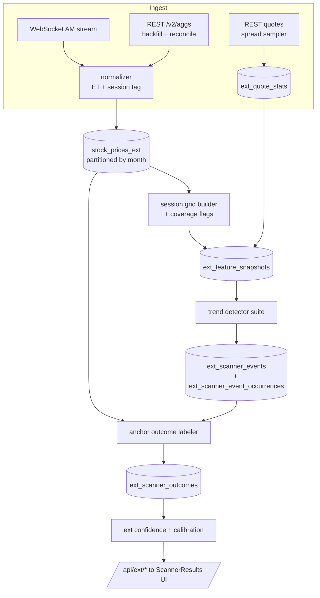

# Extended Hours Trend-Following Scanner — Design v2

Purpose: define a production-grade store and scanner for premarket and after-hours trade
setups, built on a trend-following methodology, with strict separation from the current
regular-session pipelines.

Research-first: signals are evaluated before they are trusted, and no order routing is in
scope. But the store, ingestion, and evaluation layers are designed to production standards
from the start, because retrofitting point-in-time correctness is not possible.

## 1. Why a separate pipeline

Extended-hours microstructure differs from regular session:

- Lower liquidity and much wider spreads
- More event-driven gaps
- Faster regime flips around the open
- Different volume and volatility baselines
- Sparse tape: minutes with no trades produce no bar at all

Mixing this data into existing regular-session models would contaminate current scanner
evidence and confidence tracking.

Design rule: extended-hours data, features, events, outcomes, and reports remain isolated
from regular-session scanner tables.

## 2. Corrections carried into v2

v1 of this design got the isolation architecture right. The following defects were found on
review and are fixed throughout the rest of this document.

| # | v1 defect | v2 correction |
|---|---|---|
| 1 | Sessions defined as `16:00:01 to 20:00` | Polygon `t` is a bar-START timestamp. Sessions are half-open windows on bar-start (section 6). No second-level boundary logic. |
| 2 | No data-delay model | Every event carries both `bar_time` and `observed_at`. Entry is the first bar at or after `observed_at` (section 10). Without this, every backtest is lookahead-biased. |
| 3 | No liquidity gate | Layer 0 eligibility (section 9.1). Roughly 85% of the universe is untradable in extended hours; without this gate the scanner measures noise. |
| 4 | Cost model inherited from the RTH lane | `round_trip_cost_bps DEFAULT 4.0` is invalid here. Cost is computed per signal from measured NBBO spread (sections 7.2 and 9.5), typically 20-80 bps. |
| 5 | Sparse bars unaddressed | Fixed session grid with coverage gating (section 6.2). A "20-period EMA" otherwise spans 20 minutes on AAPL and 3 hours on a thin name. |
| 6 | Strategy catalog was gap/fade-centric | Reframed as a 4-layer trend-following stack (section 9). Gap/fade ideas are retained only where they are trend-aligned. |
| 7 | Horizons in wall-clock, engine in `horizon_bars` | Outcomes are anchor-based (`open_plus_30m`, `next_open`), not bar-count based (section 10). |
| 8 | Benchmark unspecified | SPY and sector ETFs trade thinly premarket. Benchmark rows carry `benchmark_liquidity_flag` (section 11). |
| 9 | Half-day sessions ignored | Early-close days have a 13:00-17:00 after-hours session. Hardcoding 16:00 corrupts roughly 9 sessions per year (section 8). |

## 3. Data source and plan requirements

Polygon custom aggregates (`/v2/aggs`) include premarket, regular, and after-hours bars
natively. There is **no `extended_hours` request parameter** — the endpoint takes only
`adjusted`, `sort`, and `limit`. Sessions are separated by ET timestamp, which means the
current code already receives extended-hours bars and discards them in the
`09:30 <= t < 16:00` filter inside `_resample_minutes_to_session_hourly`.

Capability requirements by plan:

| Capability | Needed for | Starter | Developer | Advanced |
|---|---|---|---|---|
| `/v2/aggs` custom bars | All ingestion | Yes, 15-min delayed, 5y history | Yes, 15-min delayed, 10y | Yes, real-time, full history |
| WebSocket `AM` per-minute aggregates | Live incremental ingest | Included, 15-min delayed | Included, delayed | Included, real-time |
| Real-time bar to actionable signal | Trading the open transition | No | No | Yes |
| Quotes / NBBO | Spread-aware eligibility and honest cost model | Verify | Verify | Yes |
| Deep minute history | Calibration to n >= 100 per scanner | 5y | 10y | Full |

**Target tier: Stocks Advanced.** Two hard reasons:

1. **Quotes.** Without NBBO the spread cannot be measured, and without spread there is no way
   to separate a signal from a signal that costs 60 bps to touch. Every extended-hours edge
   lives inside the spread. This matters more than latency.
2. **Real-time.** A 15-minute delay is fatal in exactly the highest-value windows — the
   08:45-09:30 premarket ramp and the 16:00-16:30 after-hours reaction.

The delay is a configuration value (`DATA_DELAY_SECONDS`), never an assumption. Research done
on delayed data stays valid and directly comparable after the upgrade: re-running the same
events with `DATA_DELAY_SECONDS = 0` quantifies exactly how much edge latency was costing.

Backfill note: 400 tickers x 5 years of 1-minute bars is roughly 500k paginated REST
requests. If Flat Files (bulk S3 minute aggregates) are available on the chosen tier, use them
for the historical load and reserve REST for the incremental tail. Otherwise backfill is a
resumable, month-chunked background job.

## 4. Scope and non-goals

Scope now:

- Build the extended-hours data lane, feature store, and signal lifecycle
- Detect trend-following setups in premarket and after-hours sessions
- Measure signal quality net of realistic execution cost, by cohort, sector, and setup class

Non-goals now:

- No changes to current regular-session scanner qualification gates
- No auto-order routing
- No blending extended-hours outcomes into current `scanner_event_outcomes`
- No extended-hours short signals in phase 1 (borrow constraints are not modelable here)

## 5. Architecture



This mirrors the proven regular-session lane (`run_scanner_event_pipeline.py` ->
`scanner_events` -> `drain_scanner_outcomes.py` -> `scanner_confidence`) with an isolated
schema, its own namespace, and its own scheduler.

Keep current tables unchanged:

- `stock_prices_intraday` remains regular-session only
- `stock_prices_hourly` remains regular-session only

Model namespace prefix `ext_` on every scanner name and every table, so a join across lanes is
visibly wrong at a glance.

## 6. Session definitions and the session grid

### 6.1 Session windows

Polygon `t` is the bar **start**. Sessions are half-open windows on bar-start in ET:

| Session | Window (bar-start ET) |
|---|---|
| premarket | `[04:00, 09:30)` |
| regular | `[09:30, 16:00)` (existing lane) |
| afterhours | `[16:00, 20:00)` |

The 15:55 bar is regular; the 16:00 bar is after-hours. No ambiguity, no second-level rules.

Early-close days (roughly 9 per year) shift the boundary: regular ends 13:00 and after-hours
runs `[13:00, 17:00)`. Session classification consults a market calendar, never a constant.

`session_date` is the ET trading date the session belongs to and is **materialized on every
row**. After-hours bars cross the UTC date line, so deriving it per query is both slow and a
recurring source of off-by-one bugs.

Capture and evaluate by `session_type`, never inferred from interval alone.

### 6.2 The session grid

No trade in a minute means no bar. Raw bars are therefore unusable for period-based
indicators: a 20-period EMA covers 20 minutes on a liquid name and 3 hours on a thin one.

Design decision: every session is reindexed onto a **fixed 5-minute grid** spanning the full
session window, with price forward-filled and volume zero-filled. Two derived quality fields
travel with the grid:

- `traded_bar_ratio` — fraction of grid slots that had real trades
- `session_bar_index` — position in the grid, used for indicator warm-up gating

A ticker-session with `traded_bar_ratio < 0.60` is ineligible for signal generation. All
indicators reset per `(ticker, session_date, session_type)` — an EMA is never carried across an
overnight gap.

Grid sizes: premarket 66 bars, after-hours 48 bars.

## 7. Data store design

### 7.1 stock_prices_ext — raw extended-hours bars

```sql
CREATE TABLE stock_prices_ext (
    ticker        VARCHAR(10)   NOT NULL,
    datetime      TIMESTAMPTZ   NOT NULL,   -- bar START, stored UTC
    interval      VARCHAR(5)    NOT NULL,   -- '1m' | '5m'
    session_type  VARCHAR(12)   NOT NULL,   -- 'premarket' | 'afterhours'
    session_date  DATE          NOT NULL,   -- ET trading date of the session
    open_price    DECIMAL(12,4) NOT NULL,
    high          DECIMAL(12,4) NOT NULL,
    low           DECIMAL(12,4) NOT NULL,
    close_price   DECIMAL(12,4) NOT NULL,
    volume        BIGINT        NOT NULL,
    trade_count   INTEGER,                  -- Polygon 'n'
    vwap          DECIMAL(12,4),            -- Polygon 'vw'
    source        VARCHAR(12)   NOT NULL DEFAULT 'polygon_rest',  -- rest | ws | flatfile
    revised_at    TIMESTAMPTZ,              -- set when a later fetch changed the values
    created_at    TIMESTAMPTZ   DEFAULT NOW(),
    PRIMARY KEY (ticker, datetime, interval)
) PARTITION BY RANGE (datetime);
```

Design points:

- **Composite primary key, no `BIGSERIAL`.** Unlike `stock_prices_intraday`, this table is
  write-heavy and only ever read by `(ticker, session)`. A surrogate key buys nothing and
  costs index size.
- **Monthly partitions.** 5m: ~114 bars/ticker/day, ~46k rows/day at 400 tickers, ~11M
  rows/year. 1m: ~570 bars/ticker/day, ~228k rows/day, ~57M rows/year — partitioning is
  mandatory at 1m.
- **Retention:** 1m kept 400 days, 5m kept indefinitely.
- **`revised_at`.** Polygon backfills late-reported trades. Reconciliation must be able to
  prove a bar changed after a signal fired on it, otherwise history is silently "improved" and
  outcomes are corrupted.

### 7.2 ext_quote_stats — the spread layer

```sql
CREATE TABLE ext_quote_stats (
    ticker             VARCHAR(10) NOT NULL,
    session_date       DATE        NOT NULL,
    session_type       VARCHAR(12) NOT NULL,
    bucket_start       TIMESTAMPTZ NOT NULL,   -- 5-minute bucket
    median_spread_bps  REAL,
    p90_spread_bps     REAL,
    median_bid_size    INTEGER,
    median_ask_size    INTEGER,
    quote_sample_count INTEGER,
    PRIMARY KEY (ticker, bucket_start)
);
```

Sampled rather than full tick capture — roughly 20 NBBO snapshots per 5-minute bucket per
eligible ticker. Feeds both the eligibility gate and the per-signal cost model.

This table is what makes the entire study honest. Without it, every reported alpha number is
gross of a cost that is frequently larger than the alpha.

### 7.3 ext_feature_snapshots — point-in-time feature freeze

One row per `(ticker, bar_time, interval)` for eligible tickers, holding the complete feature
vector at that instant: `session_vwap`, `ema9`, `ema20`, `rsi14`, `vol_ratio`, `range_pos`,
`rel_spy`, `spread_bps`, `daily_trend_state`, `traded_bar_ratio`, and the rest of section 9.3.

Written **before** detectors run. Two benefits:

1. Re-running detectors with new thresholds is a DB scan, not a full re-ingest.
2. Lookahead bias becomes structurally impossible — a detector cannot read a column that did
   not exist at `bar_time`.

### 7.4 Event and outcome tables

`ext_scanner_events`, `ext_scanner_event_occurrences`, and `ext_scanner_outcomes` mirror the
regular-session column set (SHA-256 `event_key` dedup, frozen `entry_price`, `atr_at_signal`,
`reference_level`, `stop_price`, `target_price`, `metadata` JSONB) plus extended-hours fields:

| Added column | Purpose |
|---|---|
| `session_type`, `session_date` | Lane identity |
| `bar_time`, `observed_at` | Delay model: `observed_at = bar_end + DATA_DELAY_SECONDS` |
| `spread_bps_at_signal`, `spread_source` | Measured cost inputs, not assumptions |
| `round_trip_cost_bps` | `2 * spread_bps_at_signal + slippage_bps`, never the `4.0` default |
| `session_bar_index`, `session_coverage_pct` | Warm-up and data-quality provenance |
| `daily_trend_state` | Higher-timeframe regime frozen at signal |
| `benchmark_liquidity_flag` | Whether the benchmark was tradable at that timestamp |

`ext_scanner_outcomes` replaces `horizon_bars` with **`horizon_anchor VARCHAR(24)`**, unique on
`(event_id, horizon_anchor)`. See section 10.

Do not reuse `scanner_events` or `scanner_event_outcomes` for this lane.

## 8. Ingestion pipeline

Three ingestion paths converge on one normalizer:

1. **Bulk backfill** — flat files where available, otherwise chunked REST. Resumable via an
   `ext_backfill_progress` checkpoint table, bounded `ThreadPoolExecutor` (reuse
   `_fetch_many_aggs`), per-ticker `try/except` so one bad symbol never kills a run.
2. **Live incremental** — WebSocket `AM` subscription over the eligible universe, buffered and
   flushed to Postgres every 15-30s with batched `execute_values` upserts. Reconnect
   re-subscribes and triggers a REST gap-fill for the disconnected window.
3. **Reconciliation** — every cycle, re-fetch the last 30 minutes via REST and upsert; late
   trades change bars and `revised_at` records it. At session end, a full-session re-fetch
   validates bar counts against the grid.

Normalizer responsibilities (single choke point, one place to get this right):

- ms epoch -> UTC -> ET
- Session classification on bar-start, via market calendar (half-days included)
- `session_date` assignment
- OHLC sanity via the existing `is_valid_ohlcv`
- Rejection of regular-session bars (they belong to the other lane)
- Duplicate collapse from pagination overlap

Failure handling reuses the existing `data_ingestion_failures` table and retry queue rather
than inventing a second mechanism.

## 9. Signal design: the 4-layer trend-following stack

A signal fires only when all four layers agree. Each layer is independently logged so it is
possible to measure which layer actually carries the alpha, rather than shipping a monolith
and guessing.

### 9.1 Layer 0 — Eligibility

Removes roughly 85% of the universe before any signal logic runs.

| Gate | Threshold | Rationale |
|---|---|---|
| Price | >= $5 | Sub-$5 extended-hours tape is noise |
| Prior-day 20d ADV | >= 750k shares | Baseline liquidity |
| Session volume to date | >= 100k shares | This session is actually alive |
| `traded_bar_ratio` | >= 0.60 | Indicators are meaningful |
| `median_spread_bps` | <= 30 (PM) / <= 25 (AH) | Cost cap |
| Halt / SSR state | not halted | Avoid untradable names |

Rejects are logged with reason codes. The reject distribution is itself a report: it answers
whether the candidate universe is even suitable for this lane.

### 9.2 Layer 1 — Higher-timeframe trend regime

This is what makes the system trend-*following* rather than gap-chasing, and it is the
discipline the v1 catalog lacked.

Reuse the existing daily lane, frozen at prior close (no new computation, no lookahead):

```
trend_state_long = (close > sma50) AND (sma50 > sma200) AND (adx14 >= 20)
```

Plus `market_discovery_states` alignment (`CONTINUATION` or `EMERGING_REVERSAL` for longs).

**The direction of every extended-hours signal must match the daily trend direction.**

### 9.3 Layer 2 — Session trend structure

Computed on the fixed 5-minute session grid, reset per `(ticker, session_date, session_type)`:

| Feature | Definition |
|---|---|
| `session_vwap` | Anchored at session start (04:00 or 16:00) |
| `ema9`, `ema20` | `close.ewm(span=n, adjust=False)`, gated by `session_bar_index >= 2n` |
| `ema_stack` | `close > ema9 > ema20` (long) |
| `vwap_side` | `close > session_vwap`, plus bars-held-above count |
| `hh_hl` | >= 2 higher highs and >= 2 higher lows in the last 8 bars |
| `range_pos` | `(close - session_low) / (session_high - session_low)` |
| `rel_spy` | session return minus SPY session return |
| `rel_sector` | session return minus sector ETF session return |

Supporting context features retained from v1: `gap_pct_vs_prev_close`, `gap_atr_ratio`,
`premarket_volume_percentile_20d`, `ah_return_from_close`, `ah_volume_percentile`,
`news_spike_proxy` (volume and range shock). These are used as *filters and cohort labels*,
not as standalone triggers.

### 9.4 Layer 3 — Trigger scanners

Seven detectors, all trend-following, all with long/short mirrors (shorts deferred to phase 5).

| Namespace | Session | Trigger |
|---|---|---|
| `ext_pm_trend_continuity_v1` | PM | `close > ema20` and `rsi14` in `[55, 68]` and `vol_ratio >= 1.5` and `close > session_vwap` and Layer 1 long |
| `ext_pm_vwap_pullback_resume_v1` | PM | Established PM uptrend, pullback touches VWAP/EMA20 without losing it, resume bar closes above the pullback high |
| `ext_pm_range_breakout_v1` | PM | Break of the 04:00-06:30 premarket opening range on >= 2x volume, in daily-trend direction |
| `ext_pm_relative_strength_v1` | PM | `rel_spy >= +1.0%` and `ema_stack` and Layer 1 long |
| `ext_ah_trend_drift_v1` | AH | >= 70% of bars in trend direction, no volume shock (excludes news reactions), `close > session_vwap` at 19:30 |
| `ext_ah_reaction_continuation_v1` | AH | Post-16:00 shock >= 3% **aligned with** the daily trend, holds the top quartile of AH range for >= 6 bars |
| `ext_ah_vwap_reclaim_v1` | AH | Reclaims AH VWAP after 18:00 and holds 3 bars, daily trend long |

`ext_pm_vwap_pullback_resume_v1` is the direct session-scoped analogue of the existing
`structured_trend_pullback` detector and should reuse its pivot/pullback vocabulary.

Primary scanner in full:

```
ema20     = close.ewm(span=20, adjust=False)          # session-scoped, reset daily
rsi14     = Wilder(close, 14)                          # session-scoped, zero-loss guarded
vol_ratio = volume / volume.shift(1).rolling(5).mean() # shifted: trigger bar excluded

fire IF close > ema20
    AND 55 <= rsi14 <= 68
    AND vol_ratio >= 1.5
    AND close > session_vwap
    AND session_bar_index >= 40          # warm-up
    AND daily_trend_state == LONG        # Layer 1
```

Two notes on this specification:

- The volume baseline **must** be shifted. If the trigger bar is included in its own
  denominator it inflates the baseline and the 1.5x gate becomes systematically too easy.
- `[55, 68]` and `1.5` are unvalidated priors inherited from regular-session intuition.
  Extended-hours RSI is far fatter-tailed because of volume voids. Treat both as swept
  parameters in phase 5, not constants.

Detector convention follows `composite_scanners.EVENT_COLUMNS`: panel in, event DataFrame out,
`direction` in `{-1, 1}`, scanner-specific enrichment in `metadata`.

### 9.5 Layer 4 — Risk model, frozen at signal

```
stop_price   = entry - max(1.2 * atr14_session, 2 * spread)   # spread-aware floor
target_price = entry + 2.0 * (entry - stop_price)
reference_level = session_vwap
round_trip_cost_bps = 2 * spread_bps_at_signal + 5
```

The spread floor on the stop matters: a stop placed inside the spread is hit by the quote, not
by the market.

### 9.6 Composite layer

Detectors emit **independent** events. An ensemble (mirroring `composite_scanners.py`) combines
them later. Hard-ANDing detectors now would destroy the ability to attribute alpha to any
single component.

### 9.7 Regular-session screener reuse

Reuse as feature components, with modification:

- MA crossover logic: yes, with shorter lookbacks and session-aware baselines
- Momentum pullback structure: reuse the vocabulary, retune every threshold
- Gap logic: conceptually relevant, requires premarket-specific definitions

Not reusable as-is:

- Anything assuming regular-session bar counts or timing
- Anything using regular-session quality filters without session context
- Existing scanner qualification gates calibrated on regular daily or hourly data

## 10. Outcome model

### 10.1 Entry model `ext_next_bar_open_v3`

`observed_at = bar_end + DATA_DELAY_SECONDS`. Entry is the open of the first grid bar whose
start is at or after `observed_at`. For after-hours signals whose horizon crosses into the next
session, entry may be the next regular open — recorded explicitly in `entry_model`.

### 10.2 Horizons are anchor-based

Resolved against `stock_prices_intraday` (regular session) and `stock_prices_ext`.

Premarket-origin events:

- `open_plus_5m`, `open_plus_15m`, `open_plus_30m`, `open_plus_60m`, `same_day_close`

After-hours-origin events:

- `next_open`, `next_open_plus_30m`, `next_open_plus_60m`, `next_day_close`

Bar-count horizons (`horizon_bars`) are wrong for this lane: 5 bars means something different
in a session with 40% coverage than in one with 100%.

### 10.3 Metrics per outcome

`raw_return`, `signed_return`, `net_signed_return` (after the measured cost),
`alpha_return` vs SPY, `sector_alpha_return`, `mae_pct`, `mfe_pct`, `mae_r`, `mfe_r`,
`stop_hit`, `target_hit`, `first_hit`.

Label classes retained for the confusion matrix: `continuation`, `reversal`, `sideways`, with
numeric returns kept alongside for every horizon.

## 11. Evaluation and qualification

Keep extended-hours evaluation fully independent from regular scanner confidence studies.

### 11.1 Metrics

- `hit_rate` by strategy and horizon anchor
- Mean and median **net** return, after measured spread cost
- Downside tail (p05, p10)
- Continuation / reversal / sideways confusion matrix
- Alpha vs SPY and vs sector ETF, each carrying `benchmark_liquidity_flag`
- Performance by market regime, by gap-size bucket, and by spread bucket

### 11.2 Bias controls

- Point-in-time feature freezing at signal timestamp (`ext_feature_snapshots`)
- No post-signal bars in feature construction
- Consistent entry model per strategy class
- Point-in-time universe: the eligible list is reconstructed per session date, never today's
  list applied backwards

### 11.3 Qualification gates — deliberately stricter than the RTH lane

| Gate | RTH lane | Extended-hours lane |
|---|---|---|
| Minimum sample | `MIN_TRAIN_PERIODS = 40` | **100 deduplicated** events |
| Deduplication | `event_key` | Additionally collapse by `(ticker, session_date)` |
| Concentration | none | No ticker > 10% of sample, no session_date > 5% |
| Promotion | win probability plus alpha | `net_alpha_ci_low > 0` **after measured spread cost**, `brier_skill_score_vs_50 > 0`, stable across >= 2 volatility regimes |

The concentration cap matters more here than anywhere else in the system: extended-hours events
cluster violently around earnings weeks, so a naive n = 200 can represent roughly 15
independent observations.

`walk_forward_calibration()` is reused unchanged — it is fed the deduplicated, capped sample.

## 12. Scheduler design for the extended-hours lane

A separate `run_ext_scheduler.py`. Do not merge into `run_scheduler.py` until qualification
gates pass.

| Job | Window (ET) | Cadence |
|---|---|---|
| `job_ext_eligibility` | 03:45, 15:45 | once per session |
| `job_ext_ingest_ws` | 04:00-09:30, 16:00-20:00 | continuous stream |
| `job_ext_reconcile` | same | every 5 min, last 30 min re-fetch |
| `job_ext_quotes` | same | every 5 min, eligible universe only |
| `job_ext_features_scan` | same | every 5 min |
| `job_ext_open_transition` | 09:30-10:30 | every 5 min, labels premarket outcomes |
| `job_ext_outcome_drain` | 20:15 | nightly |
| `job_ext_quality_report` | 20:30 | nightly |

Single-instance lock file, `--backfill` replay mode, idempotent upserts throughout.

Monitoring signals: rows per session vs expected grid size, eligible-universe drift, detector
fire counts (a 10x spike is a data bug, not an opportunity), outcome backlog depth, WebSocket
reconnect count, `revised_at` rate.

## 13. API and UI separation

Separate endpoint prefix so nothing merges by accident:

- `GET /api/ext/scans/latest?session_type=premarket&scanner=...`
- `GET /api/ext/scans/history`
- `GET /api/ext/reports/quality`
- `GET /api/ext/reports/regime`
- `GET /api/ext/coverage`

`frontend/src/pages/ScannerResults.tsx` gains:

- A session badge (`PM` / `AH`)
- A spread column — traders need it more than they need RSI
- A data-delay indicator driven by `observed_at - bar_time`
- A persistent "research signal, not validated" banner until qualification gates pass

## 14. Implementation roadmap

| Phase | Deliverable | Exit criteria |
|---|---|---|
| 1 | Store, ingestion, normalizer, coverage report | 30 sessions ingested, grid coverage >= 95% on eligible names, zero regular-session leakage |
| 2 | Layer 0 eligibility, quote sampler | Eligible universe stable at 40-120 names, spread distribution characterized |
| 3 | Feature snapshots, scanners 1, 2, 5 | Events firing at a sane rate, 5-40 per session |
| 4 | Anchor outcome labeler, quality report | First honest net-of-spread alpha numbers |
| 5 | Threshold sweep, remaining scanners, composite, shorts | >= 1 scanner passes promotion gates |
| 6 | Real-time A/B | Measured edge delta at `DATA_DELAY_SECONDS` 900 -> 0 |

## 15. Risks

1. **After realistic spread costs, extended-hours trend continuation may show no net alpha.**
   Phase 4 is a genuine go/no-go, not a formality. The design is built so this answer arrives
   cheaply and early rather than after a full build-out.
2. Event clustering around earnings inflates apparent sample size — mitigated by section 11.3.
3. Survivorship in the candidate ticker list — mitigated by point-in-time universe
   reconstruction.
4. Late-reported trades revising bars under a live signal — mitigated by `revised_at`.
5. Half-day sessions and holiday calendar drift silently corrupting session tagging.

## 16. Open decisions to lock before implementation

1. Universe: fixed list, or dynamically eligible per session? Recommendation: dynamic, with the
   fixed list as the candidate pool.
2. Primary grid: 1m or 5m? Recommendation: 5m for signals, 1m stored for outcome precision.
3. Both directions from day one, or longs only? Recommendation: longs only through phase 4.
4. Backfill depth: 1 year is sufficient for phases 3-4; 5 years only matters for regime
   robustness testing.
5. Confirm Quotes/NBBO and Flat Files access on the target tier.

## 17. Key design decisions to keep fixed

1. No mixing with regular-session scanner evidence tables
2. Explicit `session_type` and `session_date` on every extended-hours row
3. Separate model namespaces, endpoints, and reports
4. Bar-start session boundaries, calendar-aware
5. `observed_at` on every event — the delay is data, never an assumption
6. Cost is measured from quotes, never defaulted
7. Research-first, execution-second rollout
