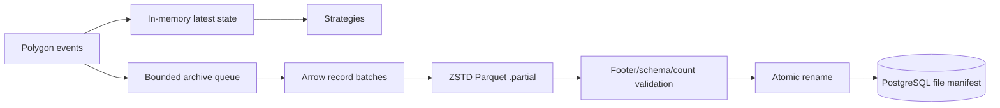
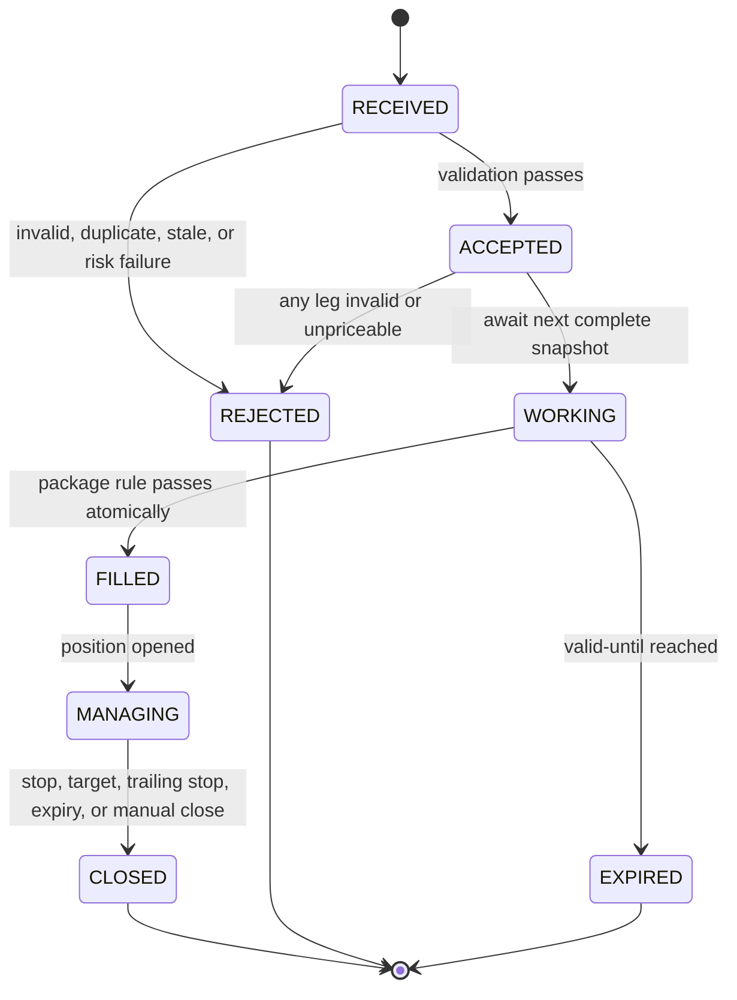

# Option Chain Scanner: Production Design and Implementation Plan

Status: proposed v3 - Developer-first fail-safe baseline

Document role: this is the normative detailed specification. Implementers should start
with `docs/OPTION_CHAIN_SCANNER_IMPLEMENTATION_GUIDE.md`, which provides the build
order and links back to the authoritative sections here. If the guide and this document
differ, this document governs until both are corrected in the same change.

Target: begin with 10 fixed stock underlyings plus 3 fixed ETF underlyings on Polygon
Options Developer, then expand to 15 stocks plus the same 3 ETFs. Upgrade to Polygon
Options Advanced only after the delayed-data research and paper engine pass their
acceptance gates and the system is ready for quote-backed shadow validation followed
by separately authorized automated execution.

## 1. Executive decision

Build the first release around a fixed allowlist of 13 underlyings organized into two
explicit cohorts.

Fixed stock cohort:

| Ticker | Initial role |
|---|---|
| AAPL | Deep, broad chain; baseline for all three scanners |
| AMD | High options activity and useful volatility skew |
| AMZN | Liquid weeklies and broad strike coverage |
| GOOGL | Large-cap chain and range/spread candidate |
| META | Liquid premium and spread candidate |
| MSFT | Stable-chain control name |
| NVDA | High-volume gamma and premium candidate |
| PLTR | Active chain at a lower notional than most mega-caps |
| SOFI | Lower-notional wheel and liquidity test case |
| TSLA | High-volume, high-IV stress case |

Fixed ETF cohort:

| Ticker | Initial role |
|---|---|
| SPY | Broad-market control and frequent 0-DTE expirations |
| QQQ | Growth/technology benchmark and frequent 0-DTE expirations |
| IWM | Small-cap benchmark and cross-market volatility comparison |

Expansion candidates for the fixed 15-stock cohort are `AVGO`, `COIN`, `INTC`,
`MSTR`, and `MU`; the three ETFs remain fixed, producing 18 total underlyings after
expansion.
This is a bootstrap list, not a claim that these are Polygon's current top 10 or top
15 on every date. Options activity changes. The system will calculate and retain a
daily Polygon ranking from the beginning, but it will not automatically alter the
live allowlist until the data pipeline has passed the expansion gate in section 18.

Why start with 13 underlyings:

- It bounds chain pagination, storage, and delayed-data processing while correctness
  is being established.
- It contains stable, high-volatility, equity, and ETF chains, making bad assumptions
  visible.
- It keeps replay tests and paper-account reconciliation manageable.
- Expansion to 15 stocks plus 3 ETFs is configuration-only because no downstream
  component accepts a hard-coded ticker list.

Important 0-DTE limitation: individual equity options generally have weekly rather
than daily expirations, so the 0-DTE stock scanner will normally become active on
expiration Fridays. `SPY`, `QQQ`, and `IWM` provide more frequent 0-DTE coverage but
remain labeled as ETFs in storage, reports, metrics, and risk limits. Do not mix ETFs
into the stock-only ranking.

## 2. Goals and non-goals

### Goals

- Fetch Polygon option-chain snapshots for the configured underlyings every 15
  minutes during the regular session.
- Ingest Polygon Developer's delayed individual option trades for flow research.
- Normalize provider payloads into an immutable provider-neutral contract.
- Compute implied volatility and Gamma locally with a vectorized Black-Scholes
  Newton-Raphson implementation.
- Apply DTE, moneyness, and liquidity filters before retaining or dispatching rows.
- Emit standardized, idempotent signal objects from three independent strategies.
- Persist enough point-in-time data to replay every signal without lookahead.
- Route signals through a factory-selected paper execution engine.
- Preserve the same strategy and execution contracts when Polygon Advanced and a
  live broker are introduced.
- Provide operational APIs for universe status, signals, positions, and paper metrics.

### Non-goals for the first release

- Live brokerage orders.
- Naked short calls or undefined-risk combinations.
- Claims of executable bid/ask fills, aggressor side, or market impact from Developer
  data, which has delayed trades but no option quotes.
- Automatic changes to the fixed stock or ETF allowlists.
- Historical performance claims based only on current chain snapshots.
- Claims that a sweep-like trade cluster proves institutional ownership or directional
  intent. Developer supplies trades, but no participant identity or contemporaneous
  option quote needed to infer trade aggressor reliably.
- Combining option signals with the existing equity `scanner_events` evidence tables.

## 3. Developer-to-Advanced capability boundary

As verified against Massive/Polygon documentation on 2026-08-29, this design supports
only the two selected tiers:

| Capability | Developer: initial | Advanced: execution upgrade | Design consequence |
|---|---:|---:|---|
| Option-chain snapshot | 15-minute delayed | Real-time | Same normalized batch contract |
| Option OHLCV and VWAP | 15-minute delayed | Real-time | Developer marks are research proxies |
| Daily open interest | Yes | Yes | OI is prior completed-session data |
| Individual option trades | 15-minute delayed, 4 years history | Real-time, full history | Developer supports retrospective flow research |
| Option quotes/NBBO | Not included | Real-time, full history | Spread and executable-price gates start with Advanced |
| Polygon IV and Greeks | Included but may be absent per contract | Included but may be absent per contract | Nullable diagnostics; local IV/Gamma remain strategy inputs |
| Flat Files and WebSockets | Included, delayed | Included, real-time | Only the producer and mark-quality path change |
| Underlying stock price | Depends on separate Stocks plan | Must be real-time from Stocks Advanced or broker | Live option/spot alignment cannot use a delayed stock mark |

`GET /v3/snapshot/options/{underlyingAsset}` supports server-side expiration and
strike ranges, returns up to 250 rows per page, and supplies `next_url`. Every page
must be consumed. `GET /v3/reference/options/contracts` supplies canonical underlying,
expiration, strike, exercise style, multiplier, and adjustment metadata.

Options Developer provides option chains, option prices, and delayed individual
trades. The snapshot contains a delayed `day` object with option OHLC, volume, and
VWAP where trading data exists. The custom-bars endpoint
`GET /v2/aggs/ticker/{optionsTicker}/range/{multiplier}/{timespan}/{from}/{to}`
provides delayed OHLCV, transaction count, and VWAP history. Sparse contracts can have
no aggregate for an interval because Polygon creates bars only from qualifying trades.
`GET /v3/trades/{optionsTicker}` provides delayed price, size, exchange, condition,
correction, sequence, participant timestamp, and SIP timestamp records. The snapshot's
underlying-stock price still depends on the separately licensed Stocks plan. Developer
startup therefore requires a compatible delayed stock aggregate feed; it does not
assume the options subscription also licenses underlying data.

Current-account verification on 2026-08-28 found that the then-configured key returned
HTTP 403 for `GET /v3/snapshot/options/SPY?limit=1`. This is expected until Options
Developer is activated for the key. When the Developer credential is available, update
the local environment and repeat the snapshot, trade, and negative quote-entitlement
probes before implementation proceeds.

The original specification calls for simulated market/limit fills using a snapshot
mid-price. Options Developer does not include option quotes, so a real midpoint is not
available. Developer phases label fills as `RESEARCH_DELAYED_PROXY` and keep three
price concepts separate:

- `display_mark`: latest option `day.close`, with current-day VWAP as a labeled display
  fallback. It may appear in the UI but does not automatically qualify for IV or fills.
- `model_mark`: the option close whose source timestamp can be paired with an
  underlying one-minute close at or immediately before that time. The default maximum
  source-time skew is 60 seconds. Local IV and Gamma use this pair only.
- `execution_proxy`: the next complete snapshot's model marks after order acceptance,
  adjusted against the account by the configured deterministic slippage model.

For Developer, fetch the underlying's delayed one-minute aggregate series once per batch
and perform a backward as-of join against each option mark timestamp. The chain's
`underlying_asset.price` is preferred for the +/-15% transfer/filter corridor and as a
sanity check; it is not used for IV when its source timestamp is absent or outside the
skew limit. For Advanced, a valid option quote midpoint may be paired with an
underlying quote no more than five seconds apart.

If an option has no source timestamp, no qualifying underlying pair, or no positive
mark, set `model_mark=NULL`, record the exact quality reason, and exclude it from IV,
signals, and execution. A cumulative day VWAP is never treated as an instantaneous
price for IV. Prior snapshots are display-only during an outage and can never produce
a new signal, fill, stop, or target transition.

Synthetic slippage may be applied for conservative research, but it must not be
presented as observed spread. Options Advanced is required for NBBO-aware shadow paper
validation and is a hard prerequisite for automated execution in this design.

Code checks explicit capabilities (`CHAIN_SNAPSHOT`, `OPTION_TRADES`, `OPTION_QUOTES`,
`UNDERLYING_PRICE`, `REAL_TIME`) returned by entitlement probes; it never assumes
capability from a configured plan name or price. Developer startup requires snapshots,
delayed trades, and a time-aligned delayed underlying feed while asserting that option
quotes are unavailable. Advanced live eligibility additionally requires real-time
option quotes/trades and a real-time underlying quote from Stocks Advanced or the
broker. Subscription prices are planning references, not application logic.

## 4. Fit with the current repository

The design extends existing boundaries instead of replacing them:

- `backend/providers/base.py` remains the stock OHLCV `PriceProvider`. Option chains
  use a separate interface because their schema and stream semantics are different.
- `backend/providers/polygon_provider.py` remains the stock aggregate adapter. Common
  HTTP retry, key redaction, and session configuration move into reusable Polygon
  transport helpers only when implementation begins.
- `backend/scripts/discover_universe_polygon.py` remains equity-universe discovery.
  Its active-common-stock and dollar-volume outputs are inputs to future option
  universe discovery.
- `backend/scripts/run_scheduler.py` remains the stock scheduler. The option pipeline
  runs in its own process so a large chain response cannot delay price ingestion.
- Existing `scanner_events` tables remain equity research tables. Options receive an
  isolated schema because one signal can have multiple legs and an execution ledger.
- Existing PostgreSQL cursor/pool helpers in `backend/database.py` are reused.
- FastAPI endpoints are registered in `backend/main.py` through a small options router.

The current dependency files include pandas and NumPy but not the official Polygon
client or PyArrow. Implementation must add and pin `scipy` and `polygon-api-client` in
both `backend/pyproject.toml` and `backend/requirements.txt`. Add `pyarrow` as an
`archive` optional dependency and require that deployment extra whenever raw Developer
trades or Advanced quote/trade windows are archived. Do not add a Roaring package to
the Developer dependency set; Advanced adopts one only after the section 12.3 benchmark
gate passes.

## 5. Target architecture

```mermaid
flowchart LR
    S[Option scheduler] --> C[Fixed universe repository]
    C --> D[BaseDataEngine]
    D -->|Delayed chain| RB[(Durable raw batch pages)]
    D -->|Delayed trades| TR[(Option trade events)]
    RB -->|Complete batch claim| N[Normalizer and quality checks]
    N --> F[Three-stage contract filter]
    F --> G[Local IV and Greeks engine]
    G --> AN[Standard option analysis matrix]
    AN --> R[(Option snapshot repository)]
    R --> O1[(Strategy work outbox)]
    TR --> O1
    O1 --> Q1[[strategy_queue wake-up]]
    MC[Market context<br/>events and stock trend] --> CG[Context gate]
    Q1 --> A[0-DTE Gamma Squeeze]
    Q1 --> B[Income Wheel]
    Q1 --> C2[Spread and Range Locator]
    Q1 --> DF[Trade-flow scanners]
    A --> CG
    B --> CG
    C2 --> CG
    DF --> CG
    CG --> SA[Candidate scenario analysis]
    SA --> SE[(Signal events and execution outbox)]
    SE --> RV[RecommendationValidityEngine]
    AN --> RV
    MC --> RV
    RV --> Q2[[validated signal wake-up]]
    Q2 --> X[ExecutionManager]
    X --> PR[Portfolio risk and stress]
    PR --> P[PaperExecutionEngine]
    P --> L[(Orders, fills, positions, equity)]
    R --> API[FastAPI options router]
    L --> API
```



The queues are bounded `queue.Queue` instances in Developer mode, but they are not the system
of record and do not provide delivery guarantees. Each producer first commits its
payload and a work-outbox row in one PostgreSQL transaction, then places only the
durable work ID on the queue. A worker claims the row with `FOR UPDATE SKIP LOCKED`,
records its lease, performs the work, and marks it complete in the same transaction
as its durable outputs. After a crash, startup requeues expired claims and all pending
work. The queue can lose every in-memory item without losing accepted market data,
signals, orders, or ledger effects.

The adapter may use a thread pool for independent underlying requests, but
normalization, filtering, and database writes operate on bounded batches. In Advanced mode,
a WebSocket producer emits the same normalized records, persists sequence checkpoints,
and coalesces updates by contract symbol before scheduling durable work.

Recommended queue defaults:

| Queue | Max size | Overload behavior |
|---|---:|---|
| `raw_option_queue` | 20 durable batch IDs | Stop fetching new batches at capacity; pending DB work remains recoverable |
| `strategy_queue` | 20 durable matrix IDs | Pause normalization and raise lag alert |
| `signal_queue` | 2,000 durable event IDs | Pause strategies; execution claims remain recoverable |
| `market_update_queue` | 10,000 contract updates | Coalesce latest update per symbol in Advanced mode |

Every queued envelope includes `batch_id`, `provider`, `market_data_time`,
`observed_at`, `underlying`, and `schema_version`.

Queue depth is a throughput signal, while durable-work age is the correctness SLA.
Warn at 75% queue capacity, pause the immediate upstream producer at 100%, page when
the oldest pending work exceeds two minutes, and open the no-new-entry circuit at five
minutes. Target p95 is under 30 seconds per underlying for normalization plus all
strategies, under one second for an atomic signal/outbox commit, and under 10 minutes
for the complete 13-underlying cycle. A cycle that cannot finish before the next slot
does not overlap; it completes under degraded status or times out visibly.

Delivery is at-least-once; business effects are exactly-once through database unique
keys and transactional state transitions. No design may claim exactly-once queue
delivery. The minimum uniqueness boundaries are:

- ingestion slot: provider + underlying + scheduled cycle + request filter hash;
- normalized snapshot: contract + provider + market-data time + payload hash;
- strategy evaluation: matrix ID + strategy name + strategy version;
- signal intent: deterministic idempotency key from section 7.4;
- order intent: account + signal ID + execution-policy version;
- ledger effect: account + order/fill ID + effect type.

Only one scheduler leader may fetch a configured universe. On startup, the service
acquires a PostgreSQL advisory lock on a dedicated connection and also writes a
heartbeat row containing instance ID, configuration fingerprint, acquired time, and
last heartbeat. Failure to acquire the lock exits without polling. Loss of the lock,
database connection, or two missed 30-second heartbeats opens the global circuit and
stops new ingestion and entries. Existing positions remain visible and resume
management only after reconciliation succeeds.

## 6. Proposed package layout

```text
backend/
  options/
    __init__.py
    config.py
    domain.py
    errors.py
    orchestration.py
    policies/
      developer_v1.json
    data/
      __init__.py
      base.py
      polygon_developer.py
      polygon_advanced.py
      trades_base.py
      normalizer.py
    analytics/
      __init__.py
      contract_filters.py
      greeks.py
      marks.py
      chain_analysis.py
      scenario_analysis.py
      portfolio_risk.py
      recommendation_validity.py
      oi_walls.py
      trade_flow.py
      volatility_surface.py
    strategies/
      __init__.py
      base.py
      gamma_squeeze.py
      income_wheel.py
      spread_locator.py
      block_sweep.py
      volume_oi_flow.py
      smile_distortion.py
      context_gate.py
    context/
      __init__.py
      events.py
      trend.py
    execution/
      __init__.py
      base.py
      factory.py
      manager.py
      paper.py
      risk.py
      metrics.py
    repositories/
      __init__.py
      universe.py
      snapshots.py
      signals.py
      paper_ledger.py
    storage/
      __init__.py
      parquet_archive.py
      retention.py
    api.py
  scripts/
    run_option_pipeline.py
    rank_option_universe.py
    replay_option_session.py
  migrations/
    015_option_market_data.sql
    016_option_signals.sql
    017_option_paper_execution.sql
  tests/
    options/
      fixtures/
      test_contract_filters.py
      test_greeks.py
      test_polygon_option_contract.py
      test_strategies.py
      test_paper_execution.py
      test_option_pipeline.py
      test_option_replay.py
```

`polygon_advanced.py` is introduced only in the Advanced upgrade. It is listed here to
reserve the boundary and is not shipped in Developer phases.

## 7. Core interfaces and domain contracts

### 7.1 Data engine

The options package owns the requested abstraction:

```python
class BaseDataEngine(ABC):
    @abstractmethod
    def get_spot_price(self, underlyer: str, as_of: datetime) -> SpotPrice:
        ...

    @abstractmethod
    def get_option_chain(
        self,
        underlyer: str,
        as_of: datetime,
        expiration_through: date,
        strike_min: Decimal,
        strike_max: Decimal,
    ) -> RawOptionBatch:
        ...

    @abstractmethod
    def stream_market_data(
        self,
        underlyers: Collection[str],
        output: Queue[RawOptionBatch],
        stop_event: threading.Event,
    ) -> None:
        ...
```

`PolygonDeveloperEngine.stream_market_data` is a scheduled delayed-data producer. It
fetches spot first, pushes DTE and strike limits into the snapshot request, follows all
pages, records request IDs, and emits one complete batch per underlying. It also pulls
incremental delayed trades from the last committed per-contract cursor through the
Developer trades endpoint. A partial snapshot or trade page chain is failed as a batch
and is never scanned.

`PolygonAdvancedEngine` will consume WebSocket events and REST reconciliation while
emitting the same normalized records. Strategies cannot import a Polygon class.

Trade data follows interface segregation rather than expanding every chain provider.
`OptionsTradeSource` defines delayed REST/backfill and streaming methods that emit
provider-neutral `OptionTradeEvent` records. `PolygonDeveloperEngine` implements the
delayed trade capability as a core function; `PolygonAdvancedEngine` implements the
real-time capability. Live ticks are accumulated by event time into one-minute bars
with watermarking, allowed-lateness handling, and correction records before they enter
the same snapshot/strategy contracts. Raw ticks remain available to the flow scanners
and are never reconstructed from bars.

### 7.2 Contract discovery and chain assembly

Polygon reference data, not ticker-string parsing, is the authority for contract
identity. `OptionContractCatalogRepository` owns the catalog and exposes only standard,
validated contracts to chain normalization.

Catalog lifecycle:

1. Before each session, list active contracts for every configured underlying with
  expiration from the current ET market date through 45 calendar days later. Follow
  every reference page and persist the catalog before market polling begins.
2. Refresh once after the session and on a cache miss. A missing snapshot contract is
  fetched by exact ticker and quarantined until its reference row commits.
3. Mark a catalog row expired after its exchange cutoff; never delete its identity or
  adjustment history under the retention rules in section 12.1.
4. Preserve provider ticker, underlying, call/put type, expiration, strike, exercise
  style, shares per contract, primary exchange, correction/version, additional
  underlyings, and first/last-valid times.
5. Developer eligibility requires call or put, American exercise, multiplier 100, no
  additional deliverables, and no adjustment/correction that changes deliverables.
  Reject unsupported rows with `UNSUPPORTED_CONTRACT_TYPE`,
  `UNSUPPORTED_EXERCISE_STYLE`, `UNSUPPORTED_MULTIPLIER`, or `ADJUSTED_CONTRACT`.

  New strikes are listed by an exchange/OCC; an individual contract writer can create
  new open interest only in a listed series and cannot invent a strike. The system must
  therefore distinguish a newly listed series from increased volume/OI on an existing
  catalog contract.

  Intraday new-series admission uses this state machine:

  ```text
  UNKNOWN_REFERENCE
    -> REFERENCE_PENDING
    -> VALIDATED_ACTIVE | REJECTED_UNSUPPORTED | REFERENCE_UNAVAILABLE
    -> WATCHLIST_ACTIVE
  ```

  Detection and accounting rules:

  1. A complete Developer chain snapshot is the primary intraday discovery feed. Any
    contract ticker absent from the local catalog is persisted as
    `UNKNOWN_REFERENCE` with source batch/page, first-observed time, and raw details.
  2. The normalizer performs an exact-ticker reference lookup with a bounded five-second
    admission budget. It never trusts snapshot details alone for multiplier,
    deliverables, strike, expiration, or contract type.
  3. If the reference row validates before matrix sealing, commit the catalog row and
    include the contract in that matrix. Otherwise exclude it with
    `REFERENCE_PENDING`; do not delay the full underlying cycle indefinitely.
  4. A reference result arriving after matrix sealing cannot mutate that matrix. The
    contract becomes eligible only in the next complete matrix so replay and event
    identity remain deterministic.
  5. If Polygon reference data has not published the series yet, retain the pending row
    and retry exact lookup on the next cycle and post-close refresh. Do not emit a
    signal, create a leg, or subscribe to detailed trades/quotes until validation.
  6. On admission, assign a stable catalog `contract_id`, add the contract to the
    filtered trade watchlist when it passes DTE/moneyness/liquidity rules, and backfill
    Developer trades from session open through the current delayed watermark. The
    overlap/deduplication contract below prevents double counting.
  7. A new strike commonly starts with zero prior-day OI. Apply the liquidity floor
    unchanged: it remains excluded until volume is at least 20 or reported OI is at
    least 100. Never synthesize OI from trade volume.
  8. Persist catalog admission time separately from exchange listing/reference dates.
    Point-in-time replay cannot expose the contract before `first_observed_at` and
    successful catalog validation.

  One or two pending contracts do not make an otherwise complete raw chain partial. The
  matrix records unknown/pending counts and exclusions. If unknown references exceed the
  policy threshold of 20 contracts or 1% of received rows, whichever is lower, mark the
  matrix `REFERENCE_DRIFT_FAILED`, suppress all strategies for that underlying, and
  alert; widespread unknowns indicate reference lag or provider schema drift rather than
  ordinary strike expansion.

  Advanced keeps a REST control-plane reconciliation every 15 minutes even while quote
  and trade data arrive by WebSocket. It discovers newly listed series, validates them,
  then atomically updates the dynamic subscription set. Unknown WebSocket events are
  persisted to quarantine but cannot enter latest state or strategies. Unsubscription
  uses the same controlled path for expired, adjusted, or out-of-corridor contracts and
  never removes contracts needed by working orders or open positions.

Do not derive strike, expiration, side, or multiplier from the OCC-formatted ticker for
business decisions. A parser may validate format for diagnostics, but the catalog row
is canonical.

Chain request and assembly:

1. Fetch a timestamped underlying spot observation first. Missing or non-positive spot
  fails the underlying batch with `MISSING_SPOT_REFERENCE`.
2. Request the chain with expiration `[market_date, market_date + 45 days]`, strike
  `[0.85 * spot, 1.15 * spot]`, `limit=250`, and a stable provider sort/order.
  Decimal bounds are sent without rounding them inward.
3. Follow `next_url` until absent. The terminal page is defined only by absent
  `next_url`, not by row count. Validate HTTPS host, cursor continuity, unchanged
  request filters, unique page URL/cursor, page/row/byte caps, and request IDs.
4. Persist every raw page and terminal marker before setting `batch.complete=true`.
  Timeout, malformed response, cycle, filter drift, cap breach, or missing terminal
  page quarantines the entire batch; no partial chain reaches normalization.
5. Join every result to the catalog by exact contract ticker. Apply standard-contract,
  DTE, strike corridor, and liquidity rules locally even when Polygon applied server
  filters. Record received and rejected counts by reason.
6. Deduplicate within the batch by contract ticker and provider source timestamp. If
  two payloads conflict, retain immutable revisions and expose only the latest revision
  available to the batch's `DecisionContext`.

Normalization maps provider details into `OptionContractSnapshot`; missing optional
quote/provider-Greek fields remain null, while missing identity, source time, spot,
positive model mark, or catalog validation makes the row ineligible. Raw-payload and
normalized-payload SHA-256 values travel with the row for idempotency and audit.

Developer trade retrieval is bounded to a watchlist: contracts retained by the current
chain filters, contracts referenced by a candidate during the current session, and all
working-order/open-position contracts. Newly admitted contracts backfill from the
current session open through the latest Developer-available watermark; the service
does not request four years of trades during a market-hours cycle.

Polygon trade fields do not provide a portable generic trade ID/version contract. Use
the immutable event key `(provider, contract_ticker, sip_timestamp, sequence_number,
participant_timestamp)` plus raw-payload hash. Persist a per-contract high watermark
of `(sip_timestamp, sequence_number)` and request with a short timestamp overlap on
every 15-minute cycle so equal-timestamp events and late corrections are replayed and
deduplicated. Pagination cursors are durable only for the in-progress request; after a
complete request, the event-time high watermark is the restart cursor.

Preserve raw `conditions` and `correction` values. A versioned provider-semantics table
classifies which conditions contribute to volume/notional and how correction indicators
supersede or cancel an earlier event. Unknown conditions/corrections are persisted but
excluded from flow aggregates with a quality reason. Never invent a correction link
when Polygon did not provide one. Sequence numbers are increasing and unique per
contract but need not be consecutive; a gap is diagnostic, not proof of data loss.
REST overlap/reconciliation and aggregate-volume comparison decide whether a gap is
material before the flow batch becomes complete.

### 7.3 Immutable market snapshot

The normalized `OptionContractSnapshot` contains at least:

| Field | Meaning |
|---|---|
| `contract_ticker` | Canonical Polygon option ticker |
| `underlyer` | Canonical stock ticker; spelling retained for compatibility with the requested event contract |
| `contract_type` | `CALL` or `PUT` |
| `expiration_date` | Exchange expiration date |
| `strike` | Decimal strike price |
| `shares_per_contract` | Normally 100; adjusted contracts are rejected initially |
| `exercise_style` | Preserved from reference data |
| `spot` | Point-in-time underlying mark |
| `spot_market_data_time` | Source timestamp of the paired underlying mark |
| `bid`, `ask`, `midpoint` | Nullable and entitlement-aware |
| `display_mark`, `model_mark` | Explicitly separated prices from section 3 |
| `mark_market_data_time`, `mark_source` | Source time and origin of the option mark |
| `day_volume` | Current session cumulative contract volume |
| `open_interest` | Prior completed-session OI |
| `market_data_time` | Timestamp attached to the source market event |
| `observed_at` | When this process could first observe the payload |
| `data_delay_seconds` | `observed_at - market_data_time` |
| `local_iv`, `local_gamma` | Locally calculated values |
| `local_delta` | Local call/put delta per option share for a $1 underlying move |
| `local_theta_per_day` | Local option-price decay per calendar day, holding other inputs constant |
| `local_vega_per_vol_point` | Local option-price change for a one-percentage-point absolute IV move |
| `local_rho_per_rate_point` | Local option-price change for a one-percentage-point rate move |
| `intrinsic_value` | `max(spot-strike, 0)` for calls; `max(strike-spot, 0)` for puts |
| `extrinsic_value` | `model_mark - intrinsic_value`; negative beyond tolerance invalidates the model mark |
| `single_contract_breakeven` | Expiration breakeven using model premium; analysis context, not a probability claim |
| `provider_iv`, `provider_gamma` | Nullable diagnostics, never strategy inputs |
| `quality_flags` | Stale mark, fallback mark, non-converged IV, or missing field flags |

Use `Decimal` for orders, cash, premium, and persisted monetary amounts. Convert to
`float64` arrays only inside numerical analytics.

Mark-use rule: every strategy decision involving premium, IV, Gamma, moneyness after
normalization, or leg pricing uses `model_mark`. `display_mark` is UI/reporting only.
If any required leg has `model_mark=NULL`, no `SignalEvent` is execution-eligible.

Canonical `mark_source` values are:

- `DEVELOPER_ALIGNED_AGG_CLOSE`: delayed option aggregate close paired to underlying;
- `ADVANCED_NBBO_MIDPOINT`: fresh real-time midpoint paired to underlying;
- `BROKER_NBBO_MIDPOINT`: fresh broker midpoint paired to underlying;
- `DISPLAY_DAY_CLOSE` and `DISPLAY_DAY_VWAP`: reporting-only fallbacks, never model or
  execution inputs.

Unknown values fail schema validation. The policy states which sources are allowed for
modeling, paper proxy, Advanced shadow, and live execution.

Timestamp and replay contract:

- `market_data_time` is the source event/mark time and drives DTE, indicators, and
  market-state decisions.
- `first_observed_at` is the first instant this system possessed that exact payload;
  it is immutable and drives causal availability in replay.
- `processed_at`, `strategy_evaluated_at`, and order/fill timestamps are audit times
  from the database clock and never replace source time.
- `revised_observed_at` starts a new immutable revision. A correction received later
  cannot alter an earlier replay decision.
- Every repository read made by a strategy or paper engine requires a
  `DecisionContext(market_time, observed_time)`. SQL enforces both
  `market_data_time <= market_time` and `first_observed_at <= observed_time` and
  selects only the newest revision available at that observed time.
- Universe membership, rates, dividends, calendars, configuration, positions, and
  account effects obey the same available-at rule. A replay path cannot call a
  repository method that lacks a decision context.

The orchestrator, not a strategy, constructs one `DecisionContext` from the complete
matrix's `market_data_time` and `first_observed_at`. It passes that same immutable
context to every strategy and repository read for the matrix. A future-data request
raises `ContextViolation`, marks the strategy work item terminal for that matrix, and
alerts; strategies cannot replace or advance the context.

`OptionPipelineOrchestrator` owns this boundary. It claims one durable matrix work ID,
loads and validates the complete matrix, builds `DecisionContext`, invokes each enabled
`OptionStrategy` in deterministic registry order, persists events/suppressions and
execution-outbox rows transactionally, acknowledges the work lease, and emits metrics.
It never fetches provider data or mutates account state. One strategy failure is
recorded against that strategy/matrix and does not hide completed sibling results;
`ContextViolation`, incomplete matrix, or policy mismatch fails the entire matrix.

### 7.4 Signal event

Multi-leg strategies make one top-level option ticker and one buy/sell action
insufficient. The standard event therefore preserves the requested fields and adds
explicit legs:

```python
@dataclass(frozen=True)
class SignalEvent:
    event_id: UUID
    idempotency_key: str
    timestamp: datetime
    market_data_time: datetime
    observed_at: datetime
    underlyer: str
    strategy_name: str
    strategy_version: str
    option_tickers: tuple[str, ...]
    action: Action                 # BUY for net debit, SELL for net credit
    legs: tuple[SignalLeg, ...]    # each leg has BUY/SELL and quantity
    target_premium: Decimal        # net debit or credit per share
    stop_loss: Decimal
    take_profit: Decimal
    valid_until: datetime
    confidence: float | None
    data_quality: DataQuality
    execution_eligibility: ExecutionEligibility | None
    blocked_reasons: tuple[str, ...]
    metadata: Mapping[str, object]
```

  Each immutable `SignalLeg` contains `leg_index`, catalog `contract_id`, canonical
  `contract_ticker`, `BUY`/`SELL` side, positive integer ratio, contract type,
  expiration, strike, multiplier, `model_mark`, local IV/Gamma, source time, mark source,
  and quality flags. `leg_index` defines package order and participates in idempotency;
  net `SignalEvent.action` is `BUY` for a net debit and `SELL` for a net credit. Research
  candidates that do not define a tradable package have no `SignalLeg` and cannot enter
  execution.

  `valid_until` is the earlier of the next scheduled source-market cycle boundary and
  the strategy's entry cutoff; a signal is not silently reused against a newer matrix.
  An accepted working order has its own versioned time-in-force and is revalidated on
  each complete matrix. `confidence` is null until a separately calibrated and versioned
  model defines it; hand-built metric scaling is not an execution gate.

The idempotency key hashes strategy/version, underlying, ordered leg definitions,
market-data time, and trigger type. Repeated polling may increment occurrence count,
but cannot open the same intended trade twice.

`event_id` is deterministically derived from the idempotency key, not randomly
regenerated on retries. Signal event, all legs, occurrence, and execution-outbox row
commit atomically. The event stores `expected_leg_count`; a database constraint or
deferred validation prevents an event from becoming `READY` until exactly that many
ordered legs exist. Execution consumes only `READY` events.

Legs belong to the event definition and are inserted only when the event is first
created. A later matching detection inserts one idempotent `option_signal_occurrences`
row and increments `occurrence_count`; it never adds legs or changes
`expected_leg_count`. If market-data time is part of a strategy's event identity, a
later market-data time intentionally creates a new event rather than an occurrence.

## 8. Fixed 13-underlying universe and future top-15 stock discovery

### 8.1 Initial fixed universe

Store the fixed list in configuration, not in strategy code:

```text
OPTION_UNIVERSE_MODE=fixed
OPTION_FIXED_STOCK_UNDERLYERS=AAPL,AMD,AMZN,GOOGL,META,MSFT,NVDA,PLTR,SOFI,TSLA
OPTION_FIXED_ETF_UNDERLYERS=SPY,QQQ,IWM
OPTION_STOCK_UNIVERSE_SIZE=10
OPTION_ETF_UNIVERSE_SIZE=3
```

The service unions the two cohorts into 13 ingestion targets while preserving
`asset_type` on every universe, snapshot, signal, position, and metric row. At process
start, validate every symbol against Polygon's active contract reference data. A
symbol is disabled for that run if it has no standard, unexpired contract in the next
45 calendar days. The other symbols continue; the run is marked degraded.

### 8.2 Advisory Polygon ranking

`rank_option_universe.py` runs after delayed data is complete, no earlier than 16:30
ET. It creates a point-in-time report but does not edit the fixed allowlist.

Primary scalable source: Polygon Options daily aggregate Flat Files included with
Developer. Load the previous 20 completed sessions, map contract ticker to
`underlying_ticker` through the cached reference catalog, and aggregate by stock.

REST fallback: take the top 100 active common stocks by existing 20-day equity dollar
volume, fetch each current option-chain snapshot with DTE and strike filters, and
persist daily contract volume and OI. This fallback builds a rolling history over
time and must not pretend that one current snapshot is a 20-day ranking.

Eligibility gates before ranking:

- Polygon reference type is active US common stock; ETFs remain a separate cohort.
- Stock price is at least $5.
- 20-session equity average dollar volume is at least $100 million.
- At least 15 of the previous 20 option sessions are present.
- At least 20 retained standard contracts exist across calls and puts.
- At least three expirations are represented within 45 DTE.
- Median mark age and IV convergence pass configured quality thresholds.

Ranking values are calculated over trailing completed sessions only:

| Component | Weight | Definition |
|---|---:|---|
| Option ADV | 50% | Percentile rank of `log1p(mean daily contract volume)` |
| Option notional ADV | 20% | Percentile rank of `log1p(sum(volume * mark * 100))` |
| OI depth | 15% | Percentile rank of median daily retained open interest |
| Contract breadth | 10% | Percentile rank of active liquid strikes and expirations |
| Activity stability | 5% | Inverse coefficient of variation of daily option volume |

The report includes raw ranks as well as the weighted score. The eventual top-15
activation uses the score, but the UI must expose the pure option-volume rank so the
selection remains explainable.

`SPY`, `QQQ`, and `IWM` are not candidates in this stock ranking. They remain fixed
ETF members and receive a separate cohort label in scanner and execution performance.
Any future ETF discovery uses an independent ranking and activation threshold.

Point-in-time rule: a report computed after session $D$ becomes eligible for session
$D+1$. `as_of_session`, `computed_at`, `effective_from`, source completeness, and all
thresholds are persisted. No same-day full-session volume may influence an earlier
signal.

### 8.3 Expansion and automatic mode

- Expand from 10 fixed stocks plus 3 fixed ETFs to 15 fixed stocks plus the same 3
  fixed ETFs by adding the five stock expansion candidates only after the Developer
  expansion gate in Phase 3 passes.
- Continue comparing the fixed list against the advisory top-15 report for 20 sessions.
- Enable `OPTION_UNIVERSE_MODE=ranked` only after ranking completeness is at least 95%
  and manual review shows no ticker-identity or adjusted-contract contamination.
- In ranked mode, rebalance weekly. Remove a member only after it ranks below 20 for
  three completed reports, except when a hard eligibility gate fails. This hysteresis
  avoids daily data and position churn.
- Existing open positions remain managed after their underlying leaves the scanner
  universe. Universe changes stop new entries; they never orphan risk.

## 9. Triple-stage data reduction

Filtering occurs before snapshot persistence and strategy dispatch. Polygon receives
the date and strike ranges so rejected rows are not transferred unnecessarily; all
rules are rechecked locally because provider filters are not a trust boundary.

### Stage 1: time horizon

Compute the DTE bucket using the exchange expiration date and the current
`America/New_York` market date:

- `ZERO_DTE`: DTE exactly 0
- `WEEKLY`: DTE 1 through 14
- `MONTHLY`: DTE 15 through 45
- reject DTE below 0 or above 45

DTE is the requested calendar-date classification. Time used by Black-Scholes is
different: it is the positive year fraction from `market_data_time` to the expected
expiration cutoff. This prevents a same-day option from being priced with zero time
at 10:00 ET.

The expiration cutoff is supplied by an exchange-calendar service and persisted on
the snapshot. The default is the regular session close, including 13:00 ET early
closes; do not hard-code 16:00 ET. At or after the cutoff the contract is expired and
is rejected, even though its calendar DTE is zero. Calendar version and timezone are
part of the configuration fingerprint.

### Stage 2: moneyness

Retain contracts satisfying:

$$
0.85 \times spot \le strike \le 1.15 \times spot
$$

The spot and option observations must belong to the same delayed snapshot window.
Reject a batch if the corridor spot is missing or non-positive. Each row separately
requires the source-time alignment in section 3 before it may enter IV or a strategy.
Do not confuse transport delay (`observed_at - market_data_time`) with source-time
skew between the option and underlying marks.

### Stage 3: institutional liquidity floor

Apply the specification literally:

```text
reject when day_volume < 20 AND open_interest < 100
retain when day_volume >= 20 OR open_interest >= 100
```

Missing volume or OI is not treated as zero without a quality flag. If both are
missing, reject the row. Keep cumulative volume semantics explicit; volume from a
10:00 snapshot is not comparable to full-day volume without time-of-day normalization.

### Pre-filter quality checks

Before these stages, reject malformed rows, non-call/put contracts, non-positive
strikes, unsupported multipliers, expired contracts, and contracts with additional
deliverables. Adjusted contracts require a future dedicated valuation path.

## 10. Local option valuation and Greeks engine

Use vectorized Black-Scholes for standard stock options. Required inputs are spot
$S$, strike $K$, annual risk-free rate $r$, continuous dividend yield $q$, time to
expiration $T$, and observed mark $P$.

The solver design is:

1. Validate no-arbitrage price bounds and positive inputs.
2. Seed volatility from moneyness and time, clipped to `[0.01, 5.00]`.
3. Run masked vectorized Newton-Raphson iterations over unconverged rows.
4. Stop when absolute price error is below $10^{-6}$ or after 20 iterations.
5. Exclude rows whose Vega is below $10^{-8}$ from further Newton steps.
6. Run a bounded SciPy Brent fallback for valid non-converged rows.
7. Record convergence status, iteration count, mark source, and failure reason.
8. Calculate Delta, Gamma, per-day Theta, per-volatility-point Vega, and
  per-rate-point Rho from the solved local IV only.

If both solvers fail, persist `local_iv=NULL`, `local_gamma=NULL`, and
`IV_CONVERGENCE_FAILED`; never substitute Polygon's IV into a field named `local_iv`.
All strategies skip that row and increment a reason-coded counter. A complete batch
may contain failed rows, but it is ineligible for strategy evaluation if fewer than
95% of otherwise eligible, price-aligned rows converge. The threshold is calculated
per underlying and batch. A below-threshold batch is terminal with
`DATA_QUALITY_GATE_FAILED`; it is retained for diagnosis, not retried or scanned. One
failure warns, two consecutive failures page, and three open that underlying's
no-new-entry circuit until a later complete batch passes or an operator resets it.

Store raw `float64` results as PostgreSQL `DOUBLE PRECISION` for reproducible numerical
comparisons and also store rounded presentation values separately when needed. Money,
strike, cash, fees, and ledger amounts use fixed-precision `NUMERIC`; no strategy may
compare a rounded display value with a threshold.

Dividend yield comes from repository fundamentals when fresh and otherwise defaults
to zero with a flag. The risk-free rate is an observed configuration snapshot, not a
hard-coded constant. Store the rate and yield used on every retained row.

Most US stock options are American style while Black-Scholes is European. Local IV
and Gamma are therefore screening approximations, especially for deep in-the-money
puts and dividend-sensitive calls. The initial +/-15% corridor limits but does not
remove this model risk. Compare local and Polygon IV/Gamma distributions in monitoring;
do not silently substitute provider values when local convergence fails.

### 10.1 Standard option analysis pipeline

`OptionAnalysisEngine.analyze(matrix, context) -> OptionAnalysisSnapshot` runs after
normalization, filtering, and local IV/Greeks and before any strategy. It is pure with
respect to providers, execution, and account mutation. Strategies consume its typed
contract and expiration features rather than reimplementing option math.

The output contains:

- `ChainHealth`: completeness, freshness, catalog coverage, rejection counts,
  call/put and expiration/strike breadth, mark-alignment rate, IV convergence rate,
  unknown-reference rate, and trade-reconciliation quality;
- `ContractAnalysis`: one row per eligible contract with economics, local Greeks,
  liquidity, flow, moneyness, and model caveats;
- `ExpirationAnalysis`: ATM IV, skew, term point, put/call activity, OI concentration,
  walls, breadth, and data sufficiency per expiration;
- `UnderlyingAnalysis`: cross-expiration term structure, total activity, event/trend
  context references, and analysis caveats.

Analysis then continues at two later boundaries:

- `ScenarioAnalysisEngine.analyze(candidate, analysis, context)` runs after a strategy
  selects a single contract or ordered structure legs and before a `SignalEvent` is
  execution-eligible. It produces terminal payoff and pre-expiration full-repricing
  results.
- `PortfolioRiskAnalyzer.analyze(account, positions, proposed_candidate, scenarios,
  context)` runs inside `ExecutionManager` before order acceptance. It produces signed
  exposures and full-repricing stress for existing plus proposed positions without
  mutating the account.

#### Contract economics and Greeks

For each valid `model_mark` $P$, aligned spot $S$, and strike $K$:

$$
I_{call}=\max(S-K,0), \qquad I_{put}=\max(K-S,0)
$$

$$
E=P-I
$$

Persist intrinsic $I$ and extrinsic $E$ without clamping. If $E$ is below the negative
price tolerance in policy, add `BELOW_INTRINSIC_MARK`, invalidate `model_mark`, and
exclude the row from IV, candidates, and scenarios; clamping would hide stale or
misaligned data.

Single-contract expiration breakevens use premium per share:

$$
B_{call}=K+P, \qquad B_{put}=K-P
$$

The same price point applies to long and short single contracts but their profit sides
are opposite. A multi-leg structure's breakeven is calculated from roots of its total
terminal-payoff function, never from individual-leg breakevens.

After local IV converges, calculate local Delta, Gamma, Theta, Vega, and Rho in the
same vectorized engine. Names encode units:

- `local_delta`: option-price change per $1 underlying move, per option share;
- `local_gamma`: Delta change per $1 underlying move, per option share;
- `local_theta_per_day`: option-price change for one calendar day of decay;
- `local_vega_per_vol_point`: option-price change for a +1 percentage-point absolute
  IV move;
- `local_rho_per_rate_point`: option-price change for a +1 percentage-point absolute
  rate move.

Store the valuation timestamp, $S$, $K$, $T$, $r$, $q$, IV, model version, and mark
source with every result. Greeks are local sensitivities, not reliable large-shock
P&L estimates.

Contract features also include:

- calendar DTE and positive fractional time to cutoff;
- signed log-forward moneyness $\ln(K/F)$ where
  $F=S\exp((r-q)T)$, plus OTM/ATM/ITM classification;
- distance from spot and forward in percentage and standard-deviation units;
- day volume, prior-session OI, volume/OI ratio, and print notional;
- Developer mark age/alignment and, in Advanced, bid/ask sizes, midpoint, absolute
  spread, and spread/midpoint;
- intrinsic/extrinsic ratio and premium yield where mathematically defined.

Division by zero or unavailable denominators produces null plus a reason, never
infinity, zero substitution, or an arbitrary cap.

#### Expiration, skew, term structure, and flow

Calculate expiration analytics only from converged, aligned, standard contracts. For
each expiration:

1. Compute forward $F$ from the stored rate/dividend inputs.
2. Estimate ATM IV as the median of valid call/put IV observations at the nearest
   listed strikes bracketing $F$. Require both sides of $F$ and at least four total
   observations; otherwise set `ATM_IV_INSUFFICIENT`.
3. Locate 25-Delta call and put IV by monotonic interpolation between neighboring valid
   Delta observations. Do not extrapolate beyond observed Deltas or across a policy-
   maximum strike/Delta gap.
4. Persist `put_skew_25d = put_25d_iv - atm_iv`,
   `call_skew_25d = call_25d_iv - atm_iv`, and
   `risk_reversal_25d = call_25d_iv - put_25d_iv` with interpolation diagnostics.
5. Persist call/put day volume, call/put prior-session OI, and ratios. A zero denominator
   yields null. These ratios measure activity composition, not buyer direction or new
   position creation.
6. Calculate strike breadth, OI concentration, and the OI-wall features from section
   11. Developer quote-liquidity metrics remain `NOT_AVAILABLE`.

Across expirations, order valid ATM IV points by fractional maturity and calculate
adjacent `atm_iv_change` plus annualized slope
$(IV_2-IV_1)/(T_2-T_1)$. Never compare unmatched moneyness buckets or infer a calendar
trade when one point is missing. Surface and term features are research context in
version 1 and cannot alter execution eligibility unless a later policy/version names
them explicitly.

Do not use an OI-only "max pain" strike or claim expiration pinning in version 1.
Open interest is prior-session stock, does not reveal long/short ownership or dealer
hedging, and can change through closing trades. OI walls are labeled concentration
features, not causal price magnets.

#### Contract and structure scenarios

Every selected candidate receives terminal-payoff analysis using the generic signed-leg
payoff evaluator from section 11. Report net debit/credit, all breakeven roots, maximum
profit, maximum loss, unbounded tails, and P&L on a deterministic spot grid containing
all leg strikes and policy shocks.

Pre-expiration scenarios perform full Black-Scholes repricing of every leg, not only a
Delta/Gamma approximation. Version 1 evaluates the Cartesian grid:

- underlying shocks: `-10%, -5%, -2%, 0%, +2%, +5%, +10%`;
- absolute IV shocks: `-10, -5, 0, +5, +10` volatility points, floored above zero;
- elapsed time: `0, 1, and 5` trading sessions, capped at expiration.

Use each scenario's reduced $T$, unchanged stored $r/q$ unless the scenario explicitly
shocks them, and recompute IV-dependent price and Greeks. Aggregate signed leg values,
cash flow, fees, and multiplier into structure and account P&L. Persist assumptions,
input matrix/policy hashes, and failure reasons. Developer scenarios use delayed
`model_mark` calibration and are research estimates; Advanced shadow scenarios use
NBBO-backed inputs.

Scenario results are not forecasts. Version 1 does not publish probability of profit,
probability of touch, or expected value. Delta is not labeled as exercise probability,
and a risk-neutral Black-Scholes distribution is not treated as the real-world return
distribution. Probability/expected-value metrics require a separately calibrated,
out-of-sample physical-distribution model and versioned validation.

#### Portfolio exposure and stress

For account position side $s\in\{-1,+1\}$, quantity $N$, and multiplier $M$, aggregate:

$$
\Delta_{shares}=\sum sNM\Delta, \quad
\Gamma_{shares/\$}=\sum sNM\Gamma
$$

$$
\Theta_{\$/day}=\sum sNM\Theta_{day}, \quad
Vega_{\$/vol\ point}=\sum sNMVega_{point}, \quad
Rho_{\$/rate\ point}=\sum sNMRho_{point}
$$

Report exposures by account, underlying, strategy/version, expiration bucket, and
total portfolio. Delta notional is `delta_shares * spot`. Do not sum raw Delta across
different underlyings without also reporting the currency notional and underlying.

For small diagnostic moves the report may show Delta/Gamma approximation, clearly
labeled. Risk decisions and moves of 1% or more use full repricing on the scenario grid,
including every proposed order plus existing positions. The pre-trade risk engine uses
worst modeled scenario loss, terminal maximum loss, cash/margin, concentration, and
policy limits; model Greeks supplement but never replace bounded-loss checks.

#### Analysis quality and explainability

Every `OptionAnalysisSnapshot` has status `COMPLETE`, `DEGRADED`, or `FAILED` plus
reason counts. `FAILED` analysis cannot feed strategies. `DEGRADED` may feed only
features whose prerequisites passed, and each unavailable metric remains null with a
reason.

The candidates API returns for each selected/suppressed contract or structure:

- expiration, strike(s), side(s), marks, intrinsic/extrinsic value, breakeven(s), and
  local Greeks;
- activity/liquidity, skew/term, wall/flow, and context metrics actually used;
- scenario maximum profit/loss and stress table;
- ordered rank components, policy/model/data versions, source/observation times,
  eligibility, blocked reasons, and model caveats.

Do not include a metric in a human explanation unless it was present in the immutable
decision evidence. Analysis output is a research/risk report, not a guarantee that a
recommendation is profitable.

## 11. Strategy engine

All strategies implement `OptionStrategy.scan(matrix, context) -> Iterable[SignalEvent]`.
They receive only the clean matrix and immutable context; they do not call Polygon,
write the database, or place orders.

Detectors may persist a `ResearchCandidate`. Strategies yield standardized
`SignalEvent` recommendations; only events with non-null execution eligibility may be
submitted to an engine. The two eligible states are:

- `PAPER_PROXY`: Developer data, event/trend context, model quality, and paper-risk
  gates pass; fills remain delayed research proxies because option quotes are absent.
- `LIVE_CANDIDATE`: Advanced real-time trades, quotes, spread checks, context, and risk
  gates pass. The strategy still requires formal promotion and broker authorization.

The `ExecutionManager` rejects an event with null or mismatched eligibility. Developer
events feed only the isolated `PAPER_PROXY` ledger and cannot satisfy the quote-backed
evidence needed for live promotion. A valid recommendation blocked by portfolio,
quote, DTE, or context policy retains `execution_eligibility=NULL` and exact
`blocked_reasons`; this is not a third execution state.

Signal eligibility and execution evidence are different fields. The required mapping
is:

| Signal `execution_eligibility` | Allowed engine | Resulting fill `data_quality_label` |
|---|---|---|
| `NULL` | None | No fill |
| `PAPER_PROXY` | `paper_proxy` | `RESEARCH_DELAYED_PROXY` |
| `LIVE_CANDIDATE` | `advanced_shadow` | `ADVANCED_SHADOW` |
| Approved `LIVE_CANDIDATE` | Authorized broker adapter | `LIVE` |

`LIVE_CANDIDATE` is not itself broker authorization; strategy approval, account
reconciliation, and deployment mode remain independent gates.

### Contract candidate selection contract

Every strategy follows the same deterministic stages:

1. Read only the complete clean matrix and immutable `DecisionContext`.
2. Apply strategy eligibility without filling null metrics or weakening a quality gate.
3. Build immutable `ContractCandidate` or `StructureCandidate` records containing
  strategy/version, underlying, expiration, ordered contract IDs/legs, trigger values,
  rank components, model marks, source times, quality flags, and rejection reasons.
4. Validate that every referenced contract is catalog-backed, standard, listed in the
  same complete matrix, unexpired at source time, and has an allowed `model_mark`.
5. For structures, calculate net premium and terminal payoff/max loss before ranking.
6. Sort with the module's ordered rank tuple and finish every tuple with canonical
  contract ID(s) in leg order. Use stable sort; never use wall-clock time, random UUID,
  unordered set iteration, or rounded display values.
7. Apply the module's output cap and persist selected plus suppressed/rejected
  candidates with rank and reason. Identical matrix and policy inputs must produce
  byte-equivalent ordered events in replay.

`contract_id` is the stable integer catalog primary key. Prices and Greeks are not
embedded in the ID. Candidate score components use unrounded `float64`; equality for
sorting is exact on the stored values, followed by the integer-ID tie-breaker.

### Module A: 0-DTE Gamma Squeeze

Eligibility and trigger:

- DTE bucket is `ZERO_DTE`.
- Near the money means `abs(strike / spot - 1) <= 0.02`.
- Day volume is at least `1.5 * max(open_interest, 1)`.
- Local Gamma is greater than `0.05`.
- IV converged and the mark passes freshness requirements.
- Calls emit a bullish long-call candidate; puts emit a bearish long-put candidate.

Rank separately by call/put using `(volume_oi_ratio DESC, local_gamma DESC,
day_volume DESC, contract_id ASC)`. Emit at most one call and one put signal per
underlying per matrix. Default paper risk parameters are a 35% premium stop, 50%
premium target, and 20% trailing stop after 25% favorable movement. These are
versioned configuration inputs and must be calibrated, not treated as proven edge.

Use source market time, not wall-clock receipt time, for the entry window. The default
0-DTE window is 10:00 ET through 15:00 ET on a normal session and ends one hour before
an early close. No new 0-DTE entry is accepted after the source-time cutoff. Report
activation count and performance separately for stocks and ETFs; combined metrics may
be shown only alongside both cohort components.

### Module B: Income Wheel

Eligibility and trigger:

- Contract is a put.
- DTE is 7 through 30 inclusive.
- Strike is below spot.
- Local IV converged and premium is positive.
- The account can reserve `strike * 100` cash per contract.

Sort with `(local_iv DESC, premium_yield DESC, open_interest DESC, day_volume DESC,
expiration_date ASC, strike DESC, contract_id ASC)`. Premium yield is
`(model_mark * multiplier) / (strike * multiplier)`, equivalently
`model_mark / strike`; annualized yield is display context and not a rank input. Emit
the top three `SignalEvent` recommendations per underlying. Each is
`SELL` one cash-secured put, with target premium equal to the credit mark, take profit
at 50% of credit captured, and stop at 2 times the entry credit. Assignment creates
100 shares at the strike only when the paper account supports stock inventory;
otherwise close before expiration and record the policy.

The API should also return annualized premium yield and distance OTM, but these do not
replace the required highest-IV ordering.

The 21-DTE decay exit creates a boundary with the required 7-to-30-DTE discovery
range. The scanner still surfaces all 7-to-30-DTE puts, but when the 21-DTE exit policy
is enabled, recommendations at or below 21 DTE have `execution_eligibility=NULL` and
`DTE_AT_OR_BELOW_EXIT_BOUNDARY`; otherwise a new position would immediately qualify
for closure. Existing short-premium positions close at the first of 50% maximum profit
or DTE reaching 21.

The top-three list is a recommendation ranking, not permission to open three positions.
For each `(account, strategy, underlying, expiration)`, the dispatcher considers the
highest-ranked eligible event first. Once one position or working order exists, lower
ranked events for that key remain visible but are blocked with `POSITION_LIMIT`. Top
candidates from different expirations may proceed independently subject to portfolio
risk limits.

### Module C: Spread and Range Locator

For each expiration, aggregate OI and current volume by strike and option type.
Detect walls with robust statistics: a strike is a wall when OI is above the 90th
percentile for that expiration/type and its robust z-score is at least 2.5. Neighboring
wall strikes may be clustered, retaining the OI-weighted center.

Recommendations:

- Iron condor: a put wall below spot and call wall above spot bracket the underlying;
  sell at or just inside both walls and buy defined-risk wings farther out.
- Butterfly: one dominant near-spot pin cluster exists and symmetric listed wings are
  available; buy the wings and sell two center contracts.
- Vertical credit spread: one dominant wall exists; construct a put credit spread at
  support or a call credit spread at resistance with a farther OTM protection leg.

Every recommendation uses one expiration, standard multipliers, listed strikes, and
positive maximum risk. The strategy emits no event when all legs do not have usable
marks. Rank recommendations by wall strength, retained liquidity, reward-to-risk,
and data quality. Do not infer an executable net credit from stale legs observed in
different snapshot batches.

Wall and leg construction is deterministic:

1. For each `(expiration, option_type)`, calculate median OI, MAD, 90th percentile,
   and robust z-score. When MAD is zero, no z-score wall is emitted unless the policy's
   explicit zero-MAD fallback passes; the default has no fallback.
2. A wall strike must be strictly above the 90th-percentile OI and have robust z-score
   at least 2.5. Cluster adjacent listed strikes when no non-wall listed strike lies
   between them. Cluster center is the OI-weighted strike; cluster strength is maximum
   z-score followed by total OI.
3. Retain at most the policy's top wall clusters per expiration/type before enumerating
   structures. Version 1 retains five, sorted by `(strength DESC, total_oi DESC,
   distance_to_spot ASC, center_strike ASC)`.
4. A protective wing is an actual farther-OTM listed strike in the same underlying,
   expiration, type, multiplier, and complete matrix. Enumerate at most the first five
   farther-OTM strikes; never interpolate a synthetic strike.

Structure generation:

- **Put credit vertical:** sell one put at a put-wall strike below spot and buy one
  lower-strike put.
- **Call credit vertical:** sell one call at a call-wall strike above spot and buy one
  higher-strike call.
- **Iron condor:** combine one valid put credit vertical and one valid call credit
  vertical from the same expiration, with put short strike below call short strike.
- **Butterfly:** for one dominant center strike near spot, choose a lower and upper
  listed strike of the same option type with exactly equal strike width; buy one lower,
  sell two center, and buy one upper. Enumerate both call and put butterflies when
  their required contracts exist.

Each leg must have a positive `model_mark`, standard multiplier, source-time skew
within policy, and pass the row-level liquidity/quality gates. In Advanced, every leg
must also pass the quote-spread gate. Developer structures remain delayed proxy
recommendations.

For each structure, calculate entry cash flow from signed leg marks and calculate the
terminal P&L function using contract type, strike, side, quantity, multiplier, and net
entry cash. Evaluate all strike breakpoints and the two unbounded tails analytically.
Reject any structure whose loss is unbounded, whose maximum loss is non-positive or
undefined, or whose intended credit structure has net credit less than or equal to
zero. Formula checks for standard equal-multiplier structures are:

- credit vertical max loss = `width * multiplier - net_credit_dollars`;
- iron condor max loss = `max(put_width, call_width) * multiplier -
  net_credit_dollars`;
- long butterfly max loss = `net_debit_dollars`, and max profit =
  `width * multiplier - net_debit_dollars`.

The generic payoff evaluator is authoritative; formulas are assertions. Risk/reward
uses maximum profit divided by maximum loss. Leg liquidity is the minimum OI and
minimum current volume across legs, not the sum, so one illiquid wing cannot be hidden
by a liquid short leg.

Rank valid structures with `(wall_strength DESC, min_leg_open_interest DESC,
min_leg_volume DESC, reward_risk DESC, max_source_skew ASC, structure_type ASC,
ordered_contract_ids ASC)`. Emit at most three recommendations of each structure type
per underlying/expiration/matrix. The `ExecutionManager` independently revalues and
revalidates maximum risk against account limits before accepting an order.

### Trade-flow research modules

These modules are core to the Developer release and require the `OPTION_TRADES`
capability at startup. Developer data is 15-minute delayed, so results are retrospective
flow research rather than intraday execution instructions.

**Institutional Block/Sweep-Like Detector**

- Calculate print notional as `price * contracts * shares_per_contract` and retain
  single prints of at least $50,000 by default.
- Detect a sweep-like burst when at least 10 qualifying OTM call prints occur across
  at least two exchanges within a rolling three-minute market-time window.
- Preserve exchange, conditions, sequence, correction/cancel state, contract, price,
  size, and source timestamp. Corrections reverse prior aggregates idempotently.
- Without contemporaneous quotes or participant identifiers, do not infer buy/sell
  aggressor, common beneficial owner, or informed intent. Name the output
  `SWEEP_LIKE_CLUSTER`, never `INSTITUTIONAL_BUY`.
- Rank clusters with `(qualifying_print_count DESC, total_notional DESC,
  distinct_exchange_count DESC, window_duration ASC, window_start ASC,
  contract_id ASC)`. Persist at most 20 per underlying/session under policy; retain
  exact contributing event keys. This is a `ResearchCandidate`, not a BUY/SELL signal.

**Three-Times Volume/OI Flow Scanner**

- Flag contracts whose cumulative current-session volume is at least three times the
  prior completed-session open interest.
- Keep this scanner distinct from the required 1.5x 0-DTE Gamma Squeeze.
- Volume greater than OI does not prove positions are opening; volume includes opening,
  closing, multi-leg, and repeated turnover. The event is an activity anomaly only.
- Rank with `(volume_oi_ratio DESC, current_session_volume DESC, open_interest DESC,
  expiration_date ASC, contract_id ASC)` and retain at most 20 per underlying/matrix.
  Emit `VOLUME_OI_ANOMALY` research candidates without directional action. A separately
  versioned composite strategy must combine one with directional context before it can
  create `SignalLeg` records.

**Volatility Smile Distortion Mapper**

- Group time-aligned trade-derived IV observations by underlying, expiration, option
  type, and bounded event-time window.
- Require valid marks and at least seven liquid strikes spanning both sides of the
  forward/spot before fitting a robust smile curve.
- Emit a distortion candidate only when an OTM strike's IV residual exceeds the
  configured robust-z threshold and survives leave-one-out and neighboring-strike
  consistency checks.
- Persist the fitted surface version, inputs, residual, skew direction, and missing
  regions. Do not fit through absent or stale strikes and do not call a one-print
  outlier a market expectation.
- Rank with `(absolute_robust_residual_z DESC, neighboring_consistency DESC,
  input_liquidity DESC, expiration_date ASC, contract_id ASC)` and retain at most 10
  distortions per underlying/expiration/type/matrix. Distortions are research context;
  they do not create standalone orders.

### Macro context and confluence gate

Scheduled events are a fail-closed entry gate, not a signal feature. An abstract
`EventCalendarProvider` supplies point-in-time earnings and central-bank events with
source, announcement timestamp, event timestamp, status, and revision history.

- Block stock entries from 72 hours before a scheduled earnings release through the
  first regular-session close after it. ETFs have no earnings gate.
- Block all stock and ETF entries from 72 hours before a scheduled Federal Reserve
  rate decision through the first regular-session close after it.
- If required calendar data is unavailable, stale, conflicting, or has an unconfirmed
  event time, block new entries for the affected scope. Known scheduled events can be
  controlled; the system does not claim to eliminate surprise-event risk.

An execution-qualified directional entry requires all three confluence layers:

1. Stock context: the latest finalized daily close is above its 50-period EMA for a
   bullish signal or below it for a bearish signal. Require at least 100 valid daily
   bars and no provisional current-day bar.
2. Option flow: the strategy-specific volume/OI or trade-flow trigger is true. A
   volume/OI event is not relabeled as a sweep.
3. Pricing integrity: fresh bid and ask exist, `bid > 0`, `ask >= bid`, and
   `(ask - bid) / midpoint <= 0.05` for every proposed leg. Quote and underlying
   source times must satisfy the Advanced alignment limit.

Developer does not provide option quotes, so the paper-proxy path records layer 3 as
`NOT_AVAILABLE` and cannot claim execution-qualified pricing. Advanced makes layer 3
mandatory: a candidate that fails or lacks the quote-spread check cannot become
`LIVE_CANDIDATE`. Missing quotes are never replaced with estimated spreads.

Confluence evaluation is ordered and reason-coded:

- Failed event or trend context yields a recommendation with
  `execution_eligibility=NULL` and the corresponding blocked reason.
- A missing strategy trigger produces no recommendation; pricing work is skipped.
- In Developer mode, valid context plus a trigger and model-quality/risk gates yields
  `PAPER_PROXY`; quote integrity remains explicitly `NOT_AVAILABLE`.
- In Advanced mode, missing, stale, crossed, or wider-than-policy quotes yield null
  eligibility with `PRICING_INTEGRITY_FAILED`; only a passing quote gate can yield
  `LIVE_CANDIDATE`.

### Continuous recommendation validity

`RecommendationValidityEngine` determines whether a recommendation remains usable
after it is created. It does not create recommendations, place orders, or manage filled
positions. It consumes immutable signal/candidate evidence plus the newest coherent
market, context, policy, and account snapshots.

Validity is separate from execution eligibility:

- eligibility answers whether this type of recommendation may use a given engine;
- validity answers whether this specific recommendation is still current now;
- order state answers whether a broker request is pending, accepted, filled, canceled,
  or rejected;
- position management continues under exit/risk policy after a fill even when the
  original recommendation is no longer valid for a new entry.

Append-only validity states are:

| State | Entry meaning | May route a new order? | Terminal? |
|---|---|---:|---:|
| `PENDING` | Recommendation has not passed its first validity evaluation | No | No |
| `ACTIVE` | All current strategy, data, pricing, scenario, and account gates pass | Yes, subject to engine eligibility | No |
| `SUSPENDED` | A transient marketability/data condition prevents safe entry | No | No; may return to `ACTIVE` after a coherent recheck |
| `INVALIDATED` | Trigger/context/contract/risk premise no longer holds | No | Yes; a new recommendation is required |
| `EXPIRED` | `valid_until` or strategy entry cutoff passed | No | Yes |
| `SUPERSEDED` | A newer recommendation for the same strategy intent replaced it | No | Yes |
| `CONSUMED` | An atomic order intent was created from this validity version | No additional order | Yes for entry routing |

Developer mode evaluates validity once when each complete delayed matrix seals. A
passing recommendation can be `ACTIVE` only as `PAPER_PROXY` and expires at the next
scheduled source-cycle boundary or earlier strategy cutoff. It makes no claim about
current real-time validity during the 15-minute delay.

Advanced mode is event-driven. At recommendation creation, build an in-memory reverse
dependency index from contract IDs, underlying, strategy/context keys, account ID, and
policy hash to recommendation IDs. The following events mark only affected
recommendations dirty:

- any leg's NBBO, trade watermark, contract status, or adjustment changes;
- the underlying quote, local IV/Greeks, moneyness, or chain-analysis version changes;
- event-calendar or finalized technical context changes;
- existing positions, working orders, cash, margin, concentration, kill switch, or
  account version changes;
- feed heartbeat, sequence-gap, clock, leader, provider entitlement, or circuit state
  changes.

Normal quote bursts are coalesced over a policy-bounded 100-250 ms evaluation window;
the engine always reads the latest immutable state version and never queues every tick
for a full-chain recomputation. Contract expiry/adjustment, feed or clock failure,
global circuit open, kill switch, and lost account reconciliation bypass coalescing and
suspend or invalidate affected recommendations immediately.

Every Advanced recheck performs, in order:

1. Verify contract/catalog status, entry cutoff, signal age, policy/model versions, and
   that the recommendation has not been consumed or superseded.
2. Verify feed heartbeat and sequence reconciliation, option/underlying quote age and
   source-time alignment, positive uncrossed NBBO, sizes, and per-leg 5% spread limit.
3. Recalculate midpoint-based local IV/full Greeks, intrinsic/extrinsic value,
   moneyness, strategy trigger metrics, and context gates from one coherent watermark.
4. Reprice the full candidate, breakevens, net debit/credit, maximum profit/loss, and
   spot/IV/time scenarios.
5. Run `PortfolioRiskAnalyzer` against current positions, working orders, cash/margin,
   concentration, daily loss, and the proposed candidate.

Transition rules:

- stale/missing/crossed/wide quotes, temporary sequence reconciliation, or a transient
  account lock yield `SUSPENDED`; return to `ACTIVE` only after one complete coherent
  recheck passes every gate;
- trigger failure, contract expiry/adjustment, event/trend context failure, unbounded or
  policy-exceeding risk, model/policy mismatch, or entry cutoff yields terminal
  `INVALIDATED` or `EXPIRED` with exact reason codes;
- a newer selected candidate with the same `(strategy, underlying, structure intent)`
  yields `SUPERSEDED` for the older recommendation;
- no state transition weakens a risk or data-quality gate to reduce quote flapping.

Rapid volatility changes therefore update only affected candidates. A move in spot or
IV can alter moneyness, local Greeks, premium, spread, breakevens, scenario losses, and
portfolio limits in the same validity evaluation. The engine persists a transition
only when state/reasons change, before an order, and at a bounded periodic checkpoint;
it does not store every incoming quote in PostgreSQL.

To prevent time-of-check/time-of-use order races, each `ACTIVE` evaluation produces a
short-lived `validity_token` hashing signal/candidate ID, ordered leg quote sequence and
source times, underlying quote version, analysis/scenario versions, account version,
policy hash, validity version, and `valid_through`. `ExecutionManager` must, in one
transaction immediately before durable order intent:

1. lock the recommendation/account/order-scope rows;
2. confirm the token is the latest `ACTIVE` version and has not expired;
3. rerun hard contract, quote-age/spread, cash/margin, position-limit, and kill-switch
   checks against the token's versions;
4. reserve risk, persist the order intent, mark the recommendation `CONSUMED`, and
   commit atomically.

If any version changed, reject the token and request a fresh validity evaluation. A
broker cancel is never assumed successful: if a working order becomes suspended or
invalid, transition it to `CANCEL_PENDING`, submit the cancel, and reconcile broker
acknowledgement/fill races. Any fill received during cancellation becomes a position
and enters normal risk/exit management immediately.

### Alpha-decay and mechanical exits

Every candidate records marks at first observation and at +15, +30, and +60 minutes,
the regular close, and the next regular open when available. Research reports compare
net outcomes by observation delay and measured cost. A delayed flow scanner is not
promoted when its edge disappears before the earliest actionable observation.

Exit evaluation is independent from entry detection:

- Income Wheel and credit spreads close at the first of 50% maximum credit captured,
  DTE reaching 21, strategy stop, expiration policy, or risk kill action.
- Directional bullish positions receive an underlying technical exit when the latest
  finalized one-hour close crosses below its 20-period EMA; bearish positions exit on
  a cross above it. Neutral structures use their defined range/risk invalidation, not
  an arbitrary directional EMA rule.
- A crossing is processed only after the one-hour bar and source data are complete.
  With delayed data, "immediate" means the first eligible observation and next
  permitted proxy fill, never a fabricated real-time market order.
- Exit reason, trigger bar, source/observation times, EMA inputs, policy version, and
  any same-interval ambiguity are persisted.

## 12. Persistence design

Use separate migrations and tables rather than placing opaque option data in equity
event metadata.

### Migration 015: market data and universe

- `option_contract_catalog`: contract ticker PK, underlying, type, expiration, strike,
  exercise style, multiplier, adjustment metadata, valid-from/to, refreshed-at.
- `option_universe_runs`: run ID, mode, as-of session, effective-from, status,
  completeness, configuration JSON, started/completed timestamps.
- `option_universe_candidates`: run ID + ticker PK, raw metrics, component ranks,
  total score, eligibility, exclusion reasons, rank.
- `option_universe_members`: effective-from + ticker PK, source run, rank, score,
  activation/deactivation timestamps.
- `option_chain_snapshots`: partitioned monthly by observed time; normalized price,
  volume, OI, intrinsic/extrinsic/breakeven, full local and provider diagnostic Greeks,
  source timestamps, mark source, quality flags, batch ID. Unique on contract ticker +
  market-data time + provider.
- `option_ingestion_runs`: batch status, page count, row counts at each filter stage,
  latency, request IDs, error category, retry count.
- `option_raw_batch_pages`: batch ID + page number PK, redacted request metadata,
  gzipped response bytes, SHA-256, received time, next-page indicator, and validation
  status. A batch becomes complete only after the terminal page and page-chain
  continuity are committed.
- `option_work_items`: durable stage, subject ID, status, lease owner/expiry, attempt
  count, next attempt, last error, created/completed timestamps, and unique business
  key for inbox/outbox processing.
- `option_scheduler_instances`: instance heartbeat and configuration fingerprint for
  operations; the PostgreSQL advisory lock remains the authority for leadership.
- `option_trade_events`: immutable provider/contract/SIP/sequence/participant event key,
  exchange, raw conditions/correction, price, size, notional, market/observation times,
  payload hash, classification status, and raw-batch provenance; partitioned by market
  time.
- `option_trade_cursors`: contract ticker, completed SIP timestamp/sequence watermark,
  overlap interval, latest complete request ID, and update time.
- `option_provider_trade_semantics`: versioned provider condition/correction mappings,
  effective dates, include/exclude/supersede behavior, and configuration hash.
- `option_raw_file_manifests`: immutable file ID, event type, market date, underlying,
  hour, final path/object key, schema version, row count, min/max source time, byte size,
  SHA-256, creation status, retention class, hold status, and deletion tombstone.
- `option_retention_holds`: scoped hold ID, object/table/partition/file selector, reason,
  actor, creation/expiry times, and release audit.
- `option_analysis_runs`: matrix ID unique, underlying, decision context, status,
  chain-health counts/rates, policy/model hashes, start/completion times, and reasons.
- `option_expiration_analytics`: analysis run + expiration PK, fractional maturity,
  forward, ATM/25-Delta IV and interpolation diagnostics, skew/risk reversal, put/call
  volume/OI, breadth, concentration, walls, term-change/slope, and quality reasons.

At roughly 2,000 to 6,000 retained contracts per cycle across 13 initial underlyings,
monthly partitioning and bulk `execute_values` upserts are required. Replace this
estimate with phase 0 measurements before provisioning production storage. Section
12.1 is the sole authority for retention durations and deletion conditions.

### Migration 016: signals

- `option_strategy_candidates`: deterministic candidate ID, matrix ID, strategy/version,
  underlying, candidate kind, expiration, rank, status (`SELECTED`, `SUPPRESSED`, or
  `REJECTED`), primary/rank metrics, net premium, maximum profit/loss, reward/risk,
  eligibility, reason codes, policy hash, and decision-evidence ID. Unique on matrix +
  strategy/version + ordered candidate identity.
- `option_candidate_legs`: candidate ID + leg index PK, contract FK, side, ratio,
  model mark, IV/Gamma, source time, mark source, and quality flags. Research-only
  anomalies have no legs.
- `option_signal_events`: event ID, idempotency key unique, underlying, strategy and
  version, timestamps, net action, premium/stop/target, confidence, data quality,
  status, occurrence count, source candidate ID, and metadata.
- `option_signal_legs`: event ID + leg number PK, contract FK, action, ratio, mark,
  IV, Gamma, expiration, strike.
- `option_signal_occurrences`: event ID + market-data time unique, observed time,
  source batch, marks and trigger diagnostics.
- `option_flow_windows`: event-time window, watermark, late/corrected counts, distinct
  contracts/exchanges, notional, call/put and OTM metrics, and detector version.
- `option_volatility_surfaces`: expiration/window, input count and range, model/version,
  fit diagnostics, residual distribution, and serialized coefficients.
- `option_market_events`: event type, affected scope, scheduled time, source,
  announcement/first-observed/revised times, confidence, status, and source key.
- `option_context_snapshots`: underlying, decision context, finalized 50-day and
  20-hour EMA inputs/results, event-blackout state, quote-spread state, and reason codes.
- `option_signal_suppressions`: candidate/strategy, decision time, failed gates,
  configuration version, and input provenance.
- `option_signal_decay_outcomes`: candidate plus 15/30/60-minute, close, and next-open
  marks and net returns, with availability and quality flags.
- `option_decision_evidence`: immutable normalized leg values, underlying mark,
  source/observation times, context, quality flags, policy hash, and raw-file IDs used
  by one recommendation or transition.
- `option_scenario_results`: candidate or contract analysis reference, spot/IV/time shocks,
  repriced value, P&L, Greeks, terminal flag, assumptions, and model/policy hashes.
- `option_recommendation_validity_events`: append-only validity event ID, signal and
  candidate IDs, prior/new state, market/observation/evaluation times, valid-through,
  reason codes, leg quote sequences/times, underlying/account/analysis/scenario/policy
  versions, token hash when active, and transition evidence.
- `option_recommendation_validity_current`: one transactionally maintained row per
  signal with latest event/version/state/token hash/valid-through; this is a cache over
  append-only events and is rebuilt/verified at startup.

### Migration 017: paper execution

- `paper_accounts`: account ID, base currency, starting cash, cash, reserved margin,
  realized P&L, status, version.
- `paper_orders`: order ID, signal ID, type, time-in-force, net limit, status, submitted,
  valid-until, source validity event/version/token hash, account/risk version, and
  rejection reason.
- `execution_order_intents`: engine-neutral durable intent ID, account, signal,
  selected engine, validity event/version/token hash, risk reservation, idempotency
  key, state, broker client-order ID, and timestamps; paper/shadow/live adapters consume
  the same contract.
- `paper_order_legs`: order/leg contract, side, quantity, requested/fill price.
- `paper_fills`: immutable fill ledger, fill model, market-data time, observed time,
  fees, slippage, and required `data_quality_label` constrained to
  `RESEARCH_DELAYED_PROXY`, `ADVANCED_SHADOW`, or `LIVE`.
- `paper_positions`: current materialized state with optimistic version for concurrency.
- `paper_stock_lots`: assigned stock quantities, tax-lot basis, source option position,
  mark, realized/unrealized P&L, and lifecycle status.
- `paper_corporate_actions`: authoritative dividends/splits applied to stock lots with
  unique source-event keys.
- `paper_trades`: closed lifecycle, entry/exit values, realized P&L, max favorable and
  adverse excursion, close reason.
- `paper_equity_snapshots`: timestamp, cash, option value, stock value, margin,
  equity, high-water mark, drawdown.
- `paper_portfolio_risk_snapshots`: account + matrix/candidate ID, signed Delta/Gamma/
  Theta/Vega/Rho by underlying/strategy/expiration and portfolio, terminal max loss,
  worst scenario loss, cash/margin/concentration, quality, and policy/model hashes.

Apply migrations in numeric order. Migration 015 establishes all Developer market
data and chain/expiration analysis, including raw trades. Migration 016 adds detector,
candidate scenario, context, suppression, signal, and outcome state. Migration 017
adds the paper ledger and portfolio-risk execution state.

Money columns use fixed precision. Every mutation occurs in one database transaction
with row locking or optimistic version checks. Fills and cash ledger entries are
append-only; current balances are reconcilable from the ledger.

Minimum precision is `NUMERIC(20,8)` for strike/option/underlying prices and
`NUMERIC(24,8)` for cash, margin, fees, and P&L. Counts use `BIGINT`; source timestamps
use `TIMESTAMPTZ`; calculated IV/Greeks use `DOUBLE PRECISION` plus convergence fields.
Each table has created/updated timestamps, CHECK constraints for positive multipliers
and quantities, explicit enums or CHECK constraints for states, and foreign keys that
prevent a leg from referencing an unknown contract or batch.

### 12.1 Contract expiry and data retention

Contract expiration is a lifecycle boundary, not a universal deletion date. At the
exchange cutoff the system stops new subscriptions and entries for that contract,
flushes in-memory buffers, records the final market state, and moves open positions to
settlement. Data is deleted only after the retention policy, reference checks, backup
requirements, and holds all permit it.

The default retention classes are:

| Data class | Hot retention | Long-term retention | Expiry behavior |
|---|---:|---:|---|
| In-memory latest quote/trade and rolling windows | Active contracts plus contracts in working orders/open positions | None; rebuild from durable state | Evict after final flush and settlement unless a position/order still needs it |
| Latest-state PostgreSQL rows | Through settlement plus 7 days | None; reproducible from retained evidence/aggregates | Delete from latest-state table only after no open dependency remains |
| Raw REST pages and unreferenced normalized intraday snapshots/trades | 30 days | None after validated rollup/manifest and backup | Expiry does not shorten the 30-day troubleshooting window |
| Normalized intraday PostgreSQL partitions | 90 days | Daily rollups and decision evidence | Drop old partitions only after rollup reconciliation and hold/reference checks |
| One-second quote aggregates | 30 days | One-minute aggregates | Compact after 30 days |
| One-minute option/trade/quote aggregates | 2 years | Daily rollups | Compact after 2 years unless research policy extends it |
| Daily option/OI/IV/surface rollups | 7 years | Policy review at end of term | Keep across expiry for calibration and point-in-time research |
| Exact decision evidence for candidates, suppressions, signals, stops, and outcomes | 7 years | Extend for incidents or model holds | Never delete merely because a contract expired |
| Orders, fills, ledger entries, positions, settlements, stock lots, and operator audit | Minimum 7 years after account/lifecycle closure | Longer when broker, legal, tax, or compliance policy requires | Never delete based on option expiry; append-only corrections |
| Contract catalog and adjustment history | Indefinite, compact metadata | Indefinite | Mark expired; retain symbol decoding, multiplier, and corporate-action history |
| Parquet manifests, checksums, and deletion tombstones | File lifetime | 7 years after deletion | Preserve proof of what existed and why/when it was removed |

These are engineering defaults, not a representation of a universal regulatory
retention period. Before live brokerage, legal, broker, tax, and jurisdictional rules
may only lengthen them. Paper and live ledgers use separate retention classes.

Every decision persists an immutable `option_decision_evidence` record containing the
exact normalized leg values, underlying mark, source/observation times, context,
quality flags, policy hash, and raw-file IDs used. This compact record survives removal
of bulk raw partitions and is sufficient to explain and replay the original decision.
Selected raw windows around signals and incidents may receive a longer hold.

Retention runs are resumable and follow this order:

1. Close the partition/file to new writes and verify row count, source-time range, and
   checksum.
2. Produce and reconcile required one-minute/daily rollups and decision evidence.
3. Verify no open order, position, unsettled exercise/assignment, signal evidence,
   incident, or explicit retention hold depends on the object.
4. Verify an accepted backup exists when the object's retention class requires one.
5. Mark `PURGE_PENDING`, wait the policy grace period, and recheck dependencies.
6. Drop a PostgreSQL time partition or delete a complete Parquet file; never issue
   row-by-row deletes for bulk time-series expiry.
7. Record counts, bytes, checksum, reason, policy version, actor/job ID, and deletion
   time in an append-only tombstone.

If any check fails, retain the object and alert. Cleanup never runs during market hours
or when free disk is below the cleanup job's safety reserve. Expiration-day processing
and retention deletion are separate jobs.

### 12.2 Raw quote/trade Parquet archive

Python can generate the compressed files through PyArrow. `pyarrow` is not currently
installed and becomes a required dependency when raw Developer trades or Advanced
quotes are archived. The writer implements a `RawMarketArchive` interface so local
disk can later be replaced by object storage without changing scanners.



Default file partitioning is:

```text
option-raw/
  event_type=quotes/
    market_date=2026-08-29/
      underlying=SPY/
        hour=10/
          part-000001.parquet
  event_type=trades/
    market_date=2026-08-29/
      underlying=SPY/
        hour=10/
          part-000001.parquet
```

Writer rules:

- Convert normalized records to fixed PyArrow schemas with UTC nanosecond source and
  observation timestamps; do not infer schema from each batch.
- Buffer by `(event_type, market_date, underlying, hour)` and flush at 100,000 rows,
  60 seconds, hour/session boundary, graceful shutdown, or memory-pressure threshold,
  whichever occurs first.
- Bound both queue items and bytes. Archive congestion pauses or sheds only explicitly
  noncritical raw discovery retention; it never blocks position/risk quote processing
  or silently loses a required signal/incident window.
- Write Zstandard-compressed `.partial` files on the destination filesystem, close the
  writer, validate footer/schema/row count/time bounds, calculate SHA-256, then use
  atomic `os.replace` to publish the final file.
- Insert the PostgreSQL manifest only after the final file exists. A reconciler adopts
  valid orphan final files, removes stale `.partial` files after their grace period,
  and marks manifests whose files are missing or corrupt.
- File names are unique from writer instance, monotonic sequence, and UUID; a retry
  cannot overwrite an accepted file.
- Signals store compact decision evidence in PostgreSQL and optional manifest/file-row
  references. Strategy correctness never depends on searching an uncommitted file.
- Use PyArrow predicate pushdown and column projection during replay; avoid loading a
  full day or chain when only selected contracts and time windows are needed.

Developer can use the same writer for delayed raw trades. Advanced uses it for selected
raw quote/trade windows and optional bounded discovery archives. PostgreSQL remains the
operational source of truth for latest state, aggregates, signals, orders, positions,
and the ledger.

### 12.3 Roaring bitmap decision

Roaring bitmaps encode sets of integer IDs compactly and make repeated union,
intersection, and difference operations fast. They can accelerate a filter such as:

```text
active_contract_ids
AND dte_0_to_45_ids
AND moneyness_corridor_ids
AND liquid_ids
AND fresh_mark_ids
AND strategy_specific_ids
```

They do not store prices, timestamps, rolling volume, IV/Greeks, rankings, group-by
statistics, or account state. Numeric calculations still run in NumPy/Pandas (or Arrow)
after the bitmap selects row/contract IDs. PostgreSQL's `Bitmap Heap Scan` is an
internal query-plan operation and does not require a Roaring extension.

Decision for Developer: do not add Roaring. The filtered 13-to-18-underlying matrix is
small enough that vectorized boolean masks avoid ID-map maintenance, extra dependencies,
serialization, and cache-consistency risk.

Decision for Advanced: retain Roaring as an optional, derived in-memory eligibility
index only. Benchmark a CRoaring-compatible Python implementation when either active
contract membership exceeds 100,000 IDs, repeated filter intersections consume more
than 20% of scanner CPU, or p95 eligibility filtering exceeds 10 ms. Adopt it only if
end-to-end replay shows a material improvement over NumPy boolean masks after including
update and ID-mapping costs.

If adopted:

- Assign stable integer `contract_id` values in the contract catalog; never hash option
  symbols into collision-prone IDs.
- Version each bitmap by source batch/watermark and policy hash.
- Treat bitmaps as rebuildable caches, never durable authority or decision evidence.
- Rebuild after restart, sequence gap, policy change, universe change, or correction
  that predates the current watermark.
- Atomically swap immutable bitmap snapshots for readers; do not mutate a shared set
  while strategies evaluate it.
- Do not install a PostgreSQL Roaring extension until a measured SQL use case justifies
  its backup, upgrade, and portability cost.

## 13. Execution manager and paper engine

`ExecutionManager` owns signal consumption, idempotency, pre-trade risk checks, order
submission, and position monitoring. It receives an `ExecutionEngine` from a factory:

```text
OPTION_EXECUTION_ENGINE=paper_proxy     -> PaperExecutionEngine with Developer marks
OPTION_EXECUTION_ENGINE=advanced_shadow -> PaperExecutionEngine with Advanced NBBO
OPTION_EXECUTION_ENGINE=alpaca          -> future AlpacaExecutionEngine
OPTION_EXECUTION_ENGINE=tradier         -> future TradierExecutionEngine
```

Changing the flag changes the adapter only. Live adapters must pass explicit startup
authorization and reconciliation gates; an unknown value fails closed.

Options Developer execution is delayed research simulation, not paper-market fidelity.
It cannot claim live stops, marketability, spread cost, queue position, or fill
probability without quotes. User-facing output and exported metrics carry
`RESEARCH_DELAYED_PROXY`. After the Advanced upgrade, the same paper engine must first
run in `advanced_shadow` with NBBO-aware marks before any live adapter is authorized.

Paper order state machine:



Risk policy for the first release:

- Long options reserve premium plus fees.
- Cash-secured puts reserve strike times 100 less received credit.
- Defined-risk spreads reserve calculated maximum loss.
- Naked calls, ratio spreads with uncovered risk, and negative/unknown maximum-risk
  combinations are rejected.
- Per-trade maximum risk defaults to 1% of equity.
- Per-underlying aggregate maximum risk defaults to 3% of equity.
- Aggregate open maximum risk defaults to 10% of equity.
- 0-DTE aggregate maximum risk defaults to 2% of equity.
- At least 20% of equity remains as unreserved cash after a new order.
- Maximum contracts per order, open positions, and orders per cycle are hard limits.
- One open position or working order per account/strategy/underlying/expiration is the
  default; ranking tie-breakers make concurrent candidate selection deterministic.
- Signals whose marks are older than the configured threshold are rejected.
- Crossing the 3% daily loss limit or 10% drawdown limit opens the no-new-entry kill
  switch. Only reconciliation and risk-reducing actions continue.

Multi-leg simulation is atomic and package-based:

- All legs must reference one complete matrix, one underlying, one expiration, and
  source timestamps no more than 60 seconds apart.
- All legs are accepted or rejected together. Developer never simulates partial fills or
  legging because it has no evidence to support either behavior.
- If any leg is missing, stale, unpriceable, adjusted, or outside risk constraints,
  reject the entire order before reserving cash or margin.
- A simulated market order fills only on the next complete snapshot, never the signal
  snapshot, using adverse deterministic slippage and fees on every leg.
- A debit limit fills only when the next package debit is at or below the limit; a
  credit limit fills only when the next package credit is at or above the limit. Fill
  at the limit, which is conservative when the package mark is better. Otherwise the
  order remains working until its validity deadline.
- Reservation, all fills, all position lots, all ledger effects, order state, and
  outbox acknowledgement commit in one transaction. Any failure rolls back the entire
  package.

On every complete snapshot, mark positions, update favorable/adverse excursion and
trailing stops, evaluate target/stop ordering, and process expirations. Because a
15-minute snapshot cannot reveal intraperiod path, a bar that crosses both stop and
target uses the adverse-first assumption and records `AMBIGUOUS_SAME_INTERVAL`.

If a required position mark is unavailable, retain the last mark for display with a
`STALE` flag but make no automated stop/target transition. Block all new entries for
that underlying, alert on the first missed management cycle, and escalate after two.
The global kill switch blocks new orders and cancellations that increase exposure but
continues reconciliation, expiration processing, and explicitly authorized
risk-reducing closes.

Expiration rules handle long exercise, short assignment, worthless expiration, and
cash changes using the contract multiplier. Corporate-action and adjusted contracts
are excluded from all Developer entries.

Early assignment cannot be inferred from Developer data and is not simulated. Only
expiration exercise/assignment is modeled: at the exchange cutoff, positions enter
`PENDING_SETTLEMENT` and use the official underlying closing price after it is
finalized. Cash-secured short puts that finish in the money create the appropriate
stock lot and cash debit; long options are exercised only when intrinsic value exceeds
configured exercise fees, otherwise they expire. Settlement is provisional until
next-session reconciliation and never uses a delayed intraday tick as the official
close.

For $N$ assigned short-put contracts, the reserved and consumed cash is
`N * strike * shares_per_contract`; assignment atomically releases the reservation,
debits cash, creates `N * shares_per_contract` shares at strike basis, and closes the
option lot. Failure of any effect rolls back settlement. Assigned shares use the
existing stock provider for marks. Dividends and splits apply only from authoritative,
idempotent corporate-action records. The first release accepts assignment by default;
it does not pretend to complete a wheel with covered calls until that strategy is
separately designed and tested.

Metrics are calculated from closed trades and the equity series:

- Win rate = profitable closed trades / closed trades.
- Profit factor = gross profit / absolute gross loss; undefined when gross loss is zero.
- Max drawdown = maximum decline from the prior equity high-water mark.

Metrics are segmented by strategy version, underlying, data-quality class, and fixed
versus ranked universe. Never combine delayed-proxy and quote-backed fills silently.
Every performance view also reports eligible sessions, activation count, rejected
signals, exposure time, and stock-versus-ETF cohorts so a low-frequency strategy is
not judged only by win rate.

Every order, fill, position, performance row, API response, and export includes its
`data_quality_label`; it is not inferred from dates or engine configuration. Closed
orders, fills, positions, and ledger effects remain queryable and cannot be deleted
before the section 12.1 retention class permits it.

## 14. Scheduling, concurrency, and failure handling

Run `run_option_pipeline.py` as a separate service/container from the existing stock
scheduler.

Developer schedule in `America/New_York`:

- 09:50: first delayed snapshot after enough current-session activity exists.
- Every 15 minutes through 16:05: ingest, calculate, scan, and manage positions.
- 16:30: reconcile the completed session and calculate advisory universe inputs.
- 17:00: close/expiry reconciliation and daily metric snapshot.
- Weekend: contract catalog refresh, partition maintenance, and deterministic replay.

Use an exchange calendar rather than weekday-only checks so holidays and early closes
are correct. Schedule relative to actual open/close. Record both source and observation
time on every transition.

Failure policy:

- Retry timeouts, connection failures, and `5xx` responses with capped exponential
  backoff and jitter; the default is three retries inside the current cycle.
- Treat `401` and `403` as permanent authorization failures: alert immediately, open
  the global circuit, stop all Polygon requests and new entries, and require a
  successful operator-initiated entitlement probe before reset.
- Treat `400` and schema-validation failures as code/configuration faults. Quarantine
  the request/batch, stop that endpoint path, and alert without blind retries.
- Honor `429` and `Retry-After` globally, not independently per thread. Pause all
  Polygon workers, preserve cycle progress, then resume with jitter and reduced
  concurrency. More than three rate-limit events per session opens the circuit.
- Use a circuit breaker after three complete underlying-batch failures.
- A partial paginated chain never reaches strategies.
- Failure of one underlying does not discard complete batches for other underlyings.
- Queue saturation raises an alert and pauses polling; REST batches are not dropped.
- On restart, reconcile accepted/working orders and open positions before consuming
  new signals.
- Graceful shutdown sets a stop event, stops producers, drains bounded queues, commits
  complete transactions, and records interrupted batches.

Do not overlap scheduled slots. The durable ingestion-slot key causes a late cycle to
finish or be marked timed out; a second cycle for the same underlying/slot cannot
start concurrently. One failure warns immediately, two consecutive failures page the
operator, and three disable that underlying for new signals until a successful manual
probe or the next session. Authorization, ledger, leadership, and clock failures are
global and do not wait for the three-failure threshold.

The host clock must be synchronized. Record monotonic duration separately from UTC
timestamps, alert when NTP offset exceeds one second, and stop new signals when it
exceeds five seconds. Database time is used for leases and ordering; exchange-calendar
time is used for sessions and expiration.

Polygon pagination is treated as untrusted input. Allow only HTTPS `next_url` values
whose normalized host is the configured Polygon API host; strip credentials before
logging or persistence; reject repeated URLs, request-filter drift, malformed JSON,
unexpected schema versions, and duplicate page numbers. Default hard caps are 40
pages, 10,000 contracts, 10 MiB per page, and 64 MiB per underlying batch. Crossing a
cap quarantines the batch as `RESPONSE_LIMIT_EXCEEDED`; it never truncates and scans a
partial chain.

## 15. API surface

Add an `APIRouter(prefix="/api/options")` with:

| Method | Endpoint | Purpose |
|---|---|---|
| GET | `/universe` | Active fixed/ranked members, scores, freshness, exclusions |
| GET | `/universe/runs` | Advisory ranking history and completeness |
| GET | `/health` | Per-underlying freshness, failure reason, queue/work lag, entitlement, leader and circuit state |
| GET | `/chain/{underlyer}` | Latest retained clean matrix with filters |
| GET | `/analysis/{underlyer}` | Chain health, contract economics/Greeks, expiration skew/term/flow, and caveats |
| GET | `/candidates` | Ranked selected/suppressed/rejected contract and structure candidates with legs and reasons |
| GET | `/scenarios/{candidate_id}` | Terminal payoff, breakevens, and pre-expiration full-repricing stress grid |
| GET | `/risk` | Current account/underlying/strategy/expiration Greeks, maximum loss, and scenario stress |
| GET | `/signals` | Filterable standardized signal events and legs |
| GET | `/validity/{event_id}` | Current recommendation validity, transition history, reasons, input versions, and valid-through time |
| GET | `/positions` | Open paper positions and risk |
| GET | `/orders` | Paper order and fill audit trail |
| GET | `/performance` | Win rate, profit factor, drawdown, P&L cohorts |
| POST | `/paper/orders/{order_id}/cancel` | Cancel a working paper limit order |
| POST | `/paper/positions/{position_id}/close` | Audited manual paper close |

Default endpoints read PostgreSQL, not in-process queues. Use short TTLs only for
read-heavy summaries; market data and order state responses expose `as_of` and
`observed_at`. Mutating endpoints require authentication before deployment beyond a
local machine.

## 16. Configuration

Environment settings select deployment dependencies and operational mode only:

```text
POLYGON_API_KEY=<existing secret>
OPTION_DATA_ENGINE=polygon_developer
OPTION_UNDERLYING_DATA_PROVIDER=polygon_stocks
OPTION_EVENT_CALENDAR_PROVIDER=<configured provider>
OPTION_EXECUTION_ENGINE=paper_proxy
OPTION_UNIVERSE_MODE=fixed
OPTION_FIXED_STOCK_UNDERLYERS=AAPL,AMD,AMZN,GOOGL,META,MSFT,NVDA,PLTR,SOFI,TSLA
OPTION_FIXED_ETF_UNDERLYERS=SPY,QQQ,IWM
OPTION_POLL_SECONDS=900
OPTION_STARTING_CASH=250000
OPTION_POLICY_FILE=options/policies/developer_v1.json
OPTION_START_READ_ONLY=true
```

Algorithm and risk values live in the reviewed, immutable `developer_v1.json` policy,
not dozens of environment overrides:

| Policy group | Version 1 values |
|---|---|
| Contract filter | DTE 0-45; strike +/-15%; reject only when volume <20 and OI <100 |
| Model quality | Developer source age <=30 minutes; option/spot skew <=60 seconds; IV success >=95%; IV bounds 0.01-5.00; 20 Newton iterations plus Brent fallback |
| 0-DTE | NTM <=2%; volume/OI >=1.5; Gamma >0.05; enter 10:00 until 60 minutes before close; 35% stop; 50% target; 20% trail after 25% gain |
| Wheel | OTM puts, DTE 7-30; execution entry above 21 DTE; 50% credit target; stop at 2x credit; accept assignment |
| OI walls | 90th percentile and robust z-score >=2.5 |
| Trade flow | Print notional >=$50,000; 10 prints, 2 exchanges, 180 seconds; separate volume/OI >=3.0 scanner |
| Smile | At least 7 liquid strikes; robust residual z-score >=2.5 |
| Context | 72-hour earnings/Fed blackout; finalized 50-day EMA with 100 bars; fail closed |
| Advanced-only quote gate | Every leg spread/midpoint <=5%; source skew <=5 seconds |
| Advanced validity | 100-250 ms quote coalescing; hard invalidation bypass; quote/feed/account/context dependency tracking; short-lived version token; p99 dirty-to-state target <=500 ms under accepted peak replay |
| Mechanical exits | 50% credit capture; 21 DTE; finalized one-hour 20-EMA directional break |
| Analysis | Intrinsic/extrinsic and breakeven tolerance; ATM/25-Delta interpolation sufficiency; term/skew limits; deterministic spot/IV/time scenario grid; full-repricing threshold; chain-health status gates |
| Portfolio risk | 1% per trade; 3% per underlying; 10% aggregate; 2% 0-DTE; 20% unreserved cash; 3% daily loss; 10% drawdown |
| Capacity | 10 contracts/order; 20 positions; 20 orders/cycle; 40 pages; 10,000 contracts; 64 MiB/batch; 5 work attempts |
| Retention | 30-day raw troubleshooting window; 90-day normalized intraday PostgreSQL; 30-day one-second aggregates; 2-year one-minute aggregates; 7-year daily research/evidence; minimum 7-year ledger/audit after closure; indefinite contract metadata |

Validate environment and policy with Pydantic at startup. The policy file has a schema
version and SHA-256 stored on every ingestion, signal, order, fill, and outcome run.
It is loaded once and cannot change while a process is running. Any filter, strategy,
model, fill, fee, calendar, or risk change creates a new reviewed file, strategy or
execution-policy version, and evidence cohort. Secrets never appear in logs, database
metadata, exception strings, or API responses.

`OPTION_START_READ_ONLY=true` is a startup posture, not the kill-switch state. Kill
switch and circuit states are durable database records that survive restart. Engine,
execution-mode, universe, and policy-file changes take effect only at process startup;
the service never hot-reloads them.

The Advanced deployment changes the engine and policy explicitly:

```text
OPTION_DATA_ENGINE=polygon_advanced
OPTION_UNDERLYING_DATA_PROVIDER=<polygon_stocks_advanced_or_broker>
OPTION_EXECUTION_ENGINE=advanced_shadow
OPTION_POLICY_FILE=options/policies/advanced_v1.json
```

Only after Advanced shadow acceptance may a deployment select `alpaca` or `tradier`.
No running process can switch execution mode through configuration reload or API.
Policy paths are resolved relative to `backend/`, not the shell's current directory.

## 17. Testing and validation strategy

### Unit tests

- Contract catalog tests cover calls/puts, expiration, Decimal strikes, American style,
  multiplier 100, cache misses, expired rows, corrected/additional deliverables, and
  every unsupported-contract rejection reason. Business logic never depends on ticker
  parsing.
- New-series tests cover one and many unknown snapshot contracts, exact-reference
  success inside/outside the admission budget, absent reference data, current-versus-
  next-matrix activation, sealed-matrix immutability, stable contract IDs, Developer
  session-open trade backfill, liquidity gating with zero OI, and the 1%/20-contract
  reference-drift boundary.
- Chain-request tests cover inclusive expiration/strike bounds, no inward Decimal
  rounding, local rechecks, terminal page without `next_url`, full 250-row terminal
  pages, repeated cursors, host/filter drift, caps, duplicate/conflicting contracts,
  and incomplete-batch suppression.
- Normalization fixture tests map actual redacted Developer responses into every
  `OptionContractSnapshot` field and quality flag, including null optional Greeks,
  absent quote fields, raw/normalized hashes, source/observation times, and immutable
  revisions.
- DTE boundaries `-1, 0, 1, 14, 15, 45, 46` in ET.
- Moneyness boundaries at exactly 85% and 115% of spot.
- Liquidity truth table proving only `volume < 20 AND OI < 100` is rejected.
- Black-Scholes call/put price, IV recovery, Gamma, no-arbitrage bounds, zero Vega,
  near-expiry stability, and non-convergence flags.
- Contract-analysis tests cover intrinsic/extrinsic and negative-extrinsic rejection,
  call/put breakevens, forward/log-moneyness, Greek signs and declared units, null
  denominators, and display-mark exclusion.
- Expiration-analysis tests cover forward bracketing, ATM sufficiency, 25-Delta
  interpolation without extrapolation, maximum gaps, skew/risk-reversal signs,
  put/call zero denominators, matched-maturity term slopes, OI concentration, and
  unavailable Developer quote metrics.
- Scenario tests compare every single/multi-leg terminal payoff breakpoint, breakeven
  root, max profit/loss, IV floor, time-to-expiry cap, signed quantities/multipliers,
  and full Black-Scholes repricing against independent fixtures.
- Portfolio-risk tests cover long/short Greek signs, multiplier/quantity aggregation,
  per-underlying versus currency-notional totals, proposed-plus-existing positions,
  small-move approximation labels, and full-repricing risk gates at 1% or larger moves.
- Validity state tests cover every allowed transition, terminal-state immutability,
  Developer next-cycle expiry, Advanced suspension/reactivation, supersession,
  consumption, contract/context/risk invalidation, and continued management of a
  position after its originating recommendation becomes terminal.
- Advanced event tests replay rapid spot/IV/NBBO changes, crossed/wide/stale quotes,
  out-of-order and duplicate sequences, feed/clock/circuit failures, quote bursts and
  coalescing, dependency-index fan-out, and coherent-watermark selection.
- Validity-token tests change each quoted leg, underlying, analysis, scenario, account,
  policy, validity version, and valid-through value between validation and order intent;
  every mismatch must reject atomically without reserving risk or sending an order.
- Broker race tests cover cancel acknowledgement before fill, fill before cancel,
  partial package quantity, late fill after cancel request, duplicate callbacks, and
  restart during `CANCEL_PENDING` with exact order/position reconciliation.
- Strategy boundary tests for NTM, 1.5 volume/OI, Gamma 0.05, wheel DTE/OTM ordering,
  OI-wall clustering, and valid spread legs.
- Candidate tests permute input row order and assert byte-equivalent ranked outputs,
  final contract-ID tie-breakers, null-metric rejection, and per-module output caps.
- Spread tests enumerate missing/nonstandard/stale legs, unequal/equal wings, net
  debit/credit boundaries, min-leg liquidity, unbounded tails, and terminal payoff at
  every strike breakpoint. The generic payoff evaluator must agree with vertical,
  condor, and butterfly formula assertions.
- Wheel tests prove all top-three recommendations are emitted, DTE <=21 has null
  execution eligibility, and concurrent candidates cannot create more than one open
  or working position per account/strategy/underlying/expiration.
- Developer scanner tests for $50,000 notional, 10-print/three-minute/two-exchange
  sweep-like boundaries, corrections, 3x volume/OI, smile minimum breadth, robust
  residuals, outliers, missing strikes, and late events.
- Trade-ingestion tests cover watchlist admission/removal, session-open backfill,
  timestamp overlap, equal-timestamp sequence events, restart watermark, pagination,
  duplicate payloads, unknown condition/correction exclusion, and diagnostic sequence
  gaps without invented correction links.
- Confluence truth-table tests covering earnings/Fed blackout boundaries, stale or
  conflicting calendars, finalized 50-day EMA direction, every invalid quote state,
  exactly 5% spread, Developer's expected `NOT_AVAILABLE` quote result, and Advanced's
  missing-quote fail-closed result.
- Exit tests covering exactly 50% credit captured, DTE crossing 21, finalized versus
  provisional one-hour bars, bullish/bearish 20-hour EMA crosses, neutral structures,
  and delayed first-eligible execution.
- Paper cash, margin, duplicate event, limit fill, ambiguous interval, trailing stop,
  expiration, assignment, fees, and metrics.
- Retention boundary tests prove contract expiration stops subscriptions but does not
  purge evidence or ledger data, open/unsettled dependencies and holds block deletion,
  grace periods are rechecked, and partition drops occur only after rollup/checksum and
  accepted-backup validation.
- Parquet writer tests cover fixed Arrow schema, nanosecond timestamps, row/time bounds,
  Zstandard output, flush thresholds, unique names, footer validation, SHA-256,
  atomic rename, manifest commit ordering, crash-created `.partial` files, orphan final
  files, missing/corrupt files, and queue byte limits.

### Provider contract tests

- Recorded, redacted Polygon fixtures for empty chains, missing Greeks, absent quotes,
  multiple pages, adjusted contracts, stale timestamps, and HTTP failures.
- Assert that Developer never fabricates bid, ask, midpoint, or spread values and that
  delayed trade capability does not imply quote capability.
- Assert that Advanced refuses live-candidate evaluation when real-time trade or quote
  capability is absent.
- Assert that incomplete pagination cannot produce a `RawOptionBatch.complete=True`.
- Assert that a day VWAP or stale/misaligned mark cannot enter local IV or execution.

### Integration and replay tests

- PostgreSQL migrations, constraints, partition routing, idempotent upserts, and ledger
  reconciliation.
- End-to-end fixture: Polygon payload -> clean matrix -> six strategy scans -> signal
  queue -> risk decision -> paper fill -> close -> metrics.
- End-to-end analysis fixture: complete matrix -> chain health -> contract/expiration/
  underlying analysis -> deterministic candidates -> scenario and portfolio risk ->
  immutable decision evidence, with identical forward/replay outputs.
- Restart between accepted order and fill to prove exactly-once behavior.
- Kill the process after every durable transition and prove pending work resumes with
  no lost page, signal, fill, or duplicate ledger effect.
- Start two schedulers and prove only the advisory-lock holder can poll.
- Inject `401`, `403`, `429`, `5xx`, malformed JSON, duplicate pages, cyclic `next_url`,
  database disconnects, clock skew, and full queues and assert the expected circuit.
- Prove multi-leg orders either commit every leg/effect or commit none.
- Replay from PostgreSQL aggregates plus Parquet predicate pushdown and assert the same
  decision evidence as forward processing for retained windows.
- Simulate retention concurrently with ingestion and prove the active partition cannot
  be selected, no referenced/held object is deleted, and a retry is idempotent.
- Replay one full session twice and assert byte-equivalent signals and identical ledger
  balances.
- Feed the same snapshots sequentially through forward mode and as a preloaded replay;
  assert identical visible facts, signals, orders, and ledger effects at every decision
  time. A repository test fails any read beyond `DecisionContext`.
- Load test 18 underlyings at the expected maximum retained contracts with queues
  bounded and no unbounded process-memory growth.
- At Advanced-scale benchmarks, compare NumPy boolean masks with a CRoaring-compatible
  derived index including update, ID-map, correction, snapshot-swap, and rebuild costs;
  keep NumPy unless the measured adoption gate in section 12.3 passes.

### Mandatory provider smoke tests

- Confirm the configured Polygon subscription can access option-chain snapshots.
- Capture actual response fields and timeframe labels; entitlements are not inferred
  from documentation alone.
- Confirm current contract count and pagination for every fixed member.
- Measure full-cycle duration and require p95 below 10 minutes on a 15-minute cadence.
- Verify local versus Polygon IV/Gamma distributions and investigate large deviations.
- Require at least 95% local-IV convergence among price-aligned otherwise eligible
  contracts for each underlying; lower rates fail the smoke test.
- Verify Developer delayed trade IDs, corrections, exchange and condition fields,
  source-time delay, pagination, and expected quote denial on the actual entitlement
  before enabling flow research.
- Verify the configured underlying provider returns delayed one-minute stock/ETF bars
  aligned closely enough for every fixed symbol; missing underlying entitlement fails
  Developer startup.
- Measure Polygon IV/Greek presence by contract and treat missing values as expected
  nullable diagnostics; local convergence remains the pass/fail input.
- On the Advanced upgrade, separately verify real-time timestamps, trade and quote
  entitlements, NBBO sanity, real-time underlying marks, WebSocket subscriptions, and
  REST reconciliation.

## 18. Delivery phases and acceptance gates

### Phase 0: Developer entitlement and data-quality spike

Deliver the Polygon adapter contract test and a read-only audit for all 13 fixed
underlyings.

Acceptance:

- The configured Developer account returns HTTP 200 for chain snapshots and delayed
  trades. The prior HTTP 403 must be resolved before phase 1 implementation proceeds.
- The configured underlying provider returns the delayed one-minute bars required for
  corridor filtering and option/spot model-mark alignment.
- The quote endpoint fails with the expected entitlement response; an unexpected quote
  payload or unexpected error fails capability detection rather than changing mode.
- All 13 fixed symbols resolve to active standard contracts.
- Snapshot and trade pagination, delayed timestamps, corrections, mark fields, and
  missing-field rates are measured rather than assumed.
- A documented mark hierarchy can price enough retained rows to support scanning.
- If snapshots, trades, aggregate marks, or the paired underlying feed are unavailable,
  stop before implementing signals or paper simulation.

### Phase 1: Developer market-data core

Implement migration 015, domain objects, `BaseDataEngine`, `OptionsTradeSource`,
`PolygonDeveloperEngine`, normalization, triple-stage filters, local IV/Gamma, trade
correction handling, durable work, and persistence.

Acceptance:

- Filter and Greek tests pass.
- Complete matrices produce deterministic chain health, contract economics/full local
  Greeks, and expiration skew/term/flow analysis; unavailable metrics remain null with
  reasons rather than failing unrelated features.
- Every retained row is replayable from point-in-time fields.
- Thirteen-underlying cycle p95 is below 10 minutes.
- After a 60-minute warm-up, an eight-hour 18-underlying stress soak has RSS growth
  slope below 1% per hour, peak RSS below 1.5 times warm-up RSS, zero lost durable work,
  and no queue item older than five minutes.
- Partial batches and stale spot mismatches produce no signals.
- Crash injection loses no accepted raw page or durable work item and creates no
  duplicate business effect.

### Phase 2: Developer signals and context

Implement migration 016, all six strategy modules, event/trend context gates, signal
decay outcomes, signal persistence, scheduler, read APIs, and advisory universe
reports.

Acceptance:

- Boundary and deterministic replay tests pass.
- Every selected tradable candidate has terminal payoff, all breakeven roots, bounded
  maximum loss, and deterministic pre-expiration scenario evidence before signal
  eligibility is assigned.
- Every signal has complete legs, premium, stop, target, validity, and source batch.
- Duplicate polling cannot duplicate an event.
- Developer output is either a suppressed `ResearchCandidate` or a `PAPER_PROXY`
  signal; it can never become `LIVE_CANDIDATE` without Advanced capabilities.
- Sequential forward and batch-loaded replay produce identical outputs at every
  decision time, proving future observations are inaccessible.
- Trade corrections/cancellations, duplicate IDs, late data, event-time watermarks,
  and three-minute windows replay deterministically.
- The block detector never emits an aggressor side or institutional-owner claim when
  quote/participant evidence is absent.
- The 1.5x Gamma Squeeze and 3x flow scanner have distinct names, versions, thresholds,
  events, and outcome cohorts.
- Earnings/Fed blackout and 50-day trend gates pass all boundaries. Developer records
  quote integrity as `NOT_AVAILABLE`; it does not estimate the 5% spread.
- Signal-decay reports prove whether any delayed-trade effect remains after 15, 30,
  and 60 minutes; no latency-sensitive module is promoted on contemporaneous returns.

### Phase 3: Developer paper-proxy execution

Implement migration 017, execution factory, risk engine, paper ledger, position
management, and performance metrics.

Acceptance:

- Cash, margin, fills, positions, trades, and equity reconcile from immutable ledger
  entries after restart.
- No unsupported undefined-risk order is accepted.
- Every multi-leg simulated order is all-or-none and uses the next complete snapshot.
- Every fill and metric is labeled `RESEARCH_DELAYED_PROXY`; no result is described as
  broker-like or executable.
- Win rate, profit factor, and maximum drawdown match independent fixture calculations.
- Daily loss, drawdown, concentration, contract-count, cash-reserve, and 0-DTE limits
  each block a boundary-violating order in automated tests.
- Existing-plus-proposed full-repricing stress and portfolio exposure snapshots are
  persisted for every accepted/rejected pre-trade risk decision; no large-move risk
  decision relies only on static Greeks.

Developer expansion gate: add `AVGO`, `COIN`, `INTC`, `MSTR`, and `MU` only after the
13-underlying system completes 10 trading sessions without reconciliation errors.
The resulting 15 stocks plus `SPY`, `QQQ`, and `IWM` must retain a full-cycle p95 below
10 minutes, clear durable work before the next slot, remain within storage projections,
and meet the same mark/Greek quality gates.

Ranked-universe gate: run advisory ranking for at least 20 complete sessions. Automatic
weekly selection remains disabled until source completeness is at least 95%, effective
dates prove no lookahead, contract mappings are complete, open positions survive
membership changes, and every rank is reproducible from persisted raw metrics.

### Phase 4: Advanced shadow and automated execution

Upgrade to `PolygonAdvancedEngine` for real-time WebSocket trades/quotes, NBBO-aware
marks and costs, and REST gap reconciliation. Keep `OPTION_EXECUTION_ENGINE` set to
`advanced_shadow` until the real-time evidence gate passes. Then add the selected live
broker adapter behind the existing factory.

Advanced shadow acceptance:

- WebSocket reconnect/replay and sequence-gap tests pass.
- `RecommendationValidityEngine` maintains dependency-scoped continuous state under
  accepted peak replay, with p99 dirty-to-state latency at or below 500 ms and no
  full-chain recomputation per quote.
- Rapid spot/IV changes recalculate affected moneyness, local Greeks, package pricing,
  scenarios, and existing-plus-proposed portfolio stress before order routing.
- Only the latest unexpired `ACTIVE` validity token can create one durable order intent;
  token/version races create no reservation or broker request.
- Every proposed leg passes the 5% spread and five-second alignment gates.
- A real-time Stocks entitlement or broker feed supplies the underlying quote used by
  moneyness, IV, trend invalidation, and risk checks.
- At least 100 closed quote-backed shadow trades and 60 eligible sessions exist for
  each strategy/version proposed for automation.
- Net expectancy after measured fees/slippage is positive, profit factor is at least
  1.20, and maximum drawdown stays within policy.
- NBBO-backed shadow fills reconcile against broker-paper acknowledgements/fills and
  differences are measured by strategy and order type.

Live authorization acceptance:

- Startup account/order/position reconciliation fails closed on discrepancies.
- Kill switch, maximum loss, duplicate-order, stale-data, and authorization controls
  are independently tested.
- Broker-paper soak completes without unexplained order, fill, position, or cash drift.
- A reviewed strategy approval record and human-controlled deployment change are
  required to select `alpaca` or `tradier`; no API action can leave shadow mode.

## 19. Observability and operations

Emit structured logs and metrics for:

- request latency, status, retries, pages, and rate-limit state;
- catalog refresh/admission latency, unknown and pending references, newly admitted
  contracts, reference drift, and dynamic subscription changes;
- source timestamp lag and observation lag;
- validity state counts/transitions/reasons, dirty-to-state latency, dependency fan-out,
  coalesced update count, suspended age, token rejections, supersession, and
  cancel/fill reconciliation races;
- rows received, rejected by reason, IV convergence, and retained;
- analysis status, unavailable metrics, below-intrinsic marks, surface/interpolation
  sufficiency, scenario failures, and portfolio Greek/stress limit utilization;
- queue depth, oldest item age, batch throughput, and worker failures;
- signals and suppressions by strategy/reason;
- risk rejections, working orders, fills, stale positions, and expirations due;
- cash/position reconciliation differences;
- universe report completeness and member changes.

Alert on stale successful ingestion, three failed cycles for one underlying, any
ledger imbalance, position without a fresh mark, queue age over five minutes, IV
convergence collapse, or a universe run becoming effective with incomplete data.

Daily operations produce an audit summary with fixed/ranked members, ingestion
completeness, signal count, risk rejections, open exposure, realized P&L, drawdown,
and unresolved failures.

## 20. Non-negotiable safety invariants

These rules take precedence over availability and signal generation:

1. No complete raw batch, no strategy evaluation.
2. No source-time-aligned option/underlying marks, no local IV or Gamma decision.
3. No converged local IV, no IV- or Gamma-dependent signal.
4. No fully priced and bounded-risk leg set, no order acceptance.
5. No durable idempotency key and transaction, no state transition.
6. No latest unexpired `ACTIVE` validity token matching market, analysis, scenario,
   account, and policy versions, no order intent.
7. No scheduler leadership, database connection, valid calendar, synchronized clock,
   or required entitlement, no new ingestion or entries.
8. No reconciled ledger/account state, no new orders.
9. No fresh management snapshot, no automated stop/target claim.
10. No official settlement input, no final expiration P&L.
11. No NBBO-backed execution model and real-time underlying mark, no claim of live
  paper-fill accuracy.

Safe degradation means continuing read-only APIs, diagnostics, reconciliation, and
risk-reducing actions where their required data is valid. It never means generating a
new signal from a prior snapshot or weakening a risk gate to preserve throughput.

## 21. Failure-state matrix

| Failure | Scope | Automatic action | Reset condition |
|---|---|---|---|
| Polygon `401/403` | Global | Open circuit; stop requests and new entries; page immediately | Operator probe returns expected entitlement and schema |
| Polygon `429` | Global transport | Honor `Retry-After`; pause workers; preserve progress | Timer expires; circuit closed if session limit not exceeded |
| Timeout/`5xx` | Request/underlying | Retry with jitter; retain durable partial pages as failed diagnostics | Complete fresh batch succeeds |
| Partial/cyclic pagination | Underlying batch | Quarantine entire batch; no strategy work | A new complete page chain succeeds |
| Ordinary new listed series | Contract | Quarantine, exact-reference validate, then admit in current or next complete matrix | Valid catalog row commits and row passes normal filters |
| Reference drift above 1% or 20 contracts | Underlying matrix | Mark `REFERENCE_DRIFT_FAILED`; suppress strategies and alert | Later complete matrix falls below threshold after catalog reconciliation |
| Missing/misaligned spot | Contract or batch | Exclude row or reject corridor-invalid batch | Fresh aligned data succeeds |
| IV convergence below 95% | Underlying batch | Suppress all strategy evaluation and alert | Later batch meets threshold |
| Advanced validity backlog/SLA breach | Execution scope | Suspend affected recommendations and stop new order intents; preserve position management | Dependency queue drains and coherent revalidation passes within SLA |
| Validity token/version mismatch | Recommendation/order | Reject pre-submit transaction with no reservation or broker call | Fresh `ACTIVE` token is produced and rechecked |
| Broker cancel/fill race | Order/position | Enter reconciliation; treat any confirmed fill as exposure and manage immediately | Broker order, fills, position, and ledger agree |
| Parquet archive backlog | Archive lane | Preserve risk/position processing; pause optional discovery archiving; alert before queue limit | Backlog drains and manifest/file reconciliation passes |
| Missing/corrupt Parquet file | File/evidence scope | Quarantine manifest; block affected deep replay or promotion | Checksum-valid copy is restored or gap is accepted by incident review |
| Retention dependency/hold | Object/partition | Keep data and record blocked purge reason | Dependency closes or authorized hold is released, then grace period restarts |
| Queue/work backlog | Stage/global | Pause upstream; never discard accepted work | Oldest durable work age returns below threshold |
| Database/leader loss | Global | Stop producers and entries; terminate after durable status attempt | Restart acquires lock and reconciliation passes |
| Ledger mismatch | Account/global | Freeze new orders; keep audit APIs; page immediately | Independent ledger rebuild matches materialized balances |
| Missing position mark | Underlying | Freeze entries and automated exits; flag stale position | Complete management snapshot succeeds |
| Clock/calendar invalid | Global | Stop new signals and entries | Time and calendar checks pass |
| Disk/partition capacity high | Global writes | Stop before exhaustion; preserve DB integrity | Capacity restored and write probe passes |

## 22. Startup, recovery, and disaster recovery

Startup is a gate sequence, not merely process initialization:

1. Validate typed configuration and secret presence without logging secret values.
2. Verify schema version; refuse to start on pending, failed, or out-of-order migrations.
3. Acquire the advisory leadership lock and begin the database-time heartbeat.
4. Verify disk/database capacity, exchange calendar, UTC clock offset, and Polygon
   entitlement/schema with a one-row probe.
5. Reap only expired work leases; do not steal a live worker's claim.
6. Rebuild paper account cash, margin, positions, and realized P&L from immutable
   ledger entries and compare with materialized tables.
7. Reconcile pending settlements and all accepted/working orders.
8. Rebuild `option_recommendation_validity_current` from append-only transitions,
   expire stale tokens, reconstruct the dependency index, and keep all recommendations
   non-routable until one coherent revalidation passes.
9. Reconcile Parquet manifests, orphan final files, and expired `.partial` files before
  declaring raw evidence storage healthy.
10. Requeue pending durable work in original source-time order.
11. Enter `READY_READ_ONLY`; health, universe, position, and audit APIs are available,
  but no new entry can be submitted.
12. If all gates pass and `OPTION_START_READ_ONLY=false`, enter `RUNNING` automatically.
  Otherwise an authenticated operator must clear the durable kill switch/circuit with
  a reason. The transition is audited and does not require changing the policy hash.
13. Enable new ingestion and entries only in `RUNNING`. Risk-reducing reconciliation
  and settlement may continue in `READY_READ_ONLY` when their required data is valid.

Database migrations use expand/migrate/contract sequencing, transactional DDL where
PostgreSQL permits it, preflight row-count and disk checks, and a tested restore path.
Never auto-run a destructive migration at service startup. Deploy code compatible
with both old and expanded schemas, backfill resumably, validate, then remove old
columns in a later release.

Back up schema, configuration fingerprints, contract catalog, raw page manifests,
signals, and the complete execution ledger. Test restoration into an isolated database
at least monthly. Initial recovery objectives are RPO <= 15 minutes for research
market data, RPO = 0 for committed ledger entries, and RTO <= 60 minutes. A restore
cannot resume new entries until ledger reconstruction, latest position marks, pending
settlements, and provider entitlement all reconcile.

Retention follows section 12.1. It is a resumable, reference-safe partition/file
lifecycle with decision evidence, holds, grace periods, backup checks, and deletion
tombstones; it never runs during market hours.

## 23. Security and operator controls

- Run data ingestion, API, and execution with separate least-privilege database roles.
- Store Polygon and future broker credentials in injected secrets, never `.env` in a
  production image, database JSON, URL logs, traces, fixtures, or exception bodies.
- Redact `apiKey` from `next_url` before persistence; store request IDs and a sanitized
  parameter hash instead.
- Require authenticated, authorized, CSRF-protected access to cancel, close, kill
  switch, circuit reset, universe activation, and execution-mode changes.
- Audit actor, request ID, old/new state, reason, source IP, and timestamp for every
  operator action. Audit records are append-only.
- Paper is the compiled/deployed default. Live mode requires a distinct credential,
  environment allowlist, two-step confirmation, account match, and startup
  reconciliation. No API request may switch a running process from paper to live.
- Apply request limits and bounded pagination to read APIs; never return secrets,
  internal exception traces, raw provider URLs, or unrestricted ledger exports.

## 24. Operator runbooks

Every alert links to a versioned runbook. The minimum decision paths are:

| Alert | First checks | Safe action | Never do |
|---|---|---|---|
| No signals | Health endpoint, eligible rows, IV skips, strategy suppressions | Leave service read-only; determine whether no trigger is legitimate | Lower thresholds during a session to force output |
| `401/403` | Key identity, subscription, Polygon status, sanitized probe | Keep global circuit open; restore entitlement; manually probe and reset | Retry continuously or use stale chains |
| One underlying stale/partial | Page manifest, filter hash, response cap, provider status | Disable new entries for that underlying; retain others | Scan a partial or prior chain |
| Position mark missing | Source timestamps, contract status, management batch | Freeze automated transitions; obtain fresh complete data or authorized risk close | Claim a stop/target fill from stale data |
| Ledger mismatch | Immutable entries, materialized balances, latest transaction IDs | Freeze all new orders; rebuild in isolation; require exact reconciliation | Edit cash or positions directly |
| Backlog/capacity | Oldest work age, DB locks, worker health, disk | Pause upstream, drain durable work, scale only after diagnosis | Drop pending work or start a second leader |
| Disk/partition alert | Free space, next partition, retention holds, WAL growth | Stop ingestion before exhaustion; add capacity; validate writes | Emergency-delete referenced/audit rows |
| Failed deployment | Schema version, migration log, leader identity, reconciliation | Keep old compatible version/read-only mode; complete or roll forward migration | Destructively roll back committed ledger schema |

Circuit reset is an authenticated operator action with a reason and evidence from the
required probe. The system records who reset it, prior failure, configuration hash,
and first successful post-reset cycle. Incident closure requires timeline, affected
underlyings/orders, data gaps, ledger check, root cause, and a regression test.

## 25. Requirement traceability

| Requested capability | Design section |
|---|---|
| Abstract data engine and Developer/Advanced swap | 3, 5-7 |
| Active contract catalog, expiration enumeration, and standard-contract validation | 7.2, 12 migration 015, 17 |
| Intraday newly listed strike discovery, validation, trade backfill, and Advanced subscription updates | 7.2, 14, 17, 19, 21 |
| Complete chain pagination, strike/expiration request bounds, local rechecks, and normalization | 3, 7.2-7.3, 9, 14, 17 |
| Incremental Developer trades, watchlists, cursors, conditions, corrections, and gaps | 7.2, 11 trade flow, 12 migration 015, 17 |
| Fixed 10 stocks + 3 ETFs now, 15 stocks + 3 ETFs later | 1, 8, 18 |
| DTE, moneyness, and liquidity filters | 9 |
| Vectorized local IV and Gamma | 10 |
| Standard contract, chain, skew/term/flow, scenario, and portfolio option analysis | 10.1, 12, 15-18 |
| Advanced continuous recommendation validity under rapid market changes | 5, 11 continuous validity, 12-19, 21-22 |
| 0-DTE Gamma Squeeze | 11 Module A |
| Income Wheel top-three contracts | 11 Module B |
| OI walls and three spread recommendations | 11 Module C |
| Deterministic contract/strike ranking and final tie-breakers | 11 candidate selection contract, 17 |
| Listed spread-leg construction and payoff-based maximum-loss validation | 11 Module C, 13, 17 |
| Developer $50k block and 10-print/3-minute sweep-like research | 3, 7.1, 11, 18 Phase 2 |
| Separate 3x volume/OI activity scanner | 11, 16, 18 Phase 2 |
| Volatility smile distortion mapping | 11, 12, 18 Phase 2 |
| Earnings and Fed three-day blackout | 11 Macro context, 16-18 |
| 50-day trend plus 5% bid/ask confluence | 11 Macro context, 16-18 |
| 50% profit, 21-DTE, and one-hour 20-EMA exits | 11 Alpha-decay/exits, 13, 16-18 |
| Delayed alpha-decay measurement | 11 Alpha-decay/exits, 12, 17-18 |
| Standardized multi-leg `SignalEvent` | 7.3 |
| Execution manager and factory | 13 |
| Market/limit paper orders and portfolio state | 3, 12, 13 |
| Stops, targets, trailing stops, and expirations | 13 |
| Win rate, profit factor, and max drawdown | 13 |
| Thread-safe queues, crash durability, and stream scaling | 5, 12, 14 |
| Expiry lifecycle and purpose-based data retention | 12.1, 17, 21-22 |
| Compressed Parquet raw archive and Python writer | 6, 12.2, 17, 21-22 |
| Roaring bitmap benchmark and adoption boundary | 12.3, 17 |
| Production persistence, API, testing, and operations | 12, 15, 17, 19-23 |

## 26. First implementation slice

The smallest production-valid slice is Phase 0 plus Phase 1 for `AAPL` only behind the
same fixed-universe configuration. It should fetch and fully paginate one delayed chain
and its incremental delayed trades, prove timestamps, corrections, and entitlements,
filter contracts, calculate local IV/Gamma, persist both feeds, and replay them
deterministically. Immediately extend the same path to all 13 fixed underlyings; do not
implement strategy or execution behavior until this data contract passes its gate.