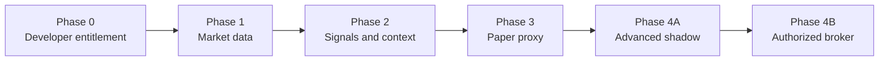
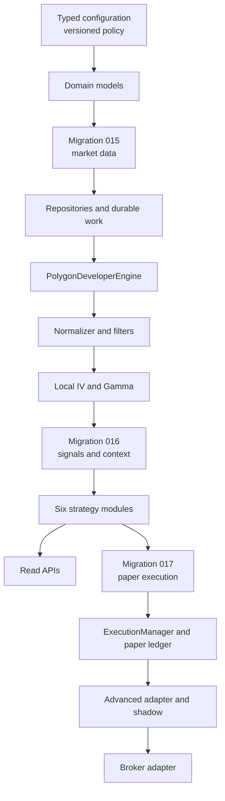
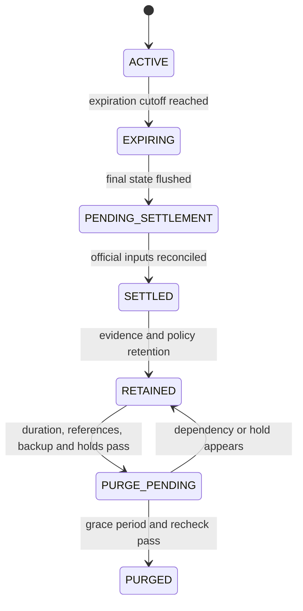

# Option Chain Scanner Implementation Guide

Status: implementation entry point

Detailed specification: [OPTION_CHAIN_SCANNER_DESIGN.md](OPTION_CHAIN_SCANNER_DESIGN.md)

Capacity decision: [OPTION_PLATFORM_CAPACITY_DECISION_2026-08-29.md](OPTION_PLATFORM_CAPACITY_DECISION_2026-08-29.md)

## 1. Purpose and Authority

Use this guide to plan and sequence implementation. It intentionally does not repeat
all thresholds, schemas, failure rules, or retention periods.

The detailed specification is normative. Each implementation pull request must cite
the sections it implements. If this guide conflicts with the detailed specification,
the detailed specification governs until both documents are corrected together.

Read detailed sections 1-3 once for scope and provider capability, then use the direct
section references under each slice below. The package map is detailed section 6; it
is a target layout, not a requirement to create future Advanced modules during the
Developer implementation.

## 2. Target Progression

- Developer is the initial Polygon tier: delayed snapshots, aggregates, OI, and
  individual trades; no option quotes.
- Developer simulations are `PAPER_PROXY` and every fill/report carries
  `RESEARCH_DELAYED_PROXY`.
- Advanced adds real-time option trades and quotes. It must run in quote-backed shadow
  mode before any broker adapter is authorized.
- A real-time underlying stock/ETF feed is independently required for Advanced live
  eligibility.

Authoritative references: detailed design sections 1-3 and 18.

## 3. Component Dependency Order

Do not implement execution before point-in-time market data and signal idempotency are
proven. Do not implement a live adapter before the paper ledger reconstructs exactly
after restart.

## 4. Phase 0: Entitlement Probe

Deliver a read-only command that checks, without logging credentials:

1. Developer chain snapshot access for one contract and then all 13 underlyings.
2. Developer delayed trade access, fields, pagination, corrections, and timestamps.
3. Expected option-quote denial under Developer.
4. Delayed one-minute underlying stock/ETF data from the configured stock provider.
5. Active standard contracts within the DTE and strike request corridor, including
  multiplier, exercise style, additional deliverables, and adjustment metadata.
6. Actual page counts, payload sizes, missing marks, and provider IV/Greek coverage.

Stop if snapshots, trades, aggregate marks, or aligned underlying data are unavailable.

Authoritative references: sections 3, 7.1, 8, and 18 Phase 0.

## 5. Phase 1: Market-Data Core

### Slice 1: configuration and domain

Implement:

- Typed environment settings
- Immutable versioned policy loading and SHA-256 fingerprint
- `DecisionContext`, market timestamps, contract snapshots, trades, batches, quality
  flags, and durable work states
- Startup in read-only mode

Done when:

- Policy changes require a process restart and new evidence cohort.
- Money uses fixed precision and numerical analytics use `float64` only internally.
- No repository read used by a decision is callable without `DecisionContext`.

References: sections 7 and 16.

### Slice 2: migration 015 and repositories

Implement:

- Contract catalog and fixed/advisory universe state
- Pre-session reference refresh, exact-ticker cache misses, expired metadata, and
  standard-contract eligibility
- Intraday new-series states, bounded exact-reference admission, next-matrix activation,
  reference-drift thresholds, watchlist admission, and session-open trade backfill
- Raw snapshot pages and incremental trade events
- Per-contract trade event-time/sequence cursors and provider semantics mappings
- Normalized snapshots and ingestion runs
- Analysis runs and expiration analytics
- Durable work/inbox-outbox leases
- Scheduler-instance heartbeat and PostgreSQL advisory leadership lock
- Raw-file manifests and retention holds
- Monthly partitions and partition-creation checks

Done when:

- Partial page chains cannot become complete.
- Duplicate delivery cannot duplicate durable market facts.
- A crash at every work transition resumes without loss.
- A newly listed strike is quarantined until catalog validation, enters no sealed past
  matrix, and becomes eligible in the current or next matrix according to admission
  timing without losing or double-counting its session trades.

References: sections 5 and 12, migration 015.

### Slice 3: Developer adapter

Implement `BaseDataEngine`, `OptionsTradeSource`, and `PolygonDeveloperEngine`:

- Fetch spot/underlying data and bounded chain pages
- Apply inclusive expiration/strike request bounds and consume pagination through the
  absent-`next_url` terminal page
- Validate URL host, cursor continuity, unchanged filters, caps, and catalog joins
- Pull delayed trades from committed cursors
- Restrict trade retrieval to filtered, candidate, working-order, and open-position
  watchlists with session-open backfill for newly admitted contracts
- Categorize HTTP and schema failures
- Preserve corrections, sequence numbers, participant/SIP timestamps, and observation
  time
- Persist before queue wake-up

Done when entitlement, partial pagination, retry, correction, and restart fixture tests
pass.

References: sections 3, 5, 7.1, 14, and 21.

### Slice 4: normalize, filter, model, and analyze

Implement:

- Standard-contract and adjusted-contract quality checks
- Provider-to-domain normalization with immutable revisions, source timestamps,
  quality flags, and payload hashes
- DTE buckets, moneyness corridor, and liquidity floor
- Source-time-aligned option and underlying `model_mark`
- Vectorized Newton-Raphson IV, bounded Brent fallback, and full local Greeks
- Per-underlying convergence gate
- Chain-health status and reason counts
- Per-contract intrinsic/extrinsic value, breakeven, moneyness, activity, liquidity,
  and unit-explicit Delta/Gamma/Theta/Vega/Rho
- Per-expiration ATM IV, 25-Delta skew/risk reversal, put/call volume/OI, OI
  concentration/walls, breadth, and cross-expiration term structure

Only `model_mark` may drive IV, Gamma, premium, or strategy decisions.

Done when all filter/model/analysis boundaries pass, forward and replay analysis are
identical, and a failed analysis or low-convergence batch becomes a terminal diagnostic
record without strategy work.

References: sections 3, 7.3, 9, 10, and 10.1.

### Slice 5: raw archive and retention foundation

Implement PyArrow archive support only when raw trades are retained:

- Fixed Arrow schema and bounded byte/item queue
- Zstandard `.partial` files
- Footer, schema, count, time-range, and SHA-256 validation
- Atomic rename followed by PostgreSQL manifest insertion
- Startup reconciliation for partial, orphan, missing, or corrupt files

Implement retention in dry-run/report-only mode first. Expiration stops subscriptions
and triggers finalization; it never directly deletes evidence or ledger data.

Do not add Roaring bitmaps in Developer mode.

References: sections 12.1-12.3.

## 6. Phase 2: Signals and Context

Implement migration 016 before strategy output:

- Candidate and contract scenario results
- Ranked strategy candidates and ordered candidate legs
- Signal events, legs, occurrences, suppressions, and decision evidence
- Flow windows and volatility surfaces
- Event calendar and technical context snapshots
- Signal-decay outcomes

Implement the six modules independently:

1. 0-DTE Gamma Squeeze
2. Income Wheel
3. Spread and Range Locator
4. Sweep-Like Cluster Detector
5. Three-Times Volume/OI Flow Scanner
6. Volatility Smile Distortion Mapper

Implement the common candidate selector before module-specific output:

- Catalog-backed `contract_id` and ordered `SignalLeg` records
- Null/quality rejection without imputation
- Stable strategy-specific rank tuples ending in contract-ID tie-breakers
- Selected, suppressed, and rejected candidate persistence with reasons
- Output caps and byte-equivalent replay ordering

For spreads, enumerate only actual listed farther-OTM wings from the same expiration
and matrix. Use the generic terminal-payoff evaluator as the max-loss authority and
assert vertical, iron-condor, and butterfly formulas against it. Reject unbounded,
undefined, non-credit intended-credit, stale-leg, or nonstandard structures before
ranking.

After each single-contract or structure candidate is selected, run terminal-payoff and
pre-expiration spot/IV/time full-repricing scenarios before assigning execution
eligibility. Probability and expected-value claims remain disabled in version 1.

The orchestrator constructs one immutable `DecisionContext` per complete matrix. Each
strategy is pure with respect to providers, persistence, and execution.

Strategies consume typed `ContractAnalysis`, `ExpirationAnalysis`, and
`UnderlyingAnalysis` outputs rather than recalculating option economics or surface
features. Research-only metrics cannot influence ranking unless the active policy and
strategy version declare them.

`OptionPipelineOrchestrator` owns durable matrix claims, context construction,
deterministic strategy invocation, transactional event/suppression/outbox persistence,
lease acknowledgement, and metrics. It does not fetch market data or mutate accounts.

Done when:

- Forward and replay processing expose identical facts at every decision time.
- Event, trend, model-quality, and execution-eligibility outcomes are reason-coded.
- The same clean matrix always selects the same expirations, strikes, sides, ordered
  legs, and ranks regardless of input row order.
- Developer recommendations can become only `PAPER_PROXY`, never `LIVE_CANDIDATE`.
- Signal event, legs, occurrence, and execution outbox commit atomically.

`PAPER_PROXY` is a signal eligibility state. When the paper engine fills that signal,
the fill and every derived report use `RESEARCH_DELAYED_PROXY` as the data-quality
label. They are related but are not interchangeable columns.

References: sections 7.4, 11, 12 migration 016, and 18 Phase 2.

## 7. Phase 3: Paper Proxy

Implement migration 017 and then:

- Execution factory and `ExecutionManager`
- Immutable cash/fill ledger and materialized account/position state
- Market/limit delayed proxy semantics
- Atomic multi-leg package fills
- Cash-secured puts, defined-risk spread margin, assignment, settlement, and stock lots
- Stops, targets, trailing stops, 21-DTE exits, and technical exits
- Risk, concentration, cash-reserve, daily-loss, and drawdown controls
- Performance metrics separated by strategy/version and data quality
- Pre-trade `PortfolioRiskAnalyzer` with signed Greek telemetry and full-repricing
  stress for existing plus proposed positions

Done when a forced restart reconstructs cash, margin, orders, positions, settlements,
and P&L exactly from immutable records.

References: sections 12 migration 017, 13, and 18 Phase 3.

## 8. Phase 4: Advanced Shadow and Broker

Implement `PolygonAdvancedEngine` without changing strategy interfaces:

- Real-time WebSocket trades and NBBO quotes
- Sequence/gap detection and REST reconciliation
- Fifteen-minute REST control-plane reconciliation for newly listed/adjusted/expired
  contracts and atomic dynamic subscription updates
- Real-time underlying quote source
- Quote/underlying alignment and spread gates
- Dynamic detailed subscriptions for candidates, working orders, open positions, and
  nearby replacement strikes
- Compact PostgreSQL aggregates and selected raw Parquet windows

Implement `RecommendationValidityEngine` before any Advanced order path:

- Build reverse dependencies from leg contracts, underlying, context, account, and
  policy to active recommendation IDs.
- Coalesce ordinary quote bursts over the policy window while hard feed, contract,
  clock, circuit, and account failures suspend immediately.
- Recompute affected local IV/Greeks, moneyness, strategy trigger, quote integrity,
  package payoff/scenarios, and existing-plus-proposed portfolio risk.
- Persist append-only `PENDING`, `ACTIVE`, `SUSPENDED`, `INVALIDATED`, `EXPIRED`,
  `SUPERSEDED`, and `CONSUMED` transitions without storing every quote.
- Produce a short-lived version token from leg quotes, underlying, analysis/scenario,
  account, policy, validity version, and valid-through time.
- Require one atomic pre-submit token check, risk reservation, order-intent insert, and
  `CONSUMED` transition. A mismatch makes no broker request.
- Reconcile cancel/fill races; any confirmed fill becomes a managed position even when
  the recommendation was suspended or invalidated during cancellation.

Run `advanced_shadow` until every acceptance gate passes. Add the broker adapter only
after strategy approval, broker-paper reconciliation, startup reconciliation, and
independent kill-switch tests.

References: sections 3, 7.1, 12.2-12.3, 13, and 18 Phase 4.

## 9. Universe Expansion Gates

Remain at 13 underlyings until 10 trading sessions complete without reconciliation
errors and the expanded 18-underlying load test meets latency, backlog, storage, and
model-quality gates. Add only `AVGO`, `COIN`, `INTC`, `MSTR`, and `MU`; the three ETFs
remain fixed.

Run advisory ranking for at least 20 complete sessions before automatic weekly
selection. Require at least 95% source completeness, point-in-time effective dates,
complete contract mappings, reproducible ranks, and uninterrupted management of open
positions when membership changes.

References: detailed sections 8 and 18 Phase 3.

## 10. Default Lifecycle Summary

Expiration is not deletion.

Bulk time-series data is compacted or removed by complete partition/file operations.
Decision evidence and ledger/audit data outlive raw feeds. Contract metadata remains
indefinitely. The detailed durations and deletion algorithm have one authoritative
home: section 12.1 of the detailed specification.

## 11. Implementation Invariants

Do not merge code that violates any of these rules:

- No complete batch, no strategy scan.
- No aligned `model_mark`, no IV/Gamma or premium decision.
- No passing local-IV quality gate, no strategy work for that underlying batch.
- No immutable decision context, no repository reads for a decision.
- No complete bounded-risk leg set, no order.
- No idempotency key and transaction, no durable effect.
- No latest unexpired `ACTIVE` validity token matching all input versions, no order
  intent.
- No scheduler leadership, database connection, valid exchange calendar, synchronized
  clock, or required entitlement, no new ingestion or entries.
- No reconciled ledger, no new order.
- No fresh management state, no automated stop/target claim.
- No official settlement input, no final expiration P&L.
- No Advanced NBBO and real-time underlying mark, no live execution claim.

The authoritative invariant list and failure responses are sections 20 and 21.

## 12. Pull Request Contract

Every implementation pull request must include:

- Detailed-spec section references
- Policy/schema version impact
- Migration compatibility and rollback notes
- Point-in-time and idempotency tests
- Failure-injection tests appropriate to the touched stage
- Metrics, alert, and runbook impact
- Retention/evidence impact
- Executed validation commands and results

Changes to thresholds, storage durations, execution semantics, or live eligibility
must update the detailed specification and create a new policy/evidence version.

## 13. Where to Look

| Question | Authoritative section |
|---|---|
| Which Polygon capabilities are required? | Detailed design 3 |
| How are queues made crash-safe? | Detailed design 5 and 14 |
| What are the provider/domain contracts? | Detailed design 7 |
| Which symbols are scanned? | Detailed design 8 |
| What filters and Greeks apply? | Detailed design 9-10 |
| How is reusable option analysis performed? | Detailed design 10.1 |
| What does each strategy emit? | Detailed design 11 |
| What tables and retention apply? | Detailed design 12 |
| How are orders and account limits handled? | Detailed design 13 |
| What APIs and configuration exist? | Detailed design 15-16 |
| What tests and phase gates block promotion? | Detailed design 17-18 |
| What failures stop the system? | Detailed design 20-22 |
| What security and operator controls apply? | Detailed design 23-24 |
| Is this workstation adequate? | Capacity decision record |