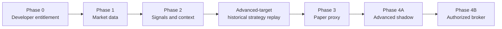
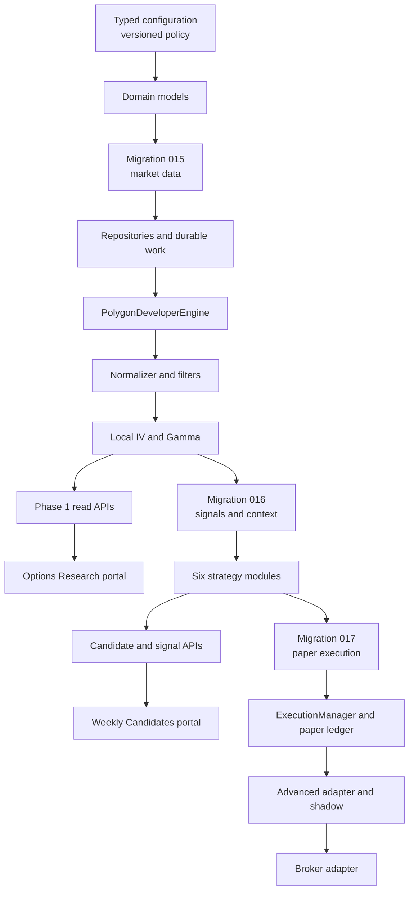
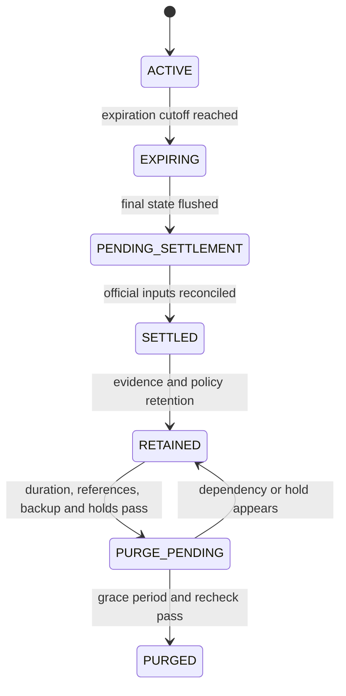

# Option Chain Scanner Implementation Guide

Status: implementation entry point

Detailed specification: [OPTION_CHAIN_SCANNER_DESIGN.md](OPTION_CHAIN_SCANNER_DESIGN.md)

Capacity decision: [OPTION_PLATFORM_CAPACITY_DECISION_2026-08-29.md](OPTION_PLATFORM_CAPACITY_DECISION_2026-08-29.md)

Latest Phase 0 evidence: [OPTION_PHASE0_VALIDATION_2026-08-29.md](OPTION_PHASE0_VALIDATION_2026-08-29.md)

Implemented pipeline walkthrough: [OPTION_PIPELINE_CURRENT_STATE.md](OPTION_PIPELINE_CURRENT_STATE.md)

## 1. Purpose and Authority

Use this guide to plan and sequence implementation. It intentionally does not repeat
all thresholds, schemas, failure rules, or retention periods.

The detailed specification is normative. Each implementation pull request must cite
the sections it implements. If this guide conflicts with the detailed specification,
the detailed specification governs until both documents are corrected together.

Read detailed sections 1-3 once for scope and provider capability, then use the direct
section references under each slice below. The package map is detailed section 6; it
is a target layout, not a requirement to create future Advanced modules during the
Developer implementation.

## 2. Target Progression

- Developer is the initial Polygon tier: delayed snapshots, aggregates, OI, and
  individual trades; no option quotes. It bootstraps ingestion and operational
  correctness but is not the final production data plane.
- Developer simulations are `PAPER_PROXY` and every fill/report carries
  `RESEARCH_DELAYED_PROXY`.
- Historical strategy replay targets the Advanced information set and combines
  point-in-time equity-scanner evidence with historical option quotes, trades,
  aggregates, references, and underlying data. It does not impose Developer's
  15-minute delay; it does impose source-time availability, bar finalization, and
  explicit processing/order latency.
- Advanced is the final production tier. It adds real-time option trades and quotes
  and must run in quote-backed shadow mode before any broker adapter is authorized.
- A real-time underlying stock/ETF feed is independently required for Advanced live
  eligibility.

Authoritative references: detailed design sections 1-3 and 18.

## 3. Component Dependency Order

Do not implement execution before point-in-time market data and signal idempotency are
proven. Do not implement a live adapter before the paper ledger reconstructs exactly
after restart.

## 4. Phase 0: Entitlement Probe

Deliver a read-only command that checks, without logging credentials:

1. Developer chain snapshot access for one contract and then all 13 underlyings.
2. Developer delayed trade access, fields, pagination, corrections, and timestamps.
3. Expected option-quote denial under Developer.
4. Delayed one-minute underlying stock/ETF data from the configured stock provider.
5. Active standard contracts within the DTE and strike request corridor, including
  multiplier, exercise style, additional deliverables, and adjustment metadata.
6. Actual page counts, payload sizes, missing marks, and provider IV/Greek coverage.

Stop if snapshots, trades, aggregate marks, or aligned underlying data are unavailable.

The 2026-08-29 weekend probe passed these entitlement and static-data checks and is a
conditional GO for Phase 1. Complete the open-session gates in the dated validation
record before marking Phase 0 fully accepted.

Authoritative references: sections 3, 7.1, 8, and 18 Phase 0.

## 5. Phase 1: Market-Data Core

### Slice 1: configuration and domain

Implement:

- Typed environment settings
- Immutable versioned policy loading and SHA-256 fingerprint
- `DecisionContext`, market timestamps, contract snapshots, trades, batches, quality
  flags, and durable work states
- Startup in read-only mode

Done when:

- Policy changes require a process restart and new evidence cohort.
- Money uses fixed precision and numerical analytics use `float64` only internally.
- No repository read used by a decision is callable without `DecisionContext`.

References: sections 7 and 16.

### Slice 2: migration 015 and repositories

Implement:

- Contract catalog and fixed/advisory universe state
- Pre-session reference refresh, exact-ticker cache misses, expired metadata, and
  standard-contract eligibility
- Intraday new-series states, bounded exact-reference admission, next-matrix activation,
  reference-drift thresholds, watchlist admission, and session-open trade backfill
- Raw snapshot pages and incremental trade events
- Per-contract trade event-time/sequence cursors and provider semantics mappings
- Normalized snapshots and ingestion runs
- Analysis runs and expiration analytics
- Durable work/inbox-outbox leases
- Scheduler-instance heartbeat and PostgreSQL advisory leadership lock
- Raw-file manifests and retention holds
- Monthly partitions and partition-creation checks

Done when:

- Partial page chains cannot become complete.
- Duplicate delivery cannot duplicate durable market facts.
- A crash at every work transition resumes without loss.
- A newly listed strike is quarantined until catalog validation, enters no sealed past
  matrix, and becomes eligible in the current or next matrix according to admission
  timing without losing or double-counting its session trades.

References: sections 5 and 12, migration 015.

### Slice 3: Developer adapter

Implement `BaseDataEngine`, `OptionsTradeSource`, and `PolygonDeveloperEngine`:

- Fetch spot/underlying data and bounded chain pages
- Apply inclusive expiration/strike request bounds and consume pagination through the
  absent-`next_url` terminal page
- Validate URL host, cursor continuity, unchanged filters, caps, and catalog joins
- Pull delayed trades from committed cursors
- Restrict trade retrieval to filtered, candidate, working-order, and open-position
  watchlists with session-open backfill for newly admitted contracts
- Categorize HTTP and schema failures
- Preserve corrections, sequence numbers, participant/SIP timestamps, and observation
  time
- Persist before queue wake-up

Done when entitlement, partial pagination, retry, correction, and restart fixture tests
pass.

References: sections 3, 5, 7.1, 14, and 21.

### Slice 4: normalize, filter, model, and analyze

Implement:

- Standard-contract and adjusted-contract quality checks
- Provider-to-domain normalization with immutable revisions, source timestamps,
  quality flags, and payload hashes
- DTE buckets, moneyness corridor, and liquidity floor
- Source-time-aligned option and underlying `model_mark`
- Vectorized Newton-Raphson IV, bounded Brent fallback, and full local Greeks
- Per-underlying convergence gate
- Chain-health status and reason counts
- Per-contract intrinsic/extrinsic value, breakeven, moneyness, activity, liquidity,
  and unit-explicit Delta/Gamma/Theta/Vega/Rho
- Per-expiration ATM IV, 25-Delta skew/risk reversal, put/call volume/OI, OI
  concentration/walls, breadth, and cross-expiration term structure

Only `model_mark` may drive IV, Gamma, premium, or strategy decisions.

Done when all filter/model/analysis boundaries pass, forward and replay analysis are
identical, and a failed analysis or low-convergence batch becomes a terminal diagnostic
record without strategy work.

References: sections 3, 7.3, 9, 10, and 10.1.

### Slice 5: raw archive and retention foundation

Implement PyArrow archive support only when raw trades are retained:

- Fixed Arrow schema and bounded byte/item queue
- Zstandard `.partial` files
- Footer, schema, count, time-range, and SHA-256 validation
- Atomic rename followed by PostgreSQL manifest insertion
- Startup reconciliation for partial, orphan, missing, or corrupt files

Implement retention in dry-run/report-only mode first. Expiration stops subscriptions
and triggers finalization; it never directly deletes evidence or ledger data.

Do not add Roaring bitmaps in Developer mode.

References: sections 12.1-12.3.

### Slice 6: Phase 1 read APIs and portal

Phase 1 ends with a capability-aware research surface over durable PostgreSQL state.
The primary experience organizes delayed market evidence for investigation; raw chain
rows and pipeline diagnostics remain available as secondary tools. Do not build any
view against in-process queues, transient provider payloads, frontend-derived strategy
rules, or mock recommendations. Apply migration 015 and wire the read-only pipeline
before treating these pages as data-connected.

Backend read APIs:

- `GET /api/options/health`: startup mode, delayed entitlement result, scheduler
  leader/heartbeat, newest complete cycle by underlying, oldest durable work age,
  partition readiness, and archive/reconciliation state.
- `GET /api/options/universe` and `GET /api/options/universe/runs`: active fixed or
  ranked members, asset cohort, effective date, source run, score, completeness, and
  exclusion/disabled reasons.
- `GET /api/options/chain/{underlyer}`: newest complete causally visible matrix,
  contract filter fields, display/model marks, local Greeks, source/observation times,
  and row-level quality reasons. Incomplete batches are diagnostic records and cannot
  be returned as the current clean chain.
- `GET /api/options/analysis/{underlyer}`: chain health, contract economics,
  expiration ATM IV, 25-Delta skew/risk reversal, term structure, activity ratios,
  OI concentration/walls, policy/model versions, and caveats.
- Add read-only ingestion/work, archive-manifest, reconciliation, and dry-run
  retention-report endpoints when their operational pages are connected. Add their
  exact response schemas to detailed design section 15 in the same change; Phase 1
  exposes no retention-delete endpoint.

Portal information architecture:

- Add one top-level `Options Research` navigation entry at `/options`. Use local tabs
  or a compact secondary navigation for the option pages so the existing global
  navbar does not gain one item per view.
- `/options`: the default `Market Structure Workbench`. It uses the Phase 2 workspace
  shape where that shape is capability-neutral: a compact evidence bar, explicit
  filters, grouped research lenses, dense evidence rows, and a right-side evidence
  drawer on desktop or full-screen evidence sheet on mobile. It is not the Phase 2
  Strategy Workbench and contains no candidate list.
- The four Phase 1 lenses are `Income Evidence`, `Directional Context`,
  `Volatility & Range`, and `OI & Activity`. They are saved views over persisted
  contract and expiration analysis, not persona assignments, strategy archetypes,
  suitability assessments, or ranks. A lens may filter by explicit facts such as
  contract type, expiration, DTE, moneyness, or data-quality state. It cannot select
  a Delta target, infer direction, assemble legs, score opportunity, or promote a row.
- `/options/explorer/:underlyer?`: the secondary dense chain explorer with underlying,
  expiration, call/put, DTE, moneyness, liquidity inputs, mark quality, and
  IV-convergence controls. Preserve URL/query state for reload and sharing. Show
  rejected and pending-reference counts separately from the retained matrix.
- `/options/operations`: the secondary operational workspace. It contains health,
  fixed/advisory universe state, latest complete cycles, ingestion page/row counts,
  retries, failure categories, unknown-reference/new-series state, trade
  watermark/backfill state, durable work leases/age, and partition readiness. The UI
  cannot edit or automatically promote the allowlist.
- `/options/archive`: archive enabled/disabled state, manifest integrity,
  reconciliation outcomes, active holds, storage totals, and retention dry-run results.
  This page has no delete, release-hold, or purge command in Phase 1.

Phase 1 evidence drawer:

- Selecting a retained contract opens a stable detail surface with contract identity,
  expiration, source-time display/model marks, intrinsic/extrinsic value, breakeven,
  local Greeks, volume/OI activity, mark provenance, source and observation times,
  model/policy versions, and row-level quality reasons.
- The drawer may include expiration-level skew, term, breadth, and OI concentration
  context only when those persisted analytics passed their required quality gates.
  OI concentration is never labeled support, resistance, dealer positioning, max
  pain, target pin, or expected pinning.
- Phase 2-shaped sections whose evidence does not yet exist remain visible only as
  concise capability states with exact prerequisites. In particular, strategy thesis,
  ordered legs, net premium, bounded maximum loss, scenario results, trend/event
  context, suppressions, management policy, and execution eligibility require
  migration 016 outputs and cannot be synthesized from a Phase 1 row.

Display and interaction contract:

- Every option page shows `15-MINUTE DELAYED RESEARCH DATA` and exposes both source
  market time and first-observed time in America/New_York, with UTC available in a
  detail view or tooltip. Never label Developer data real-time.
- Keep `display_mark` and `model_mark` visibly distinct. A display fallback cannot be
  styled as model-valid, executable, bid/ask, midpoint, spread, or NBBO data.
- Missing values render as unavailable with their reason; do not coerce missing
  volume, OI, Greeks, ratios, or quote fields to zero. Stale, incomplete, failed, and
  reference-pending states remain visible and cannot silently fall back to an older
  clean matrix for a new decision.
- A lens with no model-valid rows explains the blocking quality gate and may still
  show clearly labeled source observations. It must not loosen the gate, substitute
  provider Greeks for failed local Greeks, or rank source-only rows as opportunities.
- Use compact tables and stable responsive dimensions consistent with the existing
  operational portal. Loading, no-migration, no-complete-batch, delayed/stale,
  degraded, failed, and API-unavailable states each need explicit UI treatment.
- Phase 1 pages describe observations and analysis, not trades. They contain no Buy,
  Sell, Execute, Paper Trade, or `Recommended Options` control or heading.

Candidate and recommendation boundary:

- Do not derive candidate, opportunity, confidence, or `next weekly recommended
  options` lists directly from chain rows, highest IV, volume/OI, OI concentration,
  or local Greeks. Those are analysis inputs, not a directional thesis, bounded-risk
  package, scenario result, or idempotent signal.
- Add `/options/candidates` only in Phase 2 after migration 016, point-in-time event
  and trend context, strategy modules, deterministic candidate selection, scenario
  analysis, suppressions, and decision evidence are implemented. In Developer mode,
  title the view `Weekly Research Candidates`, show the source matrix and delayed-data
  label, and keep execution eligibility null or `PAPER_PROXY` as specified. A
  candidate is not broker authorization.
- The page may group candidates by next listed weekly expiration, but `weekly` means
  the option expiration cohort. It does not mean the system can forecast the next
  week, and it must not reuse the equity scanner's `1wk` horizon semantics.

Done when:

- Every page reads durable state through a typed API and exposes its `as_of`,
  `observed_at`, policy hash, and model version where applicable.
- The default page presents useful evidence before operational tables, all lens and
  filter state is URL-addressable, and selecting a row opens the evidence drawer
  without changing its meaning or order.
- Incomplete/future-visible data fails closed, delayed-data labeling is present on
  every option route, and no Phase 1 view presents an option as a recommendation.
- Desktop and mobile route, table, loading, empty, stale, degraded, and failure states
  pass frontend tests and browser screenshots without overlap or clipped controls.
- Existing equity scanner pages and terminology remain unchanged.

References: detailed sections 3, 7.3, 8, 10.1, 12, 15-18, and 23.

## 6. Phase 2: Signals and Context

Implementation status: migration 016, the provider-neutral strategy contracts,
deterministic payoff/scenario engine, six strategy modules, durable strategy work,
candidate/signal persistence, read APIs, and the Strategy Workbench are implemented.
The market-data policy and strategy policy are independently versioned so a strategy
revision can replay immutable matrices without changing or refetching their Phase 1
ingestion cohort. Use `run_option_pipeline.py --strategies-only` for that replay.

The first persisted 13-underlying cohort is intentionally all `SUPPRESSED`: its
weekend Developer observations failed the Phase 1 local-model quality gate. The portal
therefore demonstrates complete reason-coded decision handling but contains no
selected recommendation, scenario package, or signal event from that cohort. A future
passing open-session matrix can produce selected delayed research candidates; context,
event-calendar, account/risk, and quote limitations remain separate reason-coded
eligibility gates.

Implement migration 016 before strategy output:

- Candidate and contract scenario results
- Ranked strategy candidates and ordered candidate legs
- Signal events, legs, occurrences, suppressions, and decision evidence
- Flow windows and volatility surfaces
- Event calendar and technical context snapshots
- Signal-decay outcomes

Implement the six modules independently:

1. 0-DTE Gamma Squeeze
2. Income Wheel
3. Spread and Range Locator
4. Sweep-Like Cluster Detector
5. Three-Times Volume/OI Flow Scanner
6. Volatility Smile Distortion Mapper

Implement the common candidate selector before module-specific output:

- Catalog-backed `contract_id` and ordered `SignalLeg` records
- Null/quality rejection without imputation
- Stable strategy-specific rank tuples ending in contract-ID tie-breakers
- Selected, suppressed, and rejected candidate persistence with reasons
- Output caps and byte-equivalent replay ordering

A recommendation requires more than finding high-volume or high-IV contracts. It needs:

- A directional, income, or neutral strategy thesis
- Point-in-time trend and event-calendar context
- Deterministic candidate ranking
- Complete option legs for spreads
- Net premium and bounded maximum loss
- Scenario analysis
- Suppression reasons and immutable decision evidence
- Migration 016 candidate/signal persistence

For spreads, enumerate only actual listed farther-OTM wings from the same expiration
and matrix. Use the generic terminal-payoff evaluator as the max-loss authority and
assert vertical, iron-condor, and butterfly formulas against it. Reject unbounded,
undefined, non-credit intended-credit, stale-leg, or nonstandard structures before
ranking.

After each single-contract or structure candidate is selected, run terminal-payoff and
pre-expiration spot/IV/time full-repricing scenarios before assigning execution
eligibility. Probability and expected-value claims remain disabled in version 1.

The orchestrator constructs one immutable `DecisionContext` per complete matrix. Each
strategy is pure with respect to providers, persistence, and execution.

Strategies consume typed `ContractAnalysis`, `ExpirationAnalysis`, and
`UnderlyingAnalysis` outputs rather than recalculating option economics or surface
features. Research-only metrics cannot influence ranking unless the active policy and
strategy version declare them.

`OptionPipelineOrchestrator` owns durable matrix claims, context construction,
deterministic strategy invocation, transactional event/suppression/outbox persistence,
lease acknowledgement, and metrics. It does not fetch market data or mutate accounts.

### Phase 2 portal slice: Strategy Workbench

Build `/options/candidates` as an institutional research workbench over persisted
migration 016 candidates and evidence. It is not an order-entry screen. Use one dense
workspace with a sticky command bar, grouped opportunity tables, and a right-side
detail drawer on desktop; use a full-screen detail sheet on mobile. Compact rows may
become cards only on narrow screens.

This is an evidence-backed upgrade to the Phase 1 Market Structure Workbench, not a
frontend relabeling of its rows. Reuse the shell, delayed-data status treatment,
filters, responsive drawer behavior, and provenance vocabulary. Replace
capability-neutral evidence lenses with persona presets and opportunity suites only
for records persisted by migration 016. Phase 1 chain rows never appear in this route
unless referenced by a persisted candidate or suppression record.

The command bar contains:

- source matrix time, first-observed time, `15-MINUTE DELAYED RESEARCH DATA`, policy
  and model versions, and stale/degraded state;
- a default `All underlyings` plus `Selected` view. Underlying and candidate-status
  controls are server-side filters; `Suppressed`, `Rejected`, and `All decisions`
  remain available for explanation and audit;
- persona presets for `Income`, `Defined-Risk Income`, `Momentum`, and `Neutral / Vol`;
- structure-risk filters for `CASH_SECURED`, `DEFINED_RISK_CREDIT`, and
  `PREMIUM_AT_RISK_DEBIT`; undefined-risk short-option structures never appear;
- underlying, expiration, DTE, strategy, candidate status, data quality, and maximum
  loss/capital-at-risk controls; and
- stable sorting by strategy rank, maximum loss, return on risk, expiration, and
  underlying. Persona presets are saved views, not investor-suitability assessments.

All normalization, Greeks, strategy evaluation, structure construction, payoff,
scenario, ranking, and suppression logic runs in the backend durable pipeline. The
frontend only requests typed persisted candidate pages and details, displays
backend-computed status totals, and preserves filter/page state in the URL. It never
loads raw chains to recreate candidate logic. Use bounded server-side pagination so
an all-underlying view does not grow with chain size.

Opportunity suites:

1. **Income Generation / Wheel** shows the cash-secured put strike and expiration,
   local put Delta, distance from a policy-defined approximately 0.30-Delta research
   target, modeled net credit, cash collateral, gross return on collateral if the put
   expires worthless, distance OTM, and point-in-time IV regime. The current Wheel
   strategy does not become a 0.30-Delta selector merely because the UI displays that
   reference; selection requires a reviewed target/tolerance and new strategy/policy
   version. IV rank/percentile requires completed-session historical IV rollups,
   lookback/sample metadata, and a versioned formula; it is unavailable until those
   inputs exist.
2. **Defined-Risk Hedged Income** shows ordered multi-leg rows such as
   `SELL AAPL 210 PUT / BUY AAPL 205 PUT`, net credit, width, maximum profit, maximum
   loss, credit-to-max-loss return on risk, breakevens, and scenario worst loss. An
   adjacent compact strike chart shows call/put OI concentration clusters, spot, short
   strikes, and protective wings. Label clusters `OI concentration`, never structural
   floor/ceiling, dealer positioning, max pain, or expected pinning.
3. **High-Momentum Directional** supports long single-leg calls/puts and defined-risk
   debit verticals; `naked` never means an uncovered short option. Show the exact
   finalized trend and activity evidence used by the strategy. Version 1 may show the
   designed finalized daily 50-EMA and one-hour 20-EMA context. A five-minute
   close/EMA/volume trigger is added only after migration 016 stores that finalized
   point-in-time bar and a strategy version names it. Volume greater than OI and
   sweep-like clusters are activity evidence, not institutional ownership or trade
   direction. Choosing a long single leg in low IV or a debit vertical in high IV
   requires a versioned directional structure selector, historical IV context, and
   scenario comparison; the UI cannot infer the structure from an adjective such as
   `cheap` or `expensive`.
4. **Advanced Neutral** initially supports defined-risk butterflies and iron condors
   from actual listed legs. Show the center strike or OI concentration center, distance
   from spot, symmetric wings, bounded payoff, DTE, exchange cutoff countdown, and
   source-time local Theta per day. Do not call the center a target pin price or use an
   OI-only max-pain calculation. Calendar spreads are not in version 1; add them only
   with a separately reviewed multi-expiration strategy, cross-expiration mark
   coherence, dividend/event treatment, and full-repricing scenarios.

Opportunity rows emphasize structure identity, candidate status, source age, quality,
maximum loss/capital commitment, net premium, return on risk, primary trigger, and
blocked reason. Do not publish a hand-built confidence score. Selected, suppressed,
and rejected rows remain inspectable so absence of a recommendation is explainable.

The candidate detail drawer contains these sections:

- `Structure`: canonical ordered legs, side, ratio, multiplier, expiration, strike,
  source-time model mark, and a `Copy structure` action. Under Developer this copies a
  research leg specification, not broker syntax or a live limit price. Broker-ticket
  copy is enabled only in a later quote-backed mode with current validity evidence.
- `Risk and payoff`: modeled debit/credit, collateral, maximum profit/loss,
  breakevens, return on collateral/risk, deterministic terminal payoff, and the
  spot/IV/time full-repricing grid. Maximum loss is visually dominant and never hidden
  behind premium collected.
- `Trend and context`: finalized daily and hourly trend inputs, event blackout state,
  source bars, timestamps, and exact pass/fail reasons actually used by the strategy.
- `Liquidity and marketability`: Developer shows volume/OI and
  `QUOTE_LIQUIDITY_NOT_AVAILABLE`. Advanced may show bid, ask, sizes, midpoint, and
  spread/midpoint bands: at most 2% is efficient, above 2% through 5% is caution, and
  above 5% fails the pricing gate. Color is supplemented by text and numeric values.
- `Flow and volatility`: volume/OI activity, qualifying print count, exchanges,
  notional, local IV/Greeks, and historical IV context with lookback/sample size. Do
  not use `institutional sweep` or infer aggressor side without quote/participant
  evidence.
- `Management policy`: only the strategy's persisted stop, target, trailing, DTE, and
  technical invalidation rules. Wheel/credit 50% profit capture and 0-DTE trailing
  rules are not applied universally.
- `Evidence`: candidate/signal IDs, matrix and decision context, policy/model/strategy
  versions, quality flags, suppressions, validity history, and scenario provenance.

Implementation order:

1. Extend migration 016 and typed contracts for persona tags, strategy archetype,
   structure-risk class, historical IV context, persisted rank components, and the
   evidence fields above. Presentation tags come from a versioned strategy registry,
   not frontend inference.
2. Implement and validate any new 0.30-Delta Wheel, IV-regime structure selector, or
   five-minute trigger as strategy changes before exposing their labels in the UI.
3. Add typed list/detail/scenario/validity APIs with server-side filters and stable
   pagination. Every displayed explanation must be reconstructible from immutable
   decision evidence.
4. Build the workbench shell and grouped tables, then the detail drawer, OI/payoff
   graphics, loading/empty/stale/failure states, and saved URL filters.
5. Add Advanced quote-liquidity fields later without changing the candidate/leg/risk
   layout. Do not add automatic execution controls in this portal slice.

Done when:

- the same candidate payload renders identically regardless of input order, every
  grouping/filter is derived from persisted typed fields, and replay reproduces rank
  and explanations;
- maximum loss and source age remain visible at desktop and mobile widths, long leg
  text never truncates ambiguously, and the detail view has keyboard/focus coverage;
- Developer never renders bid/ask spread quality, a live-price claim, broker ticket,
  max pain, target pin, institutional direction, or undefined-risk recommendation;
- scenario, context, IV-regime, Delta-target, and management values are null with an
  exact reason when their prerequisites are absent; and
- browser screenshots cover all four suites, selected/suppressed/rejected rows, the
  detail drawer, long multi-leg names, stale data, and unavailable Advanced-only fields.

Done when:

- Forward and replay processing expose identical facts at every decision time.
- Event, trend, model-quality, and execution-eligibility outcomes are reason-coded.
- The same clean matrix always selects the same expirations, strikes, sides, ordered
  legs, and ranks regardless of input row order.
- Developer recommendations can become only `PAPER_PROXY`, never `LIVE_CANDIDATE`.
- Signal event, legs, occurrence, and execution outbox commit atomically.

`PAPER_PROXY` is a signal eligibility state. When the paper engine fills that signal,
the fill and every derived report use `RESEARCH_DELAYED_PROXY` as the data-quality
label. They are related but are not interchangeable columns.

References: sections 7.4, 10.2, 11, 12 migration 016, 15, and 18 Phase 2.

## 7. Phase 3: Paper Proxy

Implement migration 017 and then:

- Execution factory and `ExecutionManager`
- Immutable cash/fill ledger and materialized account/position state
- Market/limit delayed proxy semantics
- Atomic multi-leg package fills
- Cash-secured puts, defined-risk spread margin, assignment, settlement, and stock lots
- Stops, targets, trailing stops, 21-DTE exits, and technical exits
- Risk, concentration, cash-reserve, daily-loss, and drawdown controls
- Performance metrics separated by strategy/version and data quality
- Pre-trade `PortfolioRiskAnalyzer` with signed Greek telemetry and full-repricing
  stress for existing plus proposed positions
- `PortfolioMarginHealthAnalyzer` with immutable authoritative account snapshots,
  current and broker-what-if projected maintenance-margin utilization, and a strict
  35% portfolio-secured put gate. Exactly 35% passes; above 35%, stale/missing NLV,
  unreconciled state, or an estimate-only requirement blocks new portfolio-secured
  put signals. The 20% strike-notional estimate remains display-only.

Done when a forced restart reconstructs cash, margin, orders, positions, settlements,
and P&L exactly from immutable records.

The margin monitor is also done only when account updates invalidate affected
recommendations, every pass/block references one immutable account snapshot and risk
policy hash, and the portal distinguishes cash-secured requirement, planning estimate,
broker requirement, current utilization, and projected utilization without coercing
unavailable values to zero.

References: sections 12 migration 017, 13, and 18 Phase 3.

## 8. Phase 4: Advanced Shadow and Broker

Implement `PolygonAdvancedEngine` without changing strategy interfaces:

- Real-time WebSocket trades and NBBO quotes
- Sequence/gap detection and REST reconciliation
- Fifteen-minute REST control-plane reconciliation for newly listed/adjusted/expired
  contracts and atomic dynamic subscription updates
- Real-time underlying quote source
- Quote/underlying alignment and spread gates
- Dynamic detailed subscriptions for candidates, working orders, open positions, and
  nearby replacement strikes
- Compact PostgreSQL aggregates and selected raw Parquet windows

Implement `RecommendationValidityEngine` before any Advanced order path:

- Build reverse dependencies from leg contracts, underlying, context, account, and
  policy to active recommendation IDs.
- Coalesce ordinary quote bursts over the policy window while hard feed, contract,
  clock, circuit, and account failures suspend immediately.
- Recompute affected local IV/Greeks, moneyness, strategy trigger, quote integrity,
  package payoff/scenarios, and existing-plus-proposed portfolio risk.
- Persist append-only `PENDING`, `ACTIVE`, `SUSPENDED`, `INVALIDATED`, `EXPIRED`,
  `SUPERSEDED`, and `CONSUMED` transitions without storing every quote.
- Produce a short-lived version token from leg quotes, underlying, analysis/scenario,
  account, policy, validity version, and valid-through time.
- Require one atomic pre-submit token check, risk reservation, order-intent insert, and
  `CONSUMED` transition. A mismatch makes no broker request.
- Reconcile cancel/fill races; any confirmed fill becomes a managed position even when
  the recommendation was suspended or invalidated during cancellation.

Run `advanced_shadow` until every acceptance gate passes. Add the broker adapter only
after strategy approval, broker-paper reconciliation, startup reconciliation, and
independent kill-switch tests.

References: sections 3, 7.1, 12.2-12.3, 13, and 18 Phase 4.

## 9. Universe Expansion Gates

Remain at 13 underlyings until 10 trading sessions complete without reconciliation
errors and the expanded 18-underlying load test meets latency, backlog, storage, and
model-quality gates. Add only `AVGO`, `COIN`, `INTC`, `MSTR`, and `MU`; the three ETFs
remain fixed.

Run advisory ranking for at least 20 complete sessions before automatic weekly
selection. Require at least 95% source completeness, point-in-time effective dates,
complete contract mappings, reproducible ranks, and uninterrupted management of open
positions when membership changes.

References: detailed sections 8 and 18 Phase 3.

## 10. Default Lifecycle Summary

Expiration is not deletion.

Bulk time-series data is compacted or removed by complete partition/file operations.
Decision evidence and ledger/audit data outlive raw feeds. Contract metadata remains
indefinitely. The detailed durations and deletion algorithm have one authoritative
home: section 12.1 of the detailed specification.

## 11. Implementation Invariants

Do not merge code that violates any of these rules:

- No complete batch, no strategy scan.
- No aligned `model_mark`, no IV/Gamma or premium decision.
- No passing local-IV quality gate, no strategy work for that underlying batch.
- No immutable decision context, no repository reads for a decision.
- No complete bounded-risk leg set, no order.
- No idempotency key and transaction, no durable effect.
- No latest unexpired `ACTIVE` validity token matching all input versions, no order
  intent.
- No scheduler leadership, database connection, valid exchange calendar, synchronized
  clock, or required entitlement, no new ingestion or entries.
- No reconciled ledger, no new order.
- No fresh management state, no automated stop/target claim.
- No official settlement input, no final expiration P&L.
- No Advanced NBBO and real-time underlying mark, no live execution claim.

The authoritative invariant list and failure responses are sections 20 and 21.

## 12. Pull Request Contract

Every implementation pull request must include:

- Detailed-spec section references
- Policy/schema version impact
- Migration compatibility and rollback notes
- Point-in-time and idempotency tests
- Failure-injection tests appropriate to the touched stage
- Metrics, alert, and runbook impact
- Retention/evidence impact
- Executed validation commands and results

Changes to thresholds, storage durations, execution semantics, or live eligibility
must update the detailed specification and create a new policy/evidence version.

## 13. Where to Look

| Question | Authoritative section |
|---|---|
| Which Polygon capabilities are required? | Detailed design 3 |
| How are queues made crash-safe? | Detailed design 5 and 14 |
| What are the provider/domain contracts? | Detailed design 7 |
| Which symbols are scanned? | Detailed design 8 |
| What filters and Greeks apply? | Detailed design 9-10 |
| How is reusable option analysis performed? | Detailed design 10.1 |
| What does each strategy emit? | Detailed design 11 |
| What tables and retention apply? | Detailed design 12 |
| How are orders and account limits handled? | Detailed design 13 |
| What APIs and configuration exist? | Detailed design 15-16 |
| What tests and phase gates block promotion? | Detailed design 17-18 |
| What failures stop the system? | Detailed design 20-22 |
| What security and operator controls apply? | Detailed design 23-24 |
| Is this workstation adequate? | Capacity decision record |