# Option Pipeline Current-State Walkthrough

Status: code-derived baseline for review

As of: 2026-09-02

Related documents:

- [Option Chain Scanner Design](OPTION_CHAIN_SCANNER_DESIGN.md)
- [Option Chain Scanner Implementation Guide](OPTION_CHAIN_SCANNER_IMPLEMENTATION_GUIDE.md)
- [Phase 0 Validation](OPTION_PHASE0_VALIDATION_2026-08-29.md)

## 1. Purpose

This document describes what the implemented Polygon Options Developer pipeline does
today. It is intentionally descriptive rather than aspirational. Its main goals are:

1. Make every transformation from provider observation to persisted strategy candidate
   inspectable.
2. Dissect source normalization and all six strategy modules closely enough to review
   their assumptions and thresholds.
3. Identify which persisted records already support historical research.
4. Separate current behavior from proposed improvements needed for current monitoring,
   outcome measurement, calibration, and recommendation research.

The detailed design remains normative. When this walkthrough and the code disagree,
the code is the current behavior and the design is the target contract to reconcile.

### 1.1 Production and historical-research decision

The final production target is Polygon Options Advanced with real-time option trades,
option quotes, and a separately entitled real-time underlying feed. The implemented
Developer pipeline is a bootstrap and operational-validation path; its 15-minute delay
and quote limitations are not the target production execution contract.

Historical strategy development must emulate the Advanced production information set.
It reconstructs each decision time from timestamped historical option quotes, trades,
aggregates, contract references, underlying data, and point-in-time equity-scanner
evidence. It does not shift historical observations forward by the Developer
entitlement's 15-minute delay. At simulated time `t`, a strategy may consume only data
whose source availability is at or before `t`, including finalized-bar and scanner
observation rules. Entry is valued from the first eligible quote after the decision
and an explicit processing/order-latency assumption, never from a quote already used
to make the decision.

The goal of this replay is to build and evaluate an initial integrated strategy base:
equity scanners establish direction and market context, option strategies select a
compatible structure and contracts, and causal outcomes measure whether those choices
worked. Confidence and success rate are evaluation outputs derived from out-of-sample
results; they are not unmeasured inputs or recommendation labels.

## 2. Executive Summary

The implemented pipeline is a controlled one-shot backend process:

```powershell
cd backend
.\.venv\Scripts\python.exe scripts\run_option_pipeline.py --once
```

One invocation processes the configured 13-underlying universe serially. For each
underlying it fetches a bounded Polygon chain, validates catalog references, aligns
option marks with underlying minute bars, solves local IV and Greeks, builds chain and
expiration analytics, evaluates six strategy modules, and persists the complete
decision graph in PostgreSQL.

```mermaid
flowchart LR
    C[Configuration and policies] --> U[Fixed universe run]
    U --> P[Polygon references, chain, and spot]
    P --> N[Normalize and align observations]
    N --> A[Chain and expiration analysis]
    A --> X[Strategy context]
    X --> S[Six strategy modules]
    S --> R[Payoff and scenario analysis]
    R --> D[(PostgreSQL decision graph)]
    D --> API[FastAPI latest-matrix queries]
    API --> UI[Strategy Workbench]
```



Important current boundaries:

- `run_option_worker.py` is the resident XNYS-aware delayed-slot scheduler;
   `run_option_worker.py --once` processes one latest observable slot and exits.
- Open-session cycles are anchored to the XNYS open, use the configured 15-minute
   slot and provider delay, and prioritize durable retries from the current session.
- Strategy calculations run only in the backend. The frontend reads persisted rows.
- The candidate API returns only the newest persisted matrix per underlying for the
  active strategy-policy hash.
- Older matrices and candidates remain in PostgreSQL. The Signal Ledger exposes
   durable events, and the Performance view exposes 7/14/30/60-day structured-signal
   checkpoint history; a general historical candidate-cohort browser remains absent.
- The worker matures `option_signal_decay_outcomes` at 15m/30m/60m/close/next-open
   when a coherent later package mark exists. Missing packages remain pending.
- `SELECTED` means selected by a research module. It does not mean broker-authorized,
  suitable for an account, or executable. Execution eligibility is null in the
  current read-only Developer mode.

### 2.1 Current local cohort

The persisted local cohort observed on 2026-08-30 contains:

- 13 ingestion and analysis runs, one for each configured underlying.
- 15,290 catalog contracts and 8,974 normalized snapshots.
- 78 strategy decisions: one suppression for each of six strategies across 13
   underlyings.
- Zero selected candidate legs, scenarios, or signal events from the live cohort.

This result is not evidence that every strategy threshold failed independently. Chain
health failed first because the completed-session source observations produced no
valid aligned model marks. The shared gate therefore suppressed all six modules before
their individual selectors ran.

## 3. Current Entry Points

| Command | Current behavior |
|---|---|
| `run_option_pipeline.py --once` | Fetches data, normalizes, analyzes, runs strategies, and persists results for all configured or requested underlyings. |
| `run_option_pipeline.py --strategies-only` | Re-evaluates the latest compatible persisted analysis matrix without provider calls. An already completed matrix and strategy version reports `ALREADY_COMPLETED`. |
| `run_option_pipeline.py --status` | Prints durable catalog, snapshot, analysis, ingestion, candidate, signal, and recent work-state counts. |
| `run_option_pipeline.py` | Prints startup metadata and exits. |

Primary implementation:

- `backend/scripts/run_option_pipeline.py`
- `backend/options/orchestration.py`
- `backend/options/strategy_orchestration.py`

The command acquires a PostgreSQL advisory leadership lock before running. This stops
two option pipeline commands from owning the scheduler role at the same time. The lock
and scheduler-instance record exist today, but the command releases them when the
one-shot cycle exits.

## 4. End-to-End Process Today

### Step 1: Load immutable configuration

The process loads environment-backed settings, `developer_v1.json`, and
`strategy_v1.json`. It computes independent SHA-256 fingerprints for market-data and
strategy policy. These hashes become part of persisted evidence and replay identity.

Current defaults include:

- 10 stocks: AAPL, AMD, AMZN, GOOGL, META, MSFT, NVDA, PLTR, SOFI, and TSLA.
- 3 ETFs: SPY, QQQ, and IWM.
- 15-minute configured poll interval.
- Polygon Developer data engine.
- Read-only startup.
- Static 4% risk-free rate and 0% default dividend yield.

### Step 2: Choose the cycle timestamp

`ManualOptionPipeline.run_once()` asks the XNYS calendar for the latest completed
session, obtains that session's close, and adds 15 minutes. This `cycle_time` is passed
to the provider as the requested as-of time.

This is appropriate for the completed-session validation path that exists today. It
does not produce rolling intraday matrices while the market is open. An autonomous
open-session scheduler needs a distinct delayed-slot calculation based on the current
exchange session, provider delay, and completed interval.

### Step 3: Persist the fixed universe run

Each invocation creates an `option_universe_runs` row and activates the requested
members. The run records the session, configuration hash, first-observed time, asset
type, and member order. Unknown underlyings are rejected before provider work starts.

### Step 4: Fetch one underlying

Underlyings are processed serially. For each underlying the pipeline:

1. Fetches the latest positive one-minute underlying aggregate at or before
   `cycle_time`.
2. Computes a strike request corridor  of spot plus or minus 15%.
3. Requests active option references from the session date through 45 calendar days.
4. Upserts catalog identities and versions.
5. Requests the Polygon option-chain snapshot with the same expiration and strike
   bounds.
6. Persists every raw response page before normalization.
7. Validates pagination continuity, host/path, unchanged filters, terminal page, page
   count, contract count, page bytes, and batch bytes.

A partial, malformed, repeated, oversized, or invalidly paginated response is failed
or quarantined and cannot become a complete analysis matrix.

### Step 5: Claim normalization work

The completed raw batch enqueues work with business key `normalize:{batch_id}`. The
manual pipeline claims it with a 10-minute lease. Expired claims are recovered before
the cycle begins. A failed stage is placed into retry state with a five-minute delay,
up to the configured maximum of five attempts.

### Step 6: Normalize source observations

This is the main market-data decision boundary and is dissected in section 5.

At a high level it converts provider JSON into deterministic, catalog-backed,
source-time-aware `OptionContractSnapshot` facts. It does not trust provider IV or
provider Gamma for decisions. It computes local IV and all local Greeks from an
accepted `model_mark` and an aligned underlying price.

### Step 7: Persist snapshots and ingestion diagnostics

All normalized revisions are persisted with raw and normalized payload hashes. The
pipeline separately records counts for received, catalog matched, retained, rejected,
unknown-reference, IV attempted, and IV converged observations.

The matrix passed downstream is deterministic and ordered by `contract_id`. Duplicate
raw facts with the same contract ticker, option mark time, and raw payload hash are
ignored during a normalization call. Revisions with different payloads remain
auditable facts.

### Step 8: Build reusable option analysis

The analysis engine first builds chain health:

- Catalog coverage = catalog-matched count / received count.
- Mark alignment = model-mark count / retained count.
- IV convergence = converged count / IV-attempt count.
- Unknown-reference and rejection fractions.

The matrix is `FAILED` when it is incomplete, reference drift fails, no IV is
attempted, or IV convergence is below 95%. Partial mark alignment without those hard
failures produces `DEGRADED`; otherwise it is `COMPLETE`.

Only IV-converged contracts receive reusable contract analysis. That analysis includes
forward moneyness, standardized distance, volume/OI, modeled print notional, premium
yield, and intrinsic/extrinsic ratios.

Per-expiration analysis includes:

- ATM IV when the strikes bracketing the forward have sufficient call/put inputs.
- Interpolated 25-Delta call and put IV with a maximum Delta gap of 0.15.
- Call/put skew and risk reversal.
- Volume and OI totals and ratios.
- OI concentration and robust OI clusters.
- Cross-expiration ATM-IV changes and term slope where available.

The analysis run, expiration analytics, policy hash, model version, health state, and
reason codes are persisted before strategies execute.

### Step 9: Build point-in-time strategy context

For a strategy matrix the backend reads up to 100 daily closes and 20 hourly closes at
or before the matrix market time. It calculates a 50-period daily EMA and 20-period
hourly EMA and classifies aligned direction as bullish, bearish, or neutral.

Current limitations are recorded rather than hidden:

- Legacy stock bars do not carry observation timestamps, so context includes
  `BAR_OBSERVATION_TIME_UNAVAILABLE`.
- No event-calendar provider is configured, so earnings and Fed context is unavailable.
- Developer has no option quotes, so quote-spread context is unavailable.

The context can therefore be `DEGRADED` or `FAILED`. Current strategies carry these
reason codes into selected research candidates; most do not use trend or event state
as a hard selection predicate.

### Step 10: Run all six strategy modules

The strategy engine is dissected in section 6. A hard chain-health gate runs first. If
health is not exactly `COMPLETE`, each strategy emits one reason-coded `SUPPRESSED`
record and no scenarios are produced.

For a complete chain, structure-producing modules receive only snapshots with a
model mark, converged local IV, and all six local Greek values. Activity modules that
do not price a structure can inspect the broader retained matrix.

### Step 11: Evaluate payoff and scenarios

Every selected candidate with legs is evaluated by one generic terminal-payoff
engine. It derives net premium, maximum profit, maximum loss, bounded-loss state, and
breakevens from ordered legs and contract multipliers. Spread construction rejects
unbounded or economically invalid packages before persistence.

Selected candidates with legs receive a deterministic scenario grid:

- Spot shocks: -10%, -5%, 0%, +5%, and +10%.
- IV shocks: -20%, 0%, and +20%.
- Time remaining: 100%, 50%, and expiration.

At expiration, IV is irrelevant and only one IV state is stored per spot shock. This
produces 35 scenarios per structure candidate: 15 at full time, 15 at half time, and
5 terminal outcomes.

### Step 12: Persist one decision graph atomically

The context, candidates, evidence, legs, suppressions or blocked signals, scenarios,
and research artifacts are written inside one repository transaction. A failure rolls
the transaction back. Deterministic UUIDs, candidate identities, business keys, and
`ON CONFLICT DO NOTHING` constraints make a retry idempotent.

### Step 13: Complete durable work

After strategy persistence succeeds, strategy work and normalization work are marked
complete. If strategy processing returns retry, the underlying cycle fails and the
normalization work is also scheduled for retry. One underlying failure does not abort
the remaining underlyings; the universe run finishes as `DEGRADED` if any member did
not complete or degrade successfully.

### Step 14: Serve persisted results

FastAPI does not invoke strategy code. `/api/options/candidates` uses SQL to choose the
newest causally visible matrix for each underlying under the active strategy-policy
hash, then applies server-side persona, status, strategy, risk, expiration, limit, and
offset filters. Candidate detail and scenario endpoints load the persisted decision
graph by ID.

The React Workbench only requests these typed API rows and formats them. It does not
load raw chains to reconstruct ranking. The candidate query currently refreshes on
mount, filter changes, focus, or reconnection; it does not have a fixed polling
interval.

## 5. Deep Dive: Source Normalization

Primary code:

- `backend/options/data/normalizer.py`
- `backend/options/analytics/marks.py`
- `backend/options/analytics/contract_filters.py`
- `backend/options/analytics/greeks.py`

### 5.1 Parse the provider row

`parse_polygon_snapshot()` extracts:

| Normalized input | Polygon source or derivation |
|---|---|
| Contract ticker | `details.ticker`; required. |
| Corridor spot | `underlying_asset.price`; used by the contract corridor filter. |
| Day close | `day.close`; preferred display and model-mark candidate. |
| Day VWAP | `day.vwap`; display fallback only. |
| Day volume | `day.volume`. |
| Open interest | `open_interest`. |
| Option mark time | `day.last_updated`, then `last_trade.sip_timestamp` fallback. |
| Provider IV/Gamma | Retained for diagnostics only. |
| First observed time | Time the raw page was received. |
| Raw payload hash | SHA-256 of canonical, key-sorted JSON. |

Provider timestamps are interpreted as nanoseconds for sufficiently large values and
milliseconds otherwise, then normalized to UTC.

### 5.2 Establish observation identity

Inputs are sorted by contract ticker, option mark time, first-observed time, and raw
hash. Within one call, exact raw facts are deduplicated by:

```text
(contract_ticker, option_mark_time, raw_payload_sha256)
```

The normalized observation time is the explicit normalization time when provided;
otherwise it is revised-observed time or first-observed time. This distinction lets
the system answer both "when was the market fact true?" and "when could the system
have known it?"

### 5.3 Require a validated catalog identity

A row is rejected before pricing when:

- Its ticker does not match the catalog entry.
- Its catalog version is not `VALIDATED_ACTIVE`.
- It has no option mark timestamp.
- No prior aligned underlying minute bar exists.

Unknown chain tickers never enter normalization inputs. They are counted separately,
and excessive count or fraction can fail reference-drift health.

### 5.4 Separate display marks from model marks

This distinction is central:

| Field | Purpose | Current source rules |
|---|---|---|
| `display_mark` | Show a source observation in research UI. | Positive day close, otherwise positive day VWAP with `FALLBACK_MARK`. |
| `model_mark` | Drive IV, Greeks, premium, payoff, scenarios, and structure selection. | Positive day close only, with acceptable age and an aligned underlying minute close. |

The day VWAP can never silently become a model mark. A display mark can remain visible
even when the contract is not model-valid.

### 5.5 Align the underlying price causally

For each option mark, normalization selects the latest underlying minute bar whose
timestamp is less than or equal to the option mark timestamp. It rejects the row if no
prior bar exists.

The model mark is set to null when any of these conditions applies:

- Observation time precedes source market time.
- Source age exceeds 1,800 seconds.
- Day close is missing or non-positive.
- No prior underlying bar exists.
- Option-to-underlying source-time skew exceeds 60 seconds.

This is why a populated delayed chain can still produce zero model marks: displayable
option prices and causally aligned model inputs are different data products.

### 5.6 Apply contract eligibility filters

A retained contract must satisfy:

- Call or put contract type.
- American exercise style.
- 100 shares per contract.
- No additional deliverables.
- Positive strike.
- Positive corridor spot.
- Market time before expiration cutoff.
- 0 through 45 calendar DTE.
- Strike within plus or minus 15% of corridor spot.
- Day volume at least 20 or open interest at least 100.

Missing volume or OI is recorded as a quality flag. The contract fails the liquidity
floor only when neither metric independently passes its threshold.

### 5.7 Validate contract economics

Using aligned spot and the provisional model mark, the normalizer computes:

- Intrinsic value.
- Extrinsic value.
- Single-contract expiration breakeven.

If the model mark is more than $0.01 below intrinsic value, the row receives
`BELOW_INTRINSIC_MARK` and its model mark is removed. The retained source observation
remains useful diagnostically but cannot drive local valuation or strategy pricing.

### 5.8 Solve local IV and Greeks

Rows with an accepted model mark are sent to one vectorized Black-Scholes European
valuation batch using `float64` internally. The solver uses:

- IV bounds of 1% through 500%.
- Up to 20 Newton-Raphson iterations.
- Price error tolerance of 0.000001.
- Minimum Vega of 0.00000001.
- Bounded Brent fallback when Newton does not converge.

A converged row stores local IV, Delta, Gamma, Theta per day, Vega per volatility
point, and Rho per rate point. A failed row stores no local Greeks, records iterations,
price error and failure reason, and adds `NON_CONVERGED_IV`.

Provider IV and Gamma remain diagnostic fields and never replace a local failure.

### 5.9 Build immutable snapshots

The normalizer hashes the complete normalized payload and derives a deterministic
snapshot ID from that hash and normalized observation time. The snapshot preserves:

- Catalog and contract identity.
- Source, spot, mark, and observation timestamps.
- Display and model marks with provenance.
- Volume and OI.
- Local and provider model values.
- Contract economics.
- Rates and dividend assumptions.
- Solver diagnostics and quality flags.
- Raw and normalized hashes.
- Revision number and batch identity.

### 5.10 Normalization review questions

These are review questions, not implemented changes:

1. Should `corridor_spot` and the aligned model spot be required to agree within a
   versioned tolerance?
2. Is a day aggregate close with its reported `last_updated` sufficiently precise for
   intraday option modeling, or should Developer mode construct marks from bounded
   option aggregates/trades instead?
3. Should rate inputs come from a dated curve rather than one static risk-free rate?
4. Should dividend yield be point-in-time per underlying, especially around ex-dividend
   dates?
5. Should American-style dividend-sensitive contracts use a different model, with the
   existing European model retained as a versioned baseline?
6. Are 30-minute source age and 60-second spot skew appropriate for each strategy, or
   should model validity and strategy freshness be distinct policies?
7. Should missing volume and OI be tolerated for model analytics but excluded from
   activity-dependent strategies through explicit module gates?
8. Should normalization metrics report exact duplicate count separately instead of
   silently skipping duplicates within the call?

## 6. Deep Dive: Six Strategy Modules

Primary code:

- `backend/options/strategies/engine.py`
- `backend/options/strategies/registry.py`
- `backend/options/policies/strategy_v1.json`
- `backend/options/strategies/payoff.py`
- `backend/options/strategies/scenarios.py`

### 6.1 Shared gate and semantics

If chain health is not `COMPLETE`, all six modules emit one suppression using the
chain-health reasons plus `NO_STRATEGY_WORK`.

For a complete chain, every structure-producing leg must have an accepted model mark,
converged local IV, and complete local Greeks. Candidate IDs are deterministic over
matrix, strategy name/version, structure, ordered contract IDs, and trigger type.

All ordinary `_candidate()` outputs currently start as `SELECTED`. Context limitations
are added as reason codes but do not automatically change status. Every selected
candidate has `execution_eligibility = null` and a nominal `valid_until` 900 seconds
after matrix market time.

This means `SELECTED` should currently be read as "the module's deterministic research
selection," not "all context, suitability, marketability, and execution gates passed."

### 6.2 Income Wheel

**Purpose today:** rank cash-secured put research candidates.

**Eligibility:**

- Put.
- 7 through 30 calendar DTE.
- Strike below spot.
- Complete local-model inputs from the shared valid set.

**Rank order:**

1. Higher local IV.
2. Higher model premium / strike.
3. Higher open interest.
4. Higher day volume.
5. Earlier expiration.
6. Higher strike.
7. Lower contract ID as deterministic tie-breaker.

The first three rows are emitted. Each stores a short put leg, modeled net credit,
cash collateral equal to strike times multiplier, terminal payoff, maximum loss,
return on collateral, distance OTM, and annualized premium yield. IV regime is null
because completed-session IV history is not implemented.

A candidate at or below 21 DTE receives `DTE_AT_OR_BELOW_EXIT_BOUNDARY`, but it remains
selected. Management metadata records 50% profit capture, 2x premium stop, and 21-DTE
exit policy.

**No-match suppression:** `NO_ELIGIBLE_WHEEL_CONTRACT`.

**Questions for evaluation:**

1. Local IV and premium yield favor rich premium but do not target a reviewed Delta,
   probability proxy, downside distance, or trend regime.
2. Ranking uses gross return without time-normalized or downside-risk-adjusted
   comparison.
3. The 21-DTE exit boundary can be inside the 7-30 DTE entry range; decide whether
   those candidates should be suppressed rather than annotated.
4. A real IV rank/percentile needs point-in-time historical IV cohorts before it can
   influence selection.

### 6.3 0-DTE Gamma Squeeze

**Purpose today:** find near-spot, high-Gamma contracts with elevated volume relative
to OI.

**Eligibility:**

- Exactly 0 calendar DTE.
- Absolute strike/spot distance no greater than 2%.
- Day volume and OI available.
- Volume/OI at least 1.5.
- Local Gamma greater than 0.05.

Calls and puts are ranked separately by higher volume/OI, Gamma, and day volume, then
contract ID. At most one call and one put are emitted as long-premium candidates. Call
is labeled bullish and put bearish based only on contract type; no trade-aggressor
evidence is inferred.

Management metadata records a 35% stop, 50% profit target, 25% trailing activation,
and 20% trailing distance. These are persisted policies, not an implemented execution
engine.

**No-match suppression:** `NO_ZERO_DTE_GAMMA_TRIGGER`.

**Questions for evaluation:**

1. Volume/OI is cumulative day activity, not proof of opening flow or direction.
2. The strategy does not currently require a bullish/bearish trend match, time-of-day
   window, acceleration, underlying volume confirmation, or fresh option trades.
3. Raw Gamma thresholds are not normalized by spot, multiplier, or expected move.
4. A 0-DTE recommendation needs explicit exchange-cutoff and remaining-time gates.

### 6.4 Spread and Range Locator

**Purpose today:** construct bounded listed-leg packages around robust OI
concentration clusters.

For each expiration and call/put OI cluster, the module selects a short strike nearest
the cluster center. It enumerates up to five actual farther-OTM listed wings. Credit
verticals survive only when the generic payoff engine confirms positive credit,
bounded loss, and positive maximum loss.

The module may combine the strongest put and call verticals into an iron condor when
the short put is below the short call. It may build a symmetric butterfly around an OI
center within 2% of spot when equally spaced listed wings exist and the package is a
bounded debit.

Structures rank by stronger OI robust z-score, structure type, and ordered contract
IDs. At most three of each structure type per expiration are emitted. Stored evidence
includes OI center, strength, cluster OI, minimum leg volume/OI, payoff, maximum loss,
and return on risk.

**No-match suppression:** `NO_BOUNDED_LISTED_STRUCTURE`.

**Questions for evaluation:**

1. OI concentration is not support, resistance, dealer positioning, or expected
   pinning; determine which additional price/context evidence should be required.
2. Ranking starts with wall strength, not package return, width, breakeven distance,
   or scenario worst loss.
3. The first nearest wings may not be the best risk/reward package even within the
   bounded enumeration.
4. There is no explicit minimum leg liquidity beyond the earlier per-contract OR gate.
5. Iron-condor compatibility currently checks strike order and payoff, but not balanced
   width, target Delta, or a range forecast.

### 6.5 Sweep-Like Cluster

**Purpose today:** detect concentrated delayed option prints without claiming
institutional ownership or aggressor direction.

Only out-of-the-money calls are considered. Each qualifying print must have at least
$50,000 notional, calculated from the persisted trade price, contract count, and
contract multiplier. For each contract, a sliding 180-second window seeks at least 10
prints across at least two exchanges. The best window ranks by print count, total
notional, exchange count, shorter duration, earlier start, and contract ID. At most 20
research candidates are emitted.

Evidence stores the event-time window, watermark, notional, exchange count, duration,
and exact contributing event keys. The candidate is `RESEARCH_ONLY`, has no signal
legs or payoff scenarios, and records no aggressor side or institutional owner.

**No-match suppression:** `TRADE_WINDOW_NOT_AVAILABLE` when no trades were loaded,
otherwise `NO_QUALIFYING_SWEEP_LIKE_WINDOW`.

**Important current ingestion boundary:** the one-shot chain path does not fetch new
option trades. Strategy processing only reads trade events already present in
PostgreSQL from the preceding eight market-time hours. The provider implements trade
fetching and cursor persistence, but it is not wired into `ManualOptionPipeline`.

**Questions for evaluation:**

1. Wire and validate incremental watchlist trade ingestion before treating this module
   as current-session evidence.
2. Review Polygon trade condition and correction semantics before counting every
   persisted print equally.
3. Decide whether puts and non-OTM contracts need separately named detectors rather
   than silently excluding them.
4. Evaluate recurrence across contracts and expirations, not only the best window per
   contract.

### 6.6 Three-Times Volume/OI

**Purpose today:** identify unusual cumulative day activity.

A retained contract qualifies when both day volume and OI are present and volume/OI is
at least 3.0. Rows rank by higher ratio, day volume, OI, earlier expiration, and
contract ID. At most 20 are emitted.

The output is `RESEARCH_ONLY`, contains no legs, direction, payoff, or scenarios, and
cannot be execution eligible. It is evidence that may support another strategy; it is
not independently a directional recommendation.

**No-match suppression:** `NO_VOLUME_OI_ANOMALY`.

**Questions for evaluation:**

1. OI is generally prior-session state while volume accumulates intraday, so the ratio
   has a strong time-of-day effect.
2. OI near zero can create extreme ratios; consider a strategy-specific minimum OI or
   shrinkage rule.
3. Compare activity with contract history, underlying activity, nearby strikes, and
   same-time seasonal baselines.
4. Measure whether this evidence improves a structure strategy before promoting it
   beyond research context.

### 6.7 Volatility Smile Distortion

**Purpose today:** find local-IV observations far from a quadratic smile fit.

Contracts are grouped by expiration and option type. A group requires at least seven
distinct strikes and observations on both sides of spot. The module fits local IV to a
quadratic in log strike/spot, calculates residuals, and scales them by median absolute
deviation. A non-edge strike qualifies when absolute robust z-score is at least 2.5
and at least one adjacent residual has the same sign. At most 10 rows per expiration
and type are emitted, ranked by absolute residual z-score.

The output is `RESEARCH_ONLY`. Fit coefficients, input count, residual score, and
neighbor consistency are persisted, along with an `option_volatility_surfaces`
artifact. No relative-value trade, hedge, convergence horizon, or expected return is
inferred.

**No-match suppression:** `NO_VALID_SMILE_DISTORTION`.

**Questions for evaluation:**

1. Quadratic log-moneyness is a baseline, not necessarily a stable surface model.
2. The fit is unweighted; liquidity, Vega, mark age, and uncertainty do not affect it.
3. Same-sign agreement with either neighbor is a weak local-consistency requirement.
4. Historical persistence and post-observation normalization are needed before a
   residual can become a mean-reversion thesis.

## 7. What Is Persisted

| Persisted object | Main table | Historical use |
|---|---|---|
| Raw provider page | Canonical baseline raw-page tables | Reconstruct and audit provider input. |
| Contract catalog/version | `option_contract_catalog`, catalog versions | Resolve stable contract identity and metadata as known at the time. |
| Normalized snapshot revisions | `option_chain_snapshots` and fact keys | Replay model and strategy inputs by batch. |
| Ingestion batch | `option_ingestion_runs` | Measure completeness, freshness, rejection, and provider reliability. |
| Analysis matrix | `option_analysis_runs` | Define one underlyer/policy/model cohort. |
| Expiration analytics | `option_expiration_analytics` | Study IV term/skew, breadth, OI concentration, and regime. |
| Strategy context | `option_context_snapshots` | Reconstruct trend/event limitations used at decision time. |
| Candidate evidence | `option_decision_evidence` | Explain exact inputs, rank components, triggers, and quality reasons. |
| Candidate | `option_strategy_candidates` | Compare selected, suppressed, and rejected decisions across matrices and versions. |
| Ordered legs | `option_candidate_legs` | Reconstruct priced structures without reselecting from a newer chain. |
| Suppression | `option_signal_suppressions` | Analyze which gates prevent selection and their frequency. |
| Scenario grid | `option_scenario_results` | Compare ex-ante modeled risk across candidate cohorts. |
| Research artifacts | `option_flow_windows`, `option_volatility_surfaces` | Study activity clusters and smile residuals. |
| Blocked signal | `option_signal_events`, legs, occurrences | Preserve one lifecycle event per contiguous semantic package; each matrix-specific rediscovery is a candidate-linked occurrence. A package absent from an intervening matrix starts a new event if it later returns. |
| Realized follow-up | `option_signal_decay_outcomes` | The worker matures coherent 15m/30m/60m/close/next-open delayed-proxy package marks under a versioned commission-only policy. Selected candidate-leg strike/expiration bounds remain in the 60-day future chain collection window; missing coherent packages stay pending. |

## 8. Current Versus Historical Use

### 8.1 Current Workbench behavior

The candidate API first selects one latest matrix per underlying for the active
strategy-policy hash. It then returns persisted candidates from only those matrices.
The default UI applies `All underlyings` and `Selected`; status, persona, and other
filters are SQL filters over this latest cohort.

This is suitable for the current research dashboard. Candidate Audit is intentionally
latest-matrix only; Signal Ledger and Performance provide durable structured-signal
history without changing candidate selection semantics.

Performance defaults to the historical `OPPORTUNITY_BOARD` cohort: the top-ranked
selected structured candidate for each strategy, candidate kind, and matrix, matching
the board's default `per_strategy=1` presentation at that decision time. This avoids reconstructing
history from today's latest board. Operators can switch to `ALL_SIGNALS` to inspect
every retained structured signal, including candidates that ranked below the displayed
board contract. Both cohorts remain blocked research records until execution gates pass.

Candidates remain immutable matrix-level decisions. When the same strategy version,
policy, underlying, structure, and ordered contract package is selected in the next
matrix, persistence reuses the original signal event, increments its occurrence count,
and writes a new `option_signal_occurrences` row linked to the new candidate. This keeps
recommendation and Performance sample counts from growing merely because an unchanged
package survived another scan while retaining every matrix observation for audit.

The Opportunity Board is optimized for current structured decisions:

- its primary filter is structured strategy, currently Income Wheel or Defined-Risk
   Hedged Income; underlyer-level coverage detail remains in Operations;
- the latest persisted matrix for each underlyer remains visible until a newer matrix
   replaces it, with source time and nominal validity-window state shown explicitly;
- replaced Board signals remain inline for 14 calendar days, newest first, with at most
   12 prior rows shown to preserve scan density; the full count links to paginated
   Performance history, where 7/14/30/60-day windows are available;
- research-only volume/OI and volatility-smile findings are excluded because they do
   not define package legs, management levels, or recommendation events. They remain
   available through Candidate Audit and their source evidence through Research.

Universe coverage remains an exception metric on the Board. Complete coverage occupies
one compact value; missing matrices produce a warning, while per-underlyer operational
details stay in Operations rather than displacing current structures.

### 8.2 What can already be queried historically

Direct PostgreSQL research can already group immutable rows by:

- Matrix market and observation time.
- Underlying and expiration.
- Strategy and strategy version.
- Market-data and strategy-policy hash.
- Candidate status and suppression reason.
- Rank and rank components.
- Context status and reason codes.
- Structure type, risk class, payoff, and scenario loss.

Useful current studies include:

1. Data funnel by session: received to retained to aligned to IV-converged.
2. Suppression frequency by underlying, strategy, and reason.
3. Candidate stability across adjacent matrices.
4. Rank turnover and contract/structure persistence.
5. Ex-ante maximum loss and scenario distributions by strategy version.
6. Context availability and its relationship to selection frequency.
7. Provider freshness, reference drift, and model-quality reliability.

These studies explain pipeline behavior. The Performance view adds causal delayed-proxy
checkpoint observations, but meaningful effectiveness claims still require sufficient
coverage, controlled comparisons, and out-of-sample qualification.

### 8.3 Implemented outcome tracking and remaining limits

The causal outcome service populates `option_signal_decay_outcomes` at 15 minutes,
30 minutes, 60 minutes, close, and next open. Each outcome uses observations available
by its own observed time; unavailable coherent packages remain visibly pending rather
than receiving an imputed price. Fully measured candidates no longer consume the
bounded maturity queue. Selected candidate-leg bounds remain eligible for follow-up
collection for 60 days.

Opening Performance is a read-only database operation. It neither calls the provider
nor compares the signal with a navigation-time current mark. For `ALL_SIGNALS`, entry
is the lifecycle's original package; for `OPPORTUNITY_BOARD`, entry is the first
occurrence that actually ranked onto the Board. Displayed P&L compares that cohort entry
with outcomes already materialized by the option worker at the named checkpoint; a
current-mark valuation would be a separate mode and is not included.

For multi-leg structures, outcome measurement needs a coherent package valuation at
the horizon. The current Developer mode has no quotes, so outcomes produced by that
implemented path must remain explicitly labeled `RESEARCH_DELAYED_PROXY` and cannot
be presented as executable P&L. The target historical replay uses contemporaneous
Advanced quote history when coverage is complete, values all legs against one causal
watermark, and records explicit spread, slippage, latency, and unavailable-quote
assumptions.

Recommended evaluation outputs:

- Coverage and unavailable-outcome fraction.
- Net return distribution by strategy/version and holding horizon.
- A predeclared success definition per strategy and horizon.
- Win rate with confidence intervals, not alone.
- Calibrated success probabilities with reliability buckets and Brier score.
- Median and tail outcome, maximum favorable excursion, and maximum adverse excursion.
- Performance by rank bucket, underlying, DTE, moneyness, IV regime, trend state, and
  quality cohort.
- Candidate persistence versus one-cycle anomalies.
- Selected-versus-suppressed comparisons where a valid counterfactual mark exists.
- Turnover, overlap, and concentration by underlying and expiration.
- Sensitivity to realistic delayed-proxy cost assumptions.

### 8.4 Required historical interfaces

The following remain unimplemented:

1. Candidate list with `as_of`, `from`, `to`, matrix ID, and strategy-version filters.
2. Analysis-run and candidate-cohort history endpoints.
3. Historical range replay across every compatible matrix.
4. Strategy comparison reports across policy versions.
5. Fill/quote-backed realized P&L; Developer outcomes remain delayed proxies.
6. Historical candidate-detail retrieval beyond structured signals and checkpoints.

A historical replay must write a new strategy version or research-run identity. It
must never overwrite the original decision evidence. Threshold exploration should
run against immutable matrices and compare out-of-sample periods before a reviewed
policy version is promoted.

Historical retrieval time is not simulated availability time. Advanced-target replay
orders option and underlying events by their source/SIP timestamps, applies explicit
bar-finalization and processing latency, and excludes every feature or scanner result
not yet observable at the decision watermark. The Developer 15-minute transport delay
may be retained as a separate sensitivity cohort, but it is not the primary production
backtest.

## 9. Priority Improvement Sequence

This sequence is proposed work, not current behavior.

### Priority 1: Make current data genuinely current

1. Implement a separate resident option scheduler using the configured 900-second
   cadence and PostgreSQL leadership heartbeat.
2. Derive delayed open-session slots from the exchange calendar instead of always
   using the latest completed-session close.
3. Wire incremental option-trade ingestion for the bounded watchlist.
4. Add candidate-page polling or invalidation after a committed cycle.

### Priority 2: Complete causal inputs

1. Add observed-at semantics to daily and hourly bars used by strategy context.
2. Configure and persist a point-in-time event calendar.
3. Version point-in-time rates and dividend inputs.
4. Validate the source used to construct Developer model marks during an open session.

### Priority 3: Measure before retuning

1. Build the Advanced-target historical replay from point-in-time equity evidence,
   option quotes/trades/aggregates, contract references, and underlying data.
2. Populate candidate decay outcomes and strategy-specific terminal outcomes.
3. Build coverage, success-rate, calibration, and performance reports by strategy
   version.
4. Use walk-forward train/validation/test periods and review module thresholds only
   after measuring both selections and suppressions.

### Priority 4: Improve strategy semantics

1. Decide whether context reason codes are informational or hard gates per strategy.
2. Separate activity detectors from structure selectors explicitly.
3. Add reviewed Delta, range, IV-regime, and liquidity rules only as versioned policy.
4. Compare candidate packages by scenario loss and capital efficiency where those
   metrics are appropriate, rather than adding one opaque confidence score.

### Priority 5: Expose historical research safely

1. Add bounded historical APIs and stable pagination.
2. Add matrix/cohort comparison views.
3. Keep current recommendations on the latest causally visible matrix.
4. Keep historical outcomes labeled as research evidence, not guarantees or broker
   authorization.

## 10. Review Checklist

Use this checklist when dissecting a stage:

### Input provenance

- Which source field is consumed?
- What are its market time, observation time, and revision identity?
- Can a later correction alter the result, and is the original retained?

### Eligibility and missingness

- Is a missing field rejected, reason-coded, or silently defaulted?
- Is the rule common to every strategy or specific to one module?
- Does the threshold have measured support?

### Ranking

- What exact tuple determines rank?
- Does each component represent opportunity, risk, data quality, or only a tie-breaker?
- Is the ranking stable under input reordering?

### Candidate meaning

- Is the output a structure candidate or research-only evidence?
- Which conditions make it selected, suppressed, or rejected?
- Does selected mean research selection, execution eligibility, or both?

### Historical evaluation

- Is the original input matrix immutable and replayable?
- Is the future outcome measured causally with an explicit data-quality label?
- Can policy versions be compared without overwriting prior evidence?
- Are unavailable outcomes included in coverage rather than dropped?

## 11. Current Conclusions

The backend already has a strong audit foundation: immutable source facts, causal
timestamps, separate market and strategy policy hashes, deterministic ranking,
reason-coded suppressions, ordered legs, generic payoff, scenario grids, and atomic
idempotent persistence.

The largest opportunity is not to loosen gates or add more recommendation labels. It
is to complete the operational and research loop:

```text
fresh scheduled matrices -> stable candidates -> causal future outcomes ->
versioned evaluation -> reviewed policy improvement
```

Until that loop exists, the persisted candidates are best treated as inspectable
research decisions. They can explain what each strategy selected and why, but the
system does not yet have enough implemented outcome evidence to claim which selections
produce better recommendations.
