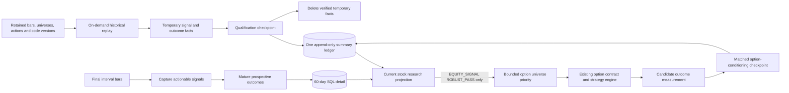
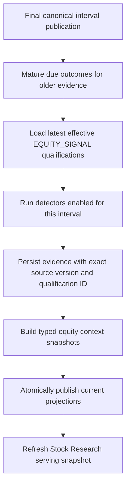

# Scanner Research Consolidation Design

## Decision

Retain verified historical study summaries, not every historical run row.

Historical replay events and outcomes are temporary working data. After qualification is validated
and published, retain the immutable study identity, methodology, coverage and result in
`equity_qualification_revisions` plus its `equity_outcome_policies` row, then delete the detailed
run facts. A future method, cost, horizon or detector study reruns from the retained canonical bar
revisions, point-in-time universes, corporate actions and versioned code.

Prospective daily signals and their outcomes remain in PostgreSQL for a rolling 60-calendar-day
user evaluation window. Never delete a signal while any declared horizon is pending. Current views
read this bounded detail together with the latest entry in the permanent summary ledger.

`scanner_events`, `scanner_event_occurrences`, `scanner_event_outcomes`, and the separate
`scanner_portal_*` snapshot family are transitional legacy stores. They remain required until all
current consumers have canonical replacements and historical outcome parity is proven. They are
not part of the target architecture.

Do not add a permanent Parquet archive, artifact manifest, file reconciler, archive mount or
combined file/database backup workflow for scanner studies. The measured Parquet bulk-read benefit
does not justify that infrastructure when detailed historical facts are not a daily dependency.
This does not change the separate option raw-market archive, whose high-volume provider facts may
be needed to reconstruct option candidate studies.

Strategy-owned tables may remain when a strategy needs a specialized current-state model or UI
projection. They are not the authoritative research ledger and must not grow another outcome or
qualification implementation. The interval worker converts the same detector output into canonical
evidence; all matured outcomes and qualifications are written centrally.

## Implementation Status

This document is the target and migration contract, not a claim that consolidation is complete.

Already available:

- canonical evidence, outcome-policy, outcome and qualification tables;
- historical point-in-time universes and reconstructed bars;
- generic historical adapters and canonical outcome/qualification services;
- deterministic scope-aware qualification publication identities for new studies;
- a code-backed registry and both canonical return policies for all seven composite scanners;
- recommendation-plan evaluation with first stop/target or horizon exits;
- prospective-only composite outcome maturity integrated into the interval worker; and
- commission-only delayed-proxy option package outcomes with coherent-batch enforcement;
- 60-day selected candidate-leg watch bounds that keep exact contracts inside future chain
  collection without duplicating marks onto candidate rows;
- a point-in-time daily historical adapter for all registered composite scanner detectors;
- a 300-session daily composite replay with 96,494 events, 559,506 outcome revisions and a
  corrected 78-cell sector-primary qualification publication; and
- revisioned stale-outcome repair with supersedes lineage and next-XNYS-session entry continuity;
- a sharded 300-session daily Pattern Watch boundary-break replay with 17,620 events, 50,502
  outcomes and one 39-cell sector-primary qualification publication;
- paired option-conditioning qualification using the shared summary ledger;
- complete legacy occurrence import into canonical evidence; and
- an equity context resolver that admits directional evidence only through effective robust
  qualification revisions; and
- a temporary Stock Research snapshot that combines legacy and canonical qualifications.

Not yet implemented:

- registry coverage for exact product and confirmed-pattern adapters;
- complete immutable provenance for the 149 legacy qualification summaries;
- automatic cleanup of validated historical working rows and expired prospective detail;
- historical composite replay/publication for 30m, 1h and 1wk intervals;
- confirmed Pattern Watch break replay/publication for 30m, 1h and 1wk intervals;
- canonical replacements for every `/api/scanner-events/*` query;
- unified equity portal snapshot types for Stock Research;
- authoritative regeneration of retained legacy scanner studies; and
- observed coherent candidate-leg follow-up marks, enabled option equity context, qualified
  pattern triggers and a populated matched option-conditioning study.

The current `run_equity_worker.py` now matures prospective composite outcomes after canonical bar
publication and before materializing new signals. The option equity-context feature remains
disabled until its consumption and qualification contracts are proven end to end.

## Pre-Cutover Baseline

Before canonical consolidation, the scanner surface had three execution paths:

| Path | Producers | Durable store | Primary purpose |
|---|---|---|---|
| Composite scanner ledger | `run_scanner_event_pipeline.py`, `research/scanner_events.py` | `scanner_events`, `scanner_event_occurrences`, `scanner_event_outcomes` | Historical/live composite scanner capture and legacy portal statistics |
| Canonical equity analysis | `run_equity_worker.py`, `equity/materialization.py` | `equity_evidence`, contexts and current projections | Current interval analysis, exact lineage and option-safe context |
| Generic historical studies | `run_historical_signal_research.py`, `run_historical_signal_outcomes.py` | Temporary JSONL/SQL facts, then permanent qualification summary | Point-in-time replay and controlled publication |

Measured on 2026-09-01:

| Relation | Rows |
|---|---:|
| `scanner_events` | 114,832 |
| `scanner_event_occurrences` | 39,805 |
| `scanner_event_outcomes` | 341,480 |
| `scanner_portal_snapshots` | 31 |
| `equity_evidence` scanner results | 221,903 |
| `equity_research_outcomes` | 394,728 |
| `equity_qualification_revisions` | 149 |

The PostgreSQL database is currently 8.70 GB. Reconstructed studies account for 144,816 of 288,424
evidence rows and all 394,728 canonical outcome rows. These validated working rows are the first
cleanup target; they need not move to another permanent fact store.

## Validated Platform Shape



No additional scanner study, rolling-summary, option-effectiveness or Parquet-manifest table is
needed. Existing operational fact tables remain bounded; `equity_qualification_revisions` is the
permanent publication ledger.

Current readiness on 2026-09-01:

| Component | Verified state | Allowed use now |
|---|---|---|
| Canonical bars, universes and actions | Historical replay inputs resolve | Reproducible research |
| Exact Gap/MA/Momentum/Bearish studies | Directional outcomes exist; zero `ROBUST_PASS` | Research display only |
| Seven composite scanners | Canonical evidence, legacy outcomes, no canonical policies | Research display only |
| Pattern Watch | Forming/at-edge context; no confirmed-break study | Visual context only |
| `xsmom-1.0` | Separate production ranking model; no canonical scanner publication | Existing candidate/regime use only |
| Qualification ledger | 149 rows; provenance/report identities incomplete | Do not delete supporting historical facts |
| Equity interval worker | Captures analysis; prospective outcome maturation missing | Current materialization only |
| Option platform | 580 candidates, 242 blocked signals, zero equity-context links/outcomes | Read-only option research |

Therefore no current canonical scanner may add confidence to a stock recommendation or authorize
an option structure. The platform remains useful for research and current-state discovery while
the gates below are completed.

## Daily Use And Retention

Daily recommendation generation needs only:

- the current prospective signal and context in SQL;
- the latest effective qualification summary in SQL; and
- pending/matured prospective outcome state in SQL.

It must not read or recompute complete historical studies every day. Attach the already-published
qualification for the exact source version, policy, direction and horizon.

Use a 60-calendar-day rolling window for user-visible signal evaluation. It shows each signal,
entry, pending/matured horizons, exit reason, return and alpha. Sixty days is preferred to one month
because the longest current equity horizon is 21 trading sessions. This recent window is a behavior
monitor, not evidence of statistical confidence; confidence comes only from the permanent frozen
historical study summary.

There is no separate rolling performance summary table. Daily pages read or aggregate the retained
60-day signal/outcome rows for recent user evaluation. A replaceable portal projection may cache
that view for serving speed, but it is not another research ledger and has no retention value.

An outcome matures when the policy's required number of final bars after the observable signal is
available at the worker watermark. It remains pending while that path is incomplete. If the path
cannot complete, publish `UNAVAILABLE` only after the policy's declared missingness cutoff; do not
convert a temporarily missing bar into a failed signal.

Delete prospective details only when the signal is older than 60 calendar days and every applicable
policy/horizon has a latest, non-stale outcome with terminal entry status: `ENTERED`,
`NOT_TRIGGERED`, `NO_LIQUID_BAR` or `UNAVAILABLE`. A `STALE` row is not terminal and must be
re-evaluated. Delete expired dependent context/projection links in dependency order. If a user needs
an older individual signal, rerun it from retained canonical inputs rather than keeping all event
rows indefinitely.

The current database's earliest prospective ORIGINAL scanner signal has market time
2026-08-28T20:00:00Z, so no row can become age-eligible before 2026-10-27. Do not enable a delete
path before that date. The first retention run must be dry-run only and report zero missing/stale
horizons plus zero surviving current-projection, context, option-context or operator-probe links
for every proposed evidence deletion.

The 60-day rule covers user-facing scanner signals, equity outcomes, option candidates and measured
candidate outcomes. Inputs needed to reproduce an active option-conditioned study follow the
option market-data retention policy and must survive through its predeclared publication
checkpoint. If they cannot be retained, mark the resulting publication non-rerunnable as described
below; do not extend every scanner signal row indefinitely.

## Continuous Summary Ledger

`equity_qualification_revisions` is the one continuous, append-only summary ledger. It contains
historical study publications and later scheduled re-evaluations; old rows are never overwritten or
deleted. Current recommendations select the latest effective row for the exact source version,
policy, interval, direction and horizon. EOD signal generation does not append a qualification row.

Use the same ledger for two research scopes recorded in `metrics.research_scope`:

- `EQUITY_SIGNAL`: does the scanner produce useful stock direction or plan returns?
- `OPTION_CONDITIONING`: does using that qualified scanner improve a particular option strategy?

Do not add an `option_scanner_effectiveness` summary table. For an option-conditioned publication,
the row's source fields identify the equity scanner, `outcome_policy_key` identifies the option
strategy/version/checkpoint contract, and metrics record the upstream equity qualification ID,
option strategy/version, DTE bucket, matched baseline, conditioned/unconditioned counts and
incremental return statistics. Equity context queries continue to accept only `EQUITY_SIGNAL` rows.

Use a versioned `metrics.option_conditioning` object containing the upstream qualification ID,
option strategy/version/policy hash, DTE bucket, measurement checkpoint, matching policy,
conditioned and control counts/mean returns, incremental return, t statistic, p value, FDR q and
early/late incremental returns. Include `research_scope` and these dimensions in `report_identity`.
The existing SQL uniqueness key remains sufficient because the option policy key and evaluation
version identify the consumer contract; no new ledger table or index is required at current volume.

The existing qualification revision and outcome policy are sufficient; do not add another study,
summary or artifact table. Enrich `equity_qualification_revisions.metrics` and use
`report_identity` so each published cell permanently records:

```text
study publication ID and evaluation version
source name/version and detector/configuration SHA-256
code/package revision
universe policy/version/SHA-256 and study date range
canonical bar/action input cutoff and aggregate input SHA-256
outcome policy ID/SHA-256, entry/exit model, costs, benchmarks and horizon
FDR family definition and thresholds
subject/cohort SHA-256 and event count
entered/not-triggered/unavailable counts
sample size and independent periods
mean net return/alpha, variance, t statistic, p value and FDR q
early/late alpha, win rate, MAE/MFE, stop/target rates
calibration metrics and confidence interval
qualification state and effective time
```

This summary is enough to use, display and audit the published conclusion. It is deliberately not
enough to test a new hypothesis without rerunning the study. Rerunning is the correct behavior
because a changed detector, slice, cost, horizon or calibration is a new study.

Append to the ledger only at a predeclared research checkpoint or when publishing a new detector or
policy version. Do not build confidence incrementally from the 60-day window and do not republish
the same study every day; those practices would create optional-stopping bias.

At a checkpoint, rerun the declared study window from retained canonical inputs and append its
complete publication. Do not average the prior summary with recent aggregates: timestamp
equal-weighting, horizon spacing, early/late splits, FDR and calibration are not safely composable
from summary rows. The ledger is continuous as an audit history of publications, not as an
incrementally updated accumulator.

Current summaries are not deletion-ready. On 2026-09-01 all 149 qualification revisions lack
`report_identity`; none stores detector, universe or cohort SHA-256 values or entered/unavailable
coverage counts. Early/late alpha is present in all revisions and mean net return is present in 95.
Keep the current detailed historical rows until each authoritative study is republished with the
complete summary contract and its identity is independently verified.

The current rerun inputs are intact: all 154,877 historical source-bar links resolve, all 144,816
reconstructed evidence rows reference existing universe runs, and 10,251 reconstructed corporate
actions cover 2024-08-19 through 2026-08-31. Canonical bar revisions, universe memberships,
security revisions and corporate actions used by a permanent publication must not be pruned while
that publication is represented as reproducible.

Publication cleanup sequence:

1. Complete every declared outcome and coverage count.
2. Build all FDR-family cells in memory and require every provenance, coverage and metric field.
3. Rerun the declared study from retained canonical inputs into an isolated working set and compare
  cell identities, cohort/input hashes, coverage counts and metrics.
4. Persist the complete family in one reviewed transaction with one `report_identity` and explicit
  `effective_from`; exact rerun must insert zero rows.
5. Read the publication back, recompute its identity and verify all canonical input hashes resolve.
6. Delete temporary historical outcomes, evidence and JSONL files.

Implement this as one fail-closed publication command. It exits nonzero and retains working facts
on any missing field, mismatch or partial family; manual review supplies only the publication time,
not permission to ignore a failed check.

If exact source inputs cannot be retained or deterministically reconstructed, keep that study's
detailed facts. That is an exception which must be stated in the qualification summary, not the
default storage model. Expired option quotes or other provider facts that cannot be refetched are
the most likely exception; either retain the required immutable option inputs/outcomes or mark the
summary as non-rerunnable after its detailed retention expires.

All 39,805 retained legacy occurrences already have `LEGACY_SCANNER_OCCURRENCE:*` evidence rows.
They remain provenance-limited because exact source bar revisions were unavailable during import.
Legacy outcomes have not yet passed a complete canonical migration/parity gate.

The 2026-09-01 reference check found zero current projection links, zero equity-context links and
zero superseding-evidence links to reconstructed evidence; only the expected 394,728 outcome links
remain. Outcome-first deletion of the validated historical working rows is therefore feasible.

A normal delete frees pages for PostgreSQL reuse but may not reduce database files on disk. During
the development cleanup, stop writers and run a controlled table rewrite (`VACUUM FULL` or
equivalent) plus index maintenance, then rerun canonical storage checks.

## Problems To Remove

1. Composite and product scanners use different runners and stores.
2. Historical replay and prospective EOD capture do not use one detector registry.
3. Legacy and canonical outcomes use separate policy and identity models.
4. Two qualification implementations can assign confidence under different families.
5. Scanner portal snapshots and equity portal snapshots have separate freshness systems.
6. Daily/weekly latest-signal APIs still depend on legacy tables while some hourly reads are
   canonical.
7. A current match can be confused with a matured outcome or qualification.
8. Repeated conditions, episode starts, streak observations, and trade subjects are not expressed
   consistently.
9. Pattern Watch evidence is available to equity context but has no qualified confirmed-break
  contract that option analysis can consume.

## Strategy-Owned Tables And Consolidation

A scanner may write a strategy-owned table for domain-specific state, provided that table is one
of the following:

- a current projection rebuilt from canonical evidence; or
- an idempotent operational result written from the same in-memory detector observations that are
  passed to canonical capture.

It must not be the only durable copy of a signal used for research. It must not own forward
outcomes, confidence labels or option-facing direction. The canonical identities are:

```text
temporary historical facts    -> JSONL/SQL working set, deleted after publication
prospective signal observation -> equity_evidence, rolling detail
prospective matured result     -> equity_research_outcomes, rolling detail
execution and horizon rules    -> equity_outcome_policies, permanent
published confidence/summary   -> equity_qualification_revisions, permanent
option-facing resolution       -> equity_context_snapshots
```

At the daily close, run every enabled `1d` detector after final daily publication. At each other
interval boundary, run only definitions enabled for that completed interval; weekly detectors run
after the final weekly bar rather than being recomputed as daily signals. Each interval cycle both
captures its new signal observations and matures any older subjects whose policy horizons are now
available. Outcome consolidation therefore does not mean copying strategy-table outcomes at EOD;
it means evaluating all due canonical subjects through the common outcome service.

## Minimal Signal Registry

Keep scanner definitions in code. A database registry and separate study-run/study-subject tables
do not help answer the product question and are deferred. Every detector that can produce an
actionable recommendation needs one immutable code registration used by replay and prospective
capture:

```text
source_name
source_version
detector/configuration SHA-256
supported_intervals
signal kind: ACTIONABLE | CONTEXT
signed direction contract, when actionable
entry and exit policy
predeclared horizons
```

The existing source name/version, fact lineage, outcome-policy hash and qualification report
identity provide durable provenance. Qualification metrics store the cohort SHA-256, subject count
and retained canonical input hashes. JSONL and detailed SQL rows are temporary working data. Add
workflow tables only if a later multi-user scheduler requires mutable run management.

## Canonical Signal Grain

One canonical signal fact represents one observable signal or research context at one market time.
It is a temporary event for historical reconstruction and an `equity_evidence` row for prospective
capture.

An actionable row must identify:

```text
source/version + ticker + interval + market_time + direction + setup_anchor
```

Its payload must include:

```text
setup_anchor
qualification_eligible
trigger_type
entry policy
stop/target/invalidation where the recommendation defines them
detector-specific metadata
```

Do not add generic START/CONTINUE/END columns. Detector code decides the actionable transition. A
fresh crossover, first pullback episode match, confirmed break or first retest rejection becomes a
subject; repeated state such as `Above MA`, an unmitigated FVG or a forming pattern remains context.
`lifecycle_key` and the detector's setup anchor are sufficient to collapse repeated episodes.

Historical and live facts must include exact security, universe and source-bar revision lineage.
Imported legacy evidence retains `LEGACY_PROVENANCE` and is not silently upgraded.

## One Detection Path

Do not rewrite all scanners into a new framework. Extend the existing historical adapter contract
with a live invocation path and a small registration mapping:

```python
class HistoricalSignalAdapter(Protocol):
    source_name: str
    source_version: str
  minimum_bars: int
  maximum_bars: int

  def detect(self, frame, context) -> tuple[HistoricalSignalEvent, ...]: ...
```

The protocol name follows the existing implementation. Keep `signal_kind` and supported intervals
in the small registration mapping rather than expanding the adapter interface.

The same engine receives different input watermarks:

- `LIVE_OBSERVED`: latest canonical final bars and the current effective universe;
- `HISTORICAL_RECONSTRUCTED`: exact dated membership, reconstructed bars and actions; or
- `REPLAY`: canonical historical bars whose observation lineage was available at the requested
  watermark.

Detector semantics never branch on execution mode. A threshold or event-identity change requires
a new source version.

The registration mapping contains only actionable transitions:

- all seven composite scanner triggers;
- gap formation, action-safe confirmation and first-entry fill;
- exact SMA9/SMA21 crossover;
- exact Momentum Pullback and Bearish Bounce episode starts; and
- confirmed Pattern Watch boundary breaks.

Gap status, FVG zones, Fibonacci levels, persistent MA state and forming patterns remain context.
FVG/Fibonacci retest trades are already expressible as `level_retest_rejection` with the level
source in metadata; they do not need duplicate signal families.

## Common Return Methodology

Every actionable signal must have an `equity_outcome_policies` contract. Historical return facts
exist while the study is computed and validated; prospective facts use
`equity_research_outcomes` for the rolling evaluation window. Context rows deliberately have no
return and must not be presented as recommendations.

Generate two distinct outcomes where the signal defines a stop and target:

1. `DIRECTIONAL_HORIZON`: enter at the next actionable bar open and exit at the horizon close.
  This answers whether the predicted direction added value over the stated holding period.
2. `RECOMMENDATION_PLAN`: enter according to the displayed recommendation, exit at the first stop
  or target, and otherwise exit at the horizon close. This answers what the recommended trade
  would have returned.

Signals without a stop/target, such as a fresh MA crossover or current Momentum/Bearish episode,
use only `DIRECTIONAL_HORIZON`; their recommendation must state its qualified holding horizon.
Do not invent a bracket after observing outcomes.

Each actionable registration declares `DIRECTIONAL_HORIZON` or `RECOMMENDATION_PLAN`. A plan
registration also declares its required entry/stop/target payload fields. Missing, non-finite or
wrong-sided brackets make the event ineligible for plan evaluation; they never silently fall back
to a directional result under the plan policy. The UI must not display a bracket or plan return
unless that exact contract was evaluated.

Common rules:

1. The signal must be observable before entry.
2. Default entry is the next actionable bar open.
3. Costs and benchmark policies are versioned. Stock-selection scanners predeclare the subject's
  SIC-derived sector ETF as primary; SPY remains the broad-market diagnostic. ETF/unclassified
  subjects fall back to SPY, and self-benchmarking falls back to QQQ.
4. Each horizon has a maturity cutoff.
5. Missing, not-triggered and unavailable subjects remain durable coverage evidence.
6. Path bars and benchmark bars are exact revision IDs.
7. MAE, MFE, stop/target hit and first-hit ambiguity use one implementation.
8. A stop gapped through fills no better than the next observable open; same-bar stop/target uses
  the declared conservative ambiguity policy.
9. Costs and modeled slippage are deducted from both return types.
10. Corrected outcomes create a new outcome revision; they are not deleted in place.

Historical replay reconstructs sector classification from Polygon's dated ticker overview at the
security's first admitted universe session and binds evidence to that immutable reference
revision. It never fills historical sectors from the current selected-ticker projection. When the
dated overview has no mappable SIC or audited manual classification, the subject remains
unclassified and uses the predeclared SPY fallback.

Composite events currently populate `entry_price` with the completed signal bar's close. That is a
reference price, not an executable recommendation after the close is observed. Treat it as
`signal_reference_price`; simulated entry remains the next actionable open unless a separately
defined limit/stop-entry rule can be evaluated from subsequent bars.

Each generated result must expose enough information to answer "what happened if executed?":

```text
signal and observation time
entry rule, actual entry time and price
exit rule, actual exit time, price and reason: STOP | TARGET | HORIZON
gross return, costs, net return and R multiple
market/sector return and net alpha
MAE/MFE and unavailable/not-triggered reason
```

Policies may define different horizons or brackets, but they cannot use a different statistical
engine merely because the detector came from the legacy scanner family.

The evaluator supports both `DIRECTIONAL_HORIZON` and `RECOMMENDATION_PLAN`. Qualification and UI
rows identify the return mode explicitly so fixed-horizon and stop/target results are never
silently combined.

## Completed Daily Return Coverage

Database state completed on 2026-09-01:

| Signal family | Evidence | Directional return | Plan return | Qualification |
|---|---|---|---|---|
| Exact Gap breakaway/continuation/fade, confirmed break and entry fill | Canonical | Canonical 5/10/21 sessions | Canonical 5/10/21 sessions | `UNRANKED` |
| Fresh SMA9/SMA21 crossover | Canonical | Canonical 5/10/21 sessions | Not applicable | `UNRANKED` |
| Momentum Pullback episode start | Canonical | Canonical 5/10/21 sessions | Not applicable | `UNRANKED` |
| Bearish Bounce episode start | Canonical | Canonical 5/10/21 sessions | Not applicable | `UNRANKED` |
| Seven composite triggers | Canonical | Canonical 5/10/21 sessions | Canonical 5/10/21 sessions | 78 cells, all `UNRANKED` |
| Confirmed Pattern Watch boundary breaks | Canonical | Canonical 5/10/21 sessions | Not applicable | 39 cells, all `UNRANKED` |
| Gap/FVG/Fibonacci/MA state and forming patterns | Context only | Not applicable | Not applicable | Not recommendation-eligible |

The seven composite triggers are `structured_trend_pullback`, `level_retest_rejection`,
`breakout_expansion`, `compression_breakout`, `failed_breakout_reversal`, `structure_reversal` and
`sma200_reclaim_rejection`. All have canonical sector-primary directional and recommendation-plan
policies.

The complete actionable coverage list is therefore:

```text
GAP_BREAKAWAY_HOLD
GAP_CONTINUATION_HOLD
GAP_FADE_REVERSAL
GAP_BREAKAWAY_CONFIRMATION
GAP_ENTRY_FILL
MA_CROSSOVER_9_21
MOMENTUM_PULLBACK episode start
BEARISH_BOUNCE episode start
the seven composite triggers listed above
CONFIRMED boundary break for each supported Pattern Watch type
```

`xsmom-1.0` is a separate production cross-sectional ranking model, not one of these scanner
contracts. It currently has 2,286 live rows dated 2026-08-21 through 2026-08-28, while the canonical
scanner qualification ledger has zero `ROBUST_PASS` rows and this database has zero `research_runs`
rows. Existing xsmom candidate/regime use remains independent. It cannot authorize scanner-derived
confidence or option direction unless its exact model is later published into the canonical
qualification/evidence contract.

Live portal bundle context rows are not substitutes for these exact subjects. For example,
`MOVING_AVERAGE_CROSSOVER/portal_strategy_bundle_v3` is persistent state while
`MA_CROSSOVER_9_21/ma_crossover_9_21_v1` is a fresh-cross event. Current portal bundle versions for
Gap, MA, Momentum, Bearish, FVG and Fibonacci have no canonical outcomes of their own. This does
not negate the outcomes attached to the separately versioned exact Gap, MA, Momentum and Bearish
subjects in the table. The interval worker must capture the exact registered actionable version;
a qualification must never cross source-version boundaries merely because display names are
similar.

All current daily qualification revisions for exact Gap, MA, Momentum, Bearish, composite and
Pattern boundary-break studies are `UNRANKED`. These families can remain visible as research but
cannot drive recommendations unless a future version and predeclared study pass the gate.

## Common Qualification Methodology

`equity.qualification` owns all qualification publications. Keep two focused estimators in that
module rather than another framework:

- `qualify_outcomes` for equity signal direction and recommendation-plan returns; and
- `qualify_option_conditioning` for timestamp-matched incremental option return versus the same
  option strategy without scanner conditioning.

Both return the same `QualificationRevision` contract, apply the declared FDR family and append to
the same summary ledger with different `research_scope` values.

Every study must predeclare its family before consuming outcomes:

```text
scanner source/version
interval
direction
horizon
mechanistic slices, if any
minimum events and periods
benchmark and costs
publication checkpoint
```

Qualification then:

1. equal-weights names sharing a signal timestamp;
2. selects horizon-spaced independent periods using the exchange calendar;
3. requires at least 100 events and 40 periods;
4. requires positive absolute net return with `t > 2` and positive early/late return;
5. requires positive predeclared primary alpha with `t > 2` and positive early/late alpha;
6. applies Benjamini-Hochberg correction within the declared family; and
7. publishes an immutable `ROBUST_PASS`, `MONITOR_ONLY` or `UNRANKED` revision.

The permanent metrics retain absolute return, SPY alpha and sector ETF alpha separately. A stock
that makes money while trailing SPY still receives its positive absolute return; it passes only if
it also beats the predeclared sector benchmark reliably. A relatively strong short that loses
money cannot pass merely because its alpha is positive.

Qualification is not republished every day. Daily repeated testing would introduce optional
stopping. Publish at predeclared checkpoints, such as quarterly dates or fixed independent-period
increments. EOD rows use the latest effective qualification revision.

Ranking rules:

- do not fabricate a score across scanner families;
- retain detector-native setup grade/strength as descriptive metadata;
- show qualification state and horizon-specific historical metrics separately;
- expose calibrated probability or expected alpha only after `ROBUST_PASS` and calibration gates;
- allow option context to consume only an explicitly qualified direction/movement contract.

## Recommendation Decisions

The research output has two separate decisions. Do not treat visibility in a scanner page as a
recommendation.

An equity signal may contribute to a stock recommendation only when its exact source version,
interval, direction, return policy and horizon have an effective `ROBUST_PASS`. Show the return
policy, sample size, independent periods, net return, primary sector alpha, SPY alpha, win rate,
drawdown/MAE, confidence interval and qualification date. Label the values as `Strategy return`,
`Sector excess return` and `Market excess return`; do not blend them into one score. If calibrated
probability is unavailable, do not display a numeric confidence percentage.

A scanner may contribute to an option recommendation only when:

1. the underlying equity signal passes the equity gate;
2. the option expiration is compatible with the signal's qualified horizon;
3. the option candidate passes existing liquidity, quote quality, bounded-loss and blackout
  rules; and
4. the same option strategy shows positive out-of-sample net return and statistically reliable
  incremental lift when conditioned on that scanner, compared with the strategy without it.

This fourth requirement prevents a profitable stock signal from being mistaken for proof that a
particular call, put, spread or volatility structure is profitable. Test scanner usefulness for
options by joining each candidate to its immutable `option_context_snapshots` row and comparing
`option_signal_decay_outcomes` for conditioned and unconditioned cohorts under the same strategy,
expiration bucket and market regime. Apply FDR across the declared scanner/option-strategy family.

Current state: the 2026-09-01 database has 30 option analysis runs, 580 candidates and 242 signal
events, but zero `option_signal_decay_outcomes`. The Polygon capability probe exposes chain
snapshots, option trades and underlying prices, but not option quotes. Stored snapshots and all 492
candidate legs have zero bid/ask/midpoint coverage.

The implemented commission-only delayed-proxy service evaluated 994 due checkpoints and persisted
zero: later batches did not contain one coherent package with model marks for all legs. Missing
packages remain pending. The worker now widens each underlying's future chain collection to include
the strike and expiration bounds of selected, unexpired candidate legs from the 60-day outcome
window. Marks remain immutable snapshot facts; they are not copied into five denormalized candidate
columns. Outcomes can accumulate only from future delayed slots that observe every leg in one
coherent batch. Qualified Pattern Watch events do not exist, and option equity context remains
disabled.

Required before options can claim scanner-derived confidence: generate candidate returns from the
recommended structure at its first executable proxy mark, deduct costs, revalue every leg at the
declared checkpoints and normalize P&L by capital at risk. Apply the signal's
stop/take-profit/expiry rule to produce its recommendation-plan return. Missing quotes remain
unavailable rather than model-filled successes.

Until Advanced NBBO is available, the implemented
`option_delayed_proxy_commission_v1` policy deducts $0.65 per contract per side. It models no
spread or slippage and labels every result `RESEARCH_DELAYED_PROXY` with
`QUOTE_LIQUIDITY_NOT_AVAILABLE`; these returns may support pipeline diagnostics and sensitivity
research but cannot qualify an executable recommendation.

### Minimal Option Selection Flow

A qualified equity scanner supplies only:

```text
underlying
direction
qualified horizon and valid-until
scanner source/version and qualification ID
```

During research, it adds or prioritizes the underlying in the option analysis universe. Keep the
existing fixed-universe cycles as the unconditioned control; otherwise incremental lift cannot be
measured. Add scanner-selected underlyings through a configured bounded quota, deduplicated by
ticker and allocated deterministically across qualified sources; never fetch chains for every raw
scanner hit. The scanner does not choose a contract, strike or structure.

Use fixed per-source quotas. Within each source, order by signal time descending and ticker; merge
sources in configured source-name order. Deduplicate a ticker while retaining all supporting
evidence IDs. If effective qualified directions conflict, suppress that ticker from directional
option work. Record the selected evidence and qualification IDs in the existing option context and
decision evidence rather than creating a selection-log table.

The existing option engine remains responsible for chain completeness, marks, liquidity, Greeks,
expiration, strategy compatibility and bounded risk. Apply these minimal constraints:

- expiration session close must be on or after `direction_valid_until`, computed with the exchange
  calendar rather than an approximate calendar-day DTE;
- bullish direction may admit bullish structures, bearish direction bearish structures, and a
  conflict suppresses directional candidates;
- long-horizon daily signals cannot authorize `ZERO_DTE_GAMMA_SQUEEZE`; 0-DTE requires a separately
  qualified intraday contract; and
- activity and volatility observations remain research-only and never infer direction.

The current engine has Wheel, defined-risk Spread/Range, 0-DTE Gamma and three research-only
activity/volatility detectors. It has no general multi-day long-call/long-put strategy. A qualified
daily scanner may therefore trigger chain analysis and filter compatible Wheel or Spread/Range
candidates, but it cannot produce a long call/put recommendation unless a separately versioned
multi-day directional strategy is added and passes option-conditioned qualification.

Do not add scanner confidence multipliers or use pattern boundaries for strike ranking initially.
First persist candidate outcomes and compare each scanner-conditioned strategy/DTE/checkpoint cohort
with its matched unconditioned cohort. Publish the result to the same summary ledger with
`research_scope=OPTION_CONDITIONING`. Only an option-conditioned `ROBUST_PASS` may turn the scanner
from a research universe trigger into a recommendation gate.

Current baseline: all 242 option signals are `BLOCKED` with no execution eligibility; 30 option
contexts exist and none links an equity context. The database contains 206 selected multi-leg and
36 selected single-contract candidates, plus 338 selected/suppressed research-only candidates.
These are detected research candidates, not executable recommendations; model marks do not replace
NBBO/executable quote, event-calendar and paper-risk gates.

## Option Analysis Read Contract

Option analysis must not read `scanner_events`, a strategy-owned scanner table, a portal snapshot
or `equity_current_projection` to make a decision. Those are legacy or serving representations.

Its point-in-time inputs are:

| Input | Canonical relation | Use |
|---|---|---|
| Contract facts | `option_chain_snapshots` and catalog/fact keys | strikes, marks, Greeks, volume and open interest |
| Expiration/flow/volatility analysis | `option_expiration_analytics`, `option_flow_windows`, `option_volatility_surfaces` | term structure, skew, walls and flow |
| Baseline underlying bars | `equity_bar_revisions` | causal daily/hourly trend calculation |
| Resolved equity context | `equity_context_snapshots` | qualified direction, trigger, range, fundamentals and conflicts |
| Context provenance | `equity_context_evidence` | exact evidence rows supporting the resolved snapshot |

The equity context builder, not each option strategy, resolves `equity_evidence` against the latest
effective `equity_qualification_revisions`. `option_context_snapshots` then records the exact
`equity_context_snapshot_id` used by an option analysis run. Candidates and decisions remain in
`option_strategy_candidates`, `option_candidate_legs` and `option_decision_evidence`.

The current implementation already resolves `qualified_direction` only from direction evidence
whose revision is in the effective robust qualification set, and option strategy context reads the
resulting `equity_context_snapshots` row. It does not yet carry typed pattern identity or geometry
into `StrategyContextSnapshot`, and option equity context remains disabled.

## Pattern Watch For Options

Current state: Pattern Watch publishes forming geometry as `PATTERN_OBSERVATION` evidence and current
projections. Its rows are `RESEARCH_ONLY` with `UNQUALIFIED_PATTERN`; `AT_EDGE` means proximity to
a boundary, not a confirmed breakout. These rows may be displayed as research context but must not
select calls, puts or option structures.

Future eligible path: add a versioned pattern-event adapter with one actionable transition:

1. Forming, at-edge and invalidated geometry remains non-actionable pattern context.
2. `CONFIRMED` with `trigger_type=BOUNDARY_BREAK`: a completed bar closes through the predeclared
  boundary; outcome-eligible, with entry no earlier than the next actionable bar.

Identity includes ticker, interval, pattern type, formation start, detector version and boundary
revision. Historical replay must reconstruct the geometry from bars visible at each watermark;
the final pattern shape cannot be projected backward. Qualify each pattern type, direction,
interval and horizon through the common study/outcome engine.

Only a confirmed event with an effective `ROBUST_PASS` movement contract may contribute option
direction. Extend the resolved equity context with typed trigger provenance: trigger evidence ID,
source/version, qualification revision, direction, confirmation time, boundary/invalidation
levels and qualified horizon. Option strategies may then:

- align call/put or bullish/bearish structures with the qualified break direction;
- choose an expiration at or beyond the qualified equity horizon;
- use boundary and invalidation levels as research inputs to strike and risk geometry; and
- suppress directional candidates when qualified pattern and scanner directions conflict.

Pattern geometry must not override option-chain liquidity, bounded-loss, quote-quality or event
blackout gates. Forming and unqualified patterns remain advisory even when their visual grade is
strong.

## Target End-Of-Day Workflow

Current-day output is a signal subject, not a forward outcome. The daily workflow is:



The current day cannot have a 5-, 10- or 21-session outcome. It receives:

- current setup metadata and direction;
- its actionable trigger and return policy;
- pending horizon coverage; and
- the latest historical qualification for that exact source version, interval and direction.

Older subjects whose horizons matured on the current session receive immutable outcomes before
new subjects are captured.

The context snapshot resolves only effective `EQUITY_SIGNAL/ROBUST_PASS` direction evidence and
retains exact evidence and qualification IDs. EOD does not compute or append qualification
revisions; the manual/checkpoint research path owns publication.

This order is not implemented in the current worker. Integrate the service into
`run_equity_worker.py` after a complete `1d`, `1wk` or `1h`
publication. Do not invoke a subprocess and do not run full-history replay during EOD.

## Historical Replay And Fine-Tuning

Keep the existing generic replay and outcome scripts. Add registered adapters and return policies
to them rather than introducing another umbrella CLI. Historical `evaluate`, `qualify` and
`status` operations use a bounded temporary working set and publish a complete immutable summary.
Historical and live paths must call the same detector function and produce the same logical fact
identity for the same finalized input.

Fine-tuning rules:

1. Never tune a measured detector version in place.
2. Diagnose on completed study data, then register a new source version.
3. Declare its family and holdout window before evaluation.
4. Run old and new versions in parallel on unseen data.
5. Keep failed and superseded evidence for meta-analysis.
6. Promote only through the common qualification engine.

## Deferred Serving Cleanup

Portal and legacy-table cleanup follows the research work; it is not part of proving scanner
usefulness. After every actionable source has canonical capture and returns, switch event summary,
backlog, recent/ticker event, sector-intelligence and qualification APIs to canonical projections.
Canonical consolidation disabled the legacy writer/projection code and dropped `scanner_events`, occurrences,
outcomes and the `scanner_portal_*` relations without `CASCADE`. Scanner APIs now use canonical
equity research reads.
No archive schema, row-for-row legacy outcome migration or retention wait is required in this
development environment.

## Study Driver Simplification

A study currently spans four scripts whose flags must agree by hand: `prepare_historical_signal_research.py`,
`run_historical_signal_research.py`, optionally `merge_historical_signal_research.py`, then
`run_historical_signal_outcomes.py`, followed by `purge_research_scanner_data.py`. Running and
reviewing that chain on 2026-09-03 produced the following observed defects. Each is recorded
because it is a property of the shape, not of one script.

1. **Flag coupling with no single source of truth.** `--adjusted` on the outcome runner must match a
   lineage ingested by a different script; nothing checks it. `--horizon-sessions` is accepted and
   then ignored on the composite path, which builds horizons from `COMPOSITE_OUTCOME_HORIZONS`.
   `--source-version` and `--evaluation-version` default to gap-formation values, and
   `evaluation_version` is stored verbatim in the permanent ledger, so a composite study would have
   been published labelled as gap formation.
2. **Policy identity split across two knobs.** Horizons live in a module constant while uniqueness is
   `(policy_key, policy_version)`. Changing horizons without also changing `policy_version` skips
   the insert through `ON CONFLICT DO NOTHING`, then fails on the outcome foreign key.
3. **A 644 MB intermediate events file**, read whole into memory by the loader and again by the
   publication hash.
4. **Purge keyed by `source_name` prefix**, which collides with production for every composite
   scanner because live capture and historical replay share the detector name. The guard correctly
   refuses, which leaves no way to trim a composite study without `--exclude-production`.
5. **No preflight.** Entitlement window, adjusted-bar coverage for the cohort, missing foreign-key
   indexes and policy conflicts are all discovered hours into a run.

The target is one manifest and one driver.

- **A checked-in, hashed study manifest** declaring detector and version, interval, cohort rule,
  benchmark, horizons, cost, bar lineage, session range and FDR family. This is the
  pre-registration artifact and the execution plan in one file; every flag above is derived from it
  rather than typed at each stage.
- **Derive `policy_version` from the manifest hash.** This removes the entire class of silent policy
  collision: a changed horizon set is by construction a new policy, and an unchanged one resolves to
  the existing row.
- **Stamp a `study_id` on every working row.** Purge becomes `WHERE study_id = ...`, which needs no
  name matching and cannot reach production capture. This is the highest-value single change for
  discarding a study at will.
- **Hold working rows in dedicated per-study partitions.** Cleanup becomes `DROP PARTITION`:
  constant time, no foreign-key revalidation. For scale, the 2026-09-03 purge removed 1,885,969
  outcomes and 327,553 evidence rows in 263 seconds, and only after two supporting indexes were
  added; without them the same delete ran 2,847 seconds without completing.
- **Keep events in that working table instead of a JSONL file**, which removes the large
  intermediate and the separate merge step.
- **Add a `preflight` subcommand** that validates the entitlement window, cohort bar coverage on the
  requested lineage, foreign-key index presence and policy conflicts before any long run starts.
- **Record stage checkpoints** so a resumed run skips completed sessions per stage rather than
  depending only on the response cache.

Retention is unchanged by this: the qualification revision stays the permanent record and
everything else is droppable. These changes only make exercising that decision cheap and safe.

Because the supporting rows are discarded, anything a report needs must be computed at
qualification time. `equity_qualification_metrics_v3` now stores `distinct_tickers`,
`top5_concentration`, `sector_alpha_t_stat`, the Wilson `hit_rate_ci_low`/`hit_rate_ci_high` and the
tested window as `first_signal_time`/`last_signal_time`. Note that
[SCANNER_ENHANCEMENTS_BACKLOG.md](SCANNER_ENHANCEMENTS_BACKLOG.md) records ticker breadth,
concentration and regime-conditioned alpha as implemented; that was in the retired
`research/scanner_events.py` runtime. Breadth and concentration are restored above.
**Regime-conditioned alpha is not ported** and remains genuinely absent from the canonical runtime,
where `regime_alpha` is still returned as empty.

## Implementation Order

1. **Publication integrity**: persist `report_identity`, complete provenance/coverage metrics,
   enforce `research_scope`, and independently verify each publication. Only then delete validated
   historical working rows.
2. **Equity outcome correctness**: classify actionable versus context outputs, implement
  recommendation-plan exits, and add canonical policies/adapters for all seven composite triggers.
  Recompute composite evidence and outcomes from canonical inputs; do not attach or relabel legacy
  outcome rows as canonical results.
3. **Equity recommendation loop**: run fixed-window historical replay/qualification jobs for every
  actionable source version. Separately, capture those exact versions prospectively, mature outcomes
  in the interval worker, retain 60-day detail, and expose recommendations only for effective
  `EQUITY_SIGNAL/ROBUST_PASS` cells.
4. **Option research loop**: use qualified scanner signals, excluding Pattern Watch until step 6,
  to populate a bounded shadow universe. Enable equity-context linkage in research mode, write
  `option_signal_decay_outcomes`, and publish matched conditioned-versus-control results with
  `qualify_option_conditioning`.
5. **Option recommendation gate**: admit a scanner-conditioned contract only when both its upstream
   equity cell and exact option strategy/DTE/checkpoint cell are `ROBUST_PASS`; keep all liquidity,
   event, quote-quality and bounded-risk gates authoritative.
6. **Extensions and cleanup**: study `CONFIRMED/BOUNDARY_BREAK` patterns after the core loop works,
   then switch remaining legacy reads, disable legacy jobs and drop legacy relations.
7. **Study driver consolidation**: fold the four-script chain behind one manifest-driven driver as
   described in "Study Driver Simplification". Order within that step is `study_id` stamping and
   manifest-derived `policy_version` first, because they remove correctness hazards; per-study
   partitions and the preflight command are throughput and safety improvements that can follow.

No archive schema or retention wait was required in the development environment. Deferred work is
limited to exact 30m/1h/1wk historical extensions, future coherent option observations and matched
option-conditioning publication, and the 60-day prospective cleanup gate beginning no earlier
than 2026-10-27.