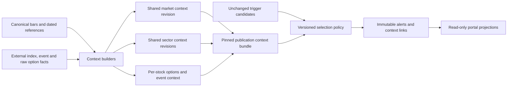

# Stock Alert Context Enhancement

Status: WORKING DELIVERY PLAN after the September 14, 2026 alert-quality review.
The user approved the technical fixes and development of this enhancement plan.
Quality v2 was explicitly activated for forward SHADOW observation on September15;
the V2 worker and default API reader now use the separate V2 store. Context
annotation, its readiness-manifest producer and contextual experiments remain
planned, not implemented or qualified. Runtime state must be rechecked before
relying on future sessions; these are resident processes, not an autostart service.
No subscriptions, downloads, broad backfills, data purge, new context gates or
worker activation are authorized by this document. The Screener remains separate.

The separate user request authorized this technical-V2 cutover and normal equity
worker startup only. No additional acquisition, context gates or studies were run.

## Post-Commit Delivery Contract

Agreed September 15, 2026: complete a testable quality-V2 baseline, freeze and
compare it, test incremental enhancements, then migrate model-dependent page
content. This plan does not authorize a commit, worker startup, reader cutover,
data acquisition or new historical execution by itself. A code commit is not a
deployment, enrollment, economic qualification or approval of new signals.

1. **Complete the baseline and readiness.** Finish the Stage1 manifest below and
  verify that historical replay and forward dispatch apply the SAME quality-V2
  decision price, confirmation, entry-slot, expiry, conflict, quota and execution
  contracts. Freeze source/cohort/clock/configuration hashes and required coverage
  before outcomes. The existing stock-ideas-v1 pilot is a baseline record, not a
  completed quality-V2 replay. No threshold search or data-gate relaxation.
2. **Run one bounded predeclared comparison.** Compare V2 selection with plain
  momentum, seeded random selection and ONE exact xsmom variant. Freeze dates,
  costs, claim family, block lengths, coverage and missing/no-fill policies first.
  Use identical candidate pools, deadlines, gates unrelated to selection and
  execution in paired arms. If xsmom coverage is narrower, compare both policies
  on that intersection and report full-baseline coverage loss separately. Do not
  use today's ranks or sector classifications in historical decisions. Long/short,
  model and timeframe results remain separate; within-candidate comparisons test
  selection, not the detector's standalone edge. Previously inspected dates stay
  development evidence. No winner is a valid result.
3. **Measure incremental value separately.** xsmom beating V2 selection does not
  establish that adding xsmom improves V2. First annotate with actual source times,
  then freeze one use of xsmom or market/sector context as a separate challenger
  versus unchanged V2. Do not combine priority, quota, stop and context changes.
  Momentum/relative-strength information already used by V2 may be redundant.
  Reversal models must not inherit continuation gates without their own declared
  hypothesis. Stage3 market/sector, later event, and options-covered trials stay
  separate and count toward their declared claim family.
4. **Review and validate prospectively.** Require executable coverage and net
  economics after cost/delay/missing-path stresses, not just superiority to a weak
  comparator. Preserve the 20% portfolio drawdown criterion where a funded portfolio
  is actually specified; independent hypothetical plans are not such a portfolio.
  A frozen prospective observation period and explicit promotion review follow
  any encouraging historical result. No uncalibrated success badges.
5. **Migrate product consumers together.** Replace old xsmom/discovery-derived
  sections on Sector Intelligence, Dashboard and ticker views only after the
  versioned replacement and its source readiness are reviewed. Separate sector
  price returns/leaders from V2 setup activity. Aggregate all evaluated candidates
  with explicit population/coverage, not just top-three alert winners. Store
  versioned projections outside GET handlers, preserve old records, and do not
  relabel V1 observations as V2. Copy complete originals before trimming working
  code, then archive old exclusive generators/readers/tests after all consumers
  move. Keep shared utilities and the explicitly retained ridge observer.

Presentation correction is an independent, earlier task: ticker "Take"/"Wait"
and "validated/actionable" wording must not imply a qualified trade. Discovery
cautions currently influence the ticker verdict despite the "not scored" wording.
Separate descriptive context from eligibility, pin model identity and use exchange-
session freshness. This correction needs focused tests and full original source
copies, but must not be bundled into an unexplained economic improvement claim.

### Operational Cutover Is Separate

A fresh stock-idea worker defaults to `--quality-version 2` and a separate
`stock-ideas-forward-v2` state directory. The launcher now passes the version
explicitly and the API's default SHADOW reader uses the same directory. Any explicit
`STOCK_ALERT_SHADOW_VIEW` override must agree with the chosen producer store.
Existing processes do not become V2 just because a Git commit changes.

Before a separately approved market-hours V2 shadow cutover: verify the full worker
command, same-policy state/view, completed source inputs and ongoing equity ingestion;
warm up/enroll under actual observation time, check the reader's returned policy ID,
and monitor first eligible windows. Do not change an old manifest to bypass policy
checks, backdate missed publications, or assume an unattended restart mechanism.
V1 retention, old xsmom/discovery consumers and the initial replay are intentional
until replacement; "all V1 was archived" is not the current contract.

### September 15 Operational Check

PRE-CUTOVER read-only observation at approximately 08:48 UTC, superseded by the
explicitly authorized cutover below; retained as dated evidence only:

- API and Vite were running. No stock-idea, equity-ingestion or other Python worker
  process was present in the inspected native process list. No startup was attempted.
- The default quality-V2 `--status` returned `NOT_ENROLLED`; the default shadow
  storage directory contained only `stock-ideas-forward-v1`. A custom external
  store or operating-system scheduled task was not audited.
- The terminal/backend environment contained no `STOCK_ALERT_SHADOW_VIEW` override
  in the allowlisted check; configured provider delay was 15 minutes. The live
  API independently confirmed HTTP200, source `SHADOW`, policy
  `stock_ideas_forward_shadow_v1`, as-of `2026-09-14T21:49:57.714664+00:00`.
  Its latest run was `MISSED_PUBLICATION`; `next_publication_at` was null.
  The response's `READY` describes a readable retained view, not a running worker.
- Therefore the next session, Wednesday September16, is NOT operationally prepared
  for quality-V2 shadow alerts by the inspected configuration. A future worker may
  start with V2 defaults, but that does not start ingestion or switch the portal.
- An explicit decision is still needed to activate the corrected technical V2
  shadow baseline before completing its historical/context study. That activation
  is observation-only, not qualification, and is separate from committing code.

### Authorized V2 Shadow Cutover

The user subsequently authorized V2 startup and the UI switch. Complete original
launcher/reader/test files were copied before edits in the
[cutover archive](../legacy/v2-shadow-cutover-2026-09-15/manifest.json):4files,
55,900bytes, SHA-256 verified. Current code no longer defaults the SHADOW reader
to V1. Missing V2 data is unavailable, not a hidden V1 fallback.

- Worker enrollment began `2026-09-15T08:54:46.169672+00:00` and completed warm-up
  for386instruments. The first saved view was checked at08:58:16UTC with no reported
  identity breaks. No pre-enrollment alerts were manufactured.
- Live API returned HTTP200, policy `stock_ideas_forward_quality_v2`, sourceSHADOW,
  statusWAITING_FOR_PUBLICATION, zeroalerts. Browser Latest Run displayed the same
  source-ready window. Next market boundary:September15 14:00UTC (10:00ET);
  publication window14:15:00-14:29:55UTC (10:15-10:29:55ET), conditional on complete
  source publications and qualifying candidates. Zero qualifying ideas remains valid.
- Resident equity ingestion, corporate actions, V2 Stock Alerts, Screening and
  Portal publishers were started. API/Vite were reused. No options pipeline,
  additional research observer or historical replay was started. Normal corporate-
  action refresh completed; equity resumed its retained interval watermarks.
- Both V1 files (view and SQLite ledger) matched pre-cutover bytes/SHA-256 after
  enrollment. The preservation receipt is local ignored backup data. No V1 plan,
  outcome, timestamp or policy manifest was rewritten or migrated.
- Focused cutover suite117passed, including explicit V2 launch flags, separate
  policy stores, current-price/entry-slot gates and no reader fallback. This is
  functional startup evidence, NOT a completed in-session cycle, future uptime
  guarantee, calibrated probability or economic qualification. Do not relax gates
  to produce an alert. The first market-session publication still needs observation.

Further enhancements follow the post-commit plan above. Keep code/store policy
versions explicit; changed policies need a separately reviewed state/cutover rather
than overwriting this new ledger. The old xsmom/discovery models and V1 historical
data remain distinct until their planned consumer migration.

## Technical Baseline Fixed First

The [42-alert review](STOCK_ALERT_REVIEW_2026-09-14.md) identified three stale-price
admissions, two plans with no remaining executable entry slot, and weak acceptance
confirmation. These are handled by `stock_ideas_forward_quality_v2` before adding
any market, sector, event or options factor:

- Gate the candidate using the latest eligible, identity-matched native30m bar at
  the publication boundary, with provider lag and both observed/created times
  visible at the input cutoff. Missing, stale, invalid or zero-volume decision bars
  cannot fall back to an old trigger price. Existing correction quarantine remains.
- Check `execution_times` before quota selection; no remaining same-session entry
  slot means suppression, not an eventual alert known to be impossible to fill.
- Preserve trigger price, stop, target, expiry and original plan reward/risk.
  Record decision price/time/revision, observation/creation times, decision risk,
  decision reward/risk and the expected entry/exit separately in the publication.
  Acceptance/reversal ranking uses decision-price extension and room/risk;
  resumption keeps its frozen RS/trigger-EMA-extension priority. Actual next-open
  entry gates and conservative paper exits still apply.
- Acceptance intraday v2 retains the same breakout formation and next-bar timing,
  but confirmation must close at least0.15 activation ATR beyond the boundary,
  have a favorable body, improve on the prior breakout close in the trade direction,
  and finish in the directional half of a nonzero candle range. Long/short rules
  are symmetric. Daily v2 contracts, resumption and reversal detection are unchanged.
  There is no added volume gate, blanket sector veto, arbitrary ratio cap, stop
  widening, or inferred success probability.

These are explicit fixed rules, not claims that 0.15ATR or the midpoint is optimal.
The same-session check is a regression fixture, not a new performance study or
counterfactual winner backtest. In that check HWM/LQD/VEA fail the decision-price
gate, RCL/MA fail the entry-slot gate, and SPGI/RMD fail acceptance confirmation.
All42 original plan records, checkpoint and input hashes are unchanged.
[Retained v2 regression evidence](stock_alert_quality_v2_regression_2026-09-14.json)
includes the exact new config and source-evidence hashes. The focused backend suite
passed147 tests; all14 new quality tests passed, including positive controls,
long/short symmetry, incremental integration, quota ordering and old-policy isolation.

Worker planning defaults to quality version2 and a separate
`backend/backups/equity-shadow/stock-ideas-forward-v2` directory. It refuses a
different-policy existing store or view; it does not migrate or rewrite v1. The
reader was kept on the retained v1 view during the original quality-fix review.
No v2 enrollment or runtime activation occurred in that review; the subsequent
explicit cutover and its evidence are recorded above. No historical replay occurred.
The corrected v2 technical policy, once frozen for the new study, is the unchanged
baseline for context experiments; original v1 is retained as historical evidence,
not mixed into the v2 comparison population.

## Implementation Sequence And Exit Gates

| Stage | Deliverable | Exit Gate | Authority Boundary |
|---|---|---|---|
| 0: Technical fixes | Quality v2, tests, isolated config and retained-case checks | Identified bad cases rejected; valid controls pass; original records unchanged | Implemented, not activated |
| 1: Readiness | One dated `stock_alert_context_readiness_v1` manifest plus concise report | Every required factor has an explicit population, clock, coverage and capability state; no false CLEAR/READY | Read-only stored-data audit first; no external calls |
| 2: Annotations | Versioned pure builders and stored per-publication context references | Baseline selected IDs, original plans and outcomes identical with annotations on/off | Background-only computation; separate artifact/pointer |
| 3: Market/sector trial | One frozen challenger versus frozen corrected technical baseline | Comparable universe/windows/execution, declared claims, execution and uncertainty checks | Bounded research output only; no live winner changes |
| 4: Event/options increments | Separate event trial, then an options-covered trial | Incremental contribution measured on matched covered controls | Acquisition budgets and new policies approved separately |
| 5: Prospective validation | Frozen prospective predictions, timing and calibration reports | Temporal correctness, stable coverage, policy parity and explicit promotion review | No automatic activation or probability badges |

Stage1 is the next implementation slice. Complete its manifest before building
context labels; do not treat a code inventory or the September11 report as current
readiness. Its completion does not require every factor to be available. A manifest
with `NOT_COVERED` VIX/quotes or `INSUFFICIENT_HISTORY` IV is a valid audit output,
not permission to invent values or block all market/sector experimentation.

### Stage 1: Readiness Manifest Contract

Use one read-only repeatable-read database snapshot, bounded query timeouts, and a
consistent actual audit cutoff; read forward SQLite state in its own explicit
snapshot and retain both cutoffs. No provider requests, GET-triggered calculations,
worker start, context materialization or backfill is part of this audit. Write a
new report path, not the existing September11 or frozen-study reports.

Scope initially: the enrolled386 security IDs; the42 reviewed alerts and their
actual decision cutoffs; daily history needed for proposed indicators; an explicit
intersection with the currently configured options-covered STOCKS. ETFs in the
equity cohort remain marked as ETFs, and options benchmark ETFs are not silently
counted as stock coverage. September14 is development evidence, not an untouched
test set. Expand dates only under a declared bounded study configuration.

Top-level manifest fields:

- `schema_version`, `generated_at`, `audit_cutoff`, source snapshot/capture clocks,
  requested dates/windows, code hashes and quality/dispatch policy hashes.
- Equity universe manifest/security IDs; benchmark/proxy map version and dated
  source references; options-cohort IDs and the exact intersection; cohort hashes.
- Factor definitions and required lookbacks; declared missing-value and staleness
  policies; capability/usage-right evidence with `NOT_VERIFIED` where necessary.
- Per factor x security x decision: `status`, `reason_codes`, `value` or null,
  `market_time`, `release_at` if known, `observed_at`, `created_at`, `available_at`,
  source revision IDs and adjustment/calculation policy; event effective/settlement
  date where distinct. No release time invented from a market date.
- Counts of expected observations, stored observations, timely eligible observations,
  usable warm-up samples, late/missing/corrected/incomparable inputs; denominator
  and covered-window fractions, not just a global READY flag.
- Requested access/redistribution status and bounded repair estimates separately
  from technical coverage. A successful local read is not a license entitlement.

Required manifest rows and cheapest existing owner to reuse:

| Factor | Audit Slice | Explicit Failure/Unknown Conditions |
|---|---|---|
| SPY/QQQ | Canonical daily and30m revisions, complete daily warm-up and actual cutoffs | Missing benchmark, incomplete session, late/corrected revision |
| Sector/stock-relative | Dated reference identity, SIC-derived proxy mapping and paired ETF/stock/SPY prices | Current-only mapping, unmapped ETF, missing counterpart or nonmatching dates |
| Prior-close VIX | Retained source observations/vintages,252-session series coverage, release/receipt clock | No retained collector, no timely prior close, rights unverified; never substitute futures ETF |
| Earnings/macro/actions | Existing event and coverage repositories over entry-through-maximum-exit horizon | Missing coverage means UNKNOWN, not no event; timing-unknown earnings retained |
| Halts/borrow | Existing authoritative retained status/coverage, if any | No feed/locate evidence means UNKNOWN; valid bars do not prove absence of a halt |
| Comparable IV | Existing readiness reporter and strict matched ATM7D/21D/45D data/rejections | Raw marks do not establish comparable maturity coverage; do not relax252/>=200/>=80% policy |
| Quotes | Stock and option NBBO timestamps, quote conditions, size and entitlement record | No entitled contemporaneous NBBO means aggressor/executable liquidity unavailable |
| Activity/OI | Retained prints, admitted contract population, corrections, settled OI dates | Sampling/put-side gaps, unknown multi-leg intent, later OI barred from earlier windows |

Re-audit IV before choosing repair. Reuse
[report_option_iv_context_readiness.py](../backend/scripts/report_option_iv_context_readiness.py)
for inventory, but run through a read-only transaction with explicit cutoff and
new output path; its default overwrites the September11 report and its raw-session
counts alone are insufficient. The comparable-series part should reuse
[materialize_option_iv_context.py](../backend/scripts/materialize_option_iv_context.py)
in its strictly non-apply path after checking the current code and cohort; no
validation override may lower the production moneyness/coverage rules. Inspect the
series date counts and rejection reasons per underlying/maturity, not just whether
the script exits successfully. Keep reconstruction vintages separate from live.

Repair-versus-vendor comparison must list: missing contract/expiration/session
counts; fixed dates and underlyings; maximum provider requests and storage budget;
rate/dividend/adjustment inputs; retrospective availability limitations; expected
additional comparable dates under unchanged gates; license/retention/redistribution
terms and monetary cost. Request approval after this comparison, not before knowing
whether bounded repair would address the actual gaps.

### Stage 2: First Annotation Definitions

Proposed first version, to freeze with the manifest before examining new returns:

| Annotation | Definition And Timing |
|---|---|
| Market direction | Prior completed daily SPY and QQQ: UP only if close>EMA50 and EMA50>EMA50[-10]; DOWN for both inverse inequalities; otherwise neutral for that ETF. Both agreeUP/DOWN => marketUP/DOWN; known disagreement/neutral mix => MIXED; either missing => UNKNOWN. Require253 contiguous sessions for stable shared warm-up. |
| Recent benchmark returns | Separate1/5/20-session simple returns ending at the eligible prior daily close. Optional same-window30m return is separate, not merged with daily trend. |
| Volatility conditions | Prior available VIX close, point and percent change from its preceding close, and empirical percentile versus the252 prior eligible closes excluding the value being ranked. Require>=202 comparable dates and report sample/coverage; unknown until retained and usage-approved. Never feed its level into market direction. |
| Sector direction | Same prior-close EMA50/slope10 rule on the dated assigned ETF proxy. ETFs/unmapped stocks remain NOT_APPLICABLE/UNAVAILABLE, not a fake sector. |
| Sector/stock relative performance | Paired20-session simple-return difference: sector minus SPY, stock minus sector; identical sessions/price basis/availability. Retain percentage-point units, not a probability score. |
| Event risk | Dated earnings/macro/actions that intersect the planned entry-to-max-exit horizon, with known time, timing uncertainty and coverage separately. CLEAR only when the scoped authoritative coverage is complete. |
| IV percentile/activity | Only where Stage1 proves comparable series/contract coverage; keep maturity, as-of/settlement time and sample count visible. Activity/positioning do not imply direction, ownership or executed liquidity. |
| Data age | Source market age and observation age separately, per component; daily prior-close freshness uses exchange sessions, not arbitrary intraday minute limits. |

Breadth is OFF in the first version. A later breadth observation must pin its
population (for example tracked common stocks, not full market), weighting,
denominator, missing members and field readiness. It cannot turn the same SPY/QQQ
direction facts into multiple independent votes.

Prior-close VIX acquisition is a separately approved small adapter after rights
review: official Cboe daily or FRED `VIXCLS`, preserving source vintage, daily-close
date, release evidence and actual receipt time. Backfilled receipt timestamps do
not certify morning availability. No intraday VIX column until exact index ticker,
entitlement and redistribution are verified; Massive stock/options access is not
Massive Indices access. A high VIX is never an automatic short or a low-risk long.

Store shared market/sector revisions once and link each alert to a pinned context
bundle. The builder computes and validates outside request handlers; a later
revision is a new annotation, not an overwrite. Keep immutable original decision
context separate from latest context. Optional portal columns read stored values
only: Market state, Sector alignment, Event risk, IV percentile (with maturity),
Option activity and Data age. No column toggle may trigger a fit, scan, SQL join
across raw history or provider request. Existing current-price comparison reads
are a separate price feature, not the new context-computation path.

Stage2 tests: future-prefix isolation; actual receipt/label availability; prior-close
VIX lag; mapping changes; mismatched sector dates; partial breadth denominator;
missing event coverage; next-day OI; absent/crossed/stale NBBO; call/put/multi-leg
ambiguity; IV sample gates; retry idempotency. Annotation-on/off must yield identical
selected IDs, original brackets, publication eligibility, fills and outcomes.

### Stage 3: One Market/Sector Challenger

After readiness/annotation review and BEFORE inspecting held-out outcomes, freeze
one candidate policy, `market_sector_continuation_v1`. Proposed gate for resumption
and acceptance: market direction agrees with trade direction, sector direction
agrees, and paired20-session sector-minus-SPY and stock-minus-sector returns agree
with direction. MIXED is a known non-pass for this continuation hypothesis; UNKNOWN
is reported separately, never treated as contrary. Failed-extension reversal and
discovery remain unchanged. VIX is an annotation only in this first comparison.
No volume/IV/news factor or simultaneous quota change is bundled into it.

Use the SAME covered candidate pool and timestamps in baseline and challenger;
show full-cohort baseline separately for coverage loss. Apply the declared gate
before the fixed per-model cap, preserving no refill after display deduplication.
Report vetoes and quota replacements separately, alongside unknown exclusions,
participation, no-fills, entry geometry, net per-opportunity and filled-only results,
target/stop/time exits, concentration and adverse missing-return/cost/delay stresses.
Freeze dates, claim family, horizons, block lengths and primary comparison before
running; any market-only/sector-only ablation is an additional declared comparison.
Do not select the best rule from September14's42 outcomes.

Stage4 adds event risk as its own declared experiment; then one IV or activity
factor on exactly the same options-covered stocks in BOTH arms. Prices, IV
valuation/comparability, NBBO conditions and OI knowledge dates remain pinned.
Neither high IV nor calls/puts/sweep-like activity becomes a stock-direction fact.
Earnings, scheduled macro releases, corporate actions, halts and borrow evidence
take priority over broad news sentiment.

Stage5 requires a prospective period with frozen code, cohort and prediction
records, parity/freshness/coverage and independent economic review before promotion.
Success probability is a separate calibrated target-before-stop conditional-on-fill
contract, not the number of context factors agreeing. Use chronological held-out
calibration/reliability, Brier/log loss versus cohort base rate, uncertainty and
drift gates; preserve no-fills and unknown outcomes explicitly. No numerical success
label or automatic live policy activation is included in these fixes.

## Decision And Scope

Add a small, traceable context layer to Stock Alerts before considering new gates.
Prioritize market/sector conditions and event/execution risk; add option-derived
context only on a declared, adequately covered population. More fields are not
automatically better signals. Correlated facts must not be counted as independent
votes or converted into an uncalibrated confidence score.

The prior studies did not establish a durable edge for the tested alert policy.
They do not prove that technical methods never work or that options/news inputs
will fix the problem. The covered-universe pilot had only one to four independent
calendar blocks; most intraday primary means were negative. It also had 390 no-fills
among 1,175 selected plans. Publication-to-entry price movement and session timing
remain important risks that additional context does not remove.

The first context delivery is evidence-only: market, sector, event and options
annotations with source/time/coverage. It does not change winners, episode lifetime,
stop/target, entry, costs or exits. Any later veto, priority change or position-size
change is a new policy and study, not a rewrite of the completed pilot.

## Existing Capabilities And Gaps

| Factor | Existing Surface | Remaining Boundary |
|---|---|---|
| SPY/QQQ trend and returns | Canonical price revisions; existing benchmark and research feature utilities | Audit exact interval, full warm-up, revision availability and alignment for each decision window |
| Market breadth/volatility | `research/regime_context.py` builds daily breadth and volatility percentiles | Its equal-weight panel return is not VIX; default current-sector lookup is unsuitable for historical joins |
| Sector ETF context | `research/gics_sectors.py` maps sector categories to ETF proxies, including SMH/IGV | Resolve classification by security ID and effective/observed revision; labels are SIC-derived, not licensed GICS ground truth |
| Sector overview | `equity/sector_research.py` reads current canonical prices and selected-ticker sectors | This current-population overview must not be joined backward onto historical alert decisions |
| Daily/hourly screener context | New immutable screening generations retain daily indicators, gap episodes and a frozen hourly context slice | Reuse only where source clocks/generations meet the alert deadline; a frozen daily screening cutoff is not a live intraday signal |
| VIX | No native VIX ingestion/alert feature path identified in this inventory | Choose index source, licensed usage, frequency and actual availability; futures ETFs are not substitutes for spot VIX |
| Comparable IV ranks | Pure statistics, immutable repository, readiness report and dry-run materializer implemented | Latest retained Sep 11 artifacts show IV-context readiness false; current availability must be re-audited before use |
| Option volume/OI | Retained contract snapshots/daily facts, chain aggregates and OI-change analytics | Declare contract population, OI settlement date, observed date, adjustment/multiplier and history completeness |
| Sweep-like activity | Versioned strategy detector over selected OTM call trade prints | Call-only/watchlist-biased sampling; aggressor and institutional owner explicitly unknown; collection policy not yet frozen for this study |
| Earnings/FOMC | `market_events.py` supports Finnhub earnings and official Fed calendar; event and coverage repositories exist | Audit fresh covered windows by stock and holding period; no row does not mean no event |
| Option quotes/execution | Existing entitlement-aware fields and upgrade design | Retained Developer boundary lacks option NBBO; audit actual account capabilities before any quote-backed claim |

Evidence for IV limits is
[option_iv_context_readiness.json](option_iv_context_readiness.json) and
[option_iv_context_materialization.json](option_iv_context_materialization.json),
both generated September 11. The pipeline records 124,052 policy-aligned settlement
marks over 13 configured underlyings (10 stocks and SPY/QQQ/IWM). Many dates have
marks, but a comparable ATM maturity series is much sparser: the strict dry run
reported 14-43 matched sessions for 7D, 7-83 for 21D and 0-41 for 45D.
These are last retained findings, not a claim about all new data as of September 14.

The current IV policy uses a 252-session window with both >=200 samples and >=80%
coverage required. With one sample per expected session, the coverage condition
requires at least 202 valid dates. Do not lower the floor to obtain a rank or
report a short-window percentile as a full-year percentile.

## Market Regime

Separate direction from volatility rather than using a single market score.

- SPY and QQQ: retain prior completed daily trend, close/EMA distance, slope and
  return fields. Treat index disagreement as MIXED, not a third independent vote.
  QQQ is concentrated Nasdaq-100 exposure, not another independent broad market.
- Intraday arms: optionally retain same-completed-window SPY/QQQ returns and
  price location when exact coverage/availability supports it. Prior daily and
  intraday observations keep separate field names and timestamps.
- VIX: annualized market-implied volatility over roughly 30 calendar days from
  SPX options, not expected market direction or the volatility of an individual
  stock. Record level, prior-close change and a declared historical percentile.
  High VIX is not automatically a short signal; low VIX is not a safe long signal.
- Future breadth: fraction above a defined moving average or advancing on the
  declared eligible cohort. Preserve denominator, weighting and missing members;
  covered-survivor breadth cannot be labeled full-market breadth.
- Later VIX term structure (for example VIX/VIX3M) is a separate field and data
  contract. It is not equivalent to the VIX futures curve. Do not use SVIX/VXX/UVXY
  prices as a spot-VIX history or silently substitute realized volatility.

Proposed descriptive fields: SPY trend, QQQ trend, daily return/moving-average
distance, VIX prior-close level/change/percentile, optional window-aligned market
return, and coverage. Exact lookbacks/thresholds must be frozen in a new versioned
configuration before return inspection. Start with a few interpretable variables,
not a fitted regime classifier and parameter grid.

## Sector Alignment

For each stock, resolve one dated primary sector/industry proxy before inspecting
outcomes. Use existing mappings where valid: SMH for semiconductor/hardware,
IGV for software/services, and the declared sector ETF for other groups. These
are proxies; mapping uncertainty is retained. ETFs/unmapped equities do not
inherit a fictitious sector. A SPY fallback can be labeled MARKET_PROXY but cannot
pass a SECTOR_ALIGNMENT gate.

Record separately:

1. Sector proxy direction over the declared complete daily/intraday horizon.
2. Sector strength relative to SPY over a matching horizon.
3. Stock strength relative to its sector proxy over that same horizon.
4. Optional stock/sector return correlation and beta using paired complete
   observations, with minimum sample and variance guards. Do not correlate price
   levels or infer stable dependence from a short noisy lookback.

An example alignment observation is: stock direction LONG, sector trend UP,
sector-minus-SPY return positive, stock-minus-sector return positive. Those facts
describe favorable continuation conditions, not calibrated odds. Repeatedly
combining RS, sector strength, moving averages and price momentum can measure
the same exposure several times; ablation tests must address this redundancy.

Model-specific interpretation is required:

| Model | Context Hypothesis To Test, Not Enable Now |
|---|---|
| Relative Trend Resumption | Market/sector direction may help distinguish a retracement within a supported trend from broad deterioration |
| Range Breakout Acceptance | Sector participation and controlled market volatility may help distinguish acceptance from an isolated chase |
| Failed Extension Reversal | Exhaustion or failed follow-through can occur against the prevailing trend; requiring full trend alignment could remove the intended opportunity |
| Momentum Discovery | Context annotation only; no trade position or profitability qualification |

Do not use a single long/short alignment veto for all three models. A short failed
extension in a rising sector is different from a short continuation trade and
must be evaluated under its own hypothesis. No fresh opposition automatically
reverses an existing paper position or alters its frozen exit plan.

## Options Context

### Comparable IV

IV level is an option-pricing input, not evidence of bullish or bearish stock
direction. Rich IV can reflect earnings, downside insurance, uncertainty or
liquidity. IV percentile as a stock-alert factor asks a different question from
whether an option premium is attractive. Do not gate a stock trade merely because
buying the associated option would be expensive.

Use one stable underlying/maturity/moneyness/valuation definition per series.
The existing materializer targets 7/21/45 CALENDAR-day ATM volatility via total
variance interpolation, distinct from trading-session stock holding periods.
Do not rename its 21D bucket 30D. A 30D series requires a separately defined bucket
and adequate expiration coverage.

The existing analytics can compute:

- Range-position rank: current IV relative to historical minimum/maximum.
- Empirical percentile: historical fraction at or below the current IV.

Retain their distinct names, 0-1 storage units/percent display, tie and flat-range
policy, calculation/model version, reference sessions and number of valid dates.
No current-session lookahead in the historical reference distribution. Daily marks
and intraday quote-based IV remain different source domains; comparability must be
validated rather than concatenated to inflate sample size. European Black-Scholes
on American-style equity options remains a model approximation, particularly
around dividends/deep ITM contracts; retain the existing quality gates.

The documented possible repair is bounded admission of missing weekly expirations
and contemporaneous ATM contracts, then policy-aligned marks for those contracts.
This is a DATA-ACQUISITION proposal requiring its own dates, tickers, request/storage
budget and approval. Do not select contracts using a future expiry-day close or
rerun completed backfills by default. A licensed comparable-IV history is an
alternative to evaluate, not an automatically approved subscription.

### Large Prints And Sweep-Like Clusters

Retain neutral observations: large-print count/notional, multi-exchange cluster
count/notional/duration, call/put, strike, expiration, moneyness, condition class
and declared sampling coverage. Normalize size against a comparable contract or
underlying activity baseline where history is adequate; a large liquid-name print
is not unusual merely because it exceeds one universal dollar threshold.

Trade-at-bid/ask estimates require contemporaneous, causally prior NBBO with
freshness/skew, locked/crossed-market, cancellation/correction and condition-code
handling. Trades inside the spread can stay UNKNOWN. Even with NBBO, the result is
an aggressor-side estimate, not proof of institutional ownership, information,
new opening exposure or net directional intent. Calls can be sold; puts can hedge
stock longs; multi-leg packages can invert the meaning of one print.

Do not use `INSTITUTIONAL_BUY`, smart-money confidence, or call-sweep count as a
bullish gate on the current data. Keep `aggressor_side` and `institutional_owner`
unknown unless actually supported; institutions are generally not identified by
public option prints. Regulatory holdings reports are lagged and cannot supply
contemporaneous order identity.

The existing detector scans a selected OTM-call watchlist and does not provide a
symmetric put-side/whole-market control. Before a measured flow study, freeze
underlyings, contract admission, expirations, moneyness, side selection, trade
conditions and request budget in the data policy hash. Define selection using
information already available before the measurement window. Unknown/unobserved
flow is not zero flow, and a retrospectively chosen high-volume watchlist is biased.

### Open Interest, Activity And Liquidity

OI concentrations by strike/expiry can be retained as positioning context. Report
call/put separately, exact expiry/DTE, stock price distance, percentage of scoped
OI and whether adjusted/nonstandard contracts are included. Changes require the
same contracts across comparable settled sessions, with new/expired contracts
reported separately. A next-day OI update cannot be used in yesterday's alert.

Rising OI shows net change in open contracts, not who bought, who sold, or which
particular earlier print opened exposure. Decreases can include expiry, exercise
and assignment. Keep raw deltas and caveats even if existing analytics use an
OPENING/UNWINDING category. Volume greater than OI does not prove new positions.

OI is NOT displayed executable liquidity, a guaranteed support/resistance wall,
dealer inventory or a known dealer-gamma sign. Executable liquidity requires
valid bid/ask spread, quoted size, stock spread, timing and actual execution
assumptions. Without quotes label volume/OI as activity proxies, not tight liquidity.
Do not synthesize historical OI from today's snapshot or option price aggregates.

## Additional High-Value Context

Before a large news/sentiment feature program, prioritize bounded factual risk:

- Earnings and known scheduled events inside the plan's holding horizon, including
  before-open/after-close/time-unknown distinctions and schedule revisions.
- FOMC/CPI/jobs-release windows using official schedules where supported; FOMC
  ingestion exists, other macro calendars need explicit new adapters/coverage.
- Halts, splits, special distributions and identity transitions with appropriate
  source coverage. A valid bar is not by itself proof that every tradability risk
  was absent.
- Stock liquidity, entry extension, remaining target room and the next executable
  time relative to session close. Short borrow/locate and fees require a suitable
  source; option put activity does not establish stock borrow availability.

The calendar registry must prove coverage for NO_KNOWN_EVENT/CLEAR. No returned
earnings record, missing news coverage or a failed request produces UNKNOWN, not
No event. Timing-based event avoidance is a new policy when enforced. An LLM may
summarize retained source-linked event facts later but cannot invent timestamps,
fill missing history, or supply calibrated trade probabilities.

## Acquisition Plan

| Data | First Path | Before Use |
|---|---|---|
| SPY/QQQ and sector ETFs | Existing canonical stock data | Read-only audit of required daily/30m windows and observed revisions; repair only separately approved gaps |
| Daily VIX | Official Cboe history or FRED `VIXCLS` | Verify terms/redistribution, source vintage and real release/receipt time; store actual capture separately from market date |
| Intraday VIX | Licensed index data, for example Massive Indices if the symbol/plan is entitled | Verify exact ticker, recency, index session calendar and historical coverage; stock/options subscription does not imply index entitlement |
| Earnings/FOMC | Existing Finnhub/Fed collectors and coverage ledgers | Re-audit population, event-window completeness and actual observation times; no worker restart implied |
| IV history | Existing comparable-IV pipeline after targeted contract coverage audit | Pass the strict materialization/coverage contract; estimate bounded repair vs licensed-series cost before acquisition |
| Option prints | Existing authorized trade source and retained condition-classified records | Freeze collection cohort/window; avoid replaying vendor watchlists as whole-market observations |
| NBBO/quoted liquidity | Entitled historical and prospective quote source | Obtain explicit approval for quote access/retention costs; align option AND stock clocks |
| Historical OI | Retained settled snapshots/daily facts; licensed history only if needed | Confirm actual history product coverage; no assumption an options quote upgrade includes historical OI |

Public reference pages checked September 14:

- [FRED VIXCLS](https://fred.stlouisfed.org/series/VIXCLS) explicitly identifies
  Daily, Close frequency. It is not an intraday feed and its release/updated time
  can follow the market date. Respect the series' copyright/citation terms.
- [Massive index aggregates](https://massive.com/docs/rest/indices/aggregates/custom-bars)
  documents index OHLC without trade volume; recency depends on the Indices plan.
  This confirms an acquisition path, not this account's VIX access. The documented
  index history start does not guarantee every requested symbol/window is complete.
- Cboe is the originating VIX source; access and permitted portal use need explicit
  review. The Cboe history page was not reliably retrievable in this check.

No subscription price or new entitlement is assumed. Select sources and freeze
request/storage limits before spending or expanding backfills. Start with market/
sector metadata on the existing covered stock cohort and a separately disclosed
options-covered stock subset, not all stocks plus fabricated option fields.

## Point-In-Time Context Contract

Create an independent `stock_alert_context_v1` annotation schema, separate from
the existing option-facing `equity_context_snapshots` qualified-direction policy.
Do not join old alpha qualification labels or promote old study outcomes.

Each observation retains instrument/security identity, factor/model/source version,
market/event time, source release time if provided, actual first receipt/created
time, effective interval/date, value/units, quality/coverage and revision identity.
Each per-publication context bundle pins the exact market, sector, stock-option
and event evidence used at the ACTUAL OR SIMULATED alert decision deadline.

Source dates alone do not establish historical availability. A VIX daily close,
late option trade or next-day settled OI received after the deadline cannot
participate in the original selection. Reconstructed historical availability is
an explicitly versioned latency scenario, not a rewritten actual observation.
Indicators/ranks must use only the visible prefix. Optional daily context can be
old but valid under its declared session policy; that differs from stale intraday
context. Weekly/monthly values require completed periods.

READY, STALE, UNAVAILABLE, NOT_ENTITLED, NOT_COVERED and INSUFFICIENT_HISTORY are
distinct input states. Missing fields remain null, not neutral or favorable.
An annotation-only record can retain the base alert with missing options context.
A context-required research arm excludes UNKNOWN as unknown and reports it,
not as an unfavorable factor. Controls use the same covered candidate population.

## Data Flow And Storage

Compute market context once per publication and sector context once per proxy;
reuse them across stocks. Reuse canonical facts/repositories and shared lineage
instead of duplicating history per alert. Exact storage/migration choices belong
to the implementation inventory, not a new duplicate price/qualification store.

Do not feed equity-conditioned option candidates back into stock selection as
independent corroboration. Stock option factors must come from raw/coherent
option observations, not already filtered strategy recommendations that consumed
the same stock trigger. Break this circular dependency explicitly.

Builders operate outside GET requests, with bounded batches, deadlines and
versioned source manifests. Page load/column selection only reads saved projections.
Do not launch provider calls, live detector scans, large joins or IV fits on GET.
Current code already demonstrates why long repeated lineage needs catalog IDs.

Initially append a separate annotation artifact linked to frozen publication IDs;
never edit the completed `replay-catalog` or pretend newly collected context was
available during its run. Preserve its original winners and outcomes. Any new
context-gated replay has its own policy, source manifest and output directory.

## Selection And Position Behavior

Only after approval of a context-selection policy:

- Freeze expected members before data arrives and evaluate available context at
  the common deadline. Do not let faster collectors choose the winners.
- Apply approved model-specific context gates before the model's pooled cap;
  retain all candidate dispositions and reasons. Then union/display-deduplicate
  without refill after cross-model deduplication, as in the base contract.
- Never select a new entry using future fill/exit outcomes or post-deadline facts.
  Recheck actual-open bracket/chase conditions under the frozen execution policy.
- Quotas, costs, holding caps, episode/reset rules and context gates are separate
  variables. Do not test a one-per-interval quota and several context changes as
  one unexplained improvement. Zero qualifying ideas remains valid.
- New context does not create a fresh trigger from an expired episode or revive a
  missed publication. A later eligible selection must be within the original
  lifetime and a newly pinned decision context, not retroactive editing.
- Post-entry context changes append risk updates and bypass fresh-idea quota;
  they do not automatically reverse, close or retarget a frozen plan.

## Incremental Evaluation

Annotation results are the first gate. Inspect distributions, coverage, staleness,
model-specific associations and no-fill causes before selecting an experimental
threshold. Any inspected association/date remains development evidence. A wider
feature inventory is not permission to mine the same dates until a winner emerges.

Proposed staged comparisons, not a simultaneous parameter search:

1. Frozen technical baseline versus ONE predeclared market/sector contextual
   policy using only existing or approved VIX/event facts. Include market-only,
   sector-only and combined ablations only if declared and counted in the test
   family before outcomes are inspected.
2. A separately declared event-risk or execution-readiness policy. Identify
   suppression/fill changes and conditional versus all-opportunity returns.
3. Options factor additions on the identical options-covered stock cohort and
   timestamps. The non-options baseline must also use that cohort. Wider-cohort
   baseline results remain separate, not attributed to option filtering.

All variants use the same initial eligible candidates, frozen execution bars,
costs, gates unrelated to the tested factor, active-position limits and unknown
handling; arm-specific positions may evolve differently and must be disclosed.
Random and momentum alternatives use the same declared context-eligible pool.
Report direct incremental comparisons versus the unchanged baseline, not only
returns after dropping difficult stocks/dates. Predeclare any gate-induced
replacement into a top-three slot and separate selection effects from gate effects.

Retain all scheduled windows, selected/suppressed candidates, unknown exclusions,
entry rejections, no-fills, unresolved paths, turnover/alert counts and opportunity
participation. Report net per-opportunity AND filled-only results without pretending
overlapping hypothetical plans form a funded portfolio. Examine largest contributors,
adverse missing paths and cost/delay stress. No-fill reductions alone are not edge.

Use the existing independent evaluation principles, with a NEW claim family
counting all examined factors, directions, intervals, priority variants and primary
comparisons. Old Holm-adjusted values/qualification IDs do not carry over. Fixed
maturity and horizon-appropriate calendar blocks remain required; many option
prints cannot create independent market regimes. Same-calendar block draws should
remain synchronized across stocks, models and variants for joint comparisons.

Do not add a high-probability badge. First establish independent incremental
economic value. A later win probability needs its target explicitly defined
(for example positive NET stock-plan return), genuine out-of-sample calibration,
reliability/Brier or log-loss checks, sample/uncertainty and drift monitoring. A
retrospectively segmented win rate or factor tally is not a personal trade probability.

## Portal Presentation

Keep the simplified Alerts layout. Optional columns: Market state, Sector
alignment, Relative strength vs sector, Event risk, IV percentile with maturity,
Option activity and Data age. Group exact values and source clocks in expanded
context details, not a new toolbar of backend switches. Latest Run remains new
selected alerts only without paper P/L; Day History preserves original plans and
separate latest-price/mark timestamps.

Show description rather than unsupported conviction: Sector aligned, Mixed market,
Earnings within plan horizon, High option activity, IV history unavailable. Original
context stays frozen; later context/market prices have their own observation time.
Legacy alerts cannot acquire hindsight-based original context. Fields missing from
the old replay stay unavailable until a separately labeled reconstruction exists.

## Bounded Delivery Plan

1. **Read-only coverage and capability manifest.** Audit SPY/QQQ/sector proxy bars,
   dated classifications, event coverage, current IV contexts and retained option
   cohorts/conditions. Recheck entitlements using existing records or a separately
   authorized minimal capability probe. Include dates, policy hashes and blocked
   fields. No broad count/download and no hidden producer restart.
2. **Approve a small data budget.** Select daily VIX source/lag and permitted use;
   decide existing data only versus a separately scoped IV/quote repair. Keep the
   market/sector cohort and narrower options cohort explicit and fixed.
3. **Build pure context plus annotation.** Unit-test future-prefix isolation,
   dated sector changes, latest-complete context, OI settlement lag, event UNKNOWN,
   missing quotes, condition corrections, IV comparability and duplicate workers.
   Generate an isolated bounded annotation artifact; no winner changes.
4. **Review annotations and freeze ONE next experiment.** Choose model-specific
   hypothesis, all primary/ablation comparisons, null/unknown policy and multiple-
   testing family before a new replay. Preserve all inspected dates as development.
5. **Run the bounded comparison and decide.** Coverage/execution first, incremental
   economics second. Reject, revise with a new trial, or retain for prospective
   shadow. No approval from previous cross-sector or option confidence studies.
6. **Prospective parity before activation.** Explicitly approve producer startup;
   demonstrate availability timing, immutable retries/corrections, source licensing,
   storage/request budgets and live/replay parity before any feed change. Detection
   accuracy, economic edge and probability calibration remain separate gates.

The recommended next actionable slice is steps 1-3 for market/sector/event facts,
with prior-close VIX only after source approval. Option IV/flow/OI can be annotated
where genuinely ready but is not an all-stock prerequisite. Do not expand paid
data collection before learning whether the cheaper contextual factors help.