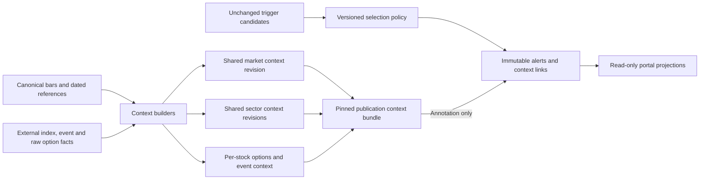

# Stock Alert Context Enhancement

Status: RICHER CONTEXT AND PROSPECTIVE EVENT SHADOW DIAGNOSTICS DEPLOYED, September 17, 2026. LIVE GATES DISABLED.
The user approved proceeding with the data-first plan. Pure daily rotation and
divergence builders, a bounded read-only capture, an immutable artifact, a separate
stored-data endpoint and the Market Conditions workspace are implemented. The
former all-agree continuation gate remains withdrawn. Continuous context refresh,
tracked breadth, realized SPY volatility, comparable intraday volume and the FRED
adapter are implemented. A separately named development conditions score and fixed
weights, retained ETF option activity and a NAV/share-record calculator are now
available. Offline immutable per-alert context storage and file-only reader/UI
attachment and a separate prospective annotation worker are implemented. A bounded
financial pilot stopped on its first HTTP403; usable financial acquisition, intraday
price divergence, calibrated sentiment and missing ETF sources remain pending.
The earlier [readiness and annotation prototype](STOCK_ALERT_CONTEXT_READINESS_2026-09-15.md)
remains separate evidence. No alert winners, technical gates, probabilities,
existing worker configuration or live alert source pointers were changed.
The September16 user approval covers the isolated context refresher and bounded
FRED acquisition after local configuration. No paid subscriptions, broad backfills,
data purge, new context gates or other worker activation is authorized by this
document. The Screener remains separate.

## Context Progression Milestone

Latest approval: implement the reviewed progression, keeping financial acquisition
deferred and live gates disabled. This milestone changes context diagnostics and UI,
not the Stock Alerts engine, frozen enrollment/OKE quarantine, plans or paper outcomes.
Financial/moat/squeeze acquisition is no longer the next priority. Existing safety,
identity, freshness, warmup and executable-entry rules remain unchanged.

### Coverage And Status

- Score components preserve stale-input status and source dates. The UI distinguishes
  Unavailable from Not captured, showing required and actual source sessions. Fixed
  weights and no missing-input reweighting remain. Current VIX/OAS sourceSeptember15
  cannot supply the composite required for September16; no freshness policy relaxed.
- [Four-proxy audit](stock_sector_action_review_2026-09-17.json), read-only at05:27:26Z:
  XLY/XLE/XLU/XLB each has one retained2-for-1split effective2025-12-05, observed/created
  September3. Adjacent raw price ratios are0.5004/0.4990/0.5001/0.5011, consistent
  with0.5 but not independent adjustment certification. No bars or actions changed.
  Price contexts expose action dates/terms/source/revision. Guards remain; coverage
  is8/12proxies and245ready stock-sector comparisons,105unavailable,36notapplicable.
- [New Market Conditions snapshot](stock_rotation_2026-09-17.progression.json):
  cutoff05:35:22.761519Z, projected05:36:06.893235Z,1301facts/939lineagesverified,
  originalpublicationsunchanged. API serves hash
  34e347b79c6682516aba6488b871679b814fd2d28416460236b354a036a71048.
  This new projection supersedes latest view only; original study/capture files remain.

### Shared Alert Facts

Future annotation construction reuses a verified immutable Market Conditions capture,
selected from the newest eight pre-cutoff archive filenames. Actual as-of/generated/
projected completion times must all precede the alert's original input cutoff. Source
session and original universe hash must match; stock-specific fields also require
exact security/ticker/reference identity. Missing archive remains NOT_COVERED. The
bounded search may miss an older eligible archive and must not fabricate a fallback.

New factors: SPY/QQQ price context, sector rotation/change/persistence, stock-relative
rotation and named divergence, tracked breadth, SPY realized volatility, VIX, OAS,
development score and SPY/sector same-time volume. Each retains snapshot hash/session
and source lineage reference; archived intraday volume behind the alert boundary is
STALE, not silently current. Snapshot hashes avoid duplicating whole-cohort bar IDs.
The same archived definitions as the page are used, not a join to today's live values.
ETF premium/flow, new financial data and additional price feeds remain excluded.
Existing basic alert factors and historical sidecar bindings remain readable.

### Event Timing And Shadow Study

`stock_alert_event_timing_v2` distinguishes IN_HOLDING_HORIZON (confirmed timestamp),
UPCOMING_BEFORE_ENTRY, RECENT_EVENT (30minute diagnostic lookback), and
SAME_DAY_TIME_UNCERTAIN (exchange-local calendar day for estimated time). An estimated
14:00FOMC timestamp is not asserted to be within a14:30entry horizon. Cancellations,
source revisions, actual availability and calendar-coverage guards still apply.

`shadow_holding_event_v1` is a frozen diagnostic, not a selection rule:
- WOULD_BLOCK: at least one confirmed earnings/FOMC event inside the planned holding
  horizon. Known confirmed exposure can be flagged even when other coverage is unknown.
- UNKNOWN: no confirmed blocking event, but missing/stale coverage or uncertain timing.
- WOULD_ALLOW: applicable covered event windows without the above conditions. Recent
  or upcoming-before-entry events stay visible but do not block this particular rule.
- NOT_APPLICABLE: watch-only/no executable horizon. No invented holding period.

`-Worker AlertContext -ShadowEvents` explicitly enables recording, not live gates.
Separate activation at **2026-09-17T05:40:41.596108Z**; original annotation activation
2026-09-16T17:05:51.948595Z retained. One publication/cycle and current/previous XNYS
sessions remain bounded. The worker now records every retained candidate in eligible
PUBLISHED runs, including baseline suppressions and runs with no selected candidates.
Immutable `event-shadow` files pin original publication/candidate hashes, baseline
selection/reason, event evidence and diagnostic verdict. Earlier runs are not backfilled.
Existing selected-alert context files are not overwritten. Failed/missed publications
are not reconstructed as successfully tradable opportunities.

This is post-publication as-of reconstruction. Preselection latency is NOT validated;
the pool is all retained publication candidates, not every stock/detector observation.
No quota refill, alternative fills, strategy return or probability is simulated. Only
an explicitly approved future experiment may promote a context requirement into selection.

### Validation And Remaining Work

[Retrospective engineering check](stock_alert_context_progression_2026-09-17.json)
uses September16 retained publications without changing old sidecars:3candidate
occurrences/2unique/2selected; all3have eligible archives and all3shadow verdicts are
UNKNOWN because FOMC timing is estimated. The repeated expired candidate keeps its
baseline suppression. Original publication hash unchanged. This is not a held-out
comparison and does not demonstrate that an event gate improves results.

CLI: `run_stock_alert_context_worker.py --review-session 2026-09-16 --output <NEW-path>`
performs only a read-only engineering review; no live activation/sidecar/source writes.
Do not rerun into existing evidence. Financial/provider requests were not made by
the review or manual snapshot capture. Market refresher retains its existing FRED
fetch policy and cadence; no new financial source, backfill or subscription enabled.

240backendtests pass across context/readers/forward/engine/replay/launcher. TypeScript
and production bundle pass. API/DOM checks verify current snapshot and source dates;
desktop1440/mobile390 screenshots and real pointer/keyboard checks cover split details,
new context/shadow fields, uncertainty and stale volume; nooverflow/clippedtext.
Alert UI checks use an isolated, removed browser fixture. Original CME/LYV sidecars
remain without new shadow fields; LYVhash571f6c77e6d1df5da79e7c7c92fbee9c0f6f2c357294295179f0bf384ee8697b
was explicitly unchanged. No retrospective projection was promoted into live history.

Only the verified market-context process pair was stopped/reloaded with previous
arguments; standalone shadow annotator launched. Heartbeat05:40:41Z confirms
shadow_events_enabled=true/live_gate_enabled=false,0pending. At deployment inspection
no Stock Alerts process was returned; it was NOT started/stopped by this milestone.
Check runtime afresh before collecting a forward sample or approving any restart.

NEXT: collect prospective shadow evidence during uninterrupted source/alert sessions;
define per-model candidate coverage, costs/adverse moves/missed opportunities and
minimum sample criteria before inspecting outcomes; evaluate on disjoint sessions.
Before an actual gate: timely preselection context for the full candidate pool,
explicit missing-data/risk policy, latency tests and operator approval are required.
Directional rotation/breadth/volume gates, composite/ETF/bond gates remain disabled.
Full sector recovery still requires approved split-adjusted price evidence and a
versioned calculation basis, not a raw-price flag exemption.

## Automatic Annotation And Financial Pilot

The subsequent "lets go ahead" approval covered a bounded existing-provider
financial pilot and deployment of the independent annotation producer. No subscriptions,
alternate provider, broad backfill, source identity repair, global cohort change or
Stock Alerts/Market Conditions restart was performed.

### Financial Access Result

[Pilot report](stock_alert_financial_pilot_2026-09-16.json): selected the first five
alphabetically ordered active, exact-ID enrolled common stocks: AAL, AAOI, AAPL,
ABBV and ABNB. Planned ceiling: 15 requests total, two quarterly rows per statement,
1MB/response, 20-second request timeout, no retries, redirects or pagination. This
is an access/contract pilot, not a representative financial study.

The first AAL income-statement request returned **HTTP403** at17:00:14Z. Acquisition
stopped immediately after that single request, with zero financial reports written.
The [sanitized receipt](stock_alert_financial_pilot_2026-09-16.AAL.receipt.json) and
report retain status and real receipt times, not credentials or request URLs. This
establishes endpoint access denial; its precise account/entitlement cause and a
successful provider response schema remain unverified. No automatic retries/fallback.

The bounded client and pilot validate ticker/CIK/quarterly/filing identity before
normalization and use actual post-response observation times. Accepted reports retain
date-only filing, unresolved-accession, unit and period limitations. Unverified capex
sign treatment suppresses derived free cash flow. Growth/ratios remain withheld by
the alert builder. Unit/sign/fiscal normalization still needs real eligible evidence;
passing synthetic tests is not provider data certification. New data cannot fill
earlier alert cutoffs retroactively.

### Resident Annotator

[Worker](../backend/scripts/run_stock_alert_context_worker.py), version
`stock_alert_context_worker_v1`, activated **2026-09-16T17:05:51.948595Z** (13:05:51ET).
It runs in a standalone PowerShell window `stock-alert-context-worker`, selected
explicitly with `start_workers.ps1 -Worker AlertContext`. Default All/Equity groups
are unchanged. No provider acquisition is part of the resident process.

- Resolves the configured shadow reader's sibling ledger and pins original enrollment
  and policy at activation. Separate path-scoped PostgreSQL advisory lock prevents
  duplicate producers. A changed ledger blocks annotation rather than re-enrolling.
- Checks every60seconds, at most one missing selected-publication bundle per cycle,
  current/previous XNYS sessions only, actual publication at/after activation. Does
  not retroactively annotate old alerts or fetch merely because an empty run exists.
- Reads the source ledger query-only and PG facts repeatable-read/read-only with
  20second statement timeout. Capture is limited to selected identities and shared
  benchmarks; price/financial facts still obey the original decision cutoff.
- Saves write-once evidence, validates manifest/row agreement and source publication
  hashes, then atomically freezes context. Existing valid bundles remain untouched.
  Watch-only candidates get no executable event horizon. Optional failures produce
  ANNOTATION_FAILED status, not lost/changed alerts or relaxed deadlines.
- Status/activation live in the ledger's `alert-context` directory, evidence in
  `context-evidence`. `--status` is a saved heartbeat, not proof of present process
  ownership; `--plan` resolves paths without enrollment or data requests; `--once`
  activates/resumes and performs one actual annotation cycle.

OBSERVED17:10:34Z: heartbeat WAITING_FOR_SELECTED_PUBLICATION,19observedpubs,
0pending, provider_requests=false, ledger_writes=false. Standalone ancestry
PowerShell23820 ->venv23960 ->Python7704; existing Stock Alerts12028/12244 unchanged.
PIDs are dated observations, not reusable stop authority. The annotator alone was
reloaded after its final watch-only fix, preserving the original activation.
No nonempty prospective live annotation has yet been observed; nonempty trade/watch
capture, verification, freezing and duplicate-cycle behavior pass isolated tests.

VALIDATED155tests across context/readers, Polygon ingestion and PowerShell launcher,
including hard limits, denial stop, actual receipts, future/changed identity isolation,
trade/watch cycles, default-group preservation and duplicate launch. Diagnostics clear.
Initial launch exposed a null empty-array quoting failure before any process started;
resident mode now omits the argument parameter, with explicit --once only for one-shot.

NEXT: observe the first eligible nonempty annotated publication; resolve financial
endpoint access with the existing provider before another separately bounded attempt,
or explicitly approve an alternative source. Do not upgrade, repeatedly probe403,
invent financials or treat the original five-stock pilot as full-cohort coverage.

## Company Context Implementation Milestone

This earlier milestone covered retained-data coverage
and the annotation-only implementation. No new provider collection, migration,
backfill, live-worker deployment or selection policy was included. Existing live
services and concurrent changes were left alone.

### Retained Coverage

The [final manifest](stock_alert_company_context_2026-09-16.final.json) and
[annotation artifact](stock_alert_company_context_2026-09-16.final.annotations.json)
capture one session at **2026-09-16T16:42:24.523641Z**. PostgreSQL was repeatable-read,
read-only; the forward SQLite ledger was opened query-only in a snapshot transaction.
Original publications matched before/after capture. The original enrollment remains
386, with the existing prospective OKE quarantine leaving 385 alert-selection members.
Readiness counts below describe original enrollment, not a new trading universe.

| Context | Observed Coverage |
|---|---|
| SPY/QQQ market | READY |
| Ticker daily | 363 READY, 15 unavailable, 8 insufficient history |
| Sector | 245 READY, 105 unavailable, 36 not applicable |
| Native 30-minute window | 385 READY, 1 unavailable |
| Earnings | 350 common stocks READY, 36 not applicable |
| FOMC calendar | 386 READY |
| Filed financials | Zero retained reports/securities for this cohort at the capture cutoff; 350 unavailable, 36 not applicable |
| Selected alerts in the captured session | Zero; no genuine alert-context sidecars could be populated |

The financial gap is absence of retained reports, not merely a stale-report or
filing-date filter. Earnings readiness proves calendar coverage, not actual results,
guidance or consensus coverage. The company-only capture deliberately skips options
and macro-provider acquisition; its NOT_COVERED optional fields do not supersede the
separate Market Conditions workspace's VIX, credit or options evidence. The first
nonfinal company capture is retained as earlier diagnostic evidence.

### Implemented Contract

- [Financial builder](../backend/research/stock_alert_context.py): correct security,
  cutoff-eligible availability/observation/creation, latest reporting period per
  quarterly/annual/TTM basis, stale age and source quality. Preserve signed retained
  cash/debt/cash-flow values; typed reports lack verified units and cash-flow period
  basis, so expose PARTIAL and withhold growth/ratios rather than assume comparability.
  No eligible reports returns UNAVAILABLE; non-common-stock financials are not applicable.
- [Immutable sidecars](../backend/research/stock_alert_annotations.py): independent
  `stock_alert_publication_context_v1` files under the selected shadow view's sibling
  `alert-context` directory. Version/source/run hashes name files; source publication
  hashes, exact plan/security binding and original input cutoffs protect attachment.
  Atomic hard-link publication never overwrites the first valid file. Repeated
  captures preserve it; a changed original publication is rejected.
- [Capture/freeze CLI](../backend/scripts/prepare_stock_alert_context.py): bounded
  `--company-context` capture, offline manifest/fact validation and a separate
  `--freeze-alert-context` step. Freezing reopens the ledger read-only and checks
  exact original publication hashes, selected alert IDs and source policy/cohort.
  Assembly time stays separate from cutoff/publication; records are labeled
  RECONSTRUCTED_FROM_RETAINED_ASOF_INPUTS, not context used by original selection.
- [API attachment](../backend/equity/stock_alert_views.py): after alert pagination,
  SHADOW only, no provider/DB reads for context, maximum 2MB per file and 10MB per
  page. Missing/corrupt/mismatched files only remove context, never alerts. REPLAY
  and LEGACY remain untouched. No edits to the detector, quota, ledger or plan.
- [Alert details](../frontend/src/pages/StockAlertsPage.tsx): market/ticker/sector,
  earnings/FOMC and filed-financial facts with availability, source revision IDs,
  unit warnings, original cutoff, assembly time and provenance. Current page
  refreshes do not substitute today's context for an earlier alert.

### Use And Verification

Reuse the process tasks `Prepare stored stock alert context readiness`,
`Verify stored stock alert context artifacts` and `Test stock alert context builders`.
Capture requires a NEW output path; the final evidence files cannot be overwritten.
For offline freeze of this verified artifact (zero selected rows, therefore no new
sidecars in this observed run):

```powershell
.\backend\.venv\Scripts\python.exe backend/scripts/prepare_stock_alert_context.py --session 2026-09-16 --state-dir backend/backups/equity-shadow/stock-ideas-forward-v2 --company-context --freeze-alert-context --output docs/stock_alert_company_context_2026-09-16.final.json
```

The verifier passes 6,951 facts, manifest/annotation equality, causal timestamps
and original-publication preservation. The freeze path completed with zero rows,
zero ledger writes and zero provider requests. Nonempty artifact-to-sidecar-to-reader
behavior is tested using isolated fixtures, not claimed as observed live delivery.
Final process-task regression: **171 passed** across context, readers, forward,
engine and replay; 14 frontend navigation/presentation tests pass; TypeScript and
production bundle pass. Browser-only fixtures exercised partial/missing values,
desktop1440/mobile390 layouts, pointer/keyboard evidence expansion and screenshots;
no page overflow or clipped text detected. Fixtures were removed and the test tab
returned to real data. The actual alert endpoint returned HTTP200 with zero rows.

At this earlier milestone, financial acquisition and automatic annotation deployment
were pending. The automatic worker and denied pilot are now recorded above; the
existing market-context refresher remains rotation-only. Offline capture/freeze
commands remain available for separately scoped historical annotation work.
Do not claim populated live financial context or nonempty live attachment until
eligible reports/alerts exist and that workflow is observed. Company catalysts,
moat/ownership and short/gamma studies remain the subsequent scoped backlog.

## Ticker-Specific Context Roadmap

Documented September 16, 2026 after the user requested company financials,
external events, institutional activity, product innovation/moat, debt/cash flow,
supply/demand imbalances, short squeezes and gamma squeezes alongside market context.
This is a proposed backlog, not an implemented signal set or permission to acquire
data, restart workers, backfill, or change alert selection. The delivery order below
supersedes earlier next-step ordering; existing evidence and validation gates remain.

Company-specific developments can outweigh market/sector direction. Changes versus
expectations and the alert's holding horizon matter: financial strength or a durable
moat is background, not evidence of an immediate upward move. A catalyst, positioning
condition or coincident price response is not proof of causation. Keep confirmed
facts, derived metrics, qualitative assessments and modeled scenarios distinct.

### Coverage And Backlog

| Area | Alert Context To Address | Existing Foundation / Remaining Work |
|---|---|---|
| Market, sector and ticker strength | Absolute direction, relative leadership, breadth, same-time volume, event horizon | Stored builders/workspace and immutable alert attachment implemented; separate prospective annotator deployed |
| Financials, debt and cash flow | Comparable revenue/EPS trends, margins, cash conversion, leverage, liquidity, maturities and dilution | Filed-report annotation builder/reader implemented; no retained cohort reports at the audited cutoff; units, acquisition and derived measures pending |
| Earnings and guidance | Next event, timing confidence, latest actual results, guidance revisions, actual-versus-consensus surprise | Earnings calendar/coverage builder exists; calendar presence is not results or consensus coverage; timestamped releases and pre-release estimates need separate sources |
| External company events | Material filings, offerings, M&A, contracts, regulatory/legal decisions, management changes and sector-specific shocks | Reuse event provenance conventions; company filing/news adapters and coverage are not established by the calendar |
| Institutional and insider disclosures | Reported holdings changes, significant beneficial ownership and insider transactions | No verified dedicated filings pipeline in the inspected context paths; legacy institutional percentage is not a usable activity history |
| Product innovation and moat | Verified launches/adoption, competitive position, pricing power, customer retention and concentration | New source-linked qualitative and metric definitions; no validated moat score |
| Supply and demand imbalances | Effective float, issuance/unlocks, executed repurchases, index rebalances, volume/liquidity and industry supply constraints | Price/volume and reference/action foundations exist; dated float, execution, rebalance and industry evidence need coverage checks or new adapters |
| Short-squeeze conditions | Dated short interest/float, days to cover, borrow stress, catalyst and price/volume response | New verified short-interest/borrow inputs required; price or put activity alone is insufficient |
| Gamma-squeeze conditions | Coherent option chain, settled OI, near-expiry strike concentration, gamma scenarios and underlying liquidity | Retained option matrices are a starting point, not certified gamma/dealer-position coverage; dated OI, Greeks and scenario validation remain pending |

The reusable fundamentals owner is
[list_fundamentals_as_of](../backend/equity/repositories.py), not the latest-only
profile endpoint. The [report normalizer](../backend/equity/polygon.py) marks
date-only availability, unresolved accessions and partial statements. Preserve
those limitations; a filing date does not establish the minute a release was known.
The [event builder](../backend/research/stock_alert_context.py) already distinguishes
covered windows from unknown coverage. These are code capabilities, not a fresh
database audit or assurance that every enrolled ticker has eligible inputs.

### Product Innovation And Moat

- Retain dated product announcements, regulatory approvals, independently reported
  adoption and disclosed product revenue, retention, backlog or customer metrics.
  Distinguish announced, approved, launched and commercially adopted milestones.
- Describe the claimed mechanism: switching costs, network effects, distribution,
  brand/pricing power, cost advantages or protected intellectual property. A patent,
  R&D spend, management claim or product launch alone does not establish a moat.
- Link each assessment to its source, publication/receipt times, supporting and
  contrary evidence, affected business segment, reviewer/model version and review
  date. Distinguish issuer claims from independently corroborated facts.
- Use sector-appropriate comparisons and comparable reporting periods. High margins
  can be cyclical; growth can come from acquisitions; backlog can be cancelable.
  Treat any LLM extraction as source-grounded assistance, not independent evidence.
- Display background and recent changes separately. No universal moat grade,
  automatic bullish label or inferred trade probability in the initial delivery.

### Debt And Cash Flow

- Start with filed cash, debt, operating cash flow, capex and free cash flow, then
  comparable growth/margins, cash conversion, net debt and supported coverage ratios.
  Add debt maturities, refinancing exposure, covenants and cash runway only when
  the necessary disclosures and explicit calculation assumptions are available.
- Normalize units, currencies, capex signs and fiscal periods. Do not mix annual,
  quarterly, year-to-date and TTM values or double-count cumulative cash flows.
  Preserve restatements as newly available revisions, not replacements in old alerts.
- Ratios with zero/negative or inapplicable denominators remain explicitly invalid;
  sector-specific treatment is required for banks, insurers and REITs. Cash runway
  is a conditional estimate, not a known date of financial distress.
- Use the newest eligible information actually received before the cutoff, with
  report age and quality visible. Results-versus-consensus needs comparable GAAP/
  adjusted definitions and estimates captured before the release; growth is not
  an earnings surprise. No fabricated estimates or retroactive use of guidance.

### Supply And Demand Imbalances

- Separate security supply (float, issuance, lockup expirations, executed repurchases),
  trading liquidity/participation, and product/industry supply-demand conditions
  (inventory, utilization, backlog, commodity constraints or customer demand).
- Use dated share-class identity, action-adjusted share counts and announcement,
  effective and observation times. A buyback authorization is not executed demand;
  a split does not itself represent economic dilution; a shelf registration is not
  proof that shares were issued. Index changes need dated announcements/effectiveness.
- Same-time relative volume, spreads and available depth are observations, not
  identified institutional accumulation. Signed order-flow estimates need suitable
  trade/quote data and explicit classification uncertainty; OHLCV cannot supply it.
- Keep ETF NAV/share creations separate from stock order flow and industry demand.
  Do not derive investor inflows from rising prices, AUM or options premium activity.

### Short And Gamma Squeeze Conditions

Short covering can amplify an upward move, but high short interest alone does not
predict a squeeze. Retain short-interest position/settlement date, publication date,
first receipt and source separately. Compute short interest as a fraction of eligible
dated float; define days to cover as reported short shares divided by average daily
share volume over a frozen trailing window. Align share units/actions and disclose
the lag, window and source coverage. Daily short-sale volume is not outstanding
short interest. Borrow availability/fees/utilization are source-specific, can change
quickly, and neither prove a locate nor demonstrate actual forced covering.

Gamma-related hedging can amplify moves in either direction when dealers are net
short gamma, or dampen moves when net long gamma. Neither call volume nor OI reveals
dealer inventory or buyer/seller intent. Long calls and long puts both have positive
gamma; assigning opposite dealer signs solely by option type is an assumption.

A gamma study must use a fixed covered stock subset, coherent spot/option clocks,
valid quotes/IV or a declared Greek model, settled OI availability, expiries, strikes,
contract multipliers/deliverables and source-policy versions. Define units (for
example dollar hedge change per 1% spot move) before comparing exposures. Never sum
cumulative snapshots or treat intraday volume as newly opened OI. Retain unsigned
concentration separately from explicitly signed inventory scenarios; show sensitivity
to dealer-sign assumptions, spot and volatility rather than claim observed dealer GEX.
Missing OI/IV coverage blocks the estimate, not the stock alert. Hedging demand depends
on actual positions and behavior, liquidity and other flows; neither scenario proves
a gamma squeeze or a price target. No combined squeeze-confidence score is proposed.

Institutional ownership remains separate from both mechanisms: 13F holdings are
quarter-end positions generally reported up to 45 days later, not current purchases
or complete net exposure. Compare share quantities with amendments/actions handled,
not changes in market value alone. 13D/13G concern significant beneficial ownership;
Form 4 concerns insiders and must separate purchases, sales, grants and exercises.
Record reporting/transaction periods and actual disclosure/receipt times for each.
None identifies the institution behind an anonymous current trade.

### Alert Attachment And Source Plan

1. Reuse background repositories and shared source revisions. Collect eligible
   financials/events on source-appropriate schedules; do not fetch or summarize
   provider data synchronously inside alert selection or a page GET.
2. Map issuer-level facts through dated issuer/security/share-class references.
   Ticker text alone must not bridge an identity change or remove OKE's alert-only
   quarantine. Issuer facts do not imply share-class ownership or price continuity.
3. Extend the independent annotation contract with report/position period, source
   release and effective times, first receipt/created times, units, evidence IDs,
   quality/coverage, and fact/metric/assessment/scenario classification. Model
   assumptions, source citations and the calculation version must be inspectable.
4. Pin a bounded immutable bundle to the exact alert/publication/security and
   original cutoff. Missing or late optional context cannot delay publication,
   reject a candidate, change quota/order, or change entries, stops, targets or expiry.
   A later annotation may attach already-retained cutoff-eligible evidence, but
   its assembly time must remain separate from the original decision time.
5. Show concise company context beside the market/sector context with dates and
   expandable evidence. UNKNOWN/STALE/NOT_COVERED differ from no known event or no
   squeeze risk. Post-publication developments append separately dated updates;
   refreshes never overwrite original context or silently alter a paper position.

Source candidates are existing financial/calendar adapters, SEC EDGAR/issuer releases
for filings and disclosed facts, official regulators for decisions, an approved news/
consensus source for timely catalysts and expectations, and suitable short-interest,
borrow and option sources for positioning. Validate each source's latency, coverage,
identity mapping, rate/storage limits and usage rights before enabling acquisition.
Public access or an existing API key does not certify retention/redistribution rights.
No new provider requests, subscriptions or broadened cohorts are approved here.

### Revised Delivery Order And Exit Gates

| Priority | Bounded Deliverable | Exit Gate |
|---|---|---|
| 1 | Read-only coverage inventory for the existing alert cohort: market/sector, earnings, financial reports and report-quality/age gaps | Named eligible/missing fields, source clocks and identities; no implicit repair, acquisition or full-market claim |
| 2 | Frozen per-alert market/sector, earnings proximity and eligible filed-financial context, including debt/cash flow | Identical winners and plan hashes with context on/off; no future data or reader-time recomputation; missing-context and refresh-isolation tests pass |
| 3 | Bounded company filing/catalyst integration and evidence-backed innovation/moat context; disclosures for supply changes and ownership | Source/rights budget approved before collection; timestamped, deduplicated evidence; issuer claims, qualitative assessments and delayed holdings clearly identified |
| 4 | Separate short-squeeze and gamma-scenario feasibility pilots on a fixed supported subset | Required short-interest/float/borrow or coherent options/OI/Greek inputs verified; absent inputs remain unknown; assumptions and sensitivity disclosed, no selection changes |
| 5 | Independent annotation evaluation; optional SPY/QQQ same-time options-activity pilot where comparable history exists | Frozen definitions/cohort/horizons, unchanged execution/costs, missingness and sample counts; disjoint/prospective evaluation before any proposed policy use |
| Deferred | Broader sector ETF options, NAV/share feeds and refined bond proxy | Separately justified incremental value, source coverage and bounded acquisition approval; none blocks usable company context |

Do not wait for every company's news, moat or borrow data to complete priorities 1-2.
Test reporting-period/sign normalization, restatement and filing-time uncertainty,
security transitions, amended ownership disclosures, short-volume misuse, delayed OI,
multiplier changes and unsupported dealer signs. Future-input perturbations must not
change earlier annotations. Optional provider failure must preserve winners, immutable
plans, historical outcomes and the running worker's deadlines. No service reload is
part of this documentation task; deployment requires explicit scope approval.

Evaluation uses the same covered cohort for baseline and comparison, predeclared
context groups, unchanged fills/costs and reported adverse excursions as well as
returns. Separate longer-horizon company assessments from intraday catalysts, account
for repeated correlated alerts and avoid double-counting shared price/volume/options
evidence as independent confirmation. Retrospective reconstructions are not actual
historical knowledge; causal or calibrated probability claims require separate evidence.

## Development Context Milestone

User clarified the request to the remaining Market Conditions sections, not other
portal pages. There is no global development bypass: freshness, corporate-action,
identity and provider-permission gates remain intact. The existing Indicators tab
now exposes the calculation and component weights; a fourth ETF Activity tab shows
option activity and creation/redemption estimates when their respective inputs exist.

### Four-Category Conditions Score

`market_conditions_development_v1` is a descriptive, independently defined score,
not the screenshot vendor's Fear & Greed formula, a calibrated probability or a
replacement for the earlier proposed five-category full sentiment model.

| Category | Calculation | Fixed Weight |
|---|---|---:|
| Momentum | Mean SPY/QQQ20-session return percentile in prior available windows, excluding current | 25% |
| Participation | Mean fraction of eligible tracked stocks aboveSMA50/SMA200 | 25% |
| Volatility | 100 minus VIX prior-history percentile expressed on0-100 scale | 25% |
| Credit | 100 minus ICE OAS prior-history percentile expressed on0-100 scale | 25% |

The composite is the weighted mean of category scores. Each displayed contribution
is weight times(category score minus50); contributions plus50 reconcile to the score.
Missing, stale, nonfinite or wrong-session required values block the composite; no
neutral filling or weight redistribution. Partial tracked breadth propagates PARTIAL
instead of claiming full-market coverage. Weights are configuration, not evidence.

The current253-close price contract yields232 prior20-session return observations.
The momentum percentile requires at least202 supported observations and nonconstant
history; it does not silently claim252 observed windows. Its coverage is displayed
as232/252. Participation uses the current eligible tracked population, not a historic
percentile; this normalization difference is intentional and visible in the method.
All definitions and weights were fixed before inspecting the generated score. No
performance or calibration study was run and no alert gate consumes this value.

The [development capture](stock_rotation_2026-09-16.development.json) at
2026-09-16T15:25:02.652396Z uses September15 daily inputs and reports **43.9991/100**,
PARTIAL: momentum12.0690, participation49.2447, volatility49.2063, credit65.4762.
Contributions are-9.4828,-0.1888,-0.1984,+3.8690 respectively. Breadth331/349,
VIX17.20 and ICE OAS276bps have independent source clocks and provenance. These are
dated facts, not an assertion of today's latest runtime state.

### ETF Activity And Remaining Sources

The capture selects at most one latest completed matrix per SPY/QQQ/sector ETF,
matching the existing policy/configuration and actual availability cutoffs. It
reports calls/puts separately using day volume times retained mark times contract
multiplier. It never sums cumulative snapshots across time or calls this traded
premium, bullish/bearish flow, buyer intent or net capital movement. Partial contract
coverage and stale matrix time remain explicit. An optional query failure is isolated
with a read-only transaction savepoint and cannot turn into fabricated zero activity.

SPY and QQQ have retained usable matrices in this capture (1,027 and1,010 contracts).
All12 sector proxies currently lack qualifying matrices. Sector activity remains
Needs coverage, with all14 rows retained visibly. Adding those contracts to provider
acquisition requires a separately bounded cohort/budget decision; the ten-stock
option cohort is not used as fictitious sector coverage.

`etf_creation_context` computes current NAV times(current shares minus previous
shares times split factor). It requires consecutive XNYS sessions, identical security
and source/currency, paired close valuation times, positive finite inputs, validated
split evidence and ex-distribution NAV basis. It estimates ETF net creation value,
not all sector flows; NAV rather than market price avoids conflating price change
with subscriptions. No paired NAV/share inputs are retained, so the14 rows currently
show Needs source. Tests cover creations, redemptions, splits, future availability
and absent records; no example records were inserted into live evidence.

The optional source artifact is `backend/backups/stock-rotation/etf-nav-shares.json`.
Its schema is `etf_nav_share_records_v1`, with `usage_approved=true`, `records` (at most
1,000), and `records_sha256` from the existing `research.stock_idea_engine.digest`.
Each record has exactly: ticker, security_id, session, market_time, observed_at,
created_at, revision_id, source, currency, shares_outstanding, nav, nav_basis,
split_factor_from_previous, split_review, split_evidence_id. Use UTC-aware times,
currencyUSD, nav_basisEX_DISTRIBUTION, split_reviewVERIFIED only with actual evidence.
This is a retained-source adapter contract, not a new download/issuer integration.
The producer must validate source evidence; a boolean or string is not a licence or
independent verification. Missing input never falls back to price/volume estimates.

### Computed Values Versus Provider Values

VIX and ICE OAS levels are provider measurements. We compute daily changes,
percentiles, component scores and the composite from those measurements. SPY
realized volatility and the bond ETF relative-return proxy are different measures,
not alternative readings of VIX/OAS. Provider authenticity, statistical similarity
and predictive usefulness are separate verification questions.

The original bond comparison remains frozen. The
[details projection](bond_etf_oas_comparison_2026-09-16.details.json) reproduces all
733 original windows and adds the saved ten largest directional disagreements to
the compact reader/UI; original report/input hashes and results are unchanged.
Example:20sessions ending2026-07-23, HYG-0.7514%, LQD-2.9060%, relative+2.1546pp,
while ICE OAS widened1bp. A July1 distribution is known in that window; that does
not prove the distribution caused the discrepancy, and event coverage is incomplete.

Recommended next experiments, not implemented or optimized by this milestone:
1. Choose the benchmark exposure. HYG-LQD is high yield versus investment grade;
  ICE high-yield OAS is high yield versus a Treasury spot curve. A HY/IG spread
  differential is a closer reference for the former. For HY stress alone, test
  HYG excess returns against a duration-matched Treasury comparator instead.
2. Use verified cash distributions and consistent total returns, preserving the
  price-only baseline and historical action/receipt times. Removing ex-dividend
  price drops is a data-definition improvement, not a promise of higher correlation.
3. Match or hedge interest-rate duration with dated exposures; a simple HYG-LQD or
  HYG-TLT difference is not duration neutral. Spread duration, rating/sector mix,
  liquidity and ETF NAV deviations remain distinct effects.
4. Freeze each revised definition and evaluate disjoint future periods, with the
  same non-overlapping/subperiod diagnostics. Do not tune weights to the already
  observed .384/.204/.277 correlations or present the score as predictive.

### Validation And Runtime

37 focused backend tests, TypeScript and production bundle pass. Development
artifact verification covers1,301 facts/940 lineage sets, including explicit fixed
score/contribution reconciliation. It is14.1MB, within the unchanged20MB reader cap;
capture took24.531seconds and original audited publications were unchanged.
Desktop1440/mobile390 screenshots and real pointer/keyboard controls pass in a new
visible browser tab. Existing shared tab had moved to Stock Alerts and was left
untouched. Four-tab keyboard navigation, internal table scrolls, score, ETF rows
and disagreement expansion were checked with no page overflow or clipped controls.

Only the context refresher was reloaded. It now uses the direct process task
`Watch stored market conditions`; startup15:29:01Z confirmed leadership and
WAITING_FOR_NEXT_SOURCE_WINDOW. It retains its previous command arguments and
fetch policy. New capture and details projection used retained data only, with no
new provider requests or environment/entitlement changes. The shared shell failed
to resolve the interpreter before the details job started; a direct process task
ran it successfully. Do not duplicate the running watcher or reuse old terminal IDs.

## Bond ETF Proxy And ICE Comparison

The independent `bond_etf_relative_performance_price_v1` factor is implemented in
`stock_rotation.py`, stored as `additional_context.bond_etf_relative_performance`.
The genuine `credit`/ICE OAS field is unchanged. The proxy has no OAS input and
retains the same values, availability and lineage whether reference data is
present or absent. No alert-selection, probability or sizing policy uses it.

For each horizon of1,5,20 XNYS sessions, the proxy is HYG price return minus LQD
price return. Internally it is a fractional return difference; the UI displays
percentage points, both absolute fund returns, source/availability times and the
price-only caveat. Both funds require eligible253-session histories, correct dated
ETF/security references, identical parsed close times and raw/action-gated basis.
Distributions are excluded; different interest-rate duration and holdings remain
material confounders. This is not a credit spread, OAS estimate or fund-flow measure.

The [frozen study](bond_etf_oas_comparison_2026-09-16.json) retains its complete
inputs and report. It covers253 price sessions from2025-09-12 through2026-09-15,
captured2026-09-16T15:02:40.500858Z. At execution, the existing local credit-use
approval gate was enabled and a retained BAMLH0A0HYM2 receipt was available, received
2026-09-16T14:49:02.157356Z. This work did not change environment/approval settings
or request new reference data. A configuration flag is not independent legal
certification of usage or redistribution rights.

The evaluator compares the proxy to **negative OAS change**, so positive reference
movement denotes tightening. FRED percentage units are converted to basis points
exactly once. It aligns observation dates on the fixed exchange calendar before
shifting horizons; missing interior OAS observations exclude the window instead of
being forward-filled. Historical data is reconstructed at receipt/capture, not
represented as available to original historical alert decisions.

| Horizon | Rolling Pairs | Pearson vs Tightening | Spearman | Directional Agreement | Nonzero Pairs |
|---|---:|---:|---:|---:|---:|
| 1 session | 252 | 0.384 | 0.326 | 67.0% | 230 |
| 5 sessions | 248 | 0.204 | 0.185 | 59.0% | 239 |
| 20 sessions | 233 | 0.277 | 0.184 | 66.5% | 227 |

All733 requested windows matched, but rolling5/20 windows overlap. Deterministic
non-overlapping counts are50 and12, with Pearson0.205 and0.422 respectively.
The20-session Pearson changes from0.573 in the first chronological half to-0.100
in the second. These modest and unstable relationships do not establish an OAS
substitute, forecast, trading success rate or statistical qualification. No weight
fitting, lead/lag search, significance tests or horizon optimization was performed.
Zero/tied observations are reported separately and excluded from sign agreement.
Known dividend dates are flagged, not adjusted or used for opportunistic exclusions;
distribution-event coverage is not certified.

The Indicators tab includes the current factor plus a distinct frozen comparison
table with rolling/non-overlapping/chronological-half samples and source hashes.
`backend/backups/stock-rotation/bond-comparison.json` is a compact, verified stored
summary. GET reads do not rerun the study or access providers/database. A missing
or invalid comparison does not block the independent factor. Original artifacts
and the `stock_rotation_v1` reader contract remain readable and unchanged.

```powershell
.\backend\.venv\Scripts\python.exe backend/scripts/prepare_stock_alert_context.py --bond-study --session 2026-09-15 --output docs/bond_etf_oas_comparison_2026-09-16.json --verify
```

The `Verify frozen bond ETF OAS comparison` process task runs this offline check.
For a new capture, omit `--verify` and use a NEW output path; `--publish-bond-comparison`
publishes only the verified summary. Optional `--oas-reference` pins a specific
retained FRED receipt; the existing credit approval gate still applies. No provider
calls are made by `--bond-study`. `--bond-from <prior-artifact> --output <new-path>`
recomputes an existing frozen study offline; it cannot change its reference inputs.
Without approved retained OAS, the independent proxy is still computed and the
comparison remains `COMPARISON_PENDING` with zero matched pairs.

Verification:32 focused tests pass, including contract/identity/clock rejection,
OAS independence, missing/duplicate dates, units/signs, perfect positive/negative
synthetic association, constant/tied series, fixed calendar windows and offline
tamper detection. TypeScript, production bundle and both artifact verifiers pass.
The [bond-enabled context snapshot](stock_rotation_2026-09-16.bond.json) verifies
1,269 facts/936 lineages and unchanged original audited publications. Its capture
returned incomplete terminal output; durable artifact and reader verification
confirmed publication before the refresher resumed. It took45.907seconds.

Browser HTTP200 and DOM checks confirmed actual proxy values, rolling and sample
switching results, and no horizontal page overflow/clipped controls at1440/390px.
The shared browser stayed hidden; pointer/keyboard activation stalled and screenshot
captures were clipped. DOM-dispatched handlers were verified, but final visual and
real-pointer validation remains a manual follow-up. Only the existing context
refresher was reloaded; other running workers and their settings were left alone.

## September 16 Context And FRED Setup

The Additional Context rows now read actual stored status/value/coverage/source
facts instead of hardcoded Unavailable placeholders. The
[context artifact](stock_rotation_2026-09-16.context.json) was captured at
`2026-09-16T09:07:48.994766+00:00` for the September15 close. Verification covers
1,268 facts and934 lineage sets; the13.1MB artifact keeps the20MB reader limit.
It used99,171 daily revisions and7,709 native30m volume revisions, with no changed
original audited publications and no provider requests while the FRED key is blank.

- Tracked breadth:332/350 common stocks eligible,101 advancing/228 declining/3 flat,
  41.87% aboveSMA50 and56.93% aboveSMA200. Partial coverage is explicit. Sector ETF
  readiness is not a prerequisite for computing stock breadth.
- SPY realized volatility:8.8075% annualized, sample standard deviation of20 daily
  simple returns times square-root252. This is not VIX. The daily input still needs
  the existing253-session valid/action-gated history.
- Same-time volume:14/14 benchmark/sector proxies have20 comparable observations.
  Each comparison requires all native30m windows through the same elapsed time and
  the same session length. Missing windows, insufficient half-day history, identity
  changes and action-affected volume cannot be silently substituted.
- VIX/credit: implemented adapter, blocked at capture by missing local key. Sentiment
  and weights remain Not implemented; sector options Needs coverage; ETF flows
  Needs source. Known corporate-action gates still block four daily sector proxies.

Set these entries in the ignored `backend/.env`; they are also documented in
`backend/.env.example`. Do not put a real key in the template or in chat.

```dotenv
FRED_API_KEY=
FRED_CREDIT_INTERNAL_USE_APPROVED=false
```

`FRED_API_KEY` enables the daily Cboe VIX series `VIXCLS`. Set the credit approval
flag true only after reviewing the [ICE/FRED terms](https://fred.stlouisfed.org/series/BAMLH0A0HYM2)
for internal use of `BAMLH0A0HYM2`; access to FRED alone is not permission to
redistribute the credit series publicly. VIX attribution/usage notes are on
[the source series page](https://fred.stlouisfed.org/series/VIXCLS).

Only these two settings reload from the local file, including an explicit blank
that revokes a previously loaded key. They do not mutate database or other worker
environment settings. When a setting is absent from the local file, its process
environment value is used. Configuration/approval changes trigger a new capture
on the next five-minute check without restarting the context process.

```powershell
.\backend\.venv\Scripts\python.exe backend/scripts/prepare_stock_alert_context.py --check-sources
.\backend\.venv\Scripts\python.exe -u backend/scripts/prepare_stock_alert_context.py --rotation-only --state-dir backend/backups/equity-shadow/stock-ideas-forward-v2 --publish-rotation-view --fetch-macro --continuous
```

The first command reports presence/approval only; it never prints the key. The
second is the isolated advisory-locked context refresher, already launched for
this milestone; do not start another copy. It checks every300seconds, captures
new expected daily/native30m windows and retries late exact benchmark bars. It
does not start ingestion or alert workers, collect missing equity bars, or modify
their stores. The GET route remains file-only and labels each component's staleness.

FRED requests cover the trailing550 calendar days (bounded18-month bootstrap),
with at most600 observations and1MB response per series, timeouts, and a four-hour
successful-response cache. HTTP/transport failures are sanitized; keys and request
URLs are not retained in artifacts/log messages. Immutable normalized responses
and actual receipt times are saved under `backend/backups/stock-rotation/fred`.
Context captures are stored under `backend/backups/stock-rotation/captures` and the
separate latest view is replaced atomically, refusing older or oversized payloads.

Credit values are converted from percentage points to basis points. Percentiles
exclude the current observation and require at least202 of252 prior XNYS sessions
and nonconstant history; missing/stale values remain explicit. A historical
download is reconstructed at receipt, never proof of historical morning availability.

Validation:22 focused tests include configuration hot reload/revocation, no-key
request suppression, mocked successful/failed requests and safe receipt retention,
volume windows, breadth denominators, units/coverage/causal clocks and duplicate
leader refusal. TypeScript and production bundle pass. Real FRED authentication
and live data quality remain unverified until the user supplies the key. No signal
performance, probability or full-market breadth claim is made.

## Delivered Daily Snapshot

- Workspace: `/market-conditions`, under Market navigation. Separate from Sector
  Intelligence and its existing rank calculations. Rotation, Stock Divergence and
  Indicators tabs use only the stored `/api/stocks/market-conditions` response.
- Capture: `2026-09-15T17:07:45.731323+00:00`, last completed session September14,
  current 386-member enrollment. One read-only repeatable-read PostgreSQL snapshot;
  source ledger read-only. 99,162 daily revisions, 386 references, 1,254 actions,
  42.39 seconds. Original audited-session publications were unchanged.
- Coverage: 8/12 proxies ready, 245/350 common stocks ready, 105 unavailable and
  36 ETFs not applicable to stock/sector comparison. XLY, XLE, XLU and XLB have
  253 daily observations but fail the existing corporate-action gate. No gap was
  repaired or dropped from the display; raw prices were not treated as adjusted.
- Implemented values: paired 1/5/20-session return differences, recent versus
  preceding nonoverlapping five-session relative change, four leadership states,
  separate absolute returns/trend, daily volume and last252-session raw high/low.
  The existing253-observation readiness requirement remains unchanged.
- Five-session proxy trails are reconstructed at the capture cutoff. Confirmation
  requires two consecutive completed-session observations, including reversions
  to an earlier state; missing sessions/series changes reset persistence. This is
  descriptive reconstructed persistence, not originally published daily context.
- [Final artifact](stock_rotation_2026-09-15.final.json): 1,245 verified facts and
  918 lineage sets, 11.7 MB with a shared revision catalog. Original capture and
  initial compact projection are preserved as diagnostics. The original24.2 MB
  payload exceeded the20 MB reader guard; lineage compaction retained that guard.
  The final offline projection also corrected a `Confirmed (1)` display case
  without new database reads or changed numeric returns. Source and projection
  hashes distinguish these artifacts.
- One-shot publisher atomically updates only
  `backend/backups/stock-rotation/latest.json`. The GET reader verifies/cache-loads
  the file, omits the heavy lineage catalog, and reports source session, capture
  time, expected session and staleness. Reloading the page does not recapture data.
- Verification: 13 context tests, 69 existing browser-model regressions, TypeScript
  check and production bundle. Real HTTP200, search, unavailable-sector details,
  stock lookup, empty results, indicator availability and keyboard tab navigation
  checked in-browser. Desktop1440/mobile390 screenshots inspected; no page-level
  horizontal overflow or clipped controls; wide tables scroll internally.

Use the `Capture stored sector rotation snapshot` process task only with a new
output path; it intentionally refuses an existing artifact. `Verify stored sector
rotation snapshot` verifies the final saved artifact offline. For an additional
capture, set `--session` to the retained publication-audit session and pass the
intended `--state-dir`; data is captured at current actual time, not backdated.
`--rotation-from <existing-artifact> --rotation-only --output <new-artifact>` is
offline projection; `--publish-rotation-view` explicitly updates the separate view.

Next: configure the implemented FRED collector, then immutable per-alert links
and matched intraday price/coverage extensions. No context-dependent winner policy has
been enabled or tested for performance. Additional inputs/rights are still needed
for the proposed full sentiment/flow components below.

## Technical Baseline Fixed First

The [42-alert review](STOCK_ALERT_REVIEW_2026-09-14.md) identified three stale-price
admissions, two plans with no remaining executable entry slot, and weak acceptance
confirmation. These are handled by `stock_ideas_forward_quality_v2` before adding
any market, sector, event or options factor:

- Gate the candidate using the latest eligible, identity-matched native30m bar at
  the publication boundary, with provider lag and both observed/created times
  visible at the input cutoff. Missing, stale, invalid or zero-volume decision bars
  cannot fall back to an old trigger price. Existing correction quarantine remains.
- Check `execution_times` before quota selection; no remaining same-session entry
  slot means suppression, not an eventual alert known to be impossible to fill.
- Preserve trigger price, stop, target, expiry and original plan reward/risk.
  Record decision price/time/revision, observation/creation times, decision risk,
  decision reward/risk and the expected entry/exit separately in the publication.
  Acceptance/reversal ranking uses decision-price extension and room/risk;
  resumption keeps its frozen RS/trigger-EMA-extension priority. Actual next-open
  entry gates and conservative paper exits still apply.
- Acceptance intraday v2 retains the same breakout formation and next-bar timing,
  but confirmation must close at least0.15 activation ATR beyond the boundary,
  have a favorable body, improve on the prior breakout close in the trade direction,
  and finish in the directional half of a nonzero candle range. Long/short rules
  are symmetric. Daily v2 contracts, resumption and reversal detection are unchanged.
  There is no added volume gate, blanket sector veto, arbitrary ratio cap, stop
  widening, or inferred success probability.

These are explicit fixed rules, not claims that 0.15ATR or the midpoint is optimal.
The same-session check is a regression fixture, not a new performance study or
counterfactual winner backtest. In that check HWM/LQD/VEA fail the decision-price
gate, RCL/MA fail the entry-slot gate, and SPGI/RMD fail acceptance confirmation.
All42 original plan records, checkpoint and input hashes are unchanged.
[Retained v2 regression evidence](stock_alert_quality_v2_regression_2026-09-14.json)
includes the exact new config and source-evidence hashes. The focused backend suite
passed147 tests; all14 new quality tests passed, including positive controls,
long/short symmetry, incremental integration, quota ordering and old-policy isolation.

Worker planning defaults to quality version2 and a separate
`backend/backups/equity-shadow/stock-ideas-forward-v2` directory. It refuses a
different-policy existing store or view; it does not migrate or rewrite v1. The
initial fix milestone did not activate v2. At the subsequent September15 context
audit, a quality-v2 worker was already running; this audit neither started it nor
changed its reader pointer. Original v1 evidence remains preserved separately.
The corrected v2 technical policy, once frozen for the new study, is the unchanged
baseline for context experiments; original v1 is retained as historical evidence,
not mixed into the v2 comparison population.

## Implementation Sequence And Exit Gates

| Stage | Deliverable | Exit Gate | Authority Boundary |
|---|---|---|---|
| 0: Technical fixes | Quality v2, tests, isolated config and retained-case checks | Identified bad cases rejected; valid controls pass; original records unchanged | Implemented; existing v2 runtime observed independently |
| 1: Readiness | One dated `stock_alert_context_readiness_v1` manifest plus concise report | Explicit population, clock, coverage and capability states; no false CLEAR/READY | Initial bounded audit implemented; strict IV dry-run/repair comparison still deferred |
| 2: Annotations | Versioned pure builders and stored per-publication context references | Baseline selected IDs, original plans and outcomes unchanged | Offline42-alert artifact implemented; continuous publisher and portal not yet wired |
| 3: Context trial | Scenario analysis, then at most one frozen model-specific challenger versus the corrected technical baseline | Comparable universe/windows/execution, declared claims, execution and uncertainty checks; no universal alignment veto | Bounded research output only; no live winner changes |
| 4: Event/options increments | Separate event trial, then an options-covered trial | Incremental contribution measured on matched covered controls | Acquisition budgets and new policies approved separately |
| 5: Prospective validation | Frozen prospective predictions, timing and calibration reports | Temporal correctness, stable coverage, policy parity and explicit promotion review | No automatic activation or probability badges |

The initial Stage1 manifest is retained in the September15 readiness report. Next
is the background publication/reader integration for the covered market/sector/event
subset, with a separate strict IV materialization dry run before options deployment.
Do not treat the September11 inventory as current readiness. Not every factor must
be available to make progress. A manifest
with `NOT_COVERED` VIX/quotes or `INSUFFICIENT_HISTORY` IV is a valid audit output,
not permission to invent values or block all market/sector experimentation.

### Stage 1: Readiness Manifest Contract

Use one read-only repeatable-read database snapshot, bounded query timeouts, and a
consistent actual audit cutoff; read forward SQLite state in its own explicit
snapshot and retain both cutoffs. No provider requests, GET-triggered calculations,
worker start, context materialization or backfill is part of this audit. Write a
new report path, not the existing September11 or frozen-study reports.

Scope initially: the enrolled386 security IDs; the42 reviewed alerts and their
actual decision cutoffs; daily history needed for proposed indicators; an explicit
intersection with the currently configured options-covered STOCKS. ETFs in the
equity cohort remain marked as ETFs, and options benchmark ETFs are not silently
counted as stock coverage. September14 is development evidence, not an untouched
test set. Expand dates only under a declared bounded study configuration.

Top-level manifest fields:

- `schema_version`, `generated_at`, `audit_cutoff`, source snapshot/capture clocks,
  requested dates/windows, code hashes and quality/dispatch policy hashes.
- Equity universe manifest/security IDs; benchmark/proxy map version and dated
  source references; options-cohort IDs and the exact intersection; cohort hashes.
- Factor definitions and required lookbacks; declared missing-value and staleness
  policies; capability/usage-right evidence with `NOT_VERIFIED` where necessary.
- Per factor x security x decision: `status`, `reason_codes`, `value` or null,
  `market_time`, `release_at` if known, `observed_at`, `created_at`, `available_at`,
  source revision IDs and adjustment/calculation policy; event effective/settlement
  date where distinct. No release time invented from a market date.
- Counts of expected observations, stored observations, timely eligible observations,
  usable warm-up samples, late/missing/corrected/incomparable inputs; denominator
  and covered-window fractions, not just a global READY flag.
- Requested access/redistribution status and bounded repair estimates separately
  from technical coverage. A successful local read is not a license entitlement.

Required manifest rows and cheapest existing owner to reuse:

| Factor | Audit Slice | Explicit Failure/Unknown Conditions |
|---|---|---|
| SPY/QQQ | Canonical daily and30m revisions, complete daily warm-up and actual cutoffs | Missing benchmark, incomplete session, late/corrected revision |
| Sector/stock-relative | Dated reference identity, SIC-derived proxy mapping and paired ETF/stock/SPY prices | Current-only mapping, unmapped ETF, missing counterpart or nonmatching dates |
| Prior-close VIX | Retained source observations/vintages,252-session series coverage, release/receipt clock | No retained collector, no timely prior close, rights unverified; never substitute futures ETF |
| Earnings/macro/actions | Existing event and coverage repositories over entry-through-maximum-exit horizon | Missing coverage means UNKNOWN, not no event; timing-unknown earnings retained |
| Halts/borrow | Existing authoritative retained status/coverage, if any | No feed/locate evidence means UNKNOWN; valid bars do not prove absence of a halt |
| Comparable IV | Existing readiness reporter and strict matched ATM7D/21D/45D data/rejections | Raw marks do not establish comparable maturity coverage; do not relax252/>=200/>=80% policy |
| Quotes | Stock and option NBBO timestamps, quote conditions, size and entitlement record | No entitled contemporaneous NBBO means aggressor/executable liquidity unavailable |
| Activity/OI | Retained prints, admitted contract population, corrections, settled OI dates | Sampling/put-side gaps, unknown multi-leg intent, later OI barred from earlier windows |

Re-audit IV before choosing repair. Reuse
[report_option_iv_context_readiness.py](../backend/scripts/report_option_iv_context_readiness.py)
for inventory, but run through a read-only transaction with explicit cutoff and
new output path; its default overwrites the September11 report and its raw-session
counts alone are insufficient. The comparable-series part should reuse
[materialize_option_iv_context.py](../backend/scripts/materialize_option_iv_context.py)
in its strictly non-apply path after checking the current code and cohort; no
validation override may lower the production moneyness/coverage rules. Inspect the
series date counts and rejection reasons per underlying/maturity, not just whether
the script exits successfully. Keep reconstruction vintages separate from live.

Repair-versus-vendor comparison must list: missing contract/expiration/session
counts; fixed dates and underlyings; maximum provider requests and storage budget;
rate/dividend/adjustment inputs; retrospective availability limitations; expected
additional comparable dates under unchanged gates; license/retention/redistribution
terms and monetary cost. Request approval after this comparison, not before knowing
whether bounded repair would address the actual gaps.

### Stage 2: First Annotation Definitions

Proposed first version, to freeze with the manifest before examining new returns:

| Annotation | Definition And Timing |
|---|---|
| Market direction | Prior completed daily SPY and QQQ: UP only if close>EMA50 and EMA50>EMA50[-10]; DOWN for both inverse inequalities; otherwise neutral for that ETF. Both agreeUP/DOWN => marketUP/DOWN; known disagreement/neutral mix => MIXED; either missing => UNKNOWN. Require253 contiguous sessions for stable shared warm-up. |
| Recent benchmark returns | Separate1/5/20-session simple returns ending at the eligible prior daily close. Optional same-window30m return is separate, not merged with daily trend. |
| Volatility conditions | Prior available VIX close, point and percent change from its preceding close, and empirical percentile versus the252 prior eligible closes excluding the value being ranked. Require>=202 comparable dates and report sample/coverage; unknown until retained and usage-approved. Never feed its level into market direction. |
| Sector direction | Same prior-close EMA50/slope10 rule on the dated assigned ETF proxy. ETFs/unmapped stocks remain NOT_APPLICABLE/UNAVAILABLE, not a fake sector. |
| Sector/stock relative performance | Retained builder has paired20-session differences. Proposed extension adds paired1/5/20-session differences and recent-versus-preceding nonoverlapping5-session change, with identical clocks and price basis. Retain percentage-point units, not risk-adjusted alpha or probability. |
| Event risk | Dated earnings/macro/actions that intersect the planned entry-to-max-exit horizon, with known time, timing uncertainty and coverage separately. CLEAR only when the scoped authoritative coverage is complete. |
| IV percentile/activity | Only where Stage1 proves comparable series/contract coverage; keep maturity, as-of/settlement time and sample count visible. Activity/positioning do not imply direction, ownership or executed liquidity. |
| Data age | Source market age and observation age separately, per component; daily prior-close freshness uses exchange sessions, not arbitrary intraday minute limits. |

Breadth remains OFF in the current implementation. It is included in the proposed
market-conditions workspace below, subject to a pinned common-stock population,
denominator, weighting, missing-member and historical-comparability contract. It
cannot turn the same SPY/QQQ facts into multiple independent votes.

Prior-close VIX acquisition is a separately approved small adapter after rights
review: official Cboe daily or FRED `VIXCLS`, preserving source vintage, daily-close
date, release evidence and actual receipt time. Backfilled receipt timestamps do
not certify morning availability. No intraday VIX column until exact index ticker,
entitlement and redistribution are verified; Massive stock/options access is not
Massive Indices access. A high VIX is never an automatic short or a low-risk long.

Store shared market/sector revisions once and link each alert to a pinned context
bundle. The builder computes and validates outside request handlers; a later
revision is a new annotation, not an overwrite. Keep immutable original decision
context separate from latest context. Optional portal columns read stored values
only: Market state, Sector alignment, Event risk, IV percentile (with maturity),
Option activity and Data age. No column toggle may trigger a fit, scan, SQL join
across raw history or provider request. Existing current-price comparison reads
are a separate price feature, not the new context-computation path.

Stage2 tests: future-prefix isolation; actual receipt/label availability; prior-close
VIX lag; mapping changes; mismatched sector dates; partial breadth denominator;
missing event coverage; next-day OI; absent/crossed/stale NBBO; call/put/multi-leg
ambiguity; IV sample gates; retry idempotency. Annotation-on/off must yield identical
selected IDs, original brackets, publication eligibility, fills and outcomes.

### Rotation And Divergence Data Contract

The objective is to describe absolute movement, relative leadership and changes
in leadership independently. This is not another sector-neutral12-1 momentum
ranking. A stock/sector can rise while SPY falls, or merely fall less; both beat
SPY but only the first has a positive absolute return. Price leadership is an
observation, not expected future outperformance or proof of money moving between
sectors. Keep the full state rather than collapse it into an all-green checklist.

Use the existing12 proxy buckets: IGV, SMH, XLF, XLV, XLY, XLC, XLI, XLP, XLE,
XLU, XLB and XLRE. This deliberately splits technology and is not the standard
eleven-sector universe. SPY/QQQ are comparison rows, not extra sectors. Freeze the
proxy list/version before comparing ranks; include neither XLK nor additional
overlapping proxies as independent sectors in the same ranking without a revision.

| Input | Required Data | Availability And Coverage |
|---|---|---|
| Benchmark and proxy prices | Final daily OHLCV and completed30m bars for SPY, QQQ and all12 proxies | Reuse canonical revisions; verify each series and common endpoint before use |
| Stock prices and identity | Same-window stock bars, dated security type/SIC and proxy assignment | No current-sector backfill; changes in identity/mapping create a comparison break |
| Price adjustment | Consistent split/dividend handling for both comparison legs | First version uses the existing raw/action-gated contract and labels PRICE returns; ETF distributions are a caveat, not total return. A total-return series needs a separate version and verified distributions |
| Rotation history | At least21 paired closes for20-session returns and11 for two adjacent5-session returns, plus prior state observations | Existing253-session trend readiness remains unchanged. Field-specific shorter readiness would be a declared later contract, not silently bypassing current gates |
| Intraday participation | Shared completed30m window, session-open price and prior-session close | Distinguish window return, open-to-now return and gap-inclusive day change; no still-forming bars or mismatched endpoints |
| Unusual trading activity | Cumulative volume/dollar turnover and matched elapsed-session history | Compare with a fixed20-session same-time baseline; early closes and missing intervals require compatible coverage |
| Market/sector breadth | Dated common-stock population, individual prices and constituent coverage | Exclude ETFs from stock breadth. Tracked-universe breadth is not full-market breadth |
| Genuine sector fund flows | Sector-ETF daily shares outstanding, NAV, distributions/split adjustments and their receipt times | Not established by current price/volume inventory; licensed/issuer source and retrospective vintages need review |

The last readiness snapshot found245/350 common stocks sector-ready and36
non-common-stock rows; this is a dated feasibility result, not certification that
every proxy or historical breadth date is ready. Expose unavailable members instead
of converting incomplete history into a rotation state.

#### Calculations

For a common eligible endpoint t and horizon h, let R(asset,h,t) be the simple
price return close[t]/close[t-h]-1. Store fractions; differences display as
percentage points, not percentages of the benchmark return:

```text
sector_relative[h] = R(sector,h,t) - R(SPY,h,t), h in {1,5,20}
stock_relative[h]  = R(stock,h,t)  - R(sector,h,t)
recent_relative5   = R(sector,5,t)   - R(SPY,5,t)
previous_relative5 = R(sector,5,t-5) - R(SPY,5,t-5)
relative_change5   = recent_relative5 - previous_relative5
```

The recent and preceding5-session periods do not overlap; their difference avoids
calling a comparison of overlapping5/20 returns an independent acceleration signal.
It is still a noisy descriptive change. Store both periods and endpoints. Repeat
the same calculation for stock versus sector. Preserve SPY-versus-QQQ disagreement
separately; do not choose whichever benchmark makes an alert look strongest.

Proposed state map uses sector_relative20 for the leadership axis and
relative_change5 for the improving/weakening axis:

| Leadership | Relative Change | Annotation |
|---|---|---|
| Positive | Positive | Leading / strengthening |
| Positive | Negative | Leading / weakening |
| Negative | Positive | Lagging / improving |
| Negative | Negative | Lagging / deteriorating |
| On a boundary | On either boundary | Transition / neutral, with raw values shown |
| Missing or incomparable | Any | Unknown, not neutral |

Always show the sector's absolute1/5/20 returns and trend alongside this state.
Leading/strengthening can still mean falling less than SPY. A positive recent5-day
relative return while20-day relative remains negative is an emerging-leadership
observation, not a prediction that the sector will become the next winner.

Keep a dated state sequence, previous confirmed state, state age and latest change.
Use two consecutive completed daily observations as the initial proposed
persistence requirement for a confirmed state transition; one observation is
provisional. Exact-zero boundaries stay neutral; a volatility-scaled near-zero
band may be proposed after a noise/coverage audit but must be frozen before return
inspection. Do not claim an arbitrary band or two-day confirmation predicts returns.
Daily state updating is not a requirement to wait two days for an intraday trigger.

Cross-proxy rank and rank change are optional display diagnostics. Compare ranks
only on identical proxy sets/dates and report the denominator. A sector dropping
in rank because another improved is different from its own relative return turning
negative. No ranked-tail rule selects alerts in this annotation stage.

#### Divergence Annotations

Store a fact tuple, not an automatic verdict: market direction, stock absolute
direction, sector absolute direction, sector-versus-SPY sign/change, stock-versus-
sector sign/change and time horizon. Proposed labels include:

| Same-Horizon Observation | Label And Interpretation |
|---|---|
| Market down, sector up, stock up | Counter-market sector leadership; a valid long setup is not vetoed |
| Market/sector down, stock up | Stock-specific strength; investigate event and execution risk without requiring benchmark agreement |
| All down, stock falls least | Relative resilience, not a bullish price move; still requires a real long trigger |
| Market up, sector down, stock down | Sector weakness / possible short context, with opposing-market risk |
| Market up, sector down, stock up | Stock-versus-sector divergence; sector weakness alone does not invalidate the long |
| All up, stock underperforms | Relative laggard, not automatically a short |
| Daily leader, intraday relative fade | Multi-horizon divergence; keep daily and intraday values separate |

Mirror observations for shorts, but interpret them by model. Resumption is trend
continuation, acceptance is a confirmed boundary event, and failed extension is
deliberately capable of countertrend reversal. Do not rename return divergence as
an oscillator divergence or infer institutional accumulation/distribution from it.
Within each horizon, all returns must share an endpoint. Daily-versus-intraday
disagreement is explicitly a cross-horizon observation, not a direct subtraction.

#### Background Tracking And Alert Linkage

Compute the daily proxy state/history once after complete source ingestion and
the intraday panel once per completed eligible30m boundary. Use the source-ready
policy and actual observation/creation cutoffs, not a fixed clock assumption.
Stock-relative facts reuse the shared proxy bundle; event checks use each plan's
real planned entry-to-maximum-exit horizon. Retain the configured provider delay.

Persist immutable shared market/proxy revisions and a compact per-alert link with
source policy, run ID, episode ID, security ID, context contract, field values,
units, state/age, per-component status, input window, revision IDs and actual
available-at time. Explicitly identify reconstructed historical annotations.
A later source correction appends a corrected observation; it must not masquerade
as a new leadership transition or rewrite context originally attached to an alert.

The technical model still creates the candidate. Initially, attach these facts
after baseline selection or along an independent path proven not to change
winners. Context not ready by the cutoff remains missing; it cannot delay an
otherwise valid baseline publication. Do not attach a later fact as if known at
decision time. Original context is frozen; latest context may update separately
for monitoring, never silently changing a stop, exit or direction.

### Market Sentiment, Weights And Sector Activity Workspace

The supplied screenshot is a layout reference only. Its 36 Fear reading, category
scores, weights, bullish/bearish premium coloring and In/Out Flow values have
provider-specific definitions not available from the image. Do not reverse-engineer
or claim to reproduce those numbers. Price rows and sentiment may also have
different cutoffs; timestamp both. Build an original transparent conditions panel.

First release: **Market Conditions** with direction and stress shown separately,
raw indicator breakdown, sector rotation table and historical state changes.
Do not start with an unsupported Fear & Greed number. The screen should show the
actual workspace, not a landing page: compact index/benchmark strip, unframed
indicator/coverage section, dense sortable sector table and a selected-sector
detail view. A compact gauge is optional only once a full declared score exists;
a rotation scatter can plot relative20 versus relative_change5 with zero axes,
dated trails and an equivalent accessible table. Do not imply a proprietary
relative-rotation graph calculation or forecast from those coordinates.

| Category | First Candidate Measures | Data Dependency / Limitation |
|---|---|---|
| Price momentum | SPY/QQQ20-session returns, distance/slope to EMA50 | Existing price builders; related measures stay inside one category, not several independent votes |
| Participation / price strength | Fraction above50/200-session MA, advances/declines, new52-week highs versus lows | Fixed dated tracked-common-stock population and historical coverage;252/253-session extrema definition must be frozen. No full-market claim |
| Volatility stress | Prior-close VIX level/change/percentile; separately realized SPY volatility | Approved VIX source required; realized volatility is not substituted under the VIX label |
| Credit / defensive conditions | Credit-spread history, or separately labeled HYG/LQD and equity/Treasury relative-price proxies | Exact paired coverage, distributions/duration and licensed series where needed. Treasury yields alone are not a credit spread or demand measure |
| Options positioning/activity | Scoped put/call volume or premium-activity ratios; comparable IV; later coherent quote-based observations | Broader consistent contract coverage and matched history required. Ten covered stocks are not market-wide options sentiment |

Treat the five categories as an indicator inventory first. Price-only categories
can be deployed without pretending to have full sentiment coverage. Readiness for
snapshot activity is not readiness for an unusual-activity percentile. Neither
put/call ratio nor a high VIX has an invariant predictive or directional meaning.

**Weights and scoring, if a later composite is retained:**

- Freeze one explicit input list, transformation, polarity and weight version.
  Map each eligible measure to a0-100 trailing historical percentile using only
  the252 prior valid reference observations (excluding the current value), at
  least202 samples, finite/variance checks and declared tie handling. Do not reuse
  an IV series' coverage to certify a different sentiment input.
- The score scale is descriptive: for example higher trend participation means
  stronger risk-taking conditions; inverse VIX percentile means lower implied
  stress, not bullish certainty. Keep market direction next to the score, never
  derive direction from it. Mixed can coexist with low volatility or a high
  composite. An unvalidated score is not a buy/sell signal or success probability.
- A transparent initial research proposal is equal20% category weights and equal
  weights for the fixed indicators within each category, not fitted importance.
  This is a candidate specification, not approved optimal weights. Adding several
  correlated momentum measures must not increase that category's total weight.
- Missing required categories/indicators make the composite Unavailable; keep
  their raw/category observations visible. Do not renormalize weights onto available
  factors or fill missing values with50. A separate Price-only Conditions version
  can be declared and labeled, but cannot share the full composite's history/name.
- Show actual configured weights, input readiness and signed contributions
  `weight * (score - 50)` around neutral50. A weight donut, if used, displays
  assigned nonnegative weights, not contributions, confidence or learned feature
  importance. Prefer a contribution bar/table for explanations and missing inputs.
- Store raw values, units, lookback endpoints, eligible/expected samples, polarity,
  component scores/weights, benchmark/universe IDs and source times with the result.
  Freeze before out-of-sample study; do not adjust weights to match the screenshot
  or the day being explained. Fear/Greed labels, if added, are fixed descriptive
  bins under our own published contract, not the vendor's classification.

**Sector Flow must not conflate three different datasets:**

1. **Sector Rotation / Activity**, available first from price and volume: latest
   delayed price/time, session change,1/5/20 returns, relative-to-SPY values, rotation
   state and age, comparable rank change, session volume/dollar turnover, same-time
   relative volume, and optional tracked-constituent breadth with coverage. A52-week
   range uses eligible prior extrema and coherent price adjustments. SPY/QQQ remain
   comparison rows. None of these columns is called net cash inflow/outflow.
2. **Options premium activity**, a separate scoped dataset: call/put totals,
   call share of observed premium activity, contract/expiration/moneyness coverage,
   quote availability and timestamps. Existing Options API estimates premium
   activity as cumulative day volume times a retained mark times multiplier;
   mark movement can change this estimate without new trades. True traded premium
   needs deduplicated, condition/correction-aware prints. Neither calculation is
   buyer/seller net premium or institutional direction. Use Call/Put, not Bull/Bear,
   colors and labels without a separately supported aggressor estimate. Do not sum
   cumulative snapshots across polling windows. Sector ETF option coverage is
   not established by the current ten-stock options cohort; aggregating those
   stocks does not produce representative sector flow.
3. **ETF Net Creations / Redemptions**, a later daily flow dataset: use dated
   shares outstanding and NAV, with split/distribution and valuation-time treatment.
   A simple adjusted-share-change times NAV is an estimate, not an intraday tape
   of investor demand. AUM change alone includes investment returns; signed trading
   volume is not fund flow. Creations/redemptions can reflect arbitrage/hedging,
   and one ETF is not all sector capital. Publish observation lag and coverage;
   never synthesize the image's In/Out Flow bar from stock-price changes.

### Original Market Context Delivery Order

This table retains the original market-workspace scope. Current next priorities
are in [Revised Delivery Order And Exit Gates](#revised-delivery-order-and-exit-gates),
which adds company context before expanding ETF options acquisition.

| Delivery | Concrete Scope | Done When |
|---|---|---|
| A: Rotation input audit | Existing SPY/QQQ,12 proxies, dated common-stock mappings; endpoint, adjustment, daily history and same-time volume coverage | Manifest names every unavailable field/proxy/member and retains source cutoffs; no acquisition or repair hidden in the audit |
| B: Pure rotation/divergence builders | Paired1/5/20 returns, nonoverlapping5-session change, absolute versus relative states, confirmed/provisional transitions and per-alert scenario facts | Synthetic positive/negative scenarios, ties, action/mapping breaks, missing dates, rank-population changes and future-prefix isolation pass |
| C: Background publication | Shared daily/proxy histories, completed30m updates, immutable alert-context links and separately stored latest context | Exact run/security/cutoff matching, retry/correction isolation, bounded latency/storage, and identical baseline winners/entry plans with annotations on/off |
| D: Price-first workspace | Market Conditions, indicator values/coverage, Sector Rotation / Activity table, state-history details and optional alert context columns | GET/column selection read stored artifacts only; desktop/mobile scanning, source-age labels and no unsupported flow/probability claims |
| E: Stress and sentiment score | Approved prior-close VIX, breadth history, credit inputs and a fixed input/weight specification | Comparable historical coverage and rights pass; missing inputs cannot silently alter the score; category contributions reconcile exactly |
| F: Options and actual fund flows | Strict matched-IV dry run, sector-ETF options coverage review, separate NAV/share-count flow acquisition plan | Explicit budget/rights approval, consistent sampling and knowledge-date controls; labels identify estimates and source limitations |

No new feed is required to prototype A-D on the already covered population.
Actual gaps found in A remain explicit; filling them needs a bounded approved
request. Continue usable market/sector work even if E/F remain blocked. Initial
workspace defaults show raw price/relative/coverage values, not an unavailable
gauge dominating the page. New context cannot change winners until the independent
evaluation step below is approved and passes its declared criteria.

Required end-to-end fixtures include market-down/sector-up/stock-up, all-down but
relative resilience, market-up/sector-down shorts, isolated stock strength, a leader
weakening while still positive, and a laggard recovering without becoming positive.
Verify two-day state persistence uses completed observations and that missing days,
benchmark mismatches or source corrections do not manufacture a rotation. For
sentiment, test fixed weights, unavailable components, zero-variance history and
reconciliation of contributions to the displayed score. For flow, test cumulative
snapshot deduplication, distributions/splits and delayed settlement publication.

### Stage 3: Scenario-Aware Context Evaluation

The previous proposed `market_sector_continuation_v1` all-agree gate is withdrawn.
It would reject counter-market leaders, emerging rotation, and stock-specific
strength while admitting an outperformer that is still losing money. No such
gate has been activated. Market-down or Mixed is not a blanket long veto; neither
market-up nor sector strength is a blanket short veto.

First measure the separate rotation/divergence scenarios conditional on model and
horizon, with no selection changes. Then, before inspecting held-out returns,
freeze at most one narrowly justified contextual challenger to the corrected
technical baseline. Preserve false negatives/opportunities lost as well as retained
outcomes. Relative benchmark improvement without positive net plan economics is
not sufficient. Reversal must have its own interpretation; no generic sentiment
score is wired directly into signal direction, probability or sizing.

Use the SAME covered candidate pool and timestamps in baseline and challenger;
show full-cohort baseline separately for coverage loss. Apply the declared gate
before the fixed per-model cap, preserving no refill after display deduplication.
Report vetoes and quota replacements separately, alongside unknown exclusions,
participation, no-fills, entry geometry, net per-opportunity and filled-only results,
target/stop/time exits, concentration and adverse missing-return/cost/delay stresses.
Freeze dates, claim family, horizons, block lengths and primary comparison before
running; any market-only/sector-only ablation is an additional declared comparison.
Do not select the best rule from September14's42 outcomes.

Stage4 adds event risk as its own declared experiment; then one IV or activity
factor on exactly the same options-covered stocks in BOTH arms. Prices, IV
valuation/comparability, NBBO conditions and OI knowledge dates remain pinned.
Neither high IV nor calls/puts/sweep-like activity becomes a stock-direction fact.
Earnings, scheduled macro releases, corporate actions, halts and borrow evidence
take priority over broad news sentiment.

Stage5 requires a prospective period with frozen code, cohort and prediction
records, parity/freshness/coverage and independent economic review before promotion.
Success probability is a separate calibrated target-before-stop conditional-on-fill
contract, not the number of context factors agreeing. Use chronological held-out
calibration/reliability, Brier/log loss versus cohort base rate, uncertainty and
drift gates; preserve no-fills and unknown outcomes explicitly. No numerical success
label or automatic live policy activation is included in these fixes.

## Decision And Scope

Add a small, traceable context layer to Stock Alerts before considering new gates.
Prioritize market/sector conditions and event/execution risk; add option-derived
context only on a declared, adequately covered population. More fields are not
automatically better signals. Correlated facts must not be counted as independent
votes or converted into an uncalibrated confidence score.

The prior studies did not establish a durable edge for the tested alert policy.
They do not prove that technical methods never work or that options/news inputs
will fix the problem. The covered-universe pilot had only one to four independent
calendar blocks; most intraday primary means were negative. It also had 390 no-fills
among 1,175 selected plans. Publication-to-entry price movement and session timing
remain important risks that additional context does not remove.

The first context delivery is evidence-only: market, sector, event and options
annotations with source/time/coverage. It does not change winners, episode lifetime,
stop/target, entry, costs or exits. Any later veto, priority change or position-size
change is a new policy and study, not a rewrite of the completed pilot.

## Existing Capabilities And Gaps

| Factor | Existing Surface | Remaining Boundary |
|---|---|---|
| SPY/QQQ trend and returns | Canonical price revisions; existing benchmark and research feature utilities | Audit exact interval, full warm-up, revision availability and alignment for each decision window |
| Market breadth/volatility | `research/regime_context.py` builds daily breadth and volatility percentiles | Its equal-weight panel return is not VIX; default current-sector lookup is unsuitable for historical joins |
| Sector ETF context | `research/gics_sectors.py` maps sector categories to ETF proxies, including SMH/IGV | Resolve classification by security ID and effective/observed revision; labels are SIC-derived, not licensed GICS ground truth |
| Sector overview | `equity/sector_research.py` reads current canonical prices and selected-ticker sectors | This current-population overview must not be joined backward onto historical alert decisions |
| Daily/hourly screener context | New immutable screening generations retain daily indicators, gap episodes and a frozen hourly context slice | Reuse only where source clocks/generations meet the alert deadline; a frozen daily screening cutoff is not a live intraday signal |
| VIX | No native VIX ingestion/alert feature path identified in this inventory | Choose index source, licensed usage, frequency and actual availability; futures ETFs are not substitutes for spot VIX |
| Comparable IV ranks | Pure statistics, immutable repository, readiness report and dry-run materializer implemented | Latest retained Sep 11 artifacts show IV-context readiness false; current availability must be re-audited before use |
| Option volume/OI | Retained contract snapshots/daily facts, chain aggregates and OI-change analytics | Declare contract population, OI settlement date, observed date, adjustment/multiplier and history completeness |
| Sweep-like activity | Versioned strategy detector over selected OTM call trade prints | Call-only/watchlist-biased sampling; aggressor and institutional owner explicitly unknown; collection policy not yet frozen for this study |
| Earnings/FOMC | `market_events.py` supports Finnhub earnings and official Fed calendar; event and coverage repositories exist | Audit fresh covered windows by stock and holding period; no row does not mean no event |
| Option quotes/execution | Existing entitlement-aware fields and upgrade design | Retained Developer boundary lacks option NBBO; audit actual account capabilities before any quote-backed claim |

Evidence for IV limits is
[option_iv_context_readiness.json](option_iv_context_readiness.json) and
[option_iv_context_materialization.json](option_iv_context_materialization.json),
both generated September 11. The pipeline records 124,052 policy-aligned settlement
marks over 13 configured underlyings (10 stocks and SPY/QQQ/IWM). Many dates have
marks, but a comparable ATM maturity series is much sparser: the strict dry run
reported 14-43 matched sessions for 7D, 7-83 for 21D and 0-41 for 45D.
These are last retained findings, not a claim about all new data as of September 14.

The current IV policy uses a 252-session window with both >=200 samples and >=80%
coverage required. With one sample per expected session, the coverage condition
requires at least 202 valid dates. Do not lower the floor to obtain a rank or
report a short-window percentile as a full-year percentile.

## Market Regime

Separate direction from volatility rather than using a single market score.

- SPY and QQQ: retain prior completed daily trend, close/EMA distance, slope and
  return fields. Treat index disagreement as MIXED, not a third independent vote.
  QQQ is concentrated Nasdaq-100 exposure, not another independent broad market.
- Intraday arms: optionally retain same-completed-window SPY/QQQ returns and
  price location when exact coverage/availability supports it. Prior daily and
  intraday observations keep separate field names and timestamps.
- VIX: annualized market-implied volatility over roughly 30 calendar days from
  SPX options, not expected market direction or the volatility of an individual
  stock. Record level, prior-close change and a declared historical percentile.
  High VIX is not automatically a short signal; low VIX is not a safe long signal.
- Future breadth: fraction above a defined moving average or advancing on the
  declared eligible cohort. Preserve denominator, weighting and missing members;
  covered-survivor breadth cannot be labeled full-market breadth.
- Later VIX term structure (for example VIX/VIX3M) is a separate field and data
  contract. It is not equivalent to the VIX futures curve. Do not use SVIX/VXX/UVXY
  prices as a spot-VIX history or silently substitute realized volatility.

Proposed descriptive fields: SPY trend, QQQ trend, daily return/moving-average
distance, VIX prior-close level/change/percentile, optional window-aligned market
return, and coverage. Exact lookbacks/thresholds must be frozen in a new versioned
configuration before return inspection. Start with a few interpretable variables,
not a fitted regime classifier and parameter grid.

## Sector Alignment

For each stock, resolve one dated primary sector/industry proxy before inspecting
outcomes. Use existing mappings where valid: SMH for semiconductor/hardware,
IGV for software/services, and the declared sector ETF for other groups. These
are proxies; mapping uncertainty is retained. ETFs/unmapped equities do not
inherit a fictitious sector. A SPY fallback can be labeled MARKET_PROXY but cannot
pass a SECTOR_ALIGNMENT gate.

Record separately:

1. Sector proxy direction over the declared complete daily/intraday horizon.
2. Sector strength relative to SPY over a matching horizon.
3. Stock strength relative to its sector proxy over that same horizon.
4. Optional stock/sector return correlation and beta using paired complete
   observations, with minimum sample and variance guards. Do not correlate price
   levels or infer stable dependence from a short noisy lookback.

An example alignment observation is: stock direction LONG, sector trend UP,
sector-minus-SPY return positive, stock-minus-sector return positive. Those facts
describe favorable continuation conditions, not calibrated odds. Repeatedly
combining RS, sector strength, moving averages and price momentum can measure
the same exposure several times; ablation tests must address this redundancy.

Model-specific interpretation is required:

| Model | Context Hypothesis To Test, Not Enable Now |
|---|---|
| Relative Trend Resumption | Market/sector direction may help distinguish a retracement within a supported trend from broad deterioration |
| Range Breakout Acceptance | Sector participation and controlled market volatility may help distinguish acceptance from an isolated chase |
| Failed Extension Reversal | Exhaustion or failed follow-through can occur against the prevailing trend; requiring full trend alignment could remove the intended opportunity |
| Momentum Discovery | Context annotation only; no trade position or profitability qualification |

Do not use a single long/short alignment veto for all three models. A short failed
extension in a rising sector is different from a short continuation trade and
must be evaluated under its own hypothesis. No fresh opposition automatically
reverses an existing paper position or alters its frozen exit plan.

## Options Context

### Comparable IV

IV level is an option-pricing input, not evidence of bullish or bearish stock
direction. Rich IV can reflect earnings, downside insurance, uncertainty or
liquidity. IV percentile as a stock-alert factor asks a different question from
whether an option premium is attractive. Do not gate a stock trade merely because
buying the associated option would be expensive.

Use one stable underlying/maturity/moneyness/valuation definition per series.
The existing materializer targets 7/21/45 CALENDAR-day ATM volatility via total
variance interpolation, distinct from trading-session stock holding periods.
Do not rename its 21D bucket 30D. A 30D series requires a separately defined bucket
and adequate expiration coverage.

The existing analytics can compute:

- Range-position rank: current IV relative to historical minimum/maximum.
- Empirical percentile: historical fraction at or below the current IV.

Retain their distinct names, 0-1 storage units/percent display, tie and flat-range
policy, calculation/model version, reference sessions and number of valid dates.
No current-session lookahead in the historical reference distribution. Daily marks
and intraday quote-based IV remain different source domains; comparability must be
validated rather than concatenated to inflate sample size. European Black-Scholes
on American-style equity options remains a model approximation, particularly
around dividends/deep ITM contracts; retain the existing quality gates.

The documented possible repair is bounded admission of missing weekly expirations
and contemporaneous ATM contracts, then policy-aligned marks for those contracts.
This is a DATA-ACQUISITION proposal requiring its own dates, tickers, request/storage
budget and approval. Do not select contracts using a future expiry-day close or
rerun completed backfills by default. A licensed comparable-IV history is an
alternative to evaluate, not an automatically approved subscription.

### Large Prints And Sweep-Like Clusters

Retain neutral observations: large-print count/notional, multi-exchange cluster
count/notional/duration, call/put, strike, expiration, moneyness, condition class
and declared sampling coverage. Normalize size against a comparable contract or
underlying activity baseline where history is adequate; a large liquid-name print
is not unusual merely because it exceeds one universal dollar threshold.

Trade-at-bid/ask estimates require contemporaneous, causally prior NBBO with
freshness/skew, locked/crossed-market, cancellation/correction and condition-code
handling. Trades inside the spread can stay UNKNOWN. Even with NBBO, the result is
an aggressor-side estimate, not proof of institutional ownership, information,
new opening exposure or net directional intent. Calls can be sold; puts can hedge
stock longs; multi-leg packages can invert the meaning of one print.

Do not use `INSTITUTIONAL_BUY`, smart-money confidence, or call-sweep count as a
bullish gate on the current data. Keep `aggressor_side` and `institutional_owner`
unknown unless actually supported; institutions are generally not identified by
public option prints. Regulatory holdings reports are lagged and cannot supply
contemporaneous order identity.

The existing detector scans a selected OTM-call watchlist and does not provide a
symmetric put-side/whole-market control. Before a measured flow study, freeze
underlyings, contract admission, expirations, moneyness, side selection, trade
conditions and request budget in the data policy hash. Define selection using
information already available before the measurement window. Unknown/unobserved
flow is not zero flow, and a retrospectively chosen high-volume watchlist is biased.

### Open Interest, Activity And Liquidity

OI concentrations by strike/expiry can be retained as positioning context. Report
call/put separately, exact expiry/DTE, stock price distance, percentage of scoped
OI and whether adjusted/nonstandard contracts are included. Changes require the
same contracts across comparable settled sessions, with new/expired contracts
reported separately. A next-day OI update cannot be used in yesterday's alert.

Rising OI shows net change in open contracts, not who bought, who sold, or which
particular earlier print opened exposure. Decreases can include expiry, exercise
and assignment. Keep raw deltas and caveats even if existing analytics use an
OPENING/UNWINDING category. Volume greater than OI does not prove new positions.

OI is NOT displayed executable liquidity, a guaranteed support/resistance wall,
dealer inventory or a known dealer-gamma sign. Executable liquidity requires
valid bid/ask spread, quoted size, stock spread, timing and actual execution
assumptions. Without quotes label volume/OI as activity proxies, not tight liquidity.
Do not synthesize historical OI from today's snapshot or option price aggregates.

## Additional High-Value Context

Before a large news/sentiment feature program, prioritize bounded factual risk:

- Earnings and known scheduled events inside the plan's holding horizon, including
  before-open/after-close/time-unknown distinctions and schedule revisions.
- FOMC/CPI/jobs-release windows using official schedules where supported; FOMC
  ingestion exists, other macro calendars need explicit new adapters/coverage.
- Halts, splits, special distributions and identity transitions with appropriate
  source coverage. A valid bar is not by itself proof that every tradability risk
  was absent.
- Stock liquidity, entry extension, remaining target room and the next executable
  time relative to session close. Short borrow/locate and fees require a suitable
  source; option put activity does not establish stock borrow availability.

The calendar registry must prove coverage for NO_KNOWN_EVENT/CLEAR. No returned
earnings record, missing news coverage or a failed request produces UNKNOWN, not
No event. Timing-based event avoidance is a new policy when enforced. An LLM may
summarize retained source-linked event facts later but cannot invent timestamps,
fill missing history, or supply calibrated trade probabilities.

## Acquisition Plan

| Data | First Path | Before Use |
|---|---|---|
| SPY/QQQ and sector ETFs | Existing canonical stock data | Read-only audit of required daily/30m windows and observed revisions; repair only separately approved gaps |
| Daily VIX | Official Cboe history or FRED `VIXCLS` | Verify terms/redistribution, source vintage and real release/receipt time; store actual capture separately from market date |
| Intraday VIX | Licensed index data, for example Massive Indices if the symbol/plan is entitled | Verify exact ticker, recency, index session calendar and historical coverage; stock/options subscription does not imply index entitlement |
| Earnings/FOMC | Existing Finnhub/Fed collectors and coverage ledgers | Re-audit population, event-window completeness and actual observation times; no worker restart implied |
| IV history | Existing comparable-IV pipeline after targeted contract coverage audit | Pass the strict materialization/coverage contract; estimate bounded repair vs licensed-series cost before acquisition |
| Option prints | Existing authorized trade source and retained condition-classified records | Freeze collection cohort/window; avoid replaying vendor watchlists as whole-market observations |
| NBBO/quoted liquidity | Entitled historical and prospective quote source | Obtain explicit approval for quote access/retention costs; align option AND stock clocks |
| Historical OI | Retained settled snapshots/daily facts; licensed history only if needed | Confirm actual history product coverage; no assumption an options quote upgrade includes historical OI |

Public reference pages checked September 14:

- [FRED VIXCLS](https://fred.stlouisfed.org/series/VIXCLS) explicitly identifies
  Daily, Close frequency. It is not an intraday feed and its release/updated time
  can follow the market date. Respect the series' copyright/citation terms.
- [Massive index aggregates](https://massive.com/docs/rest/indices/aggregates/custom-bars)
  documents index OHLC without trade volume; recency depends on the Indices plan.
  This confirms an acquisition path, not this account's VIX access. The documented
  index history start does not guarantee every requested symbol/window is complete.
- Cboe is the originating VIX source; access and permitted portal use need explicit
  review. The Cboe history page was not reliably retrievable in this check.

No subscription price or new entitlement is assumed. Select sources and freeze
request/storage limits before spending or expanding backfills. Start with market/
sector metadata on the existing covered stock cohort and a separately disclosed
options-covered stock subset, not all stocks plus fabricated option fields.

## Point-In-Time Context Contract

Create an independent `stock_alert_context_v1` annotation schema, separate from
the existing option-facing `equity_context_snapshots` qualified-direction policy.
Do not join old alpha qualification labels or promote old study outcomes.

Each observation retains instrument/security identity, factor/model/source version,
market/event time, source release time if provided, actual first receipt/created
time, effective interval/date, value/units, quality/coverage and revision identity.
Each per-publication context bundle pins the exact market, sector, stock-option
and event evidence used at the ACTUAL OR SIMULATED alert decision deadline.

Source dates alone do not establish historical availability. A VIX daily close,
late option trade or next-day settled OI received after the deadline cannot
participate in the original selection. Reconstructed historical availability is
an explicitly versioned latency scenario, not a rewritten actual observation.
Indicators/ranks must use only the visible prefix. Optional daily context can be
old but valid under its declared session policy; that differs from stale intraday
context. Weekly/monthly values require completed periods.

READY, STALE, UNAVAILABLE, NOT_ENTITLED, NOT_COVERED and INSUFFICIENT_HISTORY are
distinct input states. Missing fields remain null, not neutral or favorable.
An annotation-only record can retain the base alert with missing options context.
A context-required research arm excludes UNKNOWN as unknown and reports it,
not as an unfavorable factor. Controls use the same covered candidate population.

## Data Flow And Storage



Compute market context once per publication and sector context once per proxy;
reuse them across stocks. Reuse canonical facts/repositories and shared lineage
instead of duplicating history per alert. Exact storage/migration choices belong
to the implementation inventory, not a new duplicate price/qualification store.

Do not feed equity-conditioned option candidates back into stock selection as
independent corroboration. Stock option factors must come from raw/coherent
option observations, not already filtered strategy recommendations that consumed
the same stock trigger. Break this circular dependency explicitly.

Builders operate outside GET requests, with bounded batches, deadlines and
versioned source manifests. Page load/column selection only reads saved projections.
Do not launch provider calls, live detector scans, large joins or IV fits on GET.
Current code already demonstrates why long repeated lineage needs catalog IDs.

Initially append a separate annotation artifact linked to frozen publication IDs;
never edit the completed `replay-catalog` or pretend newly collected context was
available during its run. Preserve its original winners and outcomes. Any new
context-gated replay has its own policy, source manifest and output directory.

## Selection And Position Behavior

Only after approval of a context-selection policy:

- Freeze expected members before data arrives and evaluate available context at
  the common deadline. Do not let faster collectors choose the winners.
- Apply approved model-specific context gates before the model's pooled cap;
  retain all candidate dispositions and reasons. Then union/display-deduplicate
  without refill after cross-model deduplication, as in the base contract.
- Never select a new entry using future fill/exit outcomes or post-deadline facts.
  Recheck actual-open bracket/chase conditions under the frozen execution policy.
- Quotas, costs, holding caps, episode/reset rules and context gates are separate
  variables. Do not test a one-per-interval quota and several context changes as
  one unexplained improvement. Zero qualifying ideas remains valid.
- New context does not create a fresh trigger from an expired episode or revive a
  missed publication. A later eligible selection must be within the original
  lifetime and a newly pinned decision context, not retroactive editing.
- Post-entry context changes append risk updates and bypass fresh-idea quota;
  they do not automatically reverse, close or retarget a frozen plan.

## Incremental Evaluation

Annotation results are the first gate. Inspect distributions, coverage, staleness,
model-specific associations and no-fill causes before selecting an experimental
threshold. Any inspected association/date remains development evidence. A wider
feature inventory is not permission to mine the same dates until a winner emerges.

Proposed staged comparisons, not a simultaneous parameter search:

1. Frozen technical baseline versus ONE predeclared market/sector contextual
   policy using only existing or approved VIX/event facts. Include market-only,
   sector-only and combined ablations only if declared and counted in the test
   family before outcomes are inspected.
2. A separately declared event-risk or execution-readiness policy. Identify
   suppression/fill changes and conditional versus all-opportunity returns.
3. Options factor additions on the identical options-covered stock cohort and
   timestamps. The non-options baseline must also use that cohort. Wider-cohort
   baseline results remain separate, not attributed to option filtering.

All variants use the same initial eligible candidates, frozen execution bars,
costs, gates unrelated to the tested factor, active-position limits and unknown
handling; arm-specific positions may evolve differently and must be disclosed.
Random and momentum alternatives use the same declared context-eligible pool.
Report direct incremental comparisons versus the unchanged baseline, not only
returns after dropping difficult stocks/dates. Predeclare any gate-induced
replacement into a top-three slot and separate selection effects from gate effects.

Retain all scheduled windows, selected/suppressed candidates, unknown exclusions,
entry rejections, no-fills, unresolved paths, turnover/alert counts and opportunity
participation. Report net per-opportunity AND filled-only results without pretending
overlapping hypothetical plans form a funded portfolio. Examine largest contributors,
adverse missing paths and cost/delay stress. No-fill reductions alone are not edge.

Use the existing independent evaluation principles, with a NEW claim family
counting all examined factors, directions, intervals, priority variants and primary
comparisons. Old Holm-adjusted values/qualification IDs do not carry over. Fixed
maturity and horizon-appropriate calendar blocks remain required; many option
prints cannot create independent market regimes. Same-calendar block draws should
remain synchronized across stocks, models and variants for joint comparisons.

Do not add a high-probability badge. First establish independent incremental
economic value. A later win probability needs its target explicitly defined
(for example positive NET stock-plan return), genuine out-of-sample calibration,
reliability/Brier or log-loss checks, sample/uncertainty and drift monitoring. A
retrospectively segmented win rate or factor tally is not a personal trade probability.

## Portal Presentation

Keep the simplified Alerts layout. Optional columns: Market state, Sector
alignment, Relative strength vs sector, Event risk, IV percentile with maturity,
Option activity and Data age. Group exact values and source clocks in expanded
context details, not a new toolbar of backend switches. Latest Run remains new
selected alerts only without paper P/L; Day History preserves original plans and
separate latest-price/mark timestamps.

Show description rather than unsupported conviction: Sector aligned, Mixed market,
Earnings within plan horizon, High option activity, IV history unavailable. Original
context stays frozen; later context/market prices have their own observation time.
Legacy alerts cannot acquire hindsight-based original context. Fields missing from
the old replay stay unavailable until a separately labeled reconstruction exists.

## Bounded Delivery Plan

1. **Read-only coverage and capability manifest.** Audit SPY/QQQ/sector proxy bars,
   dated classifications, event coverage, current IV contexts and retained option
   cohorts/conditions. Recheck entitlements using existing records or a separately
   authorized minimal capability probe. Include dates, policy hashes and blocked
   fields. No broad count/download and no hidden producer restart.
2. **Approve a small data budget.** Select daily VIX source/lag and permitted use;
   decide existing data only versus a separately scoped IV/quote repair. Keep the
   market/sector cohort and narrower options cohort explicit and fixed.
3. **Build pure context plus annotation.** Unit-test future-prefix isolation,
   dated sector changes, latest-complete context, OI settlement lag, event UNKNOWN,
   missing quotes, condition corrections, IV comparability and duplicate workers.
   Generate an isolated bounded annotation artifact; no winner changes.
4. **Review annotations and freeze ONE next experiment.** Choose model-specific
   hypothesis, all primary/ablation comparisons, null/unknown policy and multiple-
   testing family before a new replay. Preserve all inspected dates as development.
5. **Run the bounded comparison and decide.** Coverage/execution first, incremental
   economics second. Reject, revise with a new trial, or retain for prospective
   shadow. No approval from previous cross-sector or option confidence studies.
6. **Prospective parity before activation.** Explicitly approve producer startup;
   demonstrate availability timing, immutable retries/corrections, source licensing,
   storage/request budgets and live/replay parity before any feed change. Detection
   accuracy, economic edge and probability calibration remain separate gates.

The recommended next actionable slice is steps 1-3 for market/sector/event facts,
with prior-close VIX only after source approval. Option IV/flow/OI can be annotated
where genuinely ready but is not an all-stock prerequisite. Do not expand paid
data collection before learning whether the cheaper contextual factors help.