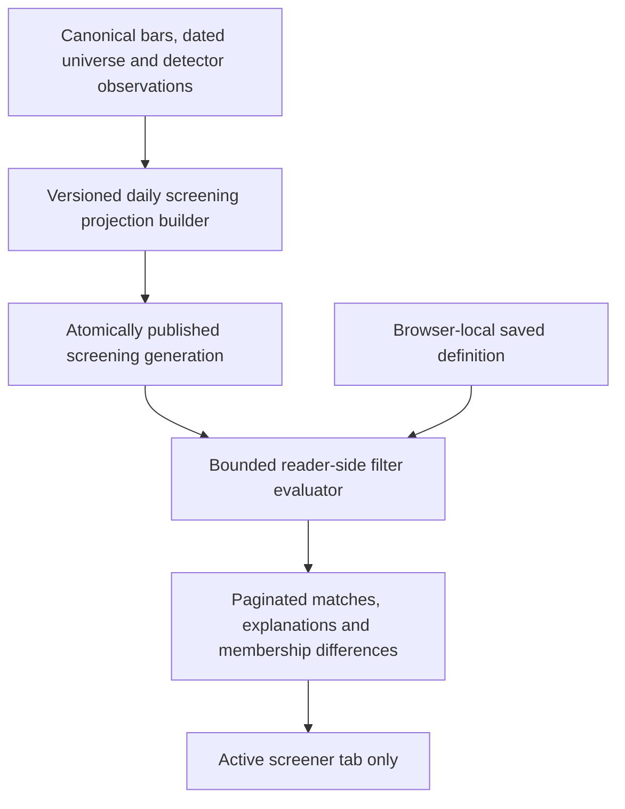

# Stock Screener Workspace Design

Status: IMPLEMENTATION CHECKPOINT, September 14, 2026. Steps 1-4 are implemented
and verified on the retained 386-instrument daily cohort. See
[the capability inventory and verification record](STOCK_SCREENING_CAPABILITIES.md).
The database owner installed the isolated snapshot-type migration. Twelve initial
immutable screening generations cover six expected sessions, September 3/4/8/9/10/11:
five missing days were restored without replacing the two September 11 revisions
or promoting any current pointer, then additive gap-enabled revisions were published
for September 10/11 and a frozen hourly-context revision for September 11, with
only that latest SCREENING pointer promoted. Two subsequent September 10/11
momentum-horizon revisions were appended without changing current pointers.
Every day retains 386 expected members;
September 9 has 385 basic-eligible rows plus an explicit unavailable ARKW row.
The reported ARKW/BKNG source gaps and BNY's bounded BK-to-BNY identity history
have since been repaired with append-only, actual-observed revisions. Existing
snapshots retain their original source cutoffs and unavailable fields; action
gates remain intact. The current September 11 generation retains the original daily
Pullbacks/Bounces/Resuming state facts. Screen
selection now opens persistent local tabs; saving filter edits lives inside Apply confirmation.
The optional New marker and off-by-default New only checkbox are now implemented,
comparing the same rules against the preceding expected session without changing
saved definitions. Full membership views and five-session persistence remain
deferred. Ongoing screening publication was separately approved September 14 as
described below; this does not authorize backfill expansion, research retirement,
alert-engine changes or data deletion.

## Advancing Hourly Context

September 14: the existing **Pullbacks: 1h change >= 0** and **Uptrend: 1h EMA
alignment** built-ins now receive newly published completed-hour context while
their daily conditions remain anchored to the last completed daily snapshot.
Predicates, field IDs, layouts and saved definitions are unchanged.

The resident screening worker prepares a new daily anchor when the complete daily
source advances, then appends paired revisions using `screening_hourly_refresh_v1`.
The existing snapshot type is reused with a retained `daily_generation` and an
idempotent pair key; original snapshots are never overwritten. The daily source
cutoff is not moved forward to admit newer bars. Hourly lineage and its own cutoff
are retained independently. Missing members, invalid slots and identity/action
issues remain UNKNOWN. A known corporate action across the daily/hourly dates
blocks the combined context. Previous daily comparison behavior is preserved;
New remains disabled for hourly-filtered rules.

Equity/All startup now includes the screening worker. It checks every 60 seconds
and reads only already-ingested data; the active screener page also polls retained
results every 60 seconds. Daily and hourly source times are shown separately and
exported to CSV. Hourly staleness accounts for the configured provider delay.
The initial frozen-hourly pilot below remains a historical contract; older
generations are explicitly labeled Frozen at daily cutoff.

## Optional Momentum Horizons

The catalog now includes optional **6-1 momentum** and **3-1 momentum** filters,
columns and sorting for user-created screens. They use close 21 sessions ago
divided by close 126 or 63 sessions ago, minus one, requiring 127 or 64 contiguous
valid sessions respectively. Percentage bounds support negative, zero and positive
values. Help explains practical tracking value before the calculation.

Existing built-ins, default layouts, saved definitions, 12-1 returns and 12-1
percentiles are unchanged. The new fields are not automatically selected or
ranked. Their independently gated values are prepared offline in additive
snapshots; reader requests perform no source work. Older snapshots fail closed
for unsupported fields. See the
[contracts and verification record](STOCK_SCREENING_CAPABILITIES.md#optional-momentum-horizons).

## Hourly Context Checkpoint

The small approved 1h context pilot is implemented as an optional group alongside
daily rules, not as a global interval switch. It filters hourly close, last-bar
change, distance from a 20-bar EMA, and three-bar EMA percentage change. An optional
Hourly context column and expanded source details retain the exact hourly timestamp,
cutoff and shortened final-slot duration. Saved rules retain separate daily and
hourly contracts; old hashes and daily/gap behavior are unchanged.

The original September 13 pilot used frozen hourly context at the daily snapshot
cutoff; the September 14 publisher above supersedes that current-view limitation.
Complete retained 30m buckets reconstruct missing
historical slots only, with explicit lineage and no raw-data writes. Latest bars
must match the published hourly cohort; incomplete history stays UNKNOWN per field.
New comparisons are unavailable for hourly-filtered rules until their comparison
policy is defined. The [hourly contract and pilot evidence](STOCK_SCREENING_CAPABILITIES.md#hourly-context-implemented-pilot)
record formulas, cutoffs, coverage and validation.

The built-in library now includes **Pullbacks: 1h change >= 0** and
**Uptrend: 1h EMA alignment** as frozen-context examples. Both include the hourly
column and populate the Filters panel with their exact daily and hourly conditions
when opened. Selected groups auto-expand with selection counts and active-field
highlights; previous searches clear on opening the panel or switching screens.
Daily, candle, gap and hourly applied chips share one responsive wrapping row.
Previewing a library item alone does not change filters. Draft edits remain
separate from the original built-in and are applied/saved through the existing flow.

Filter labels and table headings have contextual help icons. Hover explains the
field's tracking value. Click/tap or keyboard activation leads with Why track it?
and How to read it; formulas, units, required history and limits stay in collapsed
Calculation details. Daily, hourly and gap meanings remain distinct.
Help is read-only local UI, preserves draft values and returns focus to
the trigger; Escape does not also dismiss an underlying mobile Filters drawer.

## Daily Gap Context Checkpoint

The approved daily-first gap extension and bounded review-list assessment are
implemented. Filters now support a separate Daily gap context group for direction,
fill state, formation age (0-20 trading sessions), opening fill percentage, price
location and nearest fixed-zone-edge distance. All conditions must match one
episode. An optional Daily gap column summarizes a deterministic matching episode;
row expansion retrieves full matching episode geometry and source IDs on demand.

The offline projector evaluates all qualifying opening-gap formations in a verified
22-session window, not just proximity-pruned scanner results. READY with no matching
episode differs from UNKNOWN coverage. Fill is open-to-prior-close retracement;
zone boundaries use the retained formation basis. Failed at current close is
reversible and is not permanently invalidated. The
[daily gap contract and pilot assessment](STOCK_SCREENING_CAPABILITIES.md#daily-gap-context-implemented-and-assessed)
record exact meanings, scope, new snapshot IDs and verification evidence.

Latest coverage is 383/386 instruments and 830 episodes. Recent unfilled up gaps
give 46 matches; adding the inspected liquidity/proximity conditions gives 20.
These are descriptive review lists, not backtested recommendations. Existing New
counts and base fields are unchanged, and old snapshots remain immutable.
The later frozen hourly-context pilot is recorded above. Automatic intraday
publication and broader lifecycle transitions are still separate later steps.

## Future Enhancement Priorities

Recommendation updated September 13, 2026; documentation only, not implementation
approval. For trend reading, prioritize compact recent-state history, then
moving-average direction alongside existing price distance, and price/volume
context around state transitions. These are descriptive aids, not evidence of
predictive value or new trading signals.

Defer the full Membership Changes interface. Its strongest benefit is reducing
repeated daily review, not detecting stronger trends. The separately approved
New since previous session marker/filter is now implemented; assess its review
value before adding more membership views.
A stock leaving Pullbacks for Resuming up illustrates why Dropped is not a sell
signal. Keep five-session rule persistence distinct from detector-state history.

The [revised enhancement recommendations](STOCK_SCREENING_CAPABILITIES.md#future-enhancements-revised-recommendation)
define priorities, purpose, initial scope and validation gates. They supersede the
earlier comparisons-first sequence below. Existing source cutoffs, UNKNOWN handling,
read-only readers, saved-screen layouts and separate worker-activation approval
remain required. No future enhancement is enabled by this documentation change.

## Agentic Screener Roadmap

Starting point, September 13, 2026. **Proposal only; implementation requires
separate approval.** Start with assistance that proposes valid screens and explains
observed changes. Predictive alerts are a separate research capability, not a
consequence of adding an LLM.

### Existing Foundation

Reuse the structured field catalog, validated predicates, pure evaluator, immutable
snapshots and field explanations. Saved screens currently live in the browser;
publications are manually prepared and hourly context is frozen at the daily
cutoff. Six retained sessions support workflow testing, not predictive validation.

### Proposed Iterations

1. **Screener copilot (high feasibility):** translate a user's intent into a normal
   supported screener definition. Explain the proposed conditions, preview matches,
   UNKNOWN coverage and overlap with existing screens, then require approval to
   save or replace rules. Unsupported requests must be explained, not invented.
2. **Rule-based alert assistant (high feasibility, infrastructure needed):** evaluate
   explicitly subscribed screens across the full eligible population, not just the
   visible page. Start with new matches or a precisely defined material change.
   Add server-side versioned definitions, authorized background publication and
   evaluation, durable event/delivery history, deduplication and cooldowns. AI
   summarizes rule-generated events; it does not decide whether a rule matched.
3. **Experimental ranking and prediction (value unproven):** first distinguish
   review priority from expected return. For predictive work, define the outcome,
   horizon and execution assumptions before a bounded study on a fixed cohort.
   Compare with simple baselines using point-in-time inputs, chronological holdouts,
   realistic costs and probability calibration where applicable. Keep experimental
   alerts in paper mode until predefined evidence and monitoring gates are met.

### First Iteration Scope

- One request -> one editable proposal -> deterministic preview -> approved save.
- Reuse the existing catalog/query and Apply/save flow; no new screening engine.
- Test a small fixed set of intents for valid fields, units, correct explanations,
  unsupported-request handling and reproducible previews against a pinned snapshot.
- Bound tool calls, latency and cost; an AI failure leaves manual screening usable.
- No unattended alerts, provider backfills, prediction percentages or order execution.

### Boundaries And Evidence

- Give the agent allowlisted, bounded tools, not arbitrary SQL, code or worker access.
  Treat imported text as data; approve and minimize any data sent to an external model.
- Preserve user control over saved changes, subscriptions and delivery channels.
  Page requests remain read-only; background writes require separately scoped jobs.
- Record rule revision/hash, stable security ID, snapshot/cutoff, supporting values
  and explanation/model version. Missing or incompatible history is not a transition;
  source corrections are not silently treated as new market events.
- Show overlapping conditions and conflicting evidence. Multiple similar screen
  matches are not independent confirmations or a confidence score.
- Keep proposed screener events distinct from existing Stock Alerts engine plans
  and qualifications. Deterministic alerts must remain readable if AI is unavailable.

**Next planning decision:** agree a small intent/example set, model provider and
data-sharing policy, then specify the screener-copilot proposal/preview contract.
No ongoing jobs, alert delivery or research-page retirement is authorized here.

## Agreed Product Decisions

- Saved screens are reusable rules and display preferences, not saved result rows.
- A searchable screen library holds the collection. Favorites can be pinned as
  tabs INSIDE Stock Screener. Closing/unpinning a tab does not delete its screen.
- Opening a saved or built-in screen from the library adds or activates a local
  tab. Open tabs and the active tab survive reload; only the active tab queries.
  The Screen library control opens the library. The filter panel has only Apply
  and Clear; saving or updating a definition is offered inside Apply confirmation.
- Confirming Apply or saving filter edits also selects their table columns,
  preserving existing column order and unrelated selections. Draft edits and
  Cancel do not alter columns. Manual hiding and layout presets remain available;
  reopening an existing screen preserves its stored layout rather than forcing
  every filter column visible.
- The first release persists screens in this browser, with JSON export/import.
  It does not require authentication, promise account sync, or create shared data.
- The first release is daily-first, using completed, timestamped daily snapshots.
  Intraday screening is a separate subsequent phase.
- Useful pattern/persistence observations migrate before any research navigation
  is hidden. That retirement is a later separately approved step, not this release.
- Stock Screener and Stock Alerts remain separate sidebar destinations. Generic
  customizable Overview/workspace tabs are not part of this project.

## Page Responsibilities

| Page | Responsibility |
|---|---|
| All Tickers | Browse the configured tracked universe and inspect broad stock data |
| Stock Screener | Build repeatable selections, understand matches and inspect changes |
| Stock Alerts | Read immutable engine-selected plans, recurrence and paper outcomes |
| Ticker Detail | Inspect one stock's chart, structures, context and option chain |

The Screener does not apply the alert engine's top-three quota or rank by number
of scanners agreeing. Every matching eligible stock is included, with pagination.
A selected pattern is an observation, not a proven edge or an alert recommendation.
An arbitrary filtered stock has no invented entry, stop, target or confidence score.

## Saved Screens And Tabs

### What Is Saved

Each screen has a stable screen ID, name, schema version, predicate revision,
created/updated timestamps, universe policy, interval, structured filters, sort,
ordered visible columns, and current results-view choice. Labels use explicit units.
The default time mode is LATEST_COMPLETE, so reopening the screen uses the newest
published daily dataset, not the day on which the screen was first saved.

Historical dates and selected rows are transient navigation, not silently saved
as a new rule. A future intentionally frozen historical screen would require a
separate time-mode control. A CSV export is a result snapshot with its data date,
not a substitute for a saved screen definition.

Screen identity, rule identity and presentation are separate:

- Filter/universe/interval edits create a predicate revision and hash on Save.
- Name, pin order, sort and column changes do not create new match events.
- Automatic browser persistence of layout preferences does not silently save
  edited filtering rules. Apply and Save are different operations.
- Derived results, P/L, inferred confidence and stale API caches are not embedded
  in the portable screen definition.

### Main Flow

1. Open a saved screen from the library, a pinned tab, or a built-in starter.
  To start fresh, choose New screen under My saved screens; it opens Filters
  over All equities with default display choices and no saved definition yet.
2. Open the filters using the first toolbar button, then edit the draft. Filters
  start closed on desktop and mobile. Draft and applied rules remain separate.
3. Apply validates the draft and opens a confirmation dialog. Choose Apply without
  saving, Save as a new screen, or Update saved screen when editing a saved screen.
  Opening or cancelling the dialog makes no query or saved-definition write.
  Confirmation updates results and applied-filter chips together; successful
  confirmation closes the filter panel. Draft changes never relabel old results.
4. Save creates or updates the named definition. Save as creates a separate screen.
   Built-in examples are read-only templates; customization creates a user screen.
5. Inspect a row's match explanation, pin a screen, export results, or open its chart.

The library supports search, open, pin/unpin, rename, duplicate, export and delete.
Its collections are Built-in screens (preconfigured templates) and My saved screens
(browser-local user definitions). There is no redundant All screens collection.
New screen appears only under My saved screens, including its empty state. It
protects unsaved edits with Save/Discard/Cancel before resetting to All equities,
clearing filters, sort, pagination and filter search, restoring default columns,
closing the library and opening Filters. This reset also runs when All equities
is already active. Cancel keeps the current work; no empty saved entry is created.
The existing Apply dialog then offers Save as a new screen or Apply without saving.
Delete requires confirmation and removes only the local definition/layout, never
source snapshots or market data. Unsaved filter changes receive Save / Discard /
Cancel on switching screens or leaving the page. Browser reload recovery uses a
separate unsaved-draft record; it must never overwrite the last saved rule.

Pinned tabs are shortcuts to screens, not independent scanners. On desktop show
the active tab and a small set of pins, with remaining pins in a More menu. On
mobile use a compact active-screen picker with the same library. Do not render
an unlimited horizontal row of tabs or start a query for each hidden tab.

Initial screen: an unsaved All eligible equities view using the configured tracked
population, explicitly labeling included instrument types. Example starter screens
such as Liquid pullbacks or Fresh breakouts are editable filter recipes, not
recommended trades. Their numeric defaults are UX examples, not optimized parameters.

### Screen Versus Watchlist

A screen dynamically chooses stocks from rules. A watchlist explicitly retains
chosen security IDs even after those stocks cease matching. The app currently has
no functioning account/watchlist service. Initial quick actions are chart links,
screen saving and CSV/JSON export. A browser-local shortlist can be a later small
slice; account-backed watchlists must not be implied by a nonfunctional button.

## Workspace Layout

Header: Stock Screener, active data session, Daily interval and meaningful stale
status. The screen uses the latest complete SCREENING publication; the daily-session
dropdown is removed. Retained historical generations remain addressable by the
read-only API for audit, without on-demand reconstruction or current-data joins.

Below the header: one compact row beginning with the filters toggle, then the Screen library picker followed directly
by open screen tabs, then filter visibility, column presets/picker, export and
refresh controls. All equities is the single unfiltered base tab; the former
All eligible built-in activates that same tab rather than adding another. Save
and Save as belong with filter actions and dirty-change confirmation.

Column presentation follows Stock Alerts: named display presets beside the shared
checkbox picker. Screener presets are Screen default, Overview, Trend, Momentum
and Liquidity. Columns expose stored daily facts for inspection; they do not change
the predicate, sort, ranks or match population. Screener columns are intentionally
different from alert plan/trigger columns. Column ordering is inside the picker,
not a separate page section, and applies only to optional columns. Every layout
begins with Stock, Close, Session change and Volume, in that order. These four
columns cannot be hidden or reordered; presets append their relevant fields
afterward without duplicating the base columns. Candle occurrences and Instrument
type are optional in the picker, not part of the default table. Close uses a currency
value and a short Close heading rather than Close (USD).
Column selections persist per built-in screen as browser-local display preferences,
as well as per saved screen. Switching tabs, reloading or discarding a recovered
filter draft does not reset the selected columns to the built-in defaults.
Built-in defaults and contextual presets omit optional columns guaranteed constant
by the applied rule. Pullbacks, Bounces, Resuming up and Resuming down therefore omit
Daily discovery state and Daily discovery trend: their state and trend are already
implied by the screen. Keep varying numeric facts and the fixed base columns.
Do not infer constants from a page of results. Omitted fields remain selectable
manually and accessible through filter chips and match explanations.
Signed numeric table values use theme-aware green for positive and red for negative:
session change, 12-1 momentum, and distances from EMA20/EMA50/SMA200 or the prior
range high. Price, volume, relative volume, percentile ranks, volatility, categorical
observations, zero and unavailable values remain neutral. Colors describe numeric
sign, not trade recommendations or predictive quality; numeric text is unchanged.
Use established portal icons, tooltips, keyboard
behavior, density and theme tokens.

Left panel (closed by default): accordion filter groups with min/max inputs, searchable categorical
selectors, checkboxes and Any/All controls. Desktop filters occupy a bounded rail;
mobile uses an accessible drawer with persistent Apply/Clear actions and saving choices inside Apply confirmation. Show field
units and invalid ranges beside the offending input. Clear makes a draft, not an
immediate destructive edit of the saved screen.

Results: matched count, removable applied-filter chips, Current / New / Still
matching / Dropped selection, pageable table, expandable match explanation.
Coverage unavailable is a state, not a fifth kind of trading signal. Diagnostics
are collapsed by default; actionable stale/missing-publication warnings remain
visible. No permanent research scorecards or per-strategy tab explosion.

Columns: the fixed daily base, followed by optional instrument identity, relevant
filter values and supported setup/context fields. Source session and data quality
remain accessible in match explanations and publication details; unsupported
persistence/lifecycle data is not invented. Column choices save per screen.
Match explanations always remain accessible even if a tested field
is hidden. Default sort is transparent and user-selectable, with security ID as
the deterministic final tie-break. Sorting never alters eligibility or delta state.

## Filter Contract

The filter schema is a versioned, allowlisted data structure, not SQL, Python or
free-form executable expressions. Each registered field declares its type, unit,
valid operators, source, interval, price basis, warm-up, freshness requirement and
supported publication versions. Requests/imports are bounded and schema validated.

| Group | First Release Candidates | Condition |
|---|---|---|
| Universe | Stock/ETF type, sector, price range | Preserve configured population and explicit type coverage; no silent survivor substitution |
| Activity | Volume, prior-window average dollar volume, relative volume, session change | Freeze exact averaging/denominator and volume alignment per field |
| Trend/momentum | Price vs EMA20/50 and SMA200, slope, RSI, daily RS63 and 12-1 momentum | Only where causal valid history supports the individual field |
| Volatility/structure | ATR%, 21-session realized volatility, distance from prior range, compression | Name lookback and whether value is prior or inclusive of current completed bar |
| Patterns/setups | Selected candle/structure observations, fresh/active/invalidated, age | Use source-versioned detector outputs; capability inventory decides initial coverage |
| Persistence | Consecutive valid matches, matches in last 5 completed sessions, age since last valid observation | No counting polling cycles, duplicate revisions or other models as extra hits |

ADX, industry, market cap and richer event fields are not promised solely because
a similarly named UI column exists elsewhere. Admit them only after finding a
bounded, dated, same-identity source and documenting their meaning. A disabled
unavailable category is preferable to an enabled filter against invented zeros.

Numeric filters accept inclusive min/max bounds with min <= max, reject nonfinite
values, and distinguish zero from no bound. UI percentages convert to a canonical
fraction at the API boundary. Valid ratio and date units are explicit.

Default boolean structure is AND across groups. Within the pattern group use Any
selected / All selected / None selected with explicit semantics. Avoid an arbitrary
nested boolean-expression designer in v1. Direction and interval belong to EACH
selected pattern or strategy observation; neutral or opposing observations are
not silently promoted into directional agreement.

### Missing Values And Feature Eligibility

Each predicate evaluates MATCH, NO_MATCH or UNKNOWN. Known failed requirements
can reject a stock even if another field is unknown; otherwise an unknown required
field yields UNKNOWN. OR-pattern groups match if any valid selected observation
matches; they are unknown if no true observation exists and at least one required
observation is unavailable. None-of conditions cannot treat unavailable as absent.

Unknown required fields do not pass a screen, but are counted separately from
known nonmatches. Missing OPTIONAL display data does not exclude a stock. This
allows a valid recently listed stock to pass a price/volume screen even without
253 sessions required for 12-1 momentum. The existing daily discovery service's
global warm-up contract stays unchanged; the new screener projection has its own
field-level eligibility. Identity continuity and supported corporate-action
handling still apply to every affected lookback.

Ranks are computed once over the field's full eligible dated universe, before
screen filters and pagination. Label the rank population. Do not rerank the
selected results and call that an original universe percentile.

## Patterns And Persistence

Inventory source contracts before enabling filters. Reuse the existing canonical
detectors and retained evidence where compatible; do not copy their code into the
frontend or reinterpret scanner names as equivalent strategies.

Initial catalog should be a small supported set, not every research variant:
trend pullback/resumption, compression/breakout, supported gap states and common
candle observations (for example, bullish engulfing and shooting star). Exact
names, intervals and availability must come from the inventory, not this wish list.

- A candle occurrence is a one-bar event. It is not an active setup for five days.
- An active setup requires its retained lifecycle and invalidation contract.
- A fresh trigger, continuing episode and re-armed episode are different records.
- Consecutive persistence uses expected exchange sessions and the same security,
  detector version, interval, direction and, where appropriate, structural episode.
- The first release uses a verified five-session window. Broader 10/21-session
  rollups require retained observations for all expected sessions and a separately
  declared extension, not the current live rescan fallback.
- Unknown sessions break proof of a consecutive streak. Window counts retain
  known count/expected count/coverage; do not silently use the next available rows.

Do not inherit previous study qualification IDs, alpha p-values or a composite
confidence score. Pattern detection and screening correctness are functional
claims; profitable predictive use requires its own separately frozen evaluation.

## Membership Changes

Status: LIGHTWEIGHT NEW IMPLEMENTED; FULL VIEWS DEFERRED. New only is a temporary
checkbox beside the match count and resets when loading/switching screens or
reloading the page. Markers sit beside tickers and can be hidden in the column
picker. No added tabs or mandatory table columns. The full screen count stays
visible; pagination follows the New-only result count. Saved rule hashes,
revisions and exported definitions do not include this transient choice.

Only a verified prior nonmatch becomes New. Missing membership/eligibility/fields,
incompatible generations, later prior cutoffs or changed shared source lineage
remain comparison-unavailable. Exact prior session/generation and reasons appear
in row details and result CSV exports. This first policy compares compatible
original reconstructed snapshots; historical source repairs do not rewrite them.

The following preserves the broader comparison contract for possible later use;
the full four-view interface remains deferred. Current results remain the default;
membership changes alone do not
measure trend direction, strength or predictive quality.

New, Still matching and Dropped compare the CURRENT APPLIED PREDICATE against the
current and immediately preceding expected daily screening publications. Both
queries use the same predicate revision, universe policy and definition version,
and compare the entire matched population before sorting or pagination.

| Prior Valid State | Current Valid State | Result |
|---|---|---|
| NO_MATCH | MATCH | New |
| MATCH | MATCH | Still matching |
| MATCH | NO_MATCH | Dropped |
| UNKNOWN or no comparable prior | MATCH | Current match; change unavailable |
| MATCH | UNKNOWN or missing identity/data | Change unavailable; NOT Dropped |

Universe admissions/removals are separately labeled eligibility changes, not
price-pattern entry/exit signals. A prior missing publication is not replaced by
the most recent convenient available one. An initial baseline has no invented
New events. A late correction appends a new source revision; original captured
publications and alert results remain immutable and identifiable.

For a newly created rule this comparison is retrospective screening, not proof
that a live alert existed yesterday. Changing a filter recomputes a comparison
under the new rule rather than comparing old-rule results with new-rule results.
No membership change itself creates a Stock Alerts record, paper trade or email.

Dropped rows retain their last matching values and date, with current valid
values available separately for explaining which condition ceased to pass. They
are not merged into Current results or counted in its matching denominator.

## Data And API Architecture

### Publication Layer

Add an isolated `stock_screener_workspace_v1` projection, not a mutation of
`stock_discovery_v1`, the alert engine or frozen research artifacts. Reuse the
canonical repository/publication utilities. Choose the exact storage migration
after confirming whether existing immutable evidence/projection payloads satisfy
the required generation and dated-read contract; do not introduce a second price
store, qualification ledger or table per saved screen.

One generation fixes expected membership, session/close/deadline, policy/code
versions, source revision/availability IDs, field capabilities, and coverage.
Publish rows plus manifest/current pointer atomically after the full bounded
population is processed. No partial worker/shard becomes the visible cohort.
Historical reconstruction, where separately requested, must be labeled rather
than backdating actual observations.

Rows are structured per-security facts plus keyed pattern observations and
persistence rollups. Store common features and source lineage once per generation;
do not replicate long lookback revision lists across every saved screen or match.
The replay's previous memory/storage failures make bounded batches and compact
shared lineage an implementation requirement, not an optional optimization.

Latest, previous and any navigable historical generations must remain addressable.
Decide storage capacity/retention after measuring one bounded build; no automatic
purge in the first release. UI date limits are not data-retention rules.

### Reader Layer

Proposed endpoints, separate from existing daily screener/alert APIs:

- GET `/api/stocks/screening/catalog`: filter fields, options, units, capabilities
  and available publication dates/generation IDs; no heavy source-table scans.
- POST `/api/stocks/screening/query`: validated structured predicate and generation,
  selected view, sort, offset/limit; read-only despite POST, no user definition writes.
- POST `/api/stocks/screening/explain`: one security and the same predicate/generation;
  only needed if complete per-row explanations are not already in the query result.

The query returns generation identity, market/observed times, universe/field
coverage, matched count, unknown count, change counts/status, and paginated rows.
Filter values and explanations use that same generation. Keep named units and
reason codes stable. Missing/unpublished generation or unsupported fields returns
a useful error, never an unannounced current-generation fallback.

Filtering, ranking selection, counts and two-snapshot comparisons are bounded
server-side operations on precomputed facts, not detectors. Initial scale is the
existing tracked population. Measure it before choosing in-memory snapshot filtering
versus indexed persisted fields; both use the same pure predicate evaluator.

Cache by generation, predicate hash, delta base, sort and page with explicit memory
limits. No cache grows per keystroke forever. Draft edits do not send requests until
Apply; only the active tab queries. Hidden pinned tabs do not poll, compute counts
or run workers. A field selection never fetches raw history or provider data.

## Browser Persistence And Portability

Use a versioned browser-local workspace key separate from the existing global
column preferences. Persist screen definitions, predicate revisions, per-screen
layouts, pinned order and last active screen. Keep unsaved drafts distinct and
allow removal without touching saved definitions. Storage errors remain visible;
do not tell the user a screen was saved when the write failed.

Export/import plain versioned JSON definitions only. Validate maximum file size,
screen/filter counts, types, operators, intervals, field versions and duplicate IDs.
No executable strings, credentials or HTML rendering. Import conflicts require
explicit replace or create-copy; never overwrite all local screens implicitly.
Exported definitions do not include market data, result outcomes or other browser
state. Local storage is browser/origin-specific and not a backup; localhost and
127.0.0.1 are distinct stores. The UI must not promise cross-device synchronization.

Future account support would migrate the same definition schema to an ownership-
checked backend with authenticated CRUD, import and optimistic concurrency. Do
not build a shared unauthenticated database store as a hidden substitute for
private user accounts. Future unattended screen-change notifications would need
server-retained definitions and separate opt-in delivery rules; browser-local pins
cannot support monitoring while the browser is closed by themselves.

## Options And Later Phases

Options context is a later capability-gated extension. Underlying summaries must
declare contract population, expirations/moneyness scope, source batch time,
coverage and standard multiplier treatment. OI may describe a different session
from current volume; never imply they were contemporaneous trades. Missing data
is UNKNOWN, not zero.

IV rank/percentile requires a consistent IV definition and sufficiently long
comparable history; 7/30-day expected moves require a specified maturity and
calculation. Realized volatility and implied volatility must not share an ambiguous
Volatility label. No bid/ask spread filter without entitled retained quotes.
Greeks, premium, strike and expiration remain in Options Screener. A later stock
filter meaning Has a qualifying contract must evaluate all its contract conditions
on the SAME contract, then aggregate matching underlyings once.

The intraday phase adds 30m/1h only after finalized-bar publication, shortened final
hour, provider timing, indicator warm-up, cross-session continuity and persistence
are validated. Daily context stays latest-complete and timestamped. It is not a
different interval label on a daily detector or a synchronous live scan fallback.

## Implementation Sequence And Gates

1. **Freeze contracts and capability inventory.** Map a small daily field/pattern
   set to exact existing producers and prior-session availability. Verify coverage
   on a bounded retained cohort. Unsupported fields remain deferred. Record rules,
   dependency graph and benchmark commands before frontend expansion.
2. **Build the daily projection and pure filter evaluator.** Add field-level warm-up,
   typed predicate validation, source-safe pattern rollups and atomic generations.
   Validate on fixtures and one bounded build from existing inputs. Do not activate
   a continuous worker or download data at this step.
3. **Deliver an unsaved daily screen end to end.** Grouped filters, Apply/Clear,
   active chips, stable pagination/sort, explanations and price/chart links on the
   existing separate Screener route. Replace the narrow daily screen UI only after
   matching the new reader contract; old services and studies stay intact.
4. **Add saved-screen library and pinned tabs.** Browser persistence, dirty drafts,
   per-screen layout, template duplication, pin order and versioned export/import.
   Verify reload recovery, deletion safety and no requests for inactive tabs.
5. **Evaluate prioritized trend context.** Propose display-only recent-state history
  and price/volume context first; inventory moving-average direction before adding
  that field. Validate interpretability and coverage. The lightweight New
  marker is now implemented; assess its daily-review value and defer full membership views.
6. **Validate and opt in to ongoing publication.** Verify atomic restart behavior,
   cold/warm reader costs, generation invalidation, mobile/desktop usability and
   actual coverage. Only then request approval to enable the new daily producer.
7. **Separately approve expansion/retirement.** Revisit full membership views only
  with demonstrated workflow need. Extend data-backed persistence, intraday and
  options capabilities; migrate useful research observations, check
   dependency consumers, then consider hiding research pages/jobs. No data purge
   or confidence promotion is implied by moving observations into the Screener.

Steps 1-4 are implemented. Subsequent steps are proposed enhancements and separate
operational gates, not mandatory additions to the existing usable release or
calendar-time promises. The revised priorities above control future proposals.

### Acceptance Criteria

- Saved-screen round trips preserve predicate and display choices; pins do not
  create extra scan jobs. Renaming/closing/deleting a pin does not change matches.
- Invalid ranges/imports fail clearly; changing rules does not change a saved
  definition until Save. Apply/cancel/stale request responses behave deterministically.
- Every displayed value and explanation is traceable to its source generation;
  future bars, revised indicators and current reference data cannot leak backward.
- Missing feature history does not become neutral/zero, no unknown state becomes
  Dropped, and pagination/sort cannot change full-result counts or original ranks.
- Persistence counts the declared valid observations, not API calls or duplicate
  revisions; events and active setups retain distinct meanings.
- Interrupted publication never exposes half a cohort; retries are idempotent.
  Existing alerts, fixed studies, daily worker and read endpoints remain unchanged.
- GET/POST readers make zero provider requests, detector calls, outcome evaluations
  or source-data writes. Draft typing and switching columns run no scan. Hidden tabs
  issue no background queries. Data preparation is timed separately from page loads.
- Proposed local performance budget to validate against the representative tracked
  cohort: warm query p95 <=250 ms, cold projection read <=1 s, default 100-row response
  <=250 KiB uncompressed. Report actual measurements and separate header/global calls;
  these are targets, not claims of current performance or internet latency.
- Browser checks cover both themes, 390px mobile and 1280/1440px desktop, filter
  drawer, tab overflow, keyboard/focus, zero-result/unknown/stale states, persistence,
  column layout and import errors without incoherent overlap or page-width overflow.
- Useful workflow success means fewer manual lookup steps, reproducible matches and
  understandable reasons. Trading profitability requires a separate study; no
  historical qualification, confluence grade or personal win probability is added.

## Current Constraints And Non-Goals

The existing discovery snapshot applies 253-session eligibility globally. The new
projection must decouple that field requirement without changing the alert policy.
Six expected screening sessions are retained, but screen persistence and recent-state
history are not enabled. Future five-session views must consume compatible published
facts; other existing windows may rescan live and are not an acceptable reader
dependency. Accounts and
real watchlists are not implemented. These are concrete dependency boundaries,
not reasons to defer the bounded daily-first release.

No options subscription change, full-market backfill, data purge, user-account
implementation, broker execution, live alert feed promotion, new confidence score,
per-strategy tabs, or generic Overview customization belongs in this plan.
API/frontend may remain available for inspection; previously paused workers must
not be restarted merely because this design document has been approved.